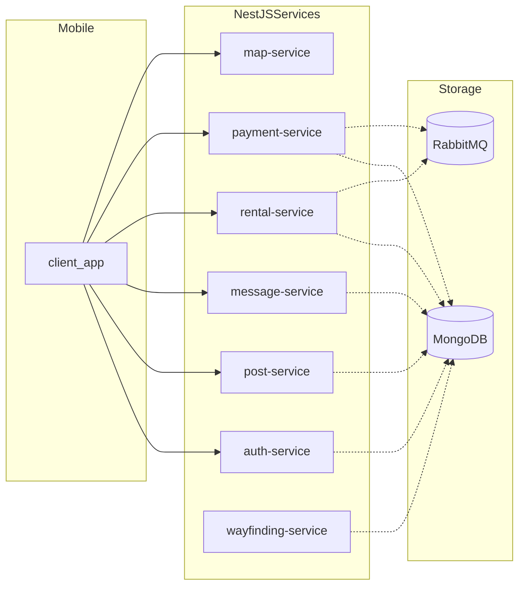
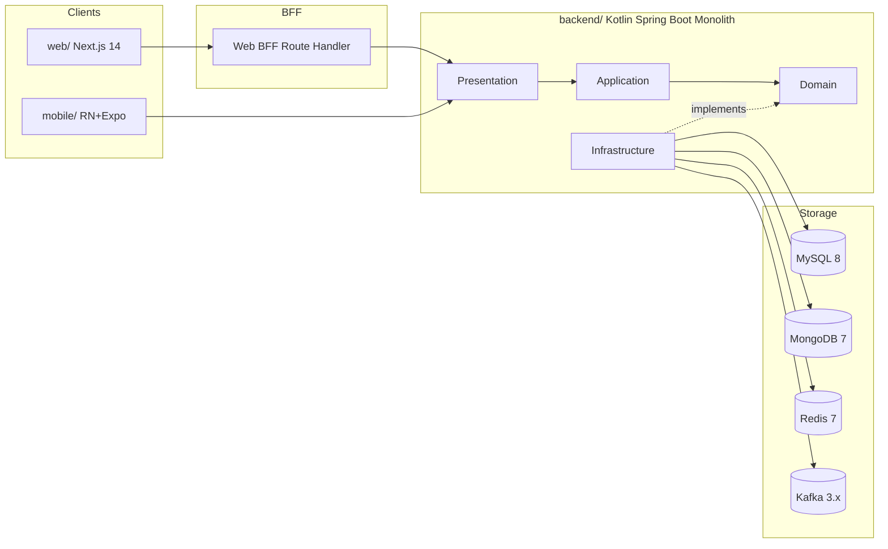
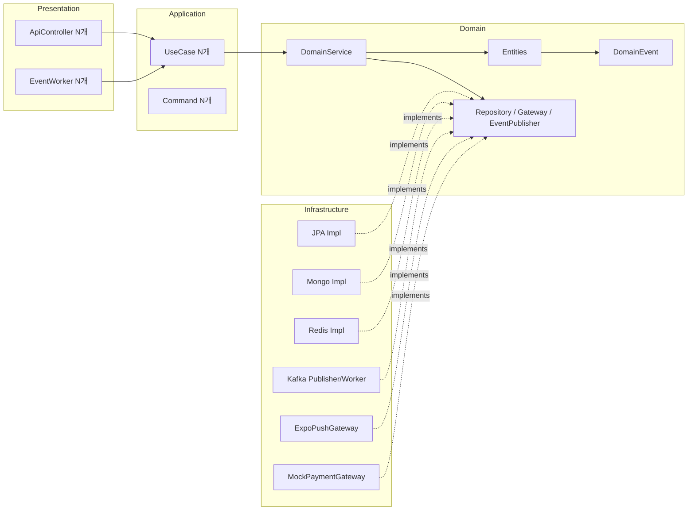
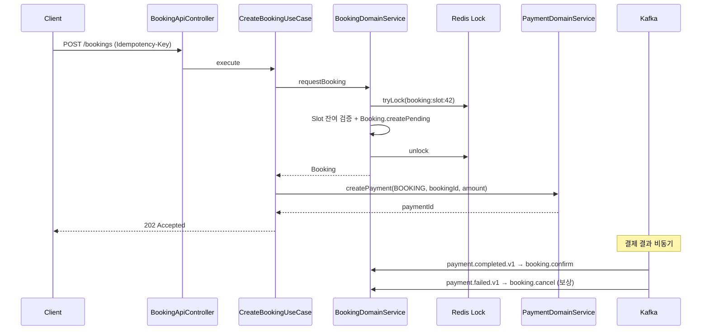
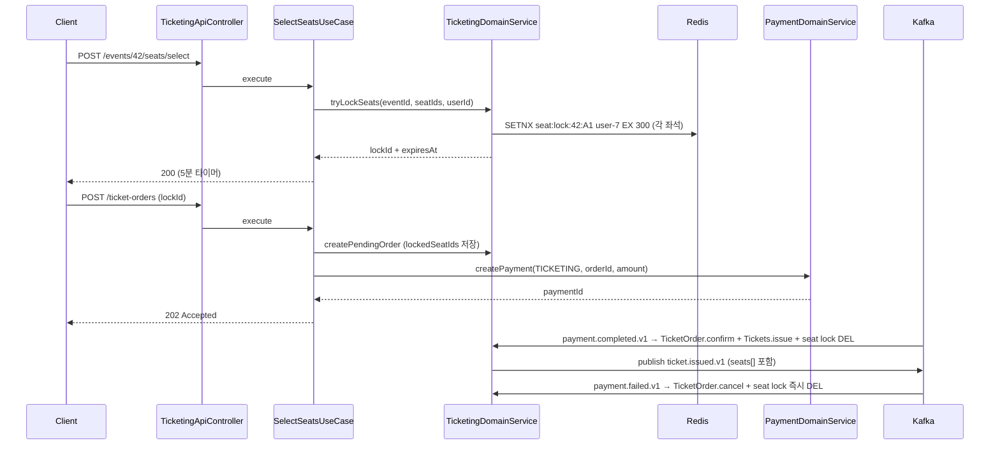
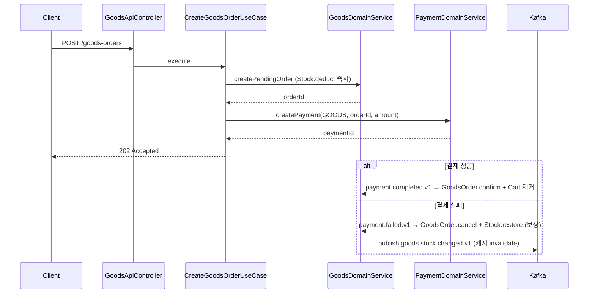
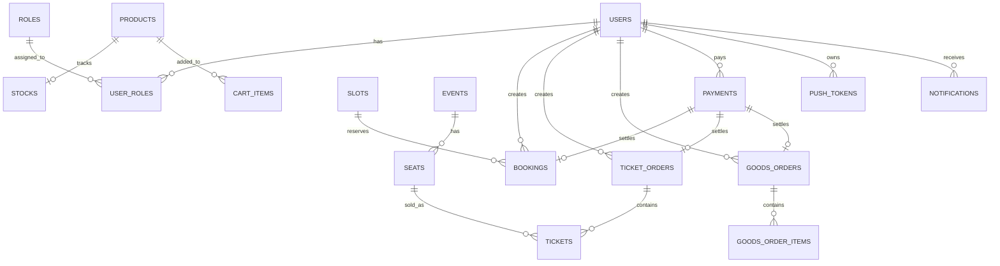

# Sports Application TDD (Technical Design Document)

> 작성일: 2026-05-19
> 작성자: biuea@doodlin.co.kr
> 입력: [PRD](../../../docs/prd/sports-application-prd.md), [TPM](./tpm-analysis.md), [티켓 75건](../../../docs/tickets/)
> 상태: 초안 — Step 1-D 사용자 승인 대기

---

## Background

MyLifeSports는 NestJS 8.x 기반 7개 마이크로서비스 + React Native 클라이언트로 구성된 생활 체육 플랫폼 시제품입니다. 다음 4가지 한계를 동시에 해결하기 위해 전면 리팩토링합니다.

1. **운영 분산** — 7개 서비스를 단일 개발자가 유지. 배포·로깅·모니터링 분산
2. **데이터 일관성 부재** — RabbitMQ 단발 메시지로 결제↔대여 연동. 보상 트랜잭션 없음
3. **보안 사고** — `rental-service/src/app.module.ts:14`에 CloudAMQP 시크릿 평문 커밋
4. **테스트 0건** — 모든 서비스 `test/` 디렉토리 비어 있음

본 작업은 위 4가지를 동시에 해결하면서 **신규 3도메인(Ticketing/Goods/Notification)**을 함께 추가합니다.

## Overview

NestJS 7-MSA → **Kotlin/Spring Boot 3.x 모놀리스**로 전환하고, MyLifeSports의 6도메인(Auth/Post/Message/Facility/Booking/Payment)에 Ticketing(경기 티켓)/Goods(스포츠 물품)/Notification(통합 알림) 3도메인을 추가합니다. 데이터는 MySQL(주) + MongoDB(비정형) + Redis(캐시·락) + Kafka(이벤트)로 폴리글랏 저장합니다. Web(Next.js 14)·Mobile(React Native + Expo 51) 두 클라이언트를 동시 제공합니다.

## Terminology

| 용어 | 정의 |
|---|---|
| Booking | **시설** 예약 (Slot 단위) — 레거시 rental-service 확장 |
| Ticketing | **경기** 티켓 판매 (Seat 단위, Redis 5분 락) — 신규 |
| Goods | 스포츠 물품 구매 (Product/Stock/Cart/Order) — 신규 |
| Facility | 체육시설 데이터 — 레거시 map+wayfinding 통합 |
| Saga | Kafka 이벤트 기반 보상 트랜잭션 (결제 실패 시 예약/주문/재고 복원) |
| Idempotency Key | 결제·이벤트 멱등성 보장 키 (unique index) |
| Seat Lock | 좌석 임시 점유 (Redis TTL 5분) — 결제 실패/만료 시 해제 |
| BFF | Backend For Frontend — Next.js Route Handler가 BE 직접 호출 대신 클라이언트와 BE 사이 위치 |

## Define Problem

### AS-IS (MyLifeSports — 폐기 예정)



문제점:
- 7개 서비스 = 7개 배포 단위 (운영 부담)
- Map/Wayfinding 데이터 중복 (HTTP/TCP 두 게이트웨이)
- 결제 ↔ 대여 RabbitMQ 단발 메시지 (보상 없음)
- 시크릿 평문 노출 (rental-service)
- 인가(Role/Permission) 부재
- Anemic Service 패턴
- 테스트 0건

### TO-BE (Sports Application)



개선점:
- 단일 모놀리스 (1개 배포 단위)
- 9개 도메인 패키지 분리 (Hexagonal + Rich Domain)
- 4종 저장소 폴리글랏 (트랜잭션·비정형·캐시·이벤트 명확 분리)
- Kafka Saga (결제 실패 자동 보상)
- 시크릿 환경 변수 외부 주입
- Role-based access control (USER/ADMIN/FACILITY_OWNER)
- TDD 5레이어 (domain/application/infrastructure/presentation/scenario)
- harness-rules 정적 검증 (@Query / LocalDateTime / ConsumerRecord 금지)

## Possible Solutions

### 벤치마킹 참조

| 제품 | 카테고리 | 참조 패턴 |
|---|---|---|
| 카카오톡 예약 | 시설 예매 | 슬롯 단위 + Redis 분산 락 |
| 인터파크/티켓링크 | 경기 티켓 | 좌석맵 + 5분 임시 점유 + 결제 흐름 |
| 무신사/29CM | 커머스 | 장바구니 + 옵티미스틱 업데이트 + 재고 보상 |
| 토스 결제 | 결제 흐름 | Idempotency-Key 헤더 + 결과 비동기 |
| Slack | 채팅 | Room/Message 분리 모델 + 커서 페이지네이션 |

### 방안 비교

| 방안 | 설명 | 채택 이유 / 미채택 사유 |
|---|---|---|
| **A. 모놀리스 + 4저장소 + Kafka Saga** (채택) | 단일 Spring Boot, MySQL 주 + Mongo/Redis/Kafka 보조, Hexagonal | 운영 부담 최소 + 트랜잭션 강제 가능 + 도메인 분리 명확. 1인 개발자 환경에 적합 |
| B. MSA 유지 + Kotlin 재작성 | 9개 마이크로서비스로 그대로 분리 | 운영 부담 7배. 1인 개발자에겐 부적합 |
| C. 단일 RDBMS + Kafka 없음 | MySQL 단일, 도메인 간 결합 강함 | Saga 패턴 불가, 결제 실패 보상 못 함 |
| D. 단일 NoSQL (Mongo 단일) | 모든 도메인 Mongo | 결제·재고 트랜잭션 보장 어려움. 레거시 한계 재현 |

채택: **A**. 모놀리스 + 폴리글랏 저장소 + Kafka Saga.

### Web/Mobile 전략 비교

| 방안 | 설명 | 채택 이유 |
|---|---|---|
| **Web=Next.js BFF + Mobile=RN Direct** (채택) | Web은 BFF 경유, Mobile은 BE 직접 호출 | Web은 httpOnly 쿠키 인증 가능, Mobile은 SecureStore 토큰 보관 |
| Web=SPA + 공통 BFF 별도 | Vite+React + 별도 Node BFF | 운영 단위 증가, SSR 이점 손실 |
| Web/Mobile 모두 BFF 경유 | RN이 자체 BFF 호출 | 추가 인프라, Mobile은 SecureStore로 충분 |

## Detail Design

### 클래스 역할 정의

#### 도메인 모델 (Rich Domain — Entity 내부 비즈니스 메서드)

| 클래스 | 핵심 책임 |
|---|---|
| `User` | 가입/패스워드 변경/Role 부여·회수, 본인 자원 접근 검증 |
| `Role`, `Permission` | 역할/권한 정의 |
| `Facility` | 시설 메타데이터 (MongoDB, 비정형 meta 맵) |
| `Slot` | 시설 예약 가능 시간대 (capacity 보유) |
| `Booking` | 예약 상태 전이 (PENDING/CONFIRMED/CANCELLED) |
| `Event`, `Seat` | 경기·좌석 (MySQL) |
| `TicketOrder`, `Ticket` | 티켓 주문·발권 (부분 unique 인덱스로 over-sell 차단) |
| `Product`, `Stock` | 상품·재고 (deduct/restore 캡슐화) |
| `Cart`, `CartItem` | 장바구니 (단일 사용자당 1개) |
| `GoodsOrder`, `GoodsOrderItem` | 주문 단위 |
| `Payment` | 결제 멱등성 + 상태 전이 |
| `Post`, `Comment` | 게시글·댓글 (MongoDB, 분리 컬렉션) |
| `Room`, `Message` | 채팅방·메시지 (MongoDB, 분리 컬렉션) |
| `Notification`, `PushToken` | 알림 큐 + Expo 푸시 토큰 |

#### 서비스 클래스 (UseCase / DomainService)

| 클래스 | 입력 → 출력 | 의존 |
|---|---|---|
| `CreateBookingUseCase` | `CreateBookingCommand` → `CreateBookingResult` | `BookingDomainService`, `PaymentDomainService` |
| `BookingDomainService` | 락 + 슬롯 검증 + Booking 생성 | `DistributedLock`, `BookingRepository`, `SlotRepository` |
| `PurchaseTicketsUseCase` | `PurchaseTicketsCommand` → `PurchaseTicketsResult` | `TicketingDomainService`, `PaymentDomainService` |
| `TicketingDomainService` | 좌석 락 + 발권 + 이벤트 발행 | `SeatLockStore`, `TicketRepository`, `DomainEventPublisher` |
| `CreatePaymentUseCase` | `CreatePaymentCommand` → `Payment` | `PaymentDomainService` |
| `PaymentDomainService` | 멱등 키 체크 + PG 호출 + 이벤트 발행 | `PaymentGateway`, `PaymentRepository`, `DomainEventPublisher` |
| `EnqueueNotificationUseCase` | `EnqueueNotificationCommand` → `Notification` | `NotificationDomainService` |
| `NotificationDomainService` | 채널 라우팅 + 발송 + 멱등 체크 | `NotificationChannelGateway`, `PushTokenRepository`, `TemplateRenderer` |
| (그 외 도메인별 UseCase/DomainService) | 동일 패턴 | be-code-convention 준수 |

### Component Diagram



### Sequence — 핵심 3개

#### 1) 시설 예매 + 결제 Saga



#### 2) 경기 티켓 좌석 락 + 발권



#### 3) Goods 주문 + 재고 보상



## ERD

### MySQL 주요 테이블 (요약, 전문은 도메인 티켓 DDL 참조)



### MongoDB 컬렉션 (요약)

| 컬렉션 | 핵심 필드 | 인덱스 |
|---|---|---|
| `posts` | type, title, content, userId, writer, createdAt | userId, type, createdAt, text(title+content) |
| `comments` | postId, content, userId, writer, createdAt | (postId, createdAt), userId |
| `rooms` | participantIds[], lastMessageAt | participantIds, lastMessageAt |
| `messages` | roomId, senderId, content, sentAt | (roomId, sentAt desc) |
| `facilities` | code, name, gu, type, lat, lng, meta | gu, type, geospatial(lat+lng) |

## Testing Plan

| 레이어 | 도구 | 검증 대상 |
|---|---|---|
| **Unit (도메인)** | Kotest BehaviorSpec + MockK | Entity·DomainService 순수 로직, 상태 전이, 검증 규칙 |
| **Unit (애플리케이션)** | Kotest + MockK | UseCase 분기, DomainService만 호출 (be-code-convention) |
| **Repository (인프라)** | Kotest + `@DataJpaTest` + Testcontainers | JPA·QueryDSL·인덱스·unique 제약·트랜잭션·낙관락 |
| **Presentation (HTTP/Kafka)** | Kotest + MockMvc/WebTestClient + Testcontainers | API 인가/검증, Kafka consumer 멱등성 |
| **Scenario (E2E)** | Kotest + Testcontainers(DB+Redis+Kafka) | 비즈니스 플로우 (예약→결제→확정, 좌석락→구매→발권, 주문→재고차감→실패시복원) |
| **Web** | Vitest + Testing Library + Playwright + axe-core | 컴포넌트·접근성·E2E |
| **Mobile** | Jest + RN Testing Library + Detox + Expo mock | 화면·네이티브 모듈·딥링크 |

**커버리지 목표**: 80% (Kover for BE, Vitest c8 for Web, Jest --coverage for Mobile).

각 티켓의 3계층 테스트 케이스(U-XX/R-XX/S-XX)는 [docs/tickets/](../../../docs/tickets/) 참조.

## Release Scenario

### 마일스톤 진행 순서

```
M0 INFRA (Wave 1~3)
    │
    ▼
M1 AUTH (Wave 4~5)
    │
    ▼
M2 FACILITY ─┬─ M3 BOOKING (Wave 6~7)
              │
              ▼ M4 PAYMENT (Wave 8~9)
              │
              ▼ M5 TICKETING / M6 GOODS (Wave 10~12)
              │
              ▼ M7 POST/MESSAGE (Wave 13~14)
              │
              ▼ M8 NOTIFICATION (Wave 15)
              │
              ▼ M-Web + M-Mobile (Wave 16~)
```

### 데이터 마이그레이션

1. **레거시 MyLifeSports MongoDB → 신규 분할**
   - `MAPSERVICE` + `WAYFINDINGSERVICE` → 신규 MongoDB `facilities` 컬렉션 (FACILITY-04)
   - `AUTHSERVICE.users` → 신규 MySQL `users` (수동 ETL, 비밀번호는 재가입 권장 — bcrypt 해시 호환 안 됨)
   - `POSTSERVICE`, `MESSAGESERVICE` → 신규 MongoDB (Comment/Message 임베드 → 분리)
   - `RENTALSERVICE` → 신규 MySQL `bookings` (수동 ETL, 신규 Slot 모델로 변환)
   - `PAYMENTSERVICE` → 폐기 (실 결제 없는 placeholder였음)

2. **이관 시점**: M2 FACILITY 완료 직후 + M3 BOOKING 완료 직후 1회성 스크립트 실행.

### 롤백 플랜

- 모놀리스 BE: 직전 dev HEAD로 revert + Flyway `repair` + 필요 시 단일 도메인 SQL down 마이그레이션
- Web/Mobile: 직전 빌드 아티팩트로 rollback
- 데이터 마이그레이션: dry-run 모드로 검증 + 실 적용은 트랜잭션 + 백업 후 진행

### 무중단 전환

V1 첫 출시는 신규 시스템 단독 (레거시 폐기 후). 향후 V2에서 점진 전환이 필요해지면 strangler fig 패턴 도입 (BE 게이트웨이가 신규/레거시 라우팅).

## Project Information

| 항목 | 값 |
|---|---|
| Jira Epic | (생성 예정 — `/jira-ticket` 스킬로 일괄 등록) |
| 담당자 | biuea@doodlin.co.kr (1인 개발) |
| 일정 | 마일스톤 기반 점진 진행 (각 wave 1~2일 추정, 총 4~6주 가정) |

## Document History

| 날짜 | 변경 | 작성자 |
|---|---|---|
| 2026-05-19 | 초안 작성 (PRD + TPM + 75티켓 통합 기술 설계) | biuea@doodlin.co.kr |
