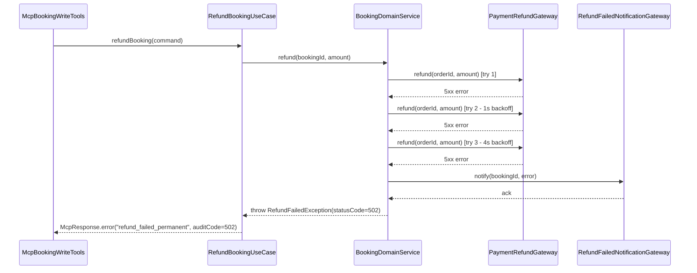
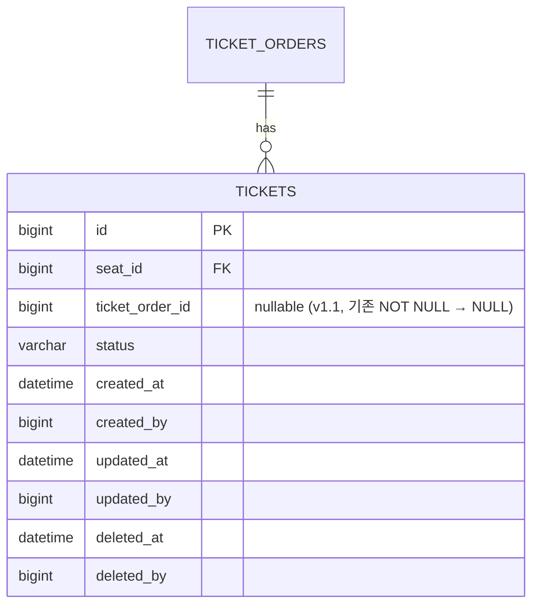

# B2B MCP Server v1.1 운영 안정화 TDD

## Background

v1.0 MCP Server MVP가 origin/dev에 28 PR 머지 완료된 상태입니다. Phase 1 (Read tool 8개 / Write tool 4개) + Phase 2 (Refund / Complimentary Ticket — PG stub) + 운영 인프라 (nginx/WAF default + k6 부하 시험 스크립트 + 토큰 유출 SOP 초안) + audit log 커버리지 보강 (BE-17b) 까지 완료되었습니다. harness-auditor 전수 감사 PASS (실질 위반 0건) 입니다.

다만 v1.0 머지 시점에 외부 게이트 (PG sandbox / DevOps 도메인 / Legal 통지 정책 / TPM PoC) 가 미해소 상태여서 다음 7개 항목이 stub · placeholder · sentinel 값으로 남아 있습니다.

| 항목 | 현재 상태 | v1.1 후속 |
|---|---|---|
| 실 PG 환불 어댑터 | `StubPaymentRefundGateway` (`@Profile("!prod")`) | FR-01 |
| MCP 노출 도메인 | `mcp-api.sportsapp.com` placeholder | FR-02 |
| 토큰 유출 SOP 연락처 9곳 | `[보안 담당자 이메일]` 등 placeholder | FR-03 |
| `Ticket.ticketOrderId` | sentinel `0L` (NOT NULL 컬럼) | FR-04 |
| TEST-01 k6 부하 시험 | 스크립트만 작성, 실 실행 없음 | FR-05 |
| BE-08b Anomaly 임계값 | 기본값 (spike ratio 2.0, 절대값 50) | FR-06 |
| 베타 5팀 운영 | 미진행 | FR-07 |

v1.1 은 위 7개 후속 항목을 외부 게이트 해소 시점에 따라 단계별로 마무리하여 **운영 진입 가능 상태** 로 끌어올립니다.

---

## Overview

**무엇**: v1.0 MCP Server를 운영 안정화 (실 PG 통합 + 도메인 prod/staging 분리 + Legal SOP 완성 + sentinel 제거 + 부하 합격 + Anomaly 조정 + 베타 5팀 dry-run).

**왜**: v1.0은 dev 머지 상태이지만 외부 게이트 미해소로 prod 진입 불가. 외부 게이트가 단계적으로 해소되는 시점 (5/27 / 5/30 / 6/3 / 6/15 / 7/14 / 7/15) 에 맞춰 후속 작업을 milestone으로 분리.

**어떻게**: 19개 티켓 (T01~T18 + T16 분리) — Infra 3 / 보안 3 / BE 5 / QA 3 / Ops 4 / PM 1. v1.0 도메인 코드 변경은 **최소** — `Ticket.kt` nullable 전환 + `McpAnomalyDetector.kt` 상수 갱신만. 신규 클래스는 PG 어댑터 1종 + Slack Gateway 1종.

---

## Terminology

| 용어 | 정의 |
|---|---|
| MCP (Model Context Protocol) | LLM 클라이언트와 BE를 잇는 표준 프로토콜. Anthropic 주도, OpenAI/Google 지원 |
| Phase 1 / Phase 2 | v1.0의 tool 단계 — Phase 1 = Read 12 + Write 4(slot/booking), Phase 2 = Write 4(refund/facility/goods/ticket) |
| sentinel 0L | `Ticket.ticketOrderId: Long` 컬럼에서 complimentary ticket을 표현하기 위해 사용한 임시 값. v1.1 FR-04에서 NULL로 정정 |
| Anomaly Detector | `domain/mcp/McpAnomalyDetector.kt` — MCP tool 호출 패턴 (spike ratio, 절대값) 기반 이상 탐지 |
| false positive (FP) | Anomaly Detector 가 정상 호출을 이상으로 잘못 판정한 비율. v1.1 목표 < 1% |
| dry-run | 실 운영 데이터 / 실 운영자가 사용하되 비공식 단계. 베타 5팀 1주 dry-run = v1.1.3 |
| G1~G5 | 베타 GA 의사결정 메트릭 5종 (활성 5팀 / 어드민 클릭 -30% / confirm 미수신 0건 / 5분 첫 조회 / throttling 80% 반복 0건) |
| Gateway | be-code-convention 패턴 — 외부 시스템 호출 (PG / SMS / Slack / Email). `domain/<context>/<X>Gateway.kt` interface + `infrastructure/<context>/<X>GatewayImpl.kt` 구현체 |
| Sentinel SQL | `UPDATE tickets SET ticket_order_id = NULL WHERE ticket_order_id = 0` — V25 단계 1 일괄 정정 |

---

## Define Problem

### AS-IS

```
v1.0 origin/dev 머지 상태:
  - Read tool 12개 + Write tool 8개 모두 운영 가능 (단 prod profile 진입 불가)
  - StubPaymentRefundGateway: prod 진입 시 NullPointerException
  - V24까지 마이그레이션 (mcp_phase2_permissions)
  - Ticket.ticketOrderId: Long (NOT NULL, sentinel 0L for complimentary)
  - McpAnomalyDetector: SPIKE_RATIO = 2.0, ABSOLUTE_THRESHOLD = 50 (운영 데이터 부재 baseline)
  - docs/security/mcp-token-leak-sop.md: 9곳 placeholder
  - infra/nginx/*.conf + infra/waf/mcp-rate-limit.tf: 도메인 placeholder
  - test/load/mcp-{read,write}-load.js: 스크립트만, 실 실행 0회
```

**문제점**:
1. prod profile에서 환불 시도 시 stub gateway가 NPE → MCP refundBooking tool 차단
2. MCP 도메인 미확정 → DNS 등록 / SSL 인증서 발급 / nginx server_name 미설정
3. Legal placeholder 9곳 → 보안 사고 발생 시 절차 미작동
4. complimentary ticket의 sentinel 0L → 데이터 의미 혼란 + nullable 컨벤션 위반
5. 부하 시험 미실행 → SLO 합격 여부 불명 + 운영 진입 위험
6. Anomaly 임계값 baseline 가정값 → false positive 비율 미측정
7. 베타 5팀 미진행 → GA 의사결정 메트릭 0건

### TO-BE

```
v1.1 머지 후 상태:
  - 실 PG (Toss/PortOne — Issue #1 결정) 환불 어댑터 prod profile 가동
  - mcp-api.sportsapp.com (또는 별도 결정) prod 도메인 노출 + staging 분리
  - SOP placeholder 9곳 실 값 기입 + 보안팀 dry-run 1회
  - Ticket.ticketOrderId: Long? (nullable) + sentinel 0L → NULL backfill
  - k6 부하 시험: read P95 < 800ms / write P95 < 1500ms / 에러율 < 0.5% / < 1% 합격
  - Anomaly: false positive < 1% 기준 상수 갱신 (운영 1주 데이터 기반)
  - 베타 5팀 온보딩 + 1주 dry-run + G1~G5 측정 + GA 의사결정
```

---

## Possible Solutions

### 벤치마킹 참조 제품

| 제품명 | 카테고리 | 참조 URL | 참조 패턴 |
|---|---|---|---|
| Toss Payments Refund API | PG | https://docs.tosspayments.com/reference/refund | 환불 API + idempotency-key + webhook |
| PortOne Refund | PG | https://developers.portone.io | 통합 PG 인터페이스 (Toss/KakaoPay 추상화) |
| Stripe Customer.io | 운영자 알림 | https://stripe.com/docs/api | webhook + retry 정책 |
| GitHub Action k6 OSS | 부하 시험 | https://k6.io/docs | staging 환경 자동 실행 + 결과 보관 |
| Anthropic MCP Inspector | 베타 클라이언트 | https://modelcontextprotocol.io | tools/list 검증 + confirm flow UX |

### 방안 비교

| 방안 | 설명 | 왜 채택 | 미채택 대안 |
|---|---|---|---|
| **PG 어댑터: 신규 Gateway interface 신설** | v1.0의 `PaymentRefundGateway` interface 위에 `TossPaymentRefundGatewayImpl` 신규 추가, `@Profile("prod")` | Port/Adapter 패턴 vs Gateway 패턴 중 Gateway 채택 (be-code-convention §네이밍 컨벤션). v1.0 `StubPaymentRefundGateway` 와 동일 interface 구현으로 prod/non-prod 자동 분기 | 신규 Port interface 신설 — Port 패턴 금지 (be-code-convention) |
| **알림 채널: Slack Gateway** | `RefundFailedNotificationGateway` interface + `SlackRefundFailedNotificationGatewayImpl` | 인프라 신설 0건 (Slack webhook URL만). 대시보드 v1.2.0 operator_inbox 출시 시 이관 가능 | AdminNotification 도메인 신설 — v1.1 범위 폭증, 대시보드 PRD 와 중복 |
| **V25 마이그레이션 정책: NULL update 일괄** | `UPDATE tickets SET ticket_order_id = NULL WHERE ticket_order_id = 0` | sentinel 제거 + 컬럼 의미 명확화. PM 결정 (Open Issue #4 해소) | 코드만 nullable 전환 (DB는 유지) — 코드/DB 의미 불일치, 디버깅 혼란 |
| **부하 시험: 1차 + 회귀 2회** | T12 (1차 실행) → T11 머지 후 T14 (회귀 실행) | 코드 변경 영향 회귀 검증 강제. prd-reviewer Step 0 권고 반영 | 1회만 실행 — 회귀 검증 부재 |
| **베타 클라이언트: n8n 포함 시도 + fallback** | 게이트 #K PoC 결과에 따라 n8n 미지원 시 Zed/Windsurf 자동 대체 | v2 자동화 결합성 사전 확보 + 운영자 선택 다양화 | n8n 제외 — v2 결합성 약화 |

---

## Detail Design

### 클래스 역할 정의

#### 신규 / 수정 클래스

| 클래스명 | 위치 | 역할 | 변경 유형 |
|---|---|---|---|
| `Ticket.kt` | `domain/ticketing/` | `ticketOrderId: Long?` 전환, `issueComplimentary` 팩토리 sentinel 제거 | 수정 (필드 + 팩토리 1곳) |
| `TossPaymentRefundGatewayImpl.kt` (or PortOne) | `infrastructure/payment/` | 실 PG 환불 API 호출, `@Profile("prod")` | 신규 |
| `RefundFailedNotificationGateway.kt` | `domain/booking/` | 환불 영구 실패 알림 Gateway interface | 신규 |
| `SlackRefundFailedNotificationGatewayImpl.kt` | `infrastructure/notification/` | Slack webhook 호출 구현체 | 신규 |
| `RefundBookingUseCase.kt` 또는 `BookingDomainService.kt` | `application/booking/` 또는 `domain/booking/` | retry 3회 지수백오프 + 영구 실패 시 Slack Gateway 호출 | 수정 |
| `McpAnomalyDetector.kt` | `domain/mcp/` | companion object 임계 상수 갱신 (운영 1주 후) | 수정 (상수만) |
| `V25__alter_tickets_ticket_order_id_nullable.sql` | `backend/src/main/resources/db/migration/` | nullable 전환 + sentinel SQL | 신규 |

#### 도메인 모델 (수정 부위만)

| 클래스명 | 역할 | 핵심 책임 |
|---|---|---|
| `Ticket` | 티켓 발권 | `ticketOrderId: Long?` (nullable). `issueComplimentary()` 팩토리는 `ticketOrderId = null`. JOIN 쿼리 nullable 안전 |
| `McpAnomalyDetector` | 호출 패턴 이상 탐지 | spike ratio + 절대값 임계 상수. v1.1.2 운영 1주 데이터 기반 재조정 |

#### 서비스 클래스 (수정 부위만)

| 클래스명 | 역할 | 입력 → 출력 | 의존 |
|---|---|---|---|
| `RefundBookingUseCase` | 환불 처리 (T10 수정) | RefundBookingCommand → RefundBookingResponse (retry 3회 + 영구 실패 시 Slack) | `BookingDomainService`, `RefundFailedNotificationGateway` |
| `TossPaymentRefundGatewayImpl` | PG 환불 어댑터 (T09 신규) | `(orderId, amount, reason) → RefundResult` | Toss/PortOne SDK (`@Profile("prod")`) |
| `SlackRefundFailedNotificationGatewayImpl` | Slack 알림 (T10 신규) | `(bookingId, error)` → void | Slack webhook URL (환경변수) |

### AS-IS / TO-BE 비교

| 요소 | AS-IS (v1.0) | TO-BE (v1.1) |
|---|---|---|
| `Ticket.ticketOrderId` | `Long` (NOT NULL, sentinel 0L) | `Long?` (NULL = complimentary) |
| `Ticket.issueComplimentary` 팩토리 | `ticketOrderId = 0L` | `ticketOrderId = null` |
| `tickets` 테이블 컬럼 | `ticket_order_id BIGINT NOT NULL` | `ticket_order_id BIGINT NULL` |
| `tickets` 기존 row 0L | 유지 | `UPDATE ... SET ticket_order_id = NULL` |
| `PaymentRefundGateway` 구현체 | `StubPaymentRefundGateway` only | `StubPaymentRefundGateway` (`@Profile("!prod")`) + `TossPaymentRefundGatewayImpl` (`@Profile("prod")`) |
| `RefundBookingUseCase` retry | 없음 | 3회 지수백오프 + 영구 실패 시 Slack Gateway 호출 |
| 환불 실패 알림 | 없음 | `RefundFailedNotificationGateway` (Slack webhook) |
| `McpAnomalyDetector.SPIKE_RATIO` | 2.0 (baseline 가정) | 운영 1주 데이터 기반 재조정 (예: 2.5 또는 3.0) |
| MCP 도메인 | `mcp-api.sportsapp.com` placeholder | DevOps 결정값 (게이트 #B) |
| 토큰 유출 SOP placeholder 9곳 | `[보안 담당자 이메일]` 등 | Legal 결정값 (게이트 #C/#D/#L) |

### Component Diagram

```mermaid
flowchart LR
    subgraph Presentation["Presentation Layer"]
        McpBookingWriteTools
    end

    subgraph Application["Application Layer"]
        RefundBookingUseCase
    end

    subgraph Domain["Domain Layer"]
        BookingDomainService
        PaymentRefundGateway[("PaymentRefundGateway<br/>interface")]
        RefundFailedNotificationGateway[("RefundFailedNotificationGateway<br/>interface")]
        Ticket
    end

    subgraph Infra["Infrastructure Layer"]
        StubPaymentRefundGateway
        TossPaymentRefundGatewayImpl
        SlackRefundFailedNotificationGatewayImpl
    end

    McpBookingWriteTools --> RefundBookingUseCase
    RefundBookingUseCase --> BookingDomainService
    BookingDomainService --> PaymentRefundGateway
    BookingDomainService --> RefundFailedNotificationGateway
    StubPaymentRefundGateway -.->|implements<br/>@Profile non-prod| PaymentRefundGateway
    TossPaymentRefundGatewayImpl -.->|implements<br/>@Profile prod| PaymentRefundGateway
    SlackRefundFailedNotificationGatewayImpl -.->|implements| RefundFailedNotificationGateway
```

### Sequence Diagram — RefundBooking with retry + Slack 알림



---

## ERD

v1.1 범위는 신규 테이블 0건. 기존 `tickets` 테이블 컬럼 nullable 전환만.



**변경 사유**: complimentary ticket은 `ticket_order` 가 없으므로 `ticket_order_id = NULL` 이 자연. v1.0의 sentinel 0L 정정.

---

## Testing Plan

### 계층별 범위

| 계층 | 범위 (v1.1 한정) | 도구 | 환경 |
|---|---|---|---|
| 단위 (Unit) | `Ticket.issueComplimentary()` nullable 팩토리, `McpAnomalyDetector` 임계 상수 검증, Slack Gateway 호출 인자 | Kotest BehaviorSpec + MockK | JVM 단독 |
| 레포지토리 (Repository) | V25 마이그레이션 적용 후 `findByTicketOrderId` 동작 (NULL row 제외), `Ticket` save → findById nullable 라운드트립 | `@DataJpaTest` + Testcontainers (MySQL 8) | 실 DB |
| 시나리오 (Scenario) | RefundBookingUseCase E2E (정상 / 부분 실패 / 3회 retry 후 Slack 알림 / PG 타임아웃) | `@SpringBootTest` + Testcontainers + WireMock (PG sandbox stub) | DB + Redis + Kafka + PG WireMock |

### 목표 커버리지

| 계층 | 목표 라인 커버리지 | 측정 도구 |
|---|---|---|
| 단위 | 90% (수정/신규 클래스만) | Kover (`./gradlew koverHtmlReport`) |
| 레포지토리 | 80% (V25 영향 쿼리) | Kover |
| 시나리오 | 핵심 플로우 4종 100% (정상/부분/거부/타임아웃) | Kotest scenario tag |

### 시나리오 계층 필수 플로우

1. **정상 환불** — Toss sandbox 환불 성공 → audit log statusCode 200
2. **부분 환불** — 부분 금액 환불 → audit log statusCode 200 + 잔액 갱신
3. **재시도 후 성공** — try 1 5xx → try 2 5xx → try 3 200 → audit log 200 (재시도 카운트 metadata 포함)
4. **3회 실패 + Slack 알림** — try 1-3 모두 5xx → Slack webhook 호출 → audit log statusCode 502
5. **PG 타임아웃** — WireMock 30초 지연 → SocketTimeoutException → Slack 알림

### 부하 시험 (FR-05, 별도 절)

- 도구: k6 (이미 v1.0에서 작성된 `test/load/mcp-{read,write}-load.js`)
- 환경: staging (Open Issue #11 결정 후 운영 동등 vs 축소)
- 시나리오 1: 200 SSE + 50 RPS read, 10분 → P95 < 800ms, 에러율 < 0.5%
- 시나리오 2: 100 SSE + 20 RPS write (refund/complimentary 포함), 10분 → P95 < 1.5s, 에러율 < 1%
- 1차 실행 (T12, v1.1.1 머지 후) → 회귀 실행 (T14, T11 + T12 머지 후)

### BaseIntegrationTest 공유 인프라

기존 v1.0의 `BaseScenarioTest` (Testcontainers MySQL/Redis/Kafka + WireMock + auth fixture) 재사용. v1.1에서 신규 공유 인프라 0건.

---

## Release Scenario

### 배포 순서

```
1. v1.1.0-a (T01·T02) — nginx server_name + application-prod.yml MCP_EXTERNAL_URL 분리 (게이트 #B 후)
2. v1.1.0-b (T03·T04·T05) — Legal SOP placeholder 9곳 실 값 + dry-run (게이트 #C/#D/#L 후)
3. v1.1.0-c (T06·T07) — V25 마이그레이션 + Ticket.kt nullable 전환 (즉시 가능)
4. v1.1.1 (T08·T09·T10·T11) — PG 시크릿 + 실 PG 어댑터 + retry/Slack + staging E2E
5. v1.1.2 (T12·T13·T14) — k6 1차 + Anomaly 조정 + k6 회귀
6. v1.1.3 (T15·T16a·T16b·T17) — 베타 5팀 매칭 + dry-run 1주
7. v1.1 GA (T18) — G1~G5 합격 + GA 의사결정 보고서
```

### V25 마이그레이션 선후 조건

**단계 0 (사전 검증)**:
```sql
SELECT COUNT(*) as zero_count,
       MIN(created_at) as oldest,
       MAX(created_at) as newest,
       COUNT(DISTINCT seat_id) as distinct_seats
FROM tickets
WHERE ticket_order_id = 0;
```
- expected complimentary ticket 수와 zero_count 일치 → 단계 1 진행
- 불일치 → BE + DBA 추가 분석 후 정책 재결정

**단계 1 (V25 적용)**:
```sql
ALTER TABLE tickets MODIFY COLUMN ticket_order_id BIGINT NULL;
UPDATE tickets SET ticket_order_id = NULL WHERE ticket_order_id = 0;
```

**단계 2 (코드 배포)**:
- `Ticket.kt`의 `ticketOrderId: Long?` 전환
- `issueComplimentary()` 팩토리 `ticketOrderId = null`
- `Ticket.ticketOrderId` 사용처 (JOIN 쿼리 등) nullable 안전 처리

### 롤백 플랜

| 단계 | 롤백 가능성 | 롤백 SQL / 절차 |
|---|---|---|
| V25 단계 1 (NOT NULL → NULL) | 가능 | `ALTER TABLE tickets MODIFY COLUMN ticket_order_id BIGINT NOT NULL DEFAULT 0` (단 NULL row 가 있으면 backfill 필요) |
| V25 단계 1.5 (sentinel UPDATE) | 가능 | `UPDATE tickets SET ticket_order_id = 0 WHERE ticket_order_id IS NULL` |
| 단계 2 코드 배포 | 가능 (이전 버전 redeploy) | 단 V25 nullable 유지 상태 + 코드만 `Long` 으로 돌리면 `null` 값에 NPE → V25 롤백 동시 필요 |
| FR-01 PG 어댑터 | 가능 | `application-prod.yml` 의 PG 시크릿 제거 → stub gateway 자동 fallback (`@Profile("!prod")` 활성화) |
| FR-02 도메인 분리 | 가능 | nginx config rollback + DNS TTL 대기 |
| FR-03 SOP placeholder | 가능 | docs revert |
| FR-06 Anomaly 임계 갱신 | 가능 | companion object 상수 revert |

### Feature Flag 적용 (선택)

- T09 (`TossPaymentRefundGatewayImpl`): `@Profile("prod")` 로 충분, 별도 flag 불필요
- T10 (Slack Gateway): `notification.slack.refund-failed-webhook-url` 환경변수 미설정 시 no-op (조건부 활성화)

---

## Security Information

### v1.1 보안 변경 항목

- **T03·T04·T05**: 토큰 유출 SOP v1.1 — Legal 결정값 9곳 기입. 통지 기한 (24h vs 72h) 결정 후 SOP에 반영.
- **T08**: PG 시크릿 환경변수 — Open Issue #9 결정 (AWS Secrets Manager / Vault / Spring Cloud Config / K8s Secret) 인프라 적용. 평문 커밋 0건.
- **T10**: Slack webhook URL — 환경변수 (`notification.slack.refund-failed-webhook-url`). 평문 커밋 0건.

### v1.0 보안 인프라 재사용

- `McpTokenAuthenticationFilter.kt` (토큰 검증)
- `AuthorizationExpressions.kt` (`@authz.hasMcpScope`)
- `PiiMasker.kt` (응답 마스킹)
- `McpAuditLogAsyncRecorder.kt` (audit log)
- `infra/waf/mcp-rate-limit.tf` (WAF rate limit)

---

## Milestone

| Milestone | 진입 조건 | 기한 (외부 게이트 해소 후) |
|---|---|---|
| v1.1.0-a (MCP 도메인) | 게이트 #B (2026-05-27) | #B + 7일 = **2026-06-03** |
| v1.1.0-b (SOP) | 게이트 #C/#D/#L (2026-06-03) | #C+7일 = **2026-06-10** |
| v1.1.0-c (V25) | 즉시 가능 | **2026-05-23 즉시 진입 가능** |
| v1.1.1 (실 PG) | Open Issue #1+#7+#9 (PG 통합 + 시크릿 인프라) | 2026-07-15 + 21일 = **2026-08-05** |
| v1.1.2 (부하/Anomaly) | v1.1.1 머지 + 운영 1주 + #11 (staging 스펙) | v1.1.1 + 21일 = **2026-08-26** |
| v1.1.3 (베타) | 게이트 #K (2026-05-30) + v1.1.2 합격 | v1.1.2 + 14일 = **2026-09-09** |
| v1.1 GA | T17 완료 + G1~G5 합격 | **2026-09-16** |

---

## Project Information

- **TPM 산출물**: `.analysis/outputs/20260523_mcp-server-v1.1/tpm-analysis.md`
- **PRD**: `.analysis/outputs/20260523_mcp-server-v1.1/prd.md`
- **외부 의존 컨택 포인트**: `.analysis/outputs/20260523_open-issues/external-dependencies.md`
- **Jira Epic**: (생성 예정 — `/jira-ticket` skill 사용)
- **티켓 수**: 19개 (T01~T18 + T16 분리)
- **담당 그룹**: Infra 3 / 보안 3 / BE 5 / QA 3 / Ops 4 / PM 1

---

## Document History

| 날짜 | 변경 내용 | 작성자 |
|---|---|---|
| 2026-05-23 | 초안 작성 — TPM 산출물 + Step 1-B 권고 6건 fix 반영 | Claude (메인 세션, /feature Step 1-D) |
