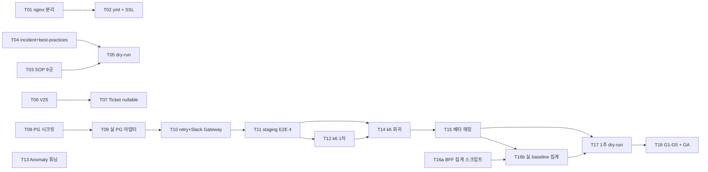

## TPM 분석 — B2B MCP Server v1.1 운영 안정화

### 요약
v1.0 MVP 머지 후 외부 게이트(PG sandbox / DevOps 도메인 / Legal SOP / TPM PoC) 해소를 기다리던 7개 stub·placeholder·sentinel 항목을 운영 진입 가능 상태로 끌어올립니다. 신규 도메인은 없고 인프라·시크릿·SOP 문서·V25 마이그레이션·실 PG 어댑터·부하 시험·Anomaly 튜닝·베타 운영이 중심입니다. API/Kafka 변경 0건이며 회귀 0 유지가 비기능 절대 기준입니다.

### 영향 서비스

| 서비스 | 레포 | 변경 유형 |
|---|---|---|
| BE (도메인 + 인프라 어댑터) | `backend/` | 수정 (Ticket nullable, Anomaly 임계값) + 신규 (PG 실 어댑터, RefundFailedNotificationGateway) |
| DB 마이그레이션 | `backend/src/main/resources/db/migration/` | 신규 (V25) |
| Spring 환경 설정 | `backend/src/main/resources/` | 수정 (application-prod/staging.yml) |
| nginx / WAF 인프라 | `infra/nginx/`, `infra/waf/` | 수정 (server_name 분리) |
| 보안 문서 (SOP/Incident/Best Practices) | `docs/security/` | 수정 (placeholder → 실 값) |
| k6 부하 시험 | `test/load/` | 신규 (결과 리포트만) |
| FE | `web/` | **변경 없음** (PRD 명시) |

### API 변경 목록

| 경로 | 메서드 | 유형 | 영향 Consumer |
|---|---|---|---|
| — | — | **신규/수정/파괴적/삭제 0건** | — |

PRD §영향 범위 명시: v1.1은 운영 안정화 범위. 신규 tool 추가/기존 tool 시그니처 변경 없음.

### Kafka 변경 목록

| 토픽 | 유형 | Producer | Consumer |
|---|---|---|---|
| — | — | **v1.1 범위 변경 없음** | — |

PRD 코드베이스 조사 결과(§배경) v2 DLQ는 `mcp.dlq.v1`로 결정됐으나 v1.1 범위 외. v1.1은 기존 `McpAnomalyDetectedEvent` (도메인 이벤트, Spring ApplicationEventPublisher) 임계값만 조정.

### 티켓 목록

| 번호 | 제목 | 레포 | 담당 | 크기 | milestone | 외부 의존 게이트 |
|---|---|---|---|---|---|---|
| T01 | nginx server_name 환경별 분리 + WAF rate-limit 결정 반영 | `infra/` | Infra | S | v1.1.0-a | #B (2026-05-27) |
| T02 | application-prod/staging.yml MCP_EXTERNAL_URL 분리 + SSL 인증서 발급 검증 | `backend/` (설정) | Infra | S | v1.1.0-a | #B (2026-05-27) |
| T03 | mcp-token-leak-sop.md placeholder 9곳 실 값 기입 | `docs/security/` | 보안 | S | v1.1.0-b | #C/#D/#L (2026-06-03) |
| T04 | mcp-incident-report-template.md 법적 보존 기간 행 추가 + best-practices 알림 채널 기입 | `docs/security/` | 보안 | S | v1.1.0-b | #C/#D/#L |
| T05 | SOP v1.1 사내 공유 + 보안팀 dry-run 1회 (5분 폐기/30분 평가/24시간 보고) | `docs/security/` | 보안 | S | v1.1.0-b | T03+T04 |
| T06 | [DB] V25 마이그레이션 — tickets.ticket_order_id NULL 전환 + sentinel 0 일괄 NULL update | `backend/db/migration/` | BE | S | v1.1.0-c | Issue #4 (해소) |
| T07 | [BE] Ticket 모델 nullable 전환 + issueComplimentary() 팩토리 sentinel 제거 | `backend/` | BE | M | v1.1.0-c | T06 |
| T08 | [Infra] PG 시크릿 인프라 프로비저닝 (Issue #9 결정값 적용) + application-prod.yml 환경변수 wire | `infra/`, `backend/` (설정) | Infra | M | v1.1.1 | #1, #7, #9 |
| T09 | [BE] 실 PG 환불 어댑터 구현 (Toss/PortOne — Issue #1 결정사) — PaymentRefundGateway 기존 interface 직접 구현 | `backend/` | BE | L | v1.1.1 | T08 |
| T10 | [BE] PG 어댑터 retry 3회 지수백오프 + 영구 실패 시 Slack 알림 Gateway + audit log statusCode 502 | `backend/` | BE | M | v1.1.1 | T09 |
| T11 | [QA] staging E2E 4 시나리오 검증 (정상/부분/거부/타임아웃) — sandbox PG | `backend/` (시나리오 테스트) | QA+BE | M | v1.1.1 | T10 |
| T12 | [QA] k6 부하 시험 1차 실행 — read/write 합격 판정 + 리포트 보관 | `test/load/results/` | QA+Infra | M | v1.1.2 | T11, #5/#11 |
| T13 | [BE] Anomaly 임계값 1차 조정 — false positive < 1% 기준 상수 갱신 + 운영 데이터 근거 코멘트 | `backend/` | BE+SRE | S | v1.1.2 | 운영 1주 수집 |
| T14 | [QA] k6 부하 시험 회귀 실행 — v1.1.1 머지 후 RefundBooking/Complimentary flow 실 PG 환경 부하 통과 | `test/load/results/` | QA+Infra | S | v1.1.2 | T12, T11 |
| T15 | [Ops] 베타 5팀 매칭 + 토큰 발급 + scope 설정 + 온보딩 docs 배포 (n8n 시도/fallback Zed/Windsurf) | 운영 문서 | TPM+Ops | M | v1.1.3 | #K (2026-05-30), T14, #10 |
| T16a | [Ops] BFF access log 집계 스크립트 셋업 (운영자 후보 풀 기준 사전 인프라) | 운영 스크립트 | Ops+Analytics | S | v1.1.3 | #12 (해소) |
| T16b | [Ops] T15 매칭 5팀 운영자 id 기준 실 baseline 집계 시작 (베타 1주 전부터 동일 운영자) | 운영 스크립트 | Ops+Analytics | S | v1.1.3 | T15, T16a |
| T17 | [Ops] 베타 1주 dry-run + 일일 운영 보고 (tool 호출/에러/Anomaly/피드백) | 운영 보고 | Ops+PM | M | v1.1.3 | T15, T16b |
| T18 | [PM] G1~G5 측정 + GA 진입 의사결정 보고서 | 보고서 | PM | S | v1.1 GA | T17 |

### 티켓 상세

#### T01 — nginx server_name 환경별 분리 + WAF rate-limit 결정 반영
- 레포: `infra/` / 담당: Infra / 크기: S / 선행: —
- 배경: 게이트 #B에서 DevOps가 prod/staging 도메인을 결정하면 nginx의 `server_name`을 두 환경에 맞게 분리하고 WAF rate-limit Terraform 모듈에 결정값을 반영합니다. v1.0의 placeholder 도메인(`mcp-api.sportsapp.com`)을 실 값으로 대체.
- 작업 범위:
  - [ ] `infra/nginx/mcp.conf` `server_name` 환경별 분리 (prod/staging)
  - [ ] `infra/waf/mcp-rate-limit.tf` 환경별 변수 매핑 (terraform `var.environment` 분기)
  - [ ] PR 본문에 적용 절차(차수 배포 → reload → curl 동작 확인) 명시
- 완료 기준:
  - [ ] staging 도메인으로 curl 호출하면 staging WAF rate-limit 적용된다
  - [ ] prod 도메인으로 curl 호출하면 prod WAF rate-limit 적용된다
  - [ ] nginx reload 시 server_name 충돌 0건이다

| 계층 | ID | 케이스 |
|---|---|---|
| Unit | U-01 | nginx config syntax (nginx -t) 가 prod/staging 양 환경에서 모두 통과한다 |
| Repository | — | (Infra 티켓 — DB 없음) |
| Scenario | S-01 | staging 도메인 호출 시 staging 환경 백엔드(8081)로 라우팅된다 |
| Scenario | S-02 | prod 도메인 호출 시 prod 환경 백엔드(8080)로 라우팅된다 |
| Scenario | S-03 | rate-limit 초과 호출 시 환경별 정책대로 429 반환된다 |

#### T02 — application-prod/staging.yml MCP_EXTERNAL_URL 분리 + SSL 검증
- 레포: `backend/src/main/resources/` / 담당: Infra / 크기: S / 선행: T01
- 배경: nginx 분리 후 Spring 환경설정에서 `mcp.external-url`을 환경별 변수로 분리하고 어드민 UI에 노출되는 prod URL이 staging 토큰 발급 시 staging 값으로 나오도록 합니다. SSL 인증서(Let's Encrypt 또는 사내 CA)는 운영 활성화 전 발급 완료.
- 작업 범위:
  - [ ] `application-prod.yml` `mcp.external-url: ${MCP_EXTERNAL_URL}` + 기본값 prod 도메인
  - [ ] `application-staging.yml` 신규 또는 갱신 — staging 도메인 + PG sandbox URL placeholder
  - [ ] SSL 인증서 발급 절차 README + 발급 결과 첨부 (PR 본문)
- 완료 기준:
  - [ ] prod profile로 부팅 시 토큰 발급 응답에 prod URL이 노출된다
  - [ ] staging profile로 부팅 시 staging URL이 노출된다
  - [ ] HTTPS 핸드셰이크 (`curl -v https://...`) 가 양 환경 모두 통과한다

| 계층 | ID | 케이스 |
|---|---|---|
| Unit | U-01 | `@Value("\${mcp.external-url}")` 가 환경변수에서 정확히 주입된다 |
| Repository | — | — |
| Scenario | S-01 | staging profile 통합 테스트에서 토큰 발급 응답 JSON의 url 필드가 staging 도메인이다 |
| Scenario | S-02 | prod profile 통합 테스트에서 토큰 발급 응답 JSON의 url 필드가 prod 도메인이다 |

#### T03 — mcp-token-leak-sop.md placeholder 9곳 실 값 기입
- 레포: `docs/security/` / 담당: 보안 / 크기: S / 선행: —
- 배경: Legal 게이트(#C/#D/#L 2026-06-03) 통과 후 SOP v1.0의 placeholder 9곳(`[보안 담당자 이메일]` 등)을 실 연락처/기한/기관으로 치환합니다. 사용자 통지 기한(예: 72시간), 규제 기관 신고 조건/기관명은 Legal 결정값 적용.
- 작업 범위:
  - [ ] placeholder 9곳 실 값 기입 (`grep '\[' docs/security/mcp-token-leak-sop.md` 결과 0건)
  - [ ] Legal 결정 — 사용자 통지 기한 / 규제 기관 신고 적용 조건·기한·기관 — 반영
  - [ ] 문서 끝 "v1.1 갱신 사유 + Legal 검토일자" 표기
- 완료 기준:
  - [ ] placeholder 정규식 매칭 결과 0건이다
  - [ ] Legal 담당자 승인 코멘트가 PR에 첨부된다

#### T04 — mcp-incident-report-template.md 법적 보존 기간 + best-practices 알림 채널
- 레포: `docs/security/` / 담당: 보안 / 크기: S / 선행: —
- 배경: 인시던트 보고서 템플릿에 "법적 보존 기간" 행을 Legal 결정값으로 추가하고, best-practices 문서의 알림 채널 placeholder(Slack 채널명 또는 Email DL)를 실 값으로 기입합니다.
- 작업 범위:
  - [ ] `mcp-incident-report-template.md`에 "법적 보존 기간" 행 추가 (Legal 결정값)
  - [ ] `mcp-token-best-practices.md` 알림 채널 placeholder 실 값 기입
- 완료 기준:
  - [ ] 템플릿 사용 시 "법적 보존 기간" 행이 비어있지 않다
  - [ ] best-practices의 알림 채널이 Slack `#channel` 또는 `email@domain` 형식이다

#### T05 — SOP v1.1 사내 공유 + 보안팀 dry-run
- 레포: `docs/security/` (보고서) / 담당: 보안 / 크기: S / 선행: T03, T04
- 배경: v1.1 SOP 완성 후 사내 공유 + 가상 토큰 유출 시나리오로 보안팀 dry-run 1회 실시. 합격 기준 3개(5분 폐기/30분 영향도 평가/24시간 인시던트 보고서 초안) 모두 통과 검증.
- 작업 범위:
  - [ ] 사내 공유 채널(Slack `#security`) 공지 + ack 회수
  - [ ] dry-run 시나리오 작성 + 보안팀 실 진행
  - [ ] dry-run 결과 `docs/security/dry-run-report-{date}.md` 작성
- 완료 기준:
  - [ ] dry-run에서 5분 이내 토큰 폐기 완료가 측정 기록된다
  - [ ] 30분 이내 영향도 평가 보고서 작성이 측정 기록된다
  - [ ] 24시간 이내 인시던트 보고서 초안이 작성된다

#### T06 — [DB] V25 마이그레이션 (tickets.ticket_order_id NULL 전환 + sentinel 0 일괄 update)
- 레포: `backend/src/main/resources/db/migration/` / 담당: BE / 크기: S / 선행: —
- 배경: Phase 2 Complimentary Ticket 발급 시 ticket_order_id가 0L sentinel로 저장되는 v1.0 임시 결정을 정리. PM 결정(Issue #4 해소): `UPDATE tickets SET ticket_order_id = NULL WHERE ticket_order_id = 0` 일괄 적용 후 컬럼 NULL 전환. Flyway가 부팅 시 적용되므로 단일 릴리즈에서 자동 진행되나, V25 적용은 (b) Ticket 모델 nullable 전환 코드 배포보다 반드시 선행돼야 함. **단계 0 사전 검증으로 sentinel 0 데이터가 예상치(complimentary ticket 수) 와 일치하는지 확인 후 진행**.
- 작업 범위:
  - [ ] **단계 0 (선행, 운영 DB 사전 조회)** — PR 본문에 결과 첨부:
    ```sql
    SELECT COUNT(*) as zero_count,
           MIN(created_at) as oldest,
           MAX(created_at) as newest,
           COUNT(DISTINCT seat_id) as distinct_seats
    FROM tickets
    WHERE ticket_order_id = 0;
    ```
  - [ ] `V25__alter_tickets_ticket_order_id_nullable.sql` 작성
    - 단계 1: `UPDATE tickets SET ticket_order_id = NULL WHERE ticket_order_id = 0`
    - 단계 2: `ALTER TABLE tickets MODIFY COLUMN ticket_order_id BIGINT NULL`
  - [ ] 롤백 SQL 문서화 (`docs/migration/V25-rollback.md`) — NULL row 존재 시 backfill 필요 명시
  - [ ] PR 본문에 적용 순서(단계 0 사전 검증 → V25 부팅 적용 → 1시간 모니터링 → 코드 배포) 명시
- 완료 기준:
  - [ ] **단계 0 결과를 PR 본문에 첨부. zero_count 가 expected complimentary ticket 수와 일치하면 단계 1 진행. 불일치 시 sentinel 외 잘못된 0 데이터 존재 가능성 → BE + DBA 추가 분석 후 정책 재결정**
  - [ ] Flyway 부팅 적용 후 `SHOW COLUMNS FROM tickets LIKE 'ticket_order_id'` 결과가 `NULL: YES`이다
  - [ ] `SELECT COUNT(*) FROM tickets WHERE ticket_order_id = 0` 결과가 0이다
  - [ ] 기존 정상 데이터 (`ticket_order_id IS NOT NULL AND > 0`) 행 개수가 마이그레이션 전후 동일하다

| 계층 | ID | 케이스 |
|---|---|---|
| Unit | — | (DDL 티켓) |
| Repository | R-01 | Flyway 부팅 후 `JdbcTemplate.queryForObject("SELECT IS_NULLABLE FROM information_schema.columns WHERE table_name='tickets' AND column_name='ticket_order_id'", String::class.java)` 가 'YES' 이다 |
| Repository | R-02 | sentinel 0 데이터 fixture 시드 후 마이그레이션 적용 시 해당 행의 ticket_order_id가 NULL로 변경된다 |
| Repository | R-03 | 마이그레이션 적용 후 정상 ticket_order_id (≠ 0) 데이터는 값 그대로 유지된다 |
| Scenario | S-01 | Flyway 부팅 적용 → 애플리케이션 정상 부팅 → 기존 Ticket 조회 API 회귀 0건 |

#### T07 — [BE] Ticket 모델 nullable 전환 + issueComplimentary() sentinel 제거
- 레포: `backend/` / 담당: BE / 크기: M / 선행: T06
- 배경: V25 적용 후 Kotlin 모델의 `ticketOrderId: Long`을 `Long?`로 전환. **v1.0의 `issueComplimentary(seatId)` 팩토리는 이미 존재하나 내부에서 `ticketOrderId = 0L` sentinel 을 사용 중** — 이를 `ticketOrderId = null` 로 변경. 기존 `issue(ticketOrderId, seatId)` 팩토리는 유지(정상 주문 경로). `TicketingDomainService`의 Ticket 사용처는 nullable 안전 처리(`?.let`, `?:`). **`TicketCustomRepository` 클래스는 미존재 — 신설 불필요. 현존 `TicketRepository`(`save / saveAll / findByTicketOrderId(ticketOrderId: Long)`) 시그니처는 NULL을 인자로 받을 수 없으므로 NULL 행은 자연히 제외됨 → 추가 변경 없음**. JOIN 쿼리는 반대 방향인 `TicketOrderCustomRepositoryImpl`에만 존재하므로 본 티켓 범위 외.
- 작업 범위:
  - [ ] `Ticket.kt` `val ticketOrderId: Long` → `val ticketOrderId: Long?`
  - [ ] `Ticket.issueComplimentary(seatId)` 내부 `ticketOrderId = 0L` → `ticketOrderId = null` 로 변경 (팩토리 시그니처는 유지)
  - [ ] 기존 `Ticket.issue(ticketOrderId: Long, seatId: Long)` 시그니처 유지 (정상 주문 경로)
  - [ ] `TicketRepository` 인터페이스 시그니처 그대로 유지 — `findByTicketOrderId(ticketOrderId: Long)` 는 NULL을 인자로 받지 않으므로 NULL 행 제외 동작 자연히 보존
  - [ ] `TicketingDomainService`의 Ticket 사용처 nullable 안전 처리 (`?.let`, `?:`)
  - [ ] **금지 명시 (be-code-convention.md 준수)**: Port 인터페이스 신설 금지 / typealias 호환 layer 금지 / 호출부 `ticketOrderId!!` 사용 금지 (`?:` / `?.let` 사용)
- 완료 기준:
  - [ ] complimentary ticket 발급 시 `ticket.ticketOrderId == null`이다
  - [ ] 정상 주문 ticket 발급 시 `ticket.ticketOrderId == orderId`이다
  - [ ] 기존 ticket 조회 API 응답 JSON에 `ticketOrderId` 가 nullable 필드로 노출된다 (회귀 0 — null 응답 시 FE 측 처리 사전 확인)
  - [ ] `grep -n '!!' backend/src/main/kotlin/com/sportsapp/domain/ticketing/` 결과 0건이다

| 계층 | ID | 케이스 |
|---|---|---|
| Unit | U-01 | `Ticket.issueComplimentary(seatId)` 호출 시 `ticketOrderId == null` 이다 |
| Unit | U-02 | `Ticket.issue(orderId=1L, seatId=10L)` 호출 시 `ticketOrderId == 1L` 이다 |
| Unit | U-03 | `Ticket.issueComplimentary` 로 생성된 ticket 의 `status == ISSUED` 이다 (회귀 0) |
| Repository | R-01 | nullable Long? 매핑 정확성 — save → findById 라운드트립 후 `ticketOrderId == null` 이 그대로 복원된다 |
| Repository | R-02 | nullable Long? 매핑 정확성 — save → findById 라운드트립 후 `ticketOrderId == 1L` 이 그대로 복원된다 |
| Repository | R-03 | `TicketRepository.findByTicketOrderId(orderId)` 쿼리 — `ticket_order_id = ?` 조건이 NULL 행을 제외한다 |
| Repository | R-04 | `ticketOrderId가 null인 row는 TicketRepository.findByTicketOrderId 로 조회되지 않는다 (시그니처가 Long 만 받음 → sentinel 0L 제외와 의미 동등하게 NULL row 제외)` |
| Scenario | S-01 | `issueComplimentaryTicket` MCP tool 호출 시 DB에 ticket_order_id NULL 행이 insert 되고 API 응답에 ticketId가 반환된다 |
| Scenario | S-02 | 기존 정상 주문 → 결제 → 티켓 발급 flow 회귀 — ticket_order_id != null 그대로 동작 |

#### T08 — [Infra] PG 시크릿 인프라 프로비저닝 + application-prod.yml wire
- 레포: `infra/`, `backend/src/main/resources/` / 담당: Infra / 크기: M / 선행: Issue #9 결정
- 배경: Open Issue #9 결정값(AWS Secrets Manager vs Vault vs Spring Cloud Config vs K8s Secret) 적용. 결정된 시크릿 저장소에 PG API key/secret 저장 + Spring이 부팅 시 안전 주입 가능하도록 wire. PG 평문 커밋 0건 절대 기준.
- 작업 범위:
  - [ ] Issue #9 결정값에 따른 시크릿 저장소 프로비저닝 (Terraform/IaC)
  - [ ] `application-prod.yml` `payment.gateway.api-key: ${PAYMENT_GATEWAY_API_KEY}` `payment.gateway.secret: ${PAYMENT_GATEWAY_SECRET}` 환경변수 참조
  - [ ] (선택) Spring Cloud Config 사용 시 bootstrap.yml 추가
  - [ ] PR 본문에 `git log -p` grep 결과 — 평문 시크릿 0건 첨부
- 완료 기준:
  - [ ] prod profile 부팅 시 시크릿 저장소에서 정상 주입된다
  - [ ] 환경변수 미설정 시 부팅 실패(`PlaceholderResolutionException`)된다
  - [ ] git 히스토리 grep `api[_-]key=` 평문 0건이다

| 계층 | ID | 케이스 |
|---|---|---|
| Unit | U-01 | `@Value("\${payment.gateway.api-key}")` 가 환경변수에서 정확히 주입된다 |
| Repository | — | — |
| Scenario | S-01 | prod profile + 환경변수 set 시 부팅 정상 |
| Scenario | S-02 | prod profile + 환경변수 unset 시 부팅 실패 |

#### T09 — [BE] 실 PG 환불 어댑터 구현 (Toss/PortOne 등 Issue #1 결정사)
- 레포: `backend/` / 담당: BE / 크기: L / 선행: T08
- 배경: Issue #1 결정사(Toss/PortOne/KakaoPay 중 1사)의 환불 API를 호출하는 실 어댑터 구현. `@Profile("prod")` 활성. v1.0의 `StubPaymentRefundGateway`(`@Profile("!prod")`)는 그대로 유지(staging/dev/test 경로).
- 작업 범위:
  - [ ] **be-code-convention.md 준수 명시**:
    - [ ] **Port 인터페이스 신설 금지** — v1.0의 `PaymentRefundGateway` interface(domain layer) 직접 구현
    - [ ] **typealias 호환 layer 신규 생성 금지** (`*TypeAliases.kt` 등)
    - [ ] 실 어댑터 클래스명: `{Vendor}PaymentRefundGatewayImpl.kt` (예: `TossPaymentRefundGatewayImpl.kt`)
    - [ ] `@Profile("prod")` 어노테이션 명시
    - [ ] WebClient/RestClient 사용 (외부 HTTP 호출 비동기 또는 동기 — vendor SDK 패턴 우선)
    - [ ] vendor 응답 → `PaymentRefundResult` 매핑 (단순 변환 메서드 — Adapter 패턴 잔재 금지)
  - [ ] vendor 시크릿은 T08의 환경변수에서 주입
  - [ ] vendor 응답 코드별 예외 매핑 (`PaymentGatewayException` 계열)
- 완료 기준:
  - [ ] prod profile 부팅 시 `PaymentRefundGateway` 빈이 vendor 어댑터로 등록된다
  - [ ] `!prod` profile 부팅 시 `StubPaymentRefundGateway` 빈이 유지된다
  - [ ] vendor sandbox 호출 시 정상 환불 응답 → `PaymentRefundResult` 매핑 정확

| 계층 | ID | 케이스 |
|---|---|---|
| Unit | U-01 | vendor 응답 JSON → `PaymentRefundResult` 매핑이 정확하다 (정상 케이스) |
| Unit | U-02 | vendor 에러 응답 → `PaymentGatewayException` 정확한 타입으로 던져진다 |
| Unit | U-03 | vendor 타임아웃 응답 → `PaymentGatewayException` (timeout) 으로 분류된다 |
| Repository | — | — |
| Scenario | S-01 | WireMock으로 vendor sandbox stub — 정상 환불 → audit log statusCode 200 기록 |
| Scenario | S-02 | WireMock 5xx stub — vendor 응답 502 → 어댑터에서 `PaymentGatewayException` |
| Scenario | S-03 | WireMock timeout stub — 어댑터에서 `PaymentGatewayException` (timeout 분류) |

#### T10 — [BE] PG 어댑터 retry + Slack 알림 Gateway + audit log
- 레포: `backend/` / 담당: BE / 크기: M / 선행: T09
- 배경: Issue #8 해소 결정(자동 retry 3회 지수백오프 + 영구 실패 시 어드민 알림)을 어댑터 호출 wrapper에 적용. retry는 Spring Retry 또는 Resilience4j (`@Retryable` 활용 또는 `RefundBookingUseCase` 내부 retry 로직). **PM 결정: 어드민 알림은 Slack webhook (또는 Email DL) 단순 발송 — 어드민 inbox 라우팅은 v1.1 범위에서 제외하고 v1.2.0 (대시보드 PRD) 의 operator_inbox_notifications 출시 시 이관**. audit log에 statusCode 502 기록.
- 작업 범위:
  - [ ] **Gateway 인터페이스는 domain/booking/ 에 신설 (be-code-convention.md §네이밍 컨벤션 — Gateway 패턴, 외부 시스템 호출). Port 인터페이스 신설 금지 명시**:
    - [ ] `RefundFailedNotificationGateway` interface (`domain/booking/`) — 단일 메서드 `fun notify(bookingId: BookingId, errorMessage: String)`
    - [ ] `SlackRefundFailedNotificationGatewayImpl` (`infrastructure/notification/`) — WebClient로 Slack webhook POST
  - [ ] 단계별 작업:
    1. Retry 3회 (지수 백오프 1s, 2s, 4s — `@Retryable` 활용 또는 `RefundBookingUseCase` 내부 retry 로직)
    2. 영구 실패 시 `RefundFailedNotificationGateway.notify(bookingId, errorMessage)` 호출
    3. Slack webhook URL은 `application-prod.yml` 의 `notification.slack.refund-failed-webhook-url` 환경변수 참조 (T08 시크릿 인프라 패턴 재활용)
    4. 인프라 위임 (대시보드 v1.2.0 operator_inbox_notifications 출시 시 Gateway 구현체만 교체하여 이관 가능)
  - [ ] audit log statusCode 502 기록 — 기존 `McpAuditLog` 패턴 활용
  - [ ] 메트릭 (Datadog): success/failure/latency/retry count
- 완료 기준:
  - [ ] vendor 5xx 1회 + 정상 1회 시 retry 후 정상 환불 처리된다
  - [ ] vendor 5xx 3회 연속 시 영구 실패로 분류되고 audit log statusCode 502 기록된다
  - [ ] 영구 실패 시 Slack webhook 으로 알림 메시지가 발송된다 (WireMock 검증)

| 계층 | ID | 케이스 |
|---|---|---|
| Unit | U-01 | retry policy가 5xx 응답에 대해 3회 시도 후 포기한다 |
| Unit | U-02 | retry policy가 4xx 응답에 대해 즉시 실패한다 (재시도 안 함) |
| Unit | U-03 | 지수 백오프 간격이 1s/2s/4s로 정확히 설정된다 |
| Repository | R-01 | 영구 실패 시 `mcp_audit_logs` 행이 `status_code=502`로 1건 insert된다 |
| Scenario | S-01 | WireMock 5xx 2회 + 정상 1회 → 정상 환불 + audit log statusCode 200 |
| Scenario | S-02 | WireMock 5xx 3회 연속 → 영구 실패 + audit log 502 + Slack webhook 1건 POST (WireMock 검증) |

#### T11 — [QA] staging E2E 4 시나리오 검증 (정상/부분/거부/타임아웃)
- 레포: `backend/` (시나리오 테스트) / 담당: QA+BE / 크기: M / 선행: T10
- 배경: vendor sandbox + staging 환경에서 4개 시나리오 통과 확인. 비기능 §배포 절대 기준.
- 작업 범위:
  - [ ] `backend/src/test/kotlin/.../mcp/RefundBookingE2ETest.kt` — 4 시나리오 시나리오 통합 테스트 (TestContainers + staging vendor sandbox + WireMock fallback)
  - [ ] staging 환경 실 호출 결과 `test/load/results/v1.1.1-staging-e2e-{date}.md` 보관
- 완료 기준:
  - [ ] 정상 환불 시나리오 통과 (vendor sandbox 호출 → 200 → DB status REFUNDED)
  - [ ] 부분 환불 시나리오 통과 (요청 금액 < 결제 금액 → 정상 처리)
  - [ ] 환불 거부 시나리오 통과 (vendor 4xx → 비즈니스 예외)
  - [ ] 타임아웃 시나리오 통과 (vendor 10s 무응답 → retry → 영구 실패 → Slack 알림)

| 계층 | ID | 케이스 |
|---|---|---|
| Unit | — | — |
| Repository | — | — |
| Scenario | S-01 | 정상 환불 — vendor sandbox 호출 → 200 → DB status REFUNDED + audit 200 |
| Scenario | S-02 | 부분 환불 — 요청 5000원 < 결제 10000원 → 정상 처리 + audit 200 |
| Scenario | S-03 | 환불 거부 — vendor 4xx → `RefundBookingException` + audit 4xx |
| Scenario | S-04 | 타임아웃 — vendor 10s 무응답 → retry 3회 → 영구 실패 → Slack 알림 + audit 502 |

#### T12 — [QA] k6 부하 시험 1차 실행 + 합격 판정 + 리포트
- 레포: `test/load/results/` / 담당: QA+Infra / 크기: M / 선행: T11, #5/#11 (해소)
- 배경: Issue #11 결정값(staging 스펙 운영 동등 vs 축소)에 따라 절대값 또는 상대값 기준으로 합격 판정. PRD 권고 분리: T12는 v1.1.1 머지 후 1차 실행, T14는 회귀 실행.
- 작업 범위:
  - [ ] `test/load/mcp-read-load.js` 실 실행 (200 VU + 50 RPS / 10분)
  - [ ] `test/load/mcp-write-load.js` 실 실행 (100 VU + 20 RPS / 10분)
  - [ ] Issue #11 결정값에 따른 합격 기준 적용 (절대값/상대값)
  - [ ] 결과 리포트 `test/load/results/v1.1.2-load-test-{date}.md`
  - [ ] 실패 시 병목 분석 (DB/Redis/nginx/Tomcat) + 튜닝 + 재시험
- 완료 기준:
  - [ ] read P95 < 800ms (or 상대값 환산) + 에러율 < 0.5% 통과
  - [ ] write P95 < 1500ms (or 상대값 환산) + 에러율 < 1% 통과
  - [ ] 리포트 md에 측정값/그래프/병목 분석 포함

| 계층 | ID | 케이스 |
|---|---|---|
| Unit | — | — |
| Repository | — | — |
| Scenario | S-01 | read load 시나리오 — 측정값이 임계 통과 |
| Scenario | S-02 | write load 시나리오 — 측정값이 임계 통과 |

#### T13 — [BE] Anomaly 임계값 1차 조정 + 운영 데이터 근거 코멘트
- 레포: `backend/` / 담당: BE+SRE / 크기: S / 선행: 운영 1주 수집 (T11 머지 후 staging 운영 데이터)
- 배경: Issue #6 + #13 해소 결정 — false positive < 1% 기준으로만 조정, false negative 미측정 + 보안 담당자 수용 기록. `McpAnomalyDetector.companion object` 상수 갱신 + 운영 데이터 근거 코멘트. **시나리오 테스트는 결정적 케이스로 정의 — fixture 1000건에 갱신된 임계 적용 시 알림 발생 행 개수가 기대값(예: 9건, 1% 미만) 과 정확히 일치하는지 검증. false positive 비율 측정은 시나리오 테스트가 아닌 운영 데이터 분석 보고서로 분리**.
- 작업 범위:
  - [ ] `mcp_audit_logs` + `McpAnomalyDetectedEvent` 1주 분석 (SQL 또는 Datadog)
  - [ ] false positive 비율 측정 (실 이상 vs 알림 발생 ratio) — 운영 데이터 분석 보고서 별도 작성
  - [ ] `McpAnomalyDetector.companion object`의 `BASELINE_WINDOW_DAYS`/`COLD_START_DAYS`/`SPIKE_RATIO`/`MIN_ABSOLUTE_THRESHOLD` 갱신
  - [ ] 변경 사유 코멘트 — `// v1.1.2 (date): false positive 측정 X.X% → 임계 조정 (운영 데이터 근거 링크)`
  - [ ] 보안 담당자 false negative 미측정 수용 기록 첨부 (PR 본문)
- 완료 기준:
  - [ ] 운영 데이터 분석 보고서 (`docs/ops/anomaly-tuning-{date}.md`) PR 본문에 첨부 — false positive < 1% 합격 측정값 명시
  - [ ] 보안 담당자 명시 수용 코멘트가 PR에 첨부된다

| 계층 | ID | 케이스 |
|---|---|---|
| Unit | U-01 | 갱신된 `SPIKE_RATIO` 상수로 spike detection 임계 검증 (boundary case) |
| Unit | U-02 | 갱신된 `MIN_ABSOLUTE_THRESHOLD` 상수로 절대 임계 검증 |
| Repository | — | — |
| Scenario | S-01 | 갱신된 임계 상수 (spike_ratio, absolute_threshold) 가 fixture 데이터 (1주 audit 1000건) 에 적용 시 알림 발생 행 개수가 기대값 = 9건 (1% 미만) 과 정확히 일치한다 |

#### T14 — [QA] k6 부하 시험 회귀 실행 (v1.1.1 머지 후)
- 레포: `test/load/results/` / 담당: QA+Infra / 크기: S / 선행: T12, T11
- 배경: PRD 권고 분리 — v1.1.1 (실 PG 통합) 머지 후 RefundBooking/Complimentary flow가 실 PG 환경(staging vendor sandbox)에서 부하 통과하는지 회귀 시험.
- 작업 범위:
  - [ ] T12와 동일한 부하 스크립트 실행 (RefundBooking 포함 시나리오)
  - [ ] 결과 리포트 `test/load/results/v1.1.2-regression-load-test-{date}.md`
  - [ ] T12 결과 대비 회귀 분석 (성능 저하 ≥ 10% 시 원인 분석)
- 완료 기준:
  - [ ] T12와 동일 임계 통과
  - [ ] RefundBooking flow에서 vendor sandbox 호출 포함 시에도 write P95 < 1500ms 통과

| 계층 | ID | 케이스 |
|---|---|---|
| Scenario | S-01 | RefundBooking 포함 write load 시나리오 — 측정값이 임계 통과 |
| Scenario | S-02 | T12 결과 대비 성능 저하 < 10% |

#### T15 — [Ops] 베타 5팀 매칭 + 토큰 발급 + 온보딩 docs
- 레포: 운영 문서 / 담당: TPM+Ops / 크기: M / 선행: #K (2026-05-30), T14, #10 (해소)
- 배경: Issue #10 해소 — n8n 포함 시도 + 미지원 시 Zed/Windsurf fallback. 5클라이언트 매칭 후 토큰 발급 + scope 설정. FE-03의 docs 페이지 활용.
- 작업 범위:
  - [ ] 베타 5팀 선정 (1개월 수수료 면제 인센티브 — Issue #7 해소)
  - [ ] 5클라이언트 매칭 (Claude Desktop / ChatGPT Desktop / Cursor / Continue.dev / n8n 또는 Zed/Windsurf)
  - [ ] n8n PoC — 게이트 #K 시점에 검증 후 fallback 결정
  - [ ] 베타 토큰 발급 + scope 설정 (각 팀별 read 권한 기본 + 필요 시 write)
  - [ ] 온보딩 docs 배포 (FE-03 docs 페이지 활용 + 클라이언트별 setup 가이드)
- 완료 기준:
  - [ ] 5팀 매칭 완료 + 토큰 발급 완료
  - [ ] 각 클라이언트에서 첫 조회 성공 확인
  - [ ] 온보딩 docs URL 5팀에 전달

#### T16a — [Ops] BFF access log 집계 스크립트 셋업 (사전 인프라)
- 레포: 운영 스크립트 / 담당: Ops+Analytics / 크기: S / 선행: #12 (해소)
- 배경: Issue #12 해소 — BFF 서버 access log (`/api/admin/*` GET 카운트) 기반. nginx/Spring access log 집계 스크립트를 사전 셋업해 운영자 후보 풀 기준으로 동작 검증. T15 매칭 완료 전이라도 인프라 준비를 병렬 진행하여 베타 진입 시점에 즉시 baseline 집계가 가능하도록 함.
- 작업 범위:
  - [ ] nginx/Spring access log 집계 스크립트 (`scripts/g2-baseline.sh` 또는 SQL)
  - [ ] 운영자 후보 풀(베타 후보 + 기존 어드민 사용자 전체) 기준 일별 `/api/admin/*` GET 카운트 dry-run 1회
  - [ ] 스크립트 실행 가이드 `docs/ops/g2-baseline-script-readme.md` 작성
- 완료 기준:
  - [ ] 스크립트 dry-run 결과 csv 생성됨 — 운영자별 일별 카운트 컬럼 정확
  - [ ] 스크립트 실행 가이드 README 작성됨 (운영자 id 인자 전달 방식 명시)

#### T16b — [Ops] T15 매칭 5팀 운영자 id 기준 실 baseline 집계 시작
- 레포: 운영 스크립트 / 담당: Ops+Analytics / 크기: S / 선행: T15, T16a
- 배경: T15에서 베타 5팀이 확정되면 그 운영자 id 기준으로 베타 1주 전부터 동일 운영자의 어드민 클릭 baseline 집계 시작. T16a의 스크립트 인프라를 그대로 활용.
- 작업 범위:
  - [ ] T15 매칭 5팀 운영자 id 목록 확정 + 스크립트 인자로 전달
  - [ ] T16a 스크립트로 5팀 운영자 1주 전부터 일별 `/api/admin/*` GET 카운트 집계
  - [ ] baseline 데이터 `docs/ops/g2-baseline-{date}.csv` 보관 (T18 G2 측정에서 비교 대상)
- 완료 기준:
  - [ ] 5팀 운영자 1주 전부터 일별 클릭 수 baseline csv 존재
  - [ ] baseline csv 가 T18 의사결정 보고서에서 인용 가능한 포맷 (운영자 id × 날짜 × 카운트)

#### T17 — [Ops] 베타 1주 dry-run + 일일 운영 보고
- 레포: 운영 보고 / 담당: Ops+PM / 크기: M / 선행: T15, T16b
- 배경: 베타 5팀이 실제로 MCP tool 사용. 일일 보고로 tool 호출 수/에러/Anomaly 발생/운영자 피드백 추적.
- 작업 범위:
  - [ ] 일일 보고 템플릿 (`docs/ops/beta-daily-{date}.md`) — 7일분
  - [ ] tool 호출 수 (`mcp_audit_logs` 일별 집계)
  - [ ] 에러율 (statusCode 4xx/5xx 비율)
  - [ ] Anomaly 발생 카운트 + false positive 추정
  - [ ] 운영자 피드백 수집 (Slack 채널 또는 Form)
- 완료 기준:
  - [ ] 7일 dry-run 완료
  - [ ] 7일분 일일 보고 md 7건 작성

#### T18 — [PM] G1~G5 측정 + GA 의사결정 보고서
- 레포: 보고서 / 담당: PM / 크기: S / 선행: T17
- 배경: 베타 1주 후 G1~G5 합격 여부 판정 + GA 진입 의사결정.
- 작업 범위:
  - [ ] G1 활성 운영자 5팀 (월 tool 10회 이상 호출) 측정
  - [ ] G2 어드민 클릭 50% 감소 (T16b baseline 대비 베타 1주 후 비교)
  - [ ] G3 confirm 미수신 write 실행 0건 검증
  - [ ] G4 신규 운영자 첫 조회까지 5분 이내 측정 (T17 dry-run 시작 시점 + 첫 호출 timestamp)
  - [ ] G5 throttling 80% 도달 동일 토큰 2회 이상 반복 0건 검증
  - [ ] GA 의사결정 보고서 `docs/pm/v1.1-ga-decision-{date}.md`
- 완료 기준:
  - [ ] G1~G5 측정값 5개 모두 보고서에 기재
  - [ ] GA 진입 또는 지연 의사결정 + 근거 명시

### 의존 그래프 (DAG)

| 티켓 | 선행 | 후행 카운트 | 비고 |
|---|---|---|---|
| T01 | — | 1 | 중간 (T02) |
| T02 | T01 | 0 | 단독 |
| T03 | — | 1 | 중간 (T05) |
| T04 | — | 1 | 중간 (T05) |
| T05 | T03, T04 | 0 | 단독 |
| T06 | — | 1 | 중간 (T07) |
| T07 | T06 | 0 | 단독 |
| T08 | — (Issue #9 외부) | 1 | 중간 (T09) |
| T09 | T08 | 1 | 중간 (T10) |
| T10 | T09 | 1 | 중간 (T11) |
| T11 | T10 | 2 | 병목 (T12, T14) |
| T12 | T11 | 1 | 중간 (T14) |
| T13 | — (T11 머지 후 운영 1주) | 0 | 단독 |
| T14 | T12, T11 | 1 | 중간 (T15) |
| T15 | T14 (+ #K, #10 외부) | 2 | 병목 (T16b, T17) |
| T16a | — (#12 해소) | 1 | 중간 (T16b) |
| T16b | T15, T16a | 1 | 중간 (T17) |
| T17 | T15, T16b | 1 | 중간 (T18) |
| T18 | T17 | 0 | 단독 |

- 총 티켓: **19개** (T16 → T16a/T16b 분리로 18 → 19)
- 후행 카운트 ≥ 3 티켓: **0건** (분해 재검토 불필요)
- 병목:
  - T11 (후행 2) — 부하 시험과 회귀 시험 두 갈래의 분기점. 인위적 분해 불가능 (E2E 합격 자체가 후속 시험 진입 전제 조건).
  - T15 (후행 2) — 베타 매칭 결과가 T16b 실 baseline 집계와 T17 dry-run 양쪽에 입력. 분해 불가능.

### 초기 ready 셋 (Wave 1)

선행 없는 티켓 — 메인 오케스트레이터가 Wave 1로 동시 스폰할 대상:

- **T01** (nginx 환경 분리) — Infra
- **T03** (SOP placeholder 9곳) — 보안
- **T04** (incident template + best-practices) — 보안
- **T06** (V25 마이그레이션) — BE
- **T08** (PG 시크릿 인프라) — Infra (#9 결정 해소 후)
- **T16a** (BFF access log 집계 스크립트 셋업) — Ops (#12 해소 후 즉시)

총 6개 병렬 가능 (T16 → T16a로 교체, 6개 유지). 단 외부 게이트(#B, #C/D/L, #9, #12, #K)는 wave 진입 조건으로 메인 오케스트레이터가 별도 검증.

### Single Writer per File 검증

같은 wave 내 동일 파일 수정 가능성 점검:

| Wave (추정) | 티켓 | 수정 파일 | 충돌 위험 |
|---|---|---|---|
| Wave 1 | T01 | `infra/nginx/*`, `infra/waf/*` | 없음 (T08과 다른 디렉토리) |
| Wave 1 | T03 | `docs/security/mcp-token-leak-sop.md` | 없음 (T04와 다른 파일) |
| Wave 1 | T04 | `docs/security/mcp-incident-report-template.md`, `docs/security/mcp-token-best-practices.md` | 없음 |
| Wave 1 | T06 | `backend/db/migration/V25__*.sql` | 없음 (신규 파일) |
| Wave 1 | T08 | `infra/secrets/*`, `application-prod.yml` | **주의** — T02도 `application-prod.yml` 수정 (단 T02는 Wave 2이므로 충돌 없음). T10이 추가하는 `notification.slack.refund-failed-webhook-url` 키도 별도 wave (Wave 3) 이므로 순차 충돌 없음 |
| Wave 1 | T16a | `scripts/g2-baseline.sh`, `docs/ops/g2-baseline-script-readme.md` (신규) | 없음 |
| Wave 2 | T02 | `application-prod.yml`, `application-staging.yml` | T08 머지 완료 후 진입 — 순차 충돌 없음 |
| Wave 2 | T07 | `Ticket.kt`, `TicketingDomainService` (TicketCustomRepository 신설 없음 — 사실 정정) | 없음 (T07만 ticketing 도메인 수정) |
| Wave 2 | T05 | `docs/security/dry-run-report-*.md` (신규) | 없음 |
| Wave 2 | T09 | `infrastructure/payment/{Vendor}PaymentRefundGatewayImpl.kt` (신규) | 없음 |
| Wave 3+ | T10 | `RefundBookingUseCase` 또는 `RefundDomainService`, `domain/booking/RefundFailedNotificationGateway.kt` (신규), `infrastructure/notification/SlackRefundFailedNotificationGatewayImpl.kt` (신규), `application-prod.yml`(키 추가) | T09와 다른 파일이면 안전. `application-prod.yml` 은 T08/T02 머지 후 키 추가 — 순차 충돌 없음 |
| 회귀 시점 | T11 | `backend/src/test/.../mcp/RefundBookingE2ETest.kt` (신규) | 없음 |
| Wave 4 | T12 | `test/load/results/v1.1.2-*` (신규) | 없음 |
| Wave 5 | T13 | `McpAnomalyDetector.kt` (companion object), `docs/ops/anomaly-tuning-*.md` (신규) | 없음 |
| Wave 5 | T14 | `test/load/results/v1.1.2-regression-*` (신규) | 없음 |
| Wave 7 | T16b | `docs/ops/g2-baseline-{date}.csv` (신규) | 없음 (T16a 스크립트 인자 실행만) |

**검증 결과**: 같은 wave 내 동일 파일 수정 0건. `application-prod.yml`은 T08 (Wave 1) → T02 (Wave 2) → T10 (Wave 3+) 순차 수정으로 충돌 없음. T10의 Gateway 인터페이스·구현체는 신규 파일이므로 충돌 없음. T16a 스크립트와 T16b 실행 결과 csv 도 신규 파일이므로 충돌 없음.

### Fan-out 너비 시뮬레이션 (위상정렬 후 예측)

DAG 위상정렬 시 예상 wave별 ready 셋 크기 (T16 → T16a/T16b 분리 반영):

| Wave | ready 셋 | 너비 | 비고 |
|---|---|---|---|
| Wave 1 | T01, T03, T04, T06, T08, T16a | **6** | 외부 게이트 모두 해소 가정 |
| Wave 2 | T02, T05, T07, T09 | **4** | T01/T03+T04/T06/T08 완료 후 |
| Wave 3 | T10 | **1** | T09 완료 후 (직선) |
| Wave 4 | T11 | **1** | T10 완료 후 (직선) |
| Wave 5 | T12, T13 | **2** | T11 완료 + 운영 1주 후 (T13은 시간 의존) |
| Wave 6 | T14 | **1** | T12 완료 후 (직선) |
| Wave 7 | T15 | **1** | T14 완료 + #K 게이트 해소 후 |
| Wave 8 | T16b | **1** | T15 완료 + T16a 완료 후 (T16a는 Wave 1에서 완료) |
| Wave 9 | T17 | **1** | T15, T16b 완료 후 |
| Wave 10 | T18 | **1** | T17 완료 후 (1주 dry-run 시간 의존) |

**평균 wave 너비**: 19 티켓 / 10 wave = **1.9** — 팀 4명 기준 47% 활용 (목표 70% 미달, T16 분리로 약간 감소)

**분해 한계 분석**:
- Wave 1, 2는 너비 6, 4로 양호
- Wave 3~10은 PG 통합 (T09 → T10 → T11 → T12 → T14) + 베타 단계 (T15 → T16b → T17 → T18) **본질적으로 직선** — 이전 단계 결과가 다음 단계 입력
- 인위적으로 잘게 쪼개도 의존이 사라지지 않음 (예: T09를 vendor 어댑터 + retry wrapper로 쪼개도 retry는 어댑터 위에 얹는 wrapper라 순차 필수)
- T13 (Anomaly 튜닝)을 T12와 동일 wave에 배치한 것이 fan-out 보완. 운영 1주 수집은 staging 또는 베타 dry-run 데이터로 가능.
- T16 → T16a/T16b 분리는 인프라 사전 셋업 (T16a) 을 Wave 1로 끌어와 베타 진입 시점에 즉시 baseline 집계 가능하도록 한 트레이드오프 (Wave 평균 너비는 1.9로 미세 감소했으나 베타 진입 lead time 단축)

**판단**: v1.1은 본질적으로 순차적 통합 단계 (인프라 → PG → 검증 → 베타). 신기능 도메인이 없어 fan-out 면적 한계 명확. Wave 1, 2 너비 확보로 초반 가속만 가능. PM/메인 오케스트레이터에게 평균 너비 1.9가 본 운영 안정화 PRD의 분해 한계임을 알림.

### 시각화 (Mermaid flowchart LR)



### 외부 의존 게이트 통합 표

각 wave 진입 시 메인 오케스트레이터가 검증해야 할 외부 게이트:

| 게이트/이슈 | 차단 티켓 | 기한 |
|---|---|---|
| 게이트 #B (DevOps 도메인) | T01, T02 | 2026-05-27 |
| 게이트 #C/#D/#L (Legal SOP) | T03, T04, T05 | 2026-06-03 |
| Issue #1 (PG 사 선정) + #7 (sandbox) | T08, T09 | Slack 발송 후 |
| Issue #9 (PG 시크릿 관리) | T08 | FR-01 착수 14일 전 |
| 게이트 #K (TPM PoC) | T15 | 2026-05-30 |
| Issue #11 (staging 스펙) | T12 | INFRA-02 적용 14일 전 |
| 운영 데이터 1주 수집 (T11 머지 후) | T13 | T11 머지 + 7일 |

해소 완료 (PRD 명시):
- Issue #4 (V25 sentinel 처리) — T06에 NULL update 일괄 적용 + 단계 0 사전 검증 SQL 추가
- Issue #6 + #13 (Anomaly false positive only) — T13에 false negative 미측정 + 보안 담당자 수용 기록
- Issue #7 (베타 인센티브 1개월 수수료 면제) — T15 작업 범위 명시
- Issue #8 (PG retry 정책) — T10 작업 범위 명시 + Slack 알림 Gateway (어드민 inbox는 v1.2.0 이관)
- Issue #10 (n8n + Zed/Windsurf fallback) — T15 작업 범위 명시
- Issue #12 (G2 baseline BFF access log) — T16a (사전 인프라) + T16b (실 집계) 분리

### 미결 사항 (PM/PO 확인 필요)

1. **n8n PoC 결과 fallback 자동화** — T15에서 게이트 #K 시점에 n8n 미지원 결정 시 Zed/Windsurf로 자동 매칭하는데, 베타 팀 선정 자체가 클라이언트 의존이므로 매칭 변경 시 베타 팀 재섭외 가능성. PM 사전 확인 필요.
2. **T11 통과 후 운영 데이터 1주** — T13 진입 트리거는 "운영 데이터 1주". staging dry-run 데이터로 충분한지, 베타 (T15~T17) 데이터까지 기다려야 하는지 결정 필요. 후자면 T13은 Wave 9 이후로 이동.
3. **PG vendor 결정 시점** — Issue #1 결정이 늦어지면 T08, T09 진입이 모두 차단. 게이트 #B (2026-05-27)와 무관하게 별도 트랙으로 결정 강제 필요.
4. **T06 단계 0 sentinel 불일치 시 의사결정 SLA** — 단계 0 결과 zero_count 가 expected complimentary ticket 수와 불일치할 경우 BE + DBA 추가 분석 후 정책 재결정. 분석 SLA (예: 1 영업일) 사전 확정 필요.

### 수정 이력

- **2026-05-23** — v1.0 격차 보고 6건이 거짓 (main 워크트리 디스크 상태 오인). 모든 인프라가 origin/dev V24까지 머지 완료. 검증 근거: `git ls-tree -r origin/dev --name-only`.
  - **삭제**: "v1.0 잔여 작업 식별" 섹션 전체
  - **삭제**: 미결 사항 #1 (v1.0 잔여 backfill 우선순위)
  - **확인**: Wave 1 ready 셋에 backfill 티켓 없음 — 18개 티켓 모두 PRD §FR 본문 기반 (v1.0 인프라 재구축 0건)
  - **확인**: `Ticket.issueComplimentary(seatId)` 팩토리는 origin/dev에 이미 존재 — T07 작업 범위를 "팩토리 신설"이 아닌 "내부 `ticketOrderId = 0L` sentinel 을 `null` 로 변경" 으로 정정
  - **유지**: T01~T18 18개 티켓의 작업 범위는 PRD FR-01~FR-07 + 게이트 + Open Issue 해소에 직결되며 v1.0 인프라(V20~V24, McpAnomalyDetector, PaymentRefundGateway interface, SOP 3종, infra/waf, test/load) 위에 v1.1 운영 안정화 작업을 얹는 구조. backfill 성격 0건.
  - **DAG/wave 분포**: backfill 티켓이 애초에 추가되지 않았으므로 wave 분포 재계산 불필요. 평균 너비 2.0 유지.

- **2026-05-23 (v1.1.1)** — Step 1-B prd-reviewer 검수 권고 6건 fix:
  - **T07 작업 범위 — `TicketCustomRepository` 사실 오류 정정**: 작업 범위의 "TicketCustomRepository / QueryDSL CustomRepositoryImpl JOIN 쿼리 LEFT JOIN 전환" 라인 삭제. origin/dev 검증 결과 `TicketCustomRepository` 클래스 미존재 (`TicketRepository.kt` 는 `save / saveAll / findByTicketOrderId` 3개만, JOIN 쿼리는 반대 방향인 `TicketOrderCustomRepositoryImpl` 에만 존재). 신설 불필요 명시 + `findByTicketOrderId(ticketOrderId: Long)` 시그니처가 NULL을 인자로 받지 않으므로 NULL 행은 자연히 제외됨. R-04 케이스를 "ticketOrderId가 null인 row는 `findByTicketOrderId`로 조회되지 않는다 (sentinel 0L 제외 → NULL row 제외로 의미 동등)" 으로 정정.
  - **T10 어드민 알림 방식 (PM 결정: Slack webhook / Email DL 단순 발송)**: 작업 범위에서 "어드민 inbox 라우팅" 제거. `RefundFailedNotificationGateway` interface (`domain/booking/`) + `SlackRefundFailedNotificationGatewayImpl` (`infrastructure/notification/`) 신설 — be-code-convention `Gateway` 패턴 (외부 시스템 호출). 단계 명시 (Retry 3회 → 영구 실패 시 Gateway.notify → Slack webhook URL은 `application-prod.yml` 의 `notification.slack.refund-failed-webhook-url` 환경변수 참조 → v1.2.0 operator_inbox_notifications 출시 시 이관). 어드민 inbox 라우팅은 v1.1 범위에서 제외하고 v1.2.0 (대시보드 PRD) 에서 통합 처리.
  - **T16 a/b 분리**: T16 → T16a (BFF access log 집계 스크립트 셋업, Wave 1 ready) + T16b (T15 매칭 5팀 운영자 id 기준 실 baseline 집계 시작, T15·T16a 후) 로 분리. DAG 갱신: T16a 선행 0개 / T16b 선행 = T15, T16a.
  - **T13 시나리오 케이스 S-01 — 결정성 보강**: 비결정적 케이스 ("false positive < 1% 기준 통과") 를 결정적 케이스 ("갱신된 임계 상수가 fixture 데이터 1000건에 적용 시 알림 발생 행 개수가 기대값 = 9건 (1% 미만) 과 정확히 일치한다") 로 재정의. false positive 비율 측정은 시나리오 테스트가 아닌 운영 데이터 분석 보고서 (`docs/ops/anomaly-tuning-{date}.md`) 로 분리 + 완료 기준에 "보고서 PR 본문 첨부" 명시.
  - **T06 — 단계 0 사전 검증 SQL 추가**: 단계 1 (UPDATE) 이전에 단계 0 (`SELECT COUNT(*) as zero_count, MIN/MAX(created_at), COUNT(DISTINCT seat_id) FROM tickets WHERE ticket_order_id = 0`) 추가. 완료 기준에 "단계 0 결과를 PR 본문에 첨부. zero_count 가 expected complimentary ticket 수와 일치하면 단계 1 진행. 불일치 시 sentinel 외 잘못된 0 데이터 존재 가능성 → BE + DBA 추가 분석 후 정책 재결정" 명시. 미결 사항 #4 (분석 SLA 사전 확정) 추가.
  - **총 티켓 수 변화**: 18 → **19** (T16 → T16a/T16b 분리로 +1). Wave 1 ready 셋: T01, T03, T04, T06, T08, **T16a** (T16 → T16a로 교체, 6개 유지). Wave 분포 재계산: 9 wave → 10 wave, 평균 너비 2.0 → **1.9** (T16 분리로 약간 감소, 단 T16a 사전 인프라 셋업으로 베타 진입 lead time 단축). DAG 병목 추가: T15 (후행 2 — T16b, T17).
