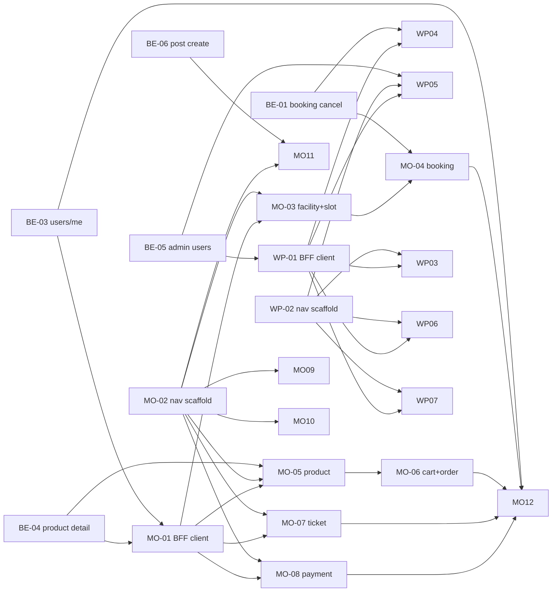

## TPM 분석 — B2C(모바일)·B2B(웹 포털) 미구현 사항

### 요약
백엔드(Kotlin/Spring)는 대부분 완성됐고, B2C 모바일은 탭 3개(홈/검색/마이)만 존재해 예약·구매·티켓·결제·메시지·알림·커뮤니티 UI가 통째로 없습니다. B2B 웹 포털은 운영자 핵심(시설·슬롯·상품·경기·대시보드)만 완성됐고 결제 내역·예약 취소·회원/권한·알림 발송·시설 import UI가 없습니다. 백엔드는 신규 엔드포인트 5개(예약 취소, 경기 삭제, GET /users/me, GET /products/{id}, GET /admin/users)가 추가로 필요합니다.

### 코드 검증 — 감사 보강 사항

실제 코드를 확인해 감사 내용을 검증했고, 감사에 누락된 BE 갭 2건을 추가로 발견했습니다.

| 항목 | 감사 가정 | 코드 검증 결과 | 조치 |
|---|---|---|---|
| 예약 취소 | 없음 | `BookingApiController` POST/GET/me/GET{id}만 존재, cancel 없음 | 확정 — BE 신규 |
| 경기 삭제 | 없음 | `EventApiController`·`EventHostApiController` 모두 delete 없음 | 확정 — BE 신규 |
| GET /users/me | 없음 | `UserApiController`는 `register`만, 프로필 조회 없음 | 확정 — BE 신규 |
| **GET /products/{id}** | "있음(mobile)" | `ProductApiController`는 `search`+`popular`만, 상세 조회 **없음** | **감사 오류 — BE 신규 필요** |
| **GET /admin/users (목록)** | "AdminUserApi 있음" | `assignRole`/`revokeRole`만 존재, 회원 **목록 조회 없음** | **회원관리 UI 전제조건 — BE 신규 필요** |
| 커뮤니티 글 작성 POST /posts | "/posts 있음" | `PostApiController`는 `search`+`get{id}`만, **글 작성 없음** | **BE 신규(글작성). 댓글 CRUD는 존재** |
| GET /payments/me | "운영자 매출용 필요" | `PaymentApiController` `GET /me` **이미 존재** | BE 작업 불필요, FE만 |
| 시설/슬롯/카트/주문/티켓/메시지/알림 조회 | API 있음 | 전부 존재 확인 | FE만 |

> 결론: 백엔드 신규 엔드포인트는 감사의 3개가 아니라 **6개**입니다 (예약취소, 경기삭제, GET /users/me, GET /products/{id}, GET /admin/users, POST /posts).

### 영향 서비스

| 서비스 | 레포 | 변경 유형 |
|---|---|---|
| backend (Kotlin/Spring) | `/backend` | 신규 엔드포인트 6개 (booking cancel, event delete, user me, product detail, admin user list, post create) |
| B2C 모바일 (Expo Router) | `/mobile` | 신규 화면 다수 + 탭 확장 + BFF 클라이언트 함수 |
| B2B 웹 포털 (Next.js + BFF) | `/web` | 신규 포털 페이지 + BFF route + lib/portal 클라이언트 |

### API 변경 목록 (BE 신규)

| 경로 | 메서드 | 유형 | 영향 Consumer |
|---|---|---|---|
| `/bookings/{id}/cancel` | POST | 신규 | MO 예약취소, WP 예약취소 |
| `/events/{id}` | DELETE | 신규 | WP 경기삭제 |
| `/users/me` | GET | 신규 | MO 마이페이지 |
| `/products/{id}` | GET | 신규 | MO 상품상세 |
| `/admin/users` | GET | 신규 | WP 회원관리 |
| `/posts` | POST | 신규 | MO 커뮤니티 글작성 |

### Kafka 변경 목록

| 토픽 | 유형 | Producer | Consumer |
|---|---|---|---|
| — | 변경 없음 | — | — |

> 본 작업은 UI 갭 + REST 엔드포인트 보강이며 이벤트 스트리밍 변경은 없습니다. 예약 취소·경기 삭제가 도메인 이벤트를 발행할 수 있으나 신규 토픽 신설은 아니며 BE 티켓 내부에서 흡수합니다.

### 우선순위 정책

- **P0 (B2C 우선)**: 모바일 핵심 거래 플로우 — 예약·구매·티켓·결제. 임팩트 최대.
- **P1 (B2C 보조)**: 메시지·알림·커뮤니티·마이페이지 확장.
- **P2 (B2B 후순위)**: 웹 포털 운영자 보조 화면.

---

### 티켓 목록

| 번호 | 제목 | 레포 | 담당 | 크기 | 우선 | 선행 |
|---|---|---|---|---|---|---|
| BE-01 | 예약 취소 엔드포인트 POST /bookings/{id}/cancel | backend | BE | M | P0 | — |
| BE-02 | 경기 삭제 엔드포인트 DELETE /events/{id} | backend | BE | S | P2 | — |
| BE-03 | 사용자 프로필 조회 GET /users/me | backend | BE | S | P0 | — |
| BE-04 | 상품 상세 조회 GET /products/{id} | backend | BE | S | P0 | — |
| BE-05 | 관리자 회원 목록 조회 GET /admin/users | backend | BE | M | P2 | — |
| BE-06 | 커뮤니티 글 작성 POST /posts | backend | BE | S | P1 | — |
| MO-01 | 모바일 BFF 클라이언트 도메인 함수 + 공용 쿼리 훅 정비 | mobile | FE | M | P0 | BE-01,BE-03,BE-04 |
| MO-02 | 탭 네비게이터 확장 + 도메인 라우트 스캐폴딩 | mobile | FE | M | P0 | — |
| MO-03 | 시설 상세 + 슬롯 선택 화면 | mobile | FE | M | P0 | MO-01,MO-02 |
| MO-04 | 예약 생성 + 내 예약 목록/취소 화면 | mobile | FE | M | P0 | MO-01,MO-02,MO-03,BE-01 |
| MO-05 | 상품 상세 화면 | mobile | FE | S | P0 | MO-01,MO-02,BE-04 |
| MO-06 | 장바구니 + 물품 주문 화면 | mobile | FE | M | P0 | MO-01,MO-02,MO-05 |
| MO-07 | 경기 상세 + 좌석 선택 + 티켓 구매 화면 | mobile | FE | L | P0 | MO-01,MO-02 |
| MO-08 | 결제 생성/내역 화면 | mobile | FE | M | P0 | MO-01,MO-02 |
| MO-09 | 알림 목록/unread/read 화면 | mobile | FE | S | P1 | MO-01,MO-02 |
| MO-10 | 메시지 채팅방 목록 + 채팅 화면 | mobile | FE | M | P1 | MO-01,MO-02 |
| MO-11 | 커뮤니티 글 목록/상세/작성 + 댓글 화면 | mobile | FE | M | P1 | MO-01,MO-02,BE-06 |
| MO-12 | 마이페이지 확장 (프로필 + 내 예약/주문/티켓/결제 내역 진입) | mobile | FE | M | P1 | MO-01,BE-03,MO-04,MO-06,MO-07,MO-08 |
| WP-01 | 포털 BFF route + lib/portal 클라이언트 (결제/회원/알림/import) | web | FE | M | P2 | BE-05 |
| WP-02 | 포털 네비게이션 + 신규 메뉴 스캐폴딩 | web | FE | S | P2 | — |
| WP-03 | 결제 내역(매출) 화면 GET /payments/me | web | FE | M | P2 | WP-01,WP-02 |
| WP-04 | 예약 취소 UI (포털 예약 화면 액션 추가) | web | FE | S | P2 | WP-01,BE-01 |
| WP-05 | 회원/권한 관리 화면 (목록 + role assign/revoke) | web | FE | M | P2 | WP-01,WP-02,BE-05 |
| WP-06 | 관리자 알림 발송 화면 | web | FE | S | P2 | WP-01,WP-02 |
| WP-07 | 시설 일괄 import 화면 | web | FE | S | P2 | WP-01,WP-02 |

---

### 티켓 상세

**BE-01 — 예약 취소 엔드포인트 POST /bookings/{id}/cancel**
- 레포: backend / 담당: BE / 크기: M / 선행: —
- 배경: 모바일·웹 포털 모두 예약 취소 UI가 필요하나 BE에 cancel 엔드포인트가 없습니다. Booking 상태 전이와 슬롯 점유 해제까지 도메인 일관성이 필요합니다.
- 작업 범위:
  - [ ] `BookingApiController`에 본인 인가가 적용된 취소 엔드포인트 추가
  - [ ] Booking Entity에 취소 가능 여부·상태 전이 검증 캡슐화 (Rich Domain)
  - [ ] CancelBookingUseCase + DomainService — 슬롯 점유 해제 연동
  - [ ] 이미 취소/완료 건 취소 시 도메인 예외
  - [ ] 단위/레포지토리/시나리오 테스트
- 완료 기준:
  - 예약자가 PENDING/CONFIRMED 건을 취소하면 상태가 CANCELLED로 전이되고 점유 슬롯이 해제된다
  - 본인이 아닌 사용자가 취소 요청하면 403이 반환된다
  - 이미 취소된 건을 다시 취소하면 도메인 예외로 4xx가 반환된다
- 수정 예상 파일: `presentation/booking/BookingApiController.kt`, `application/booking/*CancelBooking*`, `domain/booking/Booking.kt`, `domain/booking/BookingDomainService.kt`

**BE-02 — 경기 삭제 엔드포인트 DELETE /events/{id}**
- 레포: backend / 담당: BE / 크기: S / 선행: —
- 배경: 포털에서 경기 삭제가 필요하나 `EventApiController`·`EventHostApiController` 어디에도 delete가 없습니다. soft-delete 정책을 적용합니다.
- 작업 범위:
  - [ ] 경기 삭제 엔드포인트 추가 (host 권한 인가)
  - [ ] Event soft-delete (`deletedAt`) — 판매 시작/티켓 발행된 경기 삭제 제약 검증 Entity 캡슐화
  - [ ] DeleteEventUseCase
  - [ ] 단위/레포지토리/시나리오 테스트
- 완료 기준:
  - host가 미오픈 경기를 삭제하면 deletedAt이 채워지고 목록 조회에서 제외된다
  - 티켓이 발행된 경기를 삭제하면 도메인 예외로 4xx가 반환된다
- 수정 예상 파일: `presentation/ticketing/EventHostApiController.kt`, `application/ticketing/*DeleteEvent*`, `domain/ticketing/Event.kt`

**BE-03 — 사용자 프로필 조회 GET /users/me**
- 레포: backend / 담당: BE / 크기: S / 선행: —
- 배경: 모바일 마이페이지가 현재 JWT 디코딩으로만 정보를 표시합니다. 서버 권위 프로필(이메일/역할/가입일 등) 조회가 필요합니다.
- 작업 범위:
  - [ ] `UserApiController`에 GET /me 추가 (인증 사용자 기준)
  - [ ] GetMyProfileUseCase + Response 매핑
  - [ ] 단위/레포지토리/시나리오 테스트
- 완료 기준:
  - 인증 사용자가 GET /users/me 호출 시 본인 프로필이 반환된다
  - 미인증 요청은 401이 반환된다
- 수정 예상 파일: `presentation/user/UserApiController.kt`, `application/user/*GetMyProfile*`

**BE-04 — 상품 상세 조회 GET /products/{id}**
- 레포: backend / 담당: BE / 크기: S / 선행: —
- 배경: 모바일 상품 상세·구매 플로우가 `/products/{id}`를 전제로 하나 `ProductApiController`는 search/popular만 제공합니다.
- 작업 범위:
  - [ ] GET /products/{id} 추가
  - [ ] GetProductUseCase + 상세 Response (재고/판매상태 포함)
  - [ ] 미존재/삭제 상품 조회 시 404
  - [ ] 단위/레포지토리/시나리오 테스트
- 완료 기준:
  - 존재하는 상품 id로 조회 시 상세(가격/재고/판매상태)가 반환된다
  - 삭제(soft-delete)된 상품 조회 시 404가 반환된다
- 수정 예상 파일: `presentation/goods/ProductApiController.kt`, `application/goods/*GetProduct*`

**BE-05 — 관리자 회원 목록 조회 GET /admin/users**
- 레포: backend / 담당: BE / 크기: M / 선행: —
- 배경: 포털 회원/권한 관리 UI가 회원 목록을 전제하나 `AdminUserApiController`는 role assign/revoke만 있고 목록 조회가 없습니다.
- 작업 범위:
  - [ ] GET /admin/users (페이징·검색·role 필터) 추가, ADMIN 인가
  - [ ] ListUsersUseCase + QueryDSL CustomRepository
  - [ ] 단위/레포지토리/시나리오 테스트
- 완료 기준:
  - ADMIN이 회원 목록을 페이징 조회하면 이메일/역할/상태가 반환된다
  - 비ADMIN 요청은 403이 반환된다
- 수정 예상 파일: `presentation/user/AdminUserApiController.kt`, `application/user/*ListUsers*`, `infrastructure/persistence/user/*RepositoryImpl.kt`

**BE-06 — 커뮤니티 글 작성 POST /posts**
- 레포: backend / 담당: BE / 크기: S / 선행: —
- 배경: 모바일 커뮤니티 글 작성이 필요하나 `PostApiController`는 search/get만 제공합니다. 댓글 CRUD(`CommentApiController`)는 존재합니다.
- 작업 범위:
  - [ ] POST /posts 추가 (인증 사용자 작성)
  - [ ] CreatePostUseCase + Entity 팩토리 검증
  - [ ] 단위/레포지토리/시나리오 테스트
- 완료 기준:
  - 인증 사용자가 제목/본문으로 글을 작성하면 글이 생성되고 목록에 노출된다
  - 빈 제목/본문은 4xx가 반환된다
- 수정 예상 파일: `presentation/post/PostApiController.kt`, `application/post/*CreatePost*`, `domain/post/Post.kt`

**MO-01 — 모바일 BFF 클라이언트 도메인 함수 + 공용 쿼리 훅 정비**
- 레포: mobile / 담당: FE / 크기: M / 선행: BE-01,BE-03,BE-04
- 배경: 현재 화면들이 `getBeClient()`로 인라인 fetch를 합니다. 도메인별 API 함수와 react-query 훅을 한 곳에 모아 후행 화면 티켓이 충돌 없이 병렬 진행되도록 공통 클라이언트 층을 만듭니다.
- 작업 범위:
  - [ ] `api/` 하위 도메인별 함수 모듈 추가 (facilities, bookings, products, cart, goodsOrders, events, ticketOrders, payments, notifications, rooms, posts, users)
  - [ ] 도메인별 react-query key/hook 컨벤션 정리
  - [ ] 타입 정의 공유 (각 화면 티켓이 import)
- 완료 기준:
  - 각 도메인 함수가 BE 경로와 1:1 매핑되고 타입 안전하게 호출된다
  - 후행 화면 티켓이 인라인 fetch 없이 도메인 함수만 호출한다
- 수정 예상 파일: `api/facilities.ts`, `api/bookings.ts`, `api/products.ts`, `api/cart.ts`, `api/goodsOrders.ts`, `api/events.ts`, `api/ticketOrders.ts`, `api/payments.ts`, `api/notifications.ts`, `api/rooms.ts`, `api/posts.ts`, `api/users.ts`, `lib/query-client.ts`

**MO-02 — 탭 네비게이터 확장 + 도메인 라우트 스캐폴딩**
- 레포: mobile / 담당: FE / 크기: M / 선행: —
- 배경: 현재 탭은 홈/검색/마이 3개뿐이며 도메인 상세 라우트 디렉토리가 없습니다. 후행 화면 티켓이 각자의 파일만 채우도록 라우트 골격(빈 화면 + 경로)을 먼저 깝니다.
- 작업 범위:
  - [ ] `(tabs)/_layout.tsx` 탭 추가/재구성 (예: 홈/예약/스토어/티켓/마이 등 정책 확정)
  - [ ] 도메인별 라우트 디렉토리 placeholder 생성 (facility/[id], booking, product/[id], cart, event/[id], payment, notifications, rooms, community)
  - [ ] 화면 간 네비게이션 헬퍼
- 완료 기준:
  - 모든 도메인 라우트가 빈 화면으로 진입 가능하다 (404 없음)
  - 후행 화면 티켓은 자신의 라우트 파일만 수정하면 된다
- 수정 예상 파일: `app/(tabs)/_layout.tsx`, `app/facility/[id]/*`, `app/booking/*`, `app/product/[id]/*`, `app/cart/*`, `app/event/[id]/*`, `app/payment/*`, `app/notifications/*`, `app/rooms/*`, `app/community/*` (각 placeholder)

**MO-03 — 시설 상세 + 슬롯 선택 화면**
- 레포: mobile / 담당: FE / 크기: M / 선행: MO-01,MO-02,MO-03 선행은 MO-01·MO-02
- 배경: 시설 검색에서 진입할 상세·슬롯 선택 화면이 없습니다. GET /facilities/{id}, GET /facilities/{id}/slots로 구성합니다.
- 작업 범위:
  - [ ] 시설 상세 화면 (`facility/[id]`)
  - [ ] 슬롯 목록/선택 UI
  - [ ] "예약하기" 진입 → 예약 화면 라우팅
- 완료 기준:
  - 시설 카드 탭 시 상세와 가용 슬롯이 표시된다
  - 슬롯 선택 후 예약 화면으로 선택 컨텍스트가 전달된다
- 수정 예상 파일: `app/facility/[id]/index.tsx`, `app/facility/[id]/_components/SlotPicker.tsx`

**MO-04 — 예약 생성 + 내 예약 목록/취소 화면**
- 레포: mobile / 담당: FE / 크기: M / 선행: MO-01,MO-02,MO-03,BE-01
- 배경: 슬롯 선택 후 예약 생성(POST /bookings), 내 예약 목록(GET /bookings/me), 취소(BE-01)까지 거래 플로우를 완성합니다.
- 작업 범위:
  - [ ] 예약 확인/생성 화면
  - [ ] 내 예약 목록 화면 + 상태별 표시
  - [ ] 예약 취소 액션 (POST /bookings/{id}/cancel)
- 완료 기준:
  - 슬롯 선택 → 예약 생성 시 내 예약 목록에 반영된다
  - 취소 버튼으로 예약이 CANCELLED로 바뀌고 목록에 반영된다
- 수정 예상 파일: `app/booking/new.tsx`, `app/booking/index.tsx`, `app/booking/_components/*`

**MO-05 — 상품 상세 화면**
- 레포: mobile / 담당: FE / 크기: S / 선행: MO-01,MO-02,BE-04
- 배경: 상품 상세(GET /products/{id})에서 장바구니/주문으로 이어지는 진입점이 필요합니다.
- 작업 범위:
  - [ ] 상품 상세 화면 (가격/재고/판매상태)
  - [ ] "장바구니 담기" 진입점
- 완료 기준:
  - 상품 id 진입 시 상세가 표시되고 품절 상태가 구분된다
  - 장바구니 담기 시 카트에 항목이 추가된다
- 수정 예상 파일: `app/product/[id]/index.tsx`

**MO-06 — 장바구니 + 물품 주문 화면**
- 레포: mobile / 담당: FE / 크기: M / 선행: MO-01,MO-02,MO-05
- 배경: 카트(GET/POST/PATCH/DELETE /cart/*)와 주문(POST/GET /goods-orders/*) 화면을 완성합니다.
- 작업 범위:
  - [ ] 장바구니 화면 (수량 변경/삭제/비우기)
  - [ ] 주문 생성 + 주문 상세/내 주문 목록
- 완료 기준:
  - 카트에서 수량 변경·삭제가 즉시 반영된다
  - 주문 생성 시 내 주문 목록에 노출된다
- 수정 예상 파일: `app/cart/index.tsx`, `app/cart/_components/*`, `app/order/new.tsx`, `app/order/index.tsx`

**MO-07 — 경기 상세 + 좌석 선택 + 티켓 구매 화면**
- 레포: mobile / 담당: FE / 크기: L / 선행: MO-01,MO-02
- 배경: 경기 상세(GET /events/{id}), 좌석 선점(POST /events/{id}/seats/select), 티켓 주문(POST /ticket-orders)으로 이어지는 구매 플로우 전체가 없습니다.
- 작업 범위:
  - [ ] 경기 상세 화면
  - [ ] 좌석 선택 UI + 선점/해제 처리
  - [ ] 티켓 주문 생성 화면
- 완료 기준:
  - 경기 진입 시 상세와 좌석맵이 표시된다
  - 좌석 선점 후 티켓 주문이 생성되고 선점 만료/해제가 처리된다
- 수정 예상 파일: `app/event/[id]/index.tsx`, `app/event/[id]/_components/SeatMap.tsx`, `app/event/[id]/order.tsx`

**MO-08 — 결제 생성/내역 화면**
- 레포: mobile / 담당: FE / 크기: M / 선행: MO-01,MO-02
- 배경: 결제(POST /payments, GET /payments/me, GET /payments/{id}) 화면이 없습니다. 주문/티켓 플로우의 종착 결제 처리를 담당합니다.
- 작업 범위:
  - [ ] 결제 생성 화면 + 결과 처리
  - [ ] 내 결제 내역/상세 화면
- 완료 기준:
  - 결제 생성 시 결과가 표시되고 내역에 반영된다
  - 결제 내역에서 개별 결제 상세가 조회된다
- 수정 예상 파일: `app/payment/new.tsx`, `app/payment/index.tsx`, `app/payment/[id].tsx`

**MO-09 — 알림 목록/unread/read 화면**
- 레포: mobile / 담당: FE / 크기: S / 선행: MO-01,MO-02
- 배경: 알림(GET /notifications/me, /me/unread-count, PATCH /{id}/read) UI가 없습니다.
- 작업 범위:
  - [ ] 알림 목록 화면 + unread 뱃지
  - [ ] 읽음 처리
- 완료 기준:
  - 알림 목록이 표시되고 unread 카운트가 노출된다
  - 항목 탭 시 읽음 처리되어 unread 카운트가 감소한다
- 수정 예상 파일: `app/notifications/index.tsx`

**MO-10 — 메시지 채팅방 목록 + 채팅 화면**
- 레포: mobile / 담당: FE / 크기: M / 선행: MO-01,MO-02
- 배경: 메시지(POST/GET/DELETE /rooms/*, GET/POST /rooms/{id}/messages) UI가 없습니다.
- 작업 범위:
  - [ ] 채팅방 목록 (내 방)
  - [ ] 채팅방 상세 + 메시지 송수신 화면
- 완료 기준:
  - 내 채팅방 목록이 표시된다
  - 방 진입 후 메시지 전송 시 목록에 즉시 추가된다
- 수정 예상 파일: `app/rooms/index.tsx`, `app/rooms/[id].tsx`

**MO-11 — 커뮤니티 글 목록/상세/작성 + 댓글 화면**
- 레포: mobile / 담당: FE / 크기: M / 선행: MO-01,MO-02,BE-06
- 배경: 커뮤니티(GET /posts, GET /posts/{id}, POST /posts(BE-06), 댓글 CRUD) UI가 없습니다.
- 작업 범위:
  - [ ] 글 목록/상세 화면
  - [ ] 글 작성 화면 (POST /posts)
  - [ ] 댓글 목록/작성/삭제
- 완료 기준:
  - 글 목록·상세가 표시되고 글 작성 시 목록에 반영된다
  - 댓글 작성/삭제가 즉시 반영된다
- 수정 예상 파일: `app/community/index.tsx`, `app/community/[id].tsx`, `app/community/new.tsx`

**MO-12 — 마이페이지 확장 (프로필 + 내 예약/주문/티켓/결제 내역 진입)**
- 레포: mobile / 담당: FE / 크기: M / 선행: MO-01,BE-03,MO-04,MO-06,MO-07,MO-08
- 배경: 현재 `me.tsx`는 JWT 디코딩만 표시합니다. GET /users/me 기반 프로필 + 거래 내역 진입점으로 확장합니다.
- 작업 범위:
  - [ ] GET /users/me 기반 프로필 표시
  - [ ] 내 예약/주문/티켓/결제 내역 화면으로의 진입 메뉴
- 완료 기준:
  - 마이페이지가 서버 프로필을 표시한다
  - 각 거래 내역 화면으로 정상 진입한다
- 수정 예상 파일: `app/(tabs)/me.tsx`, `app/me/_components/*`

**WP-01 — 포털 BFF route + lib/portal 클라이언트 (결제/회원/알림/import)**
- 레포: web / 담당: FE / 크기: M / 선행: BE-05
- 배경: 신규 포털 화면들이 호출할 BFF route(`app/api/portal/*`)와 `lib/portal` 클라이언트가 없습니다. 후행 페이지 티켓이 충돌 없이 진행되도록 공통 데이터 층을 먼저 만듭니다.
- 작업 범위:
  - [ ] BFF route: payments(me), admin/users, admin/notifications/send, admin/facilities/import, bookings cancel proxy
  - [ ] `lib/portal/payments.ts`, `users.ts`, `notifications.ts`, `facilitiesImport.ts` 클라이언트 + 타입
- 완료 기준:
  - 각 BFF route가 BE 경로로 인증 토큰을 전달해 프록시한다
  - 후행 페이지 티켓이 lib/portal 함수만 호출한다
- 수정 예상 파일: `app/api/portal/payments/route.ts`, `app/api/portal/users/route.ts`, `app/api/portal/notifications/route.ts`, `app/api/portal/facilities/import/route.ts`, `app/api/portal/bookings/[id]/cancel/route.ts`, `lib/portal/payments.ts`, `lib/portal/users.ts`, `lib/portal/notifications.ts`, `lib/portal/facilitiesImport.ts`, `lib/portal/types.ts`

**WP-02 — 포털 네비게이션 + 신규 메뉴 스캐폴딩**
- 레포: web / 담당: FE / 크기: S / 선행: —
- 배경: `portal/layout.tsx` nav에 결제/회원/알림/import 메뉴가 없습니다. 후행 페이지 티켓이 자신의 page.tsx만 만들도록 메뉴와 빈 라우트를 먼저 깝니다.
- 작업 범위:
  - [ ] `portal/layout.tsx` nav 항목 추가 (매출/회원/알림/시설 import) + requiredRole
  - [ ] 각 신규 라우트 placeholder page
- 완료 기준:
  - nav에서 신규 메뉴 진입 시 빈 페이지가 표시된다 (404 없음)
- 수정 예상 파일: `app/portal/layout.tsx`, `app/portal/payments/page.tsx`, `app/portal/users/page.tsx`, `app/portal/notifications/page.tsx`, `app/portal/facilities-import/page.tsx`

**WP-03 — 결제 내역(매출) 화면 GET /payments/me**
- 레포: web / 담당: FE / 크기: M / 선행: WP-01,WP-02
- 배경: 운영자 매출 화면이 없습니다. BE는 GET /payments/me가 이미 존재해 FE만 필요합니다.
- 작업 범위:
  - [ ] 결제 내역 목록 화면 (기간/상태 필터, 합계)
  - [ ] 상세 진입
- 완료 기준:
  - 결제 내역이 페이징·필터와 함께 표시되고 합계가 노출된다
- 수정 예상 파일: `app/portal/payments/page.tsx`, `app/portal/payments/PaymentsListClient.tsx`

**WP-04 — 예약 취소 UI (포털 예약 화면 액션 추가)**
- 레포: web / 담당: FE / 크기: S / 선행: WP-01,BE-01
- 배경: 포털 예약 화면(`portal/bookings`)에 취소 액션이 없습니다. BE-01 cancel 엔드포인트와 연동합니다.
- 작업 범위:
  - [ ] 예약 목록/상세에 취소 버튼 + 확인 모달
  - [ ] cancel BFF route 연동
- 완료 기준:
  - 취소 버튼 클릭 시 예약이 CANCELLED로 바뀌고 목록에 반영된다
- 수정 예상 파일: `app/portal/bookings/page.tsx`, `app/portal/bookings/_components/CancelButton.tsx`

**WP-05 — 회원/권한 관리 화면 (목록 + role assign/revoke)**
- 레포: web / 담당: FE / 크기: M / 선행: WP-01,WP-02,BE-05
- 배경: AdminUserApiController는 role assign/revoke만 있고 회원 목록 조회는 BE-05로 신규입니다. UI도 통째로 없습니다.
- 작업 범위:
  - [ ] 회원 목록 화면 (검색/페이징/role 필터)
  - [ ] role 부여/회수 액션
- 완료 기준:
  - 회원 목록이 표시되고 role 부여/회수가 즉시 반영된다
- 수정 예상 파일: `app/portal/users/page.tsx`, `app/portal/users/UsersListClient.tsx`

**WP-06 — 관리자 알림 발송 화면**
- 레포: web / 담당: FE / 크기: S / 선행: WP-01,WP-02
- 배경: AdminNotificationApiController(POST /admin/notifications/send)는 있으나 발송 UI가 없습니다.
- 작업 범위:
  - [ ] 알림 발송 폼 (대상/제목/본문)
  - [ ] 발송 결과 표시
- 완료 기준:
  - 발송 폼 제출 시 BE로 전송되고 성공/실패가 표시된다
- 수정 예상 파일: `app/portal/notifications/page.tsx`, `app/portal/notifications/NotificationSendForm.tsx`

**WP-07 — 시설 일괄 import 화면**
- 레포: web / 담당: FE / 크기: S / 선행: WP-01,WP-02
- 배경: AdminFacilityApiController(POST /admin/facilities/import)는 있으나 import UI가 없습니다.
- 작업 범위:
  - [ ] 파일/데이터 업로드 폼 + import 호출
  - [ ] import 결과(성공/실패 건수) 표시
- 완료 기준:
  - import 실행 시 BE로 전송되고 처리 건수 결과가 표시된다
- 수정 예상 파일: `app/portal/facilities-import/page.tsx`, `app/portal/facilities-import/ImportForm.tsx`

---

### 의존 그래프 (DAG)

| 티켓 | 선행 | 후행 카운트 | 비고 |
|---|---|---|---|
| BE-01 | — | 2 (MO-04, WP-04) | 병목 |
| BE-02 | — | 0 | 단독 |
| BE-03 | — | 2 (MO-01, MO-12) | 병목 |
| BE-04 | — | 2 (MO-01, MO-05) | 병목 |
| BE-05 | — | 2 (WP-01, WP-05) | 병목 |
| BE-06 | — | 1 (MO-11) | 중간 |
| MO-01 | BE-01,BE-03,BE-04 | 9 | 분해권장 검토 → 아래 주석 |
| MO-02 | — | 9 | 병목(스캐폴딩) |
| MO-03 | MO-01,MO-02 | 1 (MO-04) | 중간 |
| MO-04 | MO-01,MO-02,MO-03,BE-01 | 1 (MO-12) | 중간 |
| MO-05 | MO-01,MO-02,BE-04 | 1 (MO-06) | 중간 |
| MO-06 | MO-01,MO-02,MO-05 | 1 (MO-12) | 중간 |
| MO-07 | MO-01,MO-02 | 1 (MO-12) | 중간 |
| MO-08 | MO-01,MO-02 | 1 (MO-12) | 중간 |
| MO-09 | MO-01,MO-02 | 0 | 단독 |
| MO-10 | MO-01,MO-02 | 0 | 단독 |
| MO-11 | MO-01,MO-02,BE-06 | 0 | 단독 |
| MO-12 | MO-01,BE-03,MO-04,MO-06,MO-07,MO-08 | 0 | 단독(집약) |
| WP-01 | BE-05 | 5 (WP-03~07) | 병목 |
| WP-02 | — | 5 (WP-03,05,06,07) | 병목(스캐폴딩) |
| WP-03 | WP-01,WP-02 | 0 | 단독 |
| WP-04 | WP-01,BE-01 | 0 | 단독 |
| WP-05 | WP-01,WP-02,BE-05 | 0 | 단독 |
| WP-06 | WP-01,WP-02 | 0 | 단독 |
| WP-07 | WP-01,WP-02 | 0 | 단독 |

- "선행": 이 티켓이 의존하는 티켓 (없으면 —)
- "후행 카운트": 이 티켓 산출물을 참조하는 다른 티켓 수
- "비고": 병목(후행 ≥ 2) / 단독(후행 0) / 중간(후행 1) / 분해권장(후행 ≥ 3)

#### 분해 재검토 주석 — MO-01 / MO-02 / WP-01 / WP-02 (후행 ≥ 3)

ticket-guide의 fan-out 원칙상 후행 ≥ 3은 분해 트리거입니다. 다만 이들은 **불가피한 병목(공통 클라이언트 층·라우트 스캐폴딩)**입니다. 더 잘게 쪼개려면:

- MO-01을 도메인 그룹별로 3분할 가능: **MO-01a(거래: facilities/bookings/products/cart/orders/events/tickets/payments)**, **MO-01b(소셜: notifications/rooms/posts)**, **MO-01c(user/me)**. 이렇게 하면 MO-09~MO-11(소셜)은 MO-01b만, 거래 화면은 MO-01a만 기다려 wave 너비가 넓어집니다. 본 산출에서는 단일 MO-01로 두되, 동시 작업 인원이 2명 이상이면 위 3분할을 권장합니다.
- MO-02(라우트 스캐폴딩)는 single-writer 충돌(`_layout.tsx`)을 한 곳에 모으기 위해 의도적으로 단일 티켓으로 유지합니다. 분할 시 `_layout.tsx` 충돌이 발생합니다.
- WP-01/WP-02도 동일 — BFF 공통 층과 nav(`portal/layout.tsx`) 충돌 회피를 위해 통합 유지가 옳습니다.

#### Single-writer-per-file 검증

- `mobile/app/(tabs)/_layout.tsx` → MO-02만 수정 (다른 티켓은 자신의 라우트 파일만). ✓
- `mobile/app/(tabs)/me.tsx` → MO-12만 수정. ✓
- `web/app/portal/layout.tsx` → WP-02만 수정. ✓
- `web/lib/portal/types.ts` → WP-01만 수정 (각 화면은 자신의 클라이언트/컴포넌트만). ✓
- MO 화면 티켓(MO-03~MO-11)은 각자 새 라우트 디렉토리만 생성 → 같은 wave 파일 교집합 ∅. ✓
- WP 화면 티켓(WP-03~WP-07)은 각자 새 page 디렉토리만 생성 → 교집합 ∅. ✓
- WP-04만 예외적으로 기존 `portal/bookings/page.tsx`를 수정 → 같은 wave에 bookings 수정 티켓 없음. ✓
- BE 티켓(BE-01~BE-06)은 모두 서로 다른 도메인 패키지 → 교집합 ∅. ✓

---

### 위상정렬 — Wave 표 (ready 셋)

> wave는 메인 오케스트레이터가 런타임에 위상정렬로 도출하며, 아래는 시뮬레이션입니다.

| Wave | ready 셋 (병렬 가능) | 너비 | 우선 |
|---|---|---|---|
| Wave 1 | BE-01, BE-02, BE-03, BE-04, BE-05, BE-06, MO-02, WP-02 | 8 | BE+스캐폴딩 동시 |
| Wave 2 | MO-01, WP-01 | 2 | 공통 클라이언트 층 |
| Wave 3 | MO-03, MO-05, MO-07, MO-08, MO-09, MO-10, MO-11, WP-03, WP-04, WP-05, WP-06, WP-07 | 12 | 화면 fan-out |
| Wave 4 | MO-04, MO-06 | 2 | 화면 의존 후속 |
| Wave 5 | MO-12 | 1 | 마이페이지 집약 |

- **Wave 1 ready 셋**: 선행 없는 모든 티켓 — BE 6개 + 스캐폴딩 2개. BE와 FE 스캐폴딩이 완전 병렬.
- **평균 wave 너비 ≈ 5.0**, 최대 12. 직선형 아님 — 분해 양호.
- B2C 우선이면 Wave 1에서 BE-01/03/04 + MO-02 먼저, B2B(BE-02/05, WP-02)는 여력 시 동시 진행.

### 초기 ready 셋 (Wave 1)
선행 없는 티켓 — 메인 오케스트레이터가 Wave 1로 동시 스폰:
- BE-01, BE-02, BE-03, BE-04, BE-05, BE-06, MO-02, WP-02

### 시각화 (Mermaid flowchart LR)

### 미결 사항 (PM/PO 확인 필요)

1. **모바일 탭 구성 정책** — 현재 3탭(홈/검색/마이)을 어떤 탭 셋으로 확장할지(예: 예약/스토어/티켓을 탭으로 vs 홈 내 카드 진입). MO-02 스캐폴딩 전에 확정 필요.
2. **경기 삭제 정책** — soft-delete만 허용할지, 티켓 발행 후 삭제를 어디까지 막을지(BE-02).
3. **회원 목록 조회 권한 범위** — ADMIN 전용인지, FACILITY_OWNER 등에게도 부분 노출인지(BE-05).
4. **결제 화면 PG 연동 범위** — MO-08이 실제 PG 연동까지인지, BE 결제 생성 호출만인지.
5. **시설 import 입력 형식** — CSV/엑셀/외부 API 중 무엇인지(WP-07, AdminFacilityApiController.importLegacy 시그니처 확인 필요).
6. **MO-01 분할 여부** — 동시 작업 인원 2명 이상이면 MO-01a/b/c 3분할 적용할지.

---

## 결정 반영 (2026-05-30 승인 게이트)

| 미결 | 결정 |
|---|---|
| 모바일 탭 구성 | **5탭: 홈 / 스토어 / 티켓 / 커뮤니티 / 마이**. 시설검색·예약은 **홈** 진입, 알림·채팅·거래내역은 **마이** 진입 |
| 결제 PG 범위 | **Mock PG 서버 신규 구축** — kakao / toss / naver / danal / 무통장 / 카드 6개 수단. ready→approve→webhook 플로우 모킹 |
| 경기 삭제 정책 | **soft-delete + 티켓 발행 시 삭제 차단** (Entity 캡슐화) |
| 회원 목록 권한 | ADMIN 전용 (기본값 적용) |
| 시설 import 형식 | `AdminFacilityApiController.importLegacy` 시그니처 따름 (구현 시 확인) |

### 추가 티켓 (PG Mock 결정에 따라 신설)

**PG-01 — Mock PG 결제 게이트웨이 서버 (신규)**
- 레포: `mock-pg` (신규 디렉토리) / 담당: FE(Node) / 크기: L / 선행: —
- 배경: 실제 PG 계약 없이 결제 플로우를 E2E로 검증하기 위해 PG 6사를 모킹하는 독립 서버를 둡니다.
- 작업 범위:
  - [ ] Node.js + Express 독립 서버 (`mock-pg/`), docker-compose 등록
  - [ ] provider별 엔드포인트: `POST /pg/{provider}/ready` (결제창 URL 반환), `POST /pg/{provider}/approve`, `POST /pg/{provider}/cancel`, 결제 완료 시 BE로 `webhook` 콜백
  - [ ] 결제창(승인/취소 버튼) 간이 HTML 페이지 — 모바일 웹뷰가 띄움
  - [ ] provider 6종(kakao/toss/naver/danal/무통장/card) 분기 + 무통장은 입금대기 상태 시뮬레이션
  - [ ] 멱등 처리 + 서명/토큰 검증 모킹
- 완료 기준:
  - ready 호출 시 결제창 URL과 거래 토큰이 반환된다
  - 결제창에서 승인 시 BE webhook이 호출되고 결제가 확정된다, 취소 시 취소 콜백이 호출된다
- 수정 예상 파일: `mock-pg/server.js`, `mock-pg/providers/*.js`, `mock-pg/public/checkout.html`, `mock-pg/package.json`, `docker-compose.yml`

**BE-07 — 결제 PG 연동 (Payment 도메인 + PgGateway)**
- 레포: backend / 담당: BE / 크기: L / 선행: PG-01
- 배경: 기존 `CreatePaymentUseCase`는 단순 레코드 생성만 합니다. provider 선택 + Mock PG ready/approve/webhook 플로우와 상태 전이를 추가합니다.
- 작업 범위:
  - [ ] Payment Entity에 provider(enum: KAKAO/TOSS/NAVER/DANAL/BANK_TRANSFER/CARD) + PG 상태(READY/APPROVED/CANCELLED/FAILED) 추가, 상태 전이 캡슐화 (Rich Domain)
  - [ ] `PgGateway` interface(domain) + `MockPgGatewayImpl`(infrastructure) — mock-pg 호출
  - [ ] 결제 준비 UseCase(ready URL 반환) + webhook 수신 UseCase(상태 확정) — webhook은 presentation EventWorker가 아닌 Controller 진입
  - [ ] 무통장(입금대기) 분기, 멱등 webhook 처리
  - [ ] 단위/레포지토리/시나리오 테스트 (mock-pg는 Testcontainers 또는 WireMock stub)
- 완료 기준:
  - provider 지정 결제 준비 시 PG ready가 호출되고 결제창 URL이 반환된다
  - webhook 승인 수신 시 결제가 APPROVED로 확정되고 멱등하게 1회만 반영된다
  - 취소/실패 webhook 시 상태가 각각 CANCELLED/FAILED로 전이된다
- 수정 예상 파일: `domain/payment/Payment.kt`, `domain/payment/PgGateway.kt`, `infrastructure/gateway/payment/MockPgGatewayImpl.kt`, `application/payment/PreparePaymentUseCase.kt`, `application/payment/ConfirmPaymentWebhookUseCase.kt`, `presentation/payment/PaymentApiController.kt`, `presentation/payment/PaymentWebhookApiController.kt`

### 변경 티켓

- **BE-02**: 정책 확정 — soft-delete + 티켓 발행/판매 시작 시 삭제 차단 (Event Entity가 검증).
- **MO-02**: 탭 = 홈/스토어/티켓/커뮤니티/마이. 라우트 스캐폴딩에 facility/[id], booking, product/[id], cart, order, event/[id], payment(+webview return), notifications, rooms, community, me/* 포함.
- **MO-08**: 결제 화면이 provider 선택 + Mock PG 결제창(웹뷰) + 결과 콜백 처리까지 포함. 선행에 **BE-07, PG-01** 추가.

### 갱신 DAG (추가분)

| 티켓 | 선행 | 후행 카운트 | 비고 |
|---|---|---|---|
| PG-01 | — | 1 (BE-07) | Wave 1 |
| BE-07 | PG-01 | 1 (MO-08) | Wave 2 |
| MO-08 (갱신) | MO-01, MO-02, BE-07 | 1 (MO-12) | Wave 3 |

### 갱신 Wave 표

| Wave | ready 셋 | 너비 |
|---|---|---|
| 1 | BE-01, BE-02, BE-03, BE-04, BE-05, BE-06, MO-02, WP-02, PG-01 | 9 |
| 2 | MO-01, WP-01, BE-07 | 3 |
| 3 | MO-03, MO-05, MO-07, MO-08, MO-09, MO-10, MO-11, WP-03, WP-04, WP-05, WP-06, WP-07 | 12 |
| 4 | MO-04, MO-06 | 2 |
| 5 | MO-12 | 1 |
