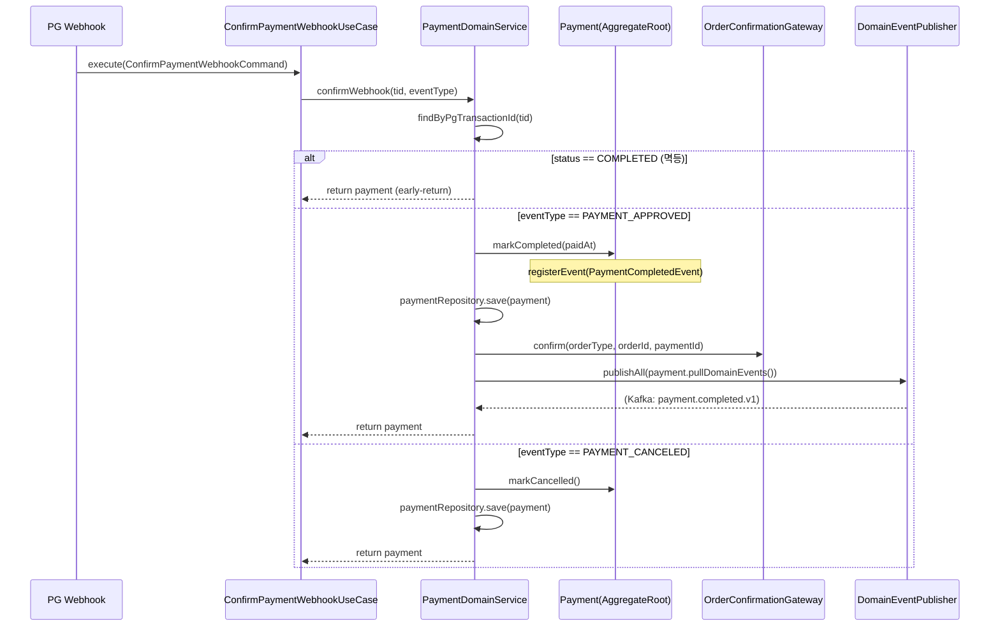
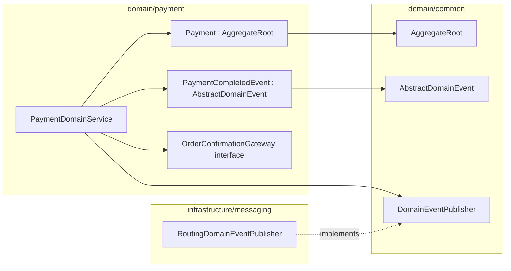

# [BE-01] PaymentCompletedEvent 도메인 이벤트 신설 및 confirmWebhook 주문확정·발행 코어 구현

## 작업 내용 (설계 의도)

### 변경 사항

현재 `PaymentDomainService.confirmWebhook`은 결제 상태를 COMPLETED로 전이하는 것으로 끝나며, 주문 확정과 도메인 이벤트 발행이 전혀 없다. `NotificationEventWorker`가 `payment.completed.v1` 토픽을 이미 구독하고 있지만 해당 토픽으로 발행하는 Producer가 없어 알림이 전달되지 않는다(결함#1 코어).

이 티켓에서는 다음 두 가지를 한 번에 해결한다.

1. `domain/payment/PaymentCompletedEvent.kt`를 `AbstractDomainEvent` 기반으로 신설한다. `topic = "payment.completed.v1"`을 지정하면 `RoutingDomainEventPublisher`가 Kafka로 자동 라우팅한다.
2. `Payment.markCompleted`가 `registerEvent(PaymentCompletedEvent(...))`를 내부에서 적재하도록 한다. `Payment`는 `AggregateRoot`를 상속해야 `registerEvent` / `pullDomainEvents`를 사용할 수 있다.
3. `PaymentDomainService.confirmWebhook`에서 PAYMENT_APPROVED 분기 완료 후 `domainEventPublisher.publishAll(payment.pullDomainEvents())`를 호출해 이벤트를 발행한다. `OrderConfirmationGateway`를 주입받아 `OrderType`별 주문 확정을 위임한다(`OrderConfirmationGateway`는 BE-02에서 정의).
4. 이미 COMPLETED인 경우 early-return으로 멱등성을 유지한다.

의존: 없음(독립 시작 가능). BE-14b(prepare 트랜잭션 분리)는 이 티켓 완료 후 착수.

## 다이어그램

### 처리 흐름

### 클래스 의존

## 테스트 케이스

### 단위 테스트 (Unit)

| ID | 대상 | 케이스 |
|---|---|---|
| U-01 | `Payment#markCompleted` | READY 상태에서 markCompleted 호출 시 status가 COMPLETED로 전이되고 PaymentCompletedEvent가 domainEvents에 1건 적재된다 |
| U-02 | `Payment#markCompleted` | PENDING 상태에서 markCompleted 호출 시 InvalidPaymentStateException이 던져진다 |
| U-03 | `PaymentCompletedEvent` | topic 필드가 "payment.completed.v1"이고 aggregateId가 payment.id와 일치한다 |
| U-04 | `PaymentDomainService#confirmWebhook` | PAYMENT_APPROVED 처리 후 pullDomainEvents()가 PaymentCompletedEvent 1건을 반환한다 |
| U-05 | `PaymentDomainService#confirmWebhook` | 이미 COMPLETED인 payment에 PAYMENT_APPROVED를 수신하면 save와 publishAll이 호출되지 않는다(멱등) |
| U-06 | `PaymentDomainService#confirmWebhook` | PAYMENT_APPROVED 처리 시 OrderConfirmationGateway.confirm이 payment.orderType과 payment.orderId로 1회 호출된다 |
| U-07 | `PaymentDomainService#confirmWebhook` | PAYMENT_CANCELED 처리 시 PaymentCompletedEvent가 적재되지 않는다 |

### 레포지토리 테스트 (Repository / Persistence)

| ID | 대상 | 케이스 |
|---|---|---|
| R-01 | `PaymentRepository` | markCompleted 후 save된 Payment의 status가 COMPLETED이고 paidAt이 UTC로 저장·복원된다 |
| R-02 | `PaymentRepository` | version 컬럼이 save마다 증가하여 낙관락 동작이 확인된다 |
| R-03 | `PaymentRepository#findByPgTransactionId` | pg_transaction_id로 Payment를 정확히 1건 조회한다 |

### 시나리오 테스트 (Scenario / Integration)

| ID | 시나리오 | 케이스 |
|---|---|---|
| S-01 | 결제 확정 메인 플로우 | PAYMENT_APPROVED 웹훅 수신 시 payment.status가 COMPLETED로 전이되고 Kafka payment.completed.v1 토픽에 PaymentCompletedEvent가 1건 발행된다 |
| S-02 | 멱등성 | 동일 tid로 PAYMENT_APPROVED 웹훅을 2회 처리해도 DB 상태 변경과 Kafka 발행이 1회만 일어난다 |
| S-03 | OrderConfirmationGateway 연동 | PAYMENT_APPROVED 처리 시 OrderConfirmationGateway.confirm이 호출되어 orderType별 주문이 확정된다 |
