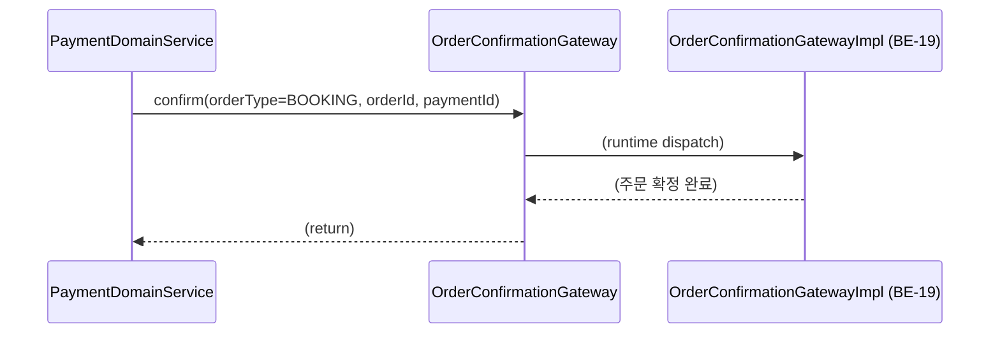
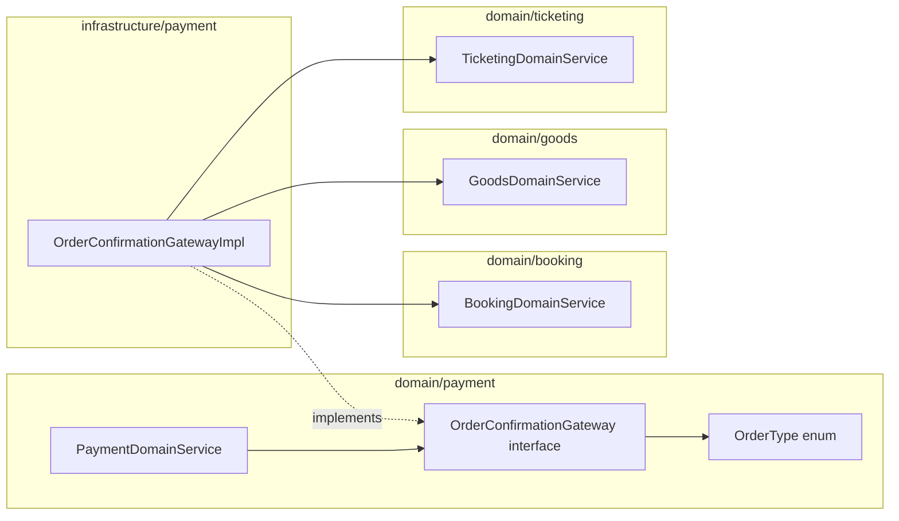

# [BE-02] OrderConfirmationGateway ACL 인터페이스 정의

## 작업 내용 (설계 의도)

### 변경 사항

현재 `PaymentDomainService`는 결제 완료 후 주문 확정을 처리할 방법이 없다. Booking 확정은 `BookingDomainService.confirmBooking`이, Ticketing 확정은 `TicketingDomainService.confirmOrder`가, Goods 확정은 `GoodsDomainService.markPaid`가 각각 담당한다. `domain/payment`가 다른 도메인 패키지를 직접 import하면 도메인 경계를 위반한다.

Anti-Corruption Layer(ACL)로 `domain/payment/OrderConfirmationGateway.kt` 인터페이스를 신설한다. `PaymentDomainService`는 이 인터페이스만 알고, 구현체(`OrderConfirmationGatewayImpl`)는 후속 티켓(BE-19)에서 infrastructure 레이어에 배치한다. 이 티켓은 인터페이스 정의만 수행한다(크기 S).

의존: 없음(독립 시작 가능). BE-01이 이 인터페이스를 사용하므로, BE-01 구현 시 이 인터페이스가 먼저 정의되어 있어야 한다.

### 변경 범위

- `domain/payment/OrderConfirmationGateway.kt` 신규 파일 생성
- `OrderType`별 주문 확정 단일 진입점 `confirm(orderType, orderId, paymentId)` 메서드 정의

### 비범위 (out of scope)

- 구현체(`OrderConfirmationGatewayImpl`) 작성 — BE-19에서 처리
- 호출부(`PaymentDomainService`) 연결 — BE-01에서 처리

## 다이어그램

### 처리 흐름

### 클래스 의존

## 테스트 케이스

### 단위 테스트 (Unit)

| ID | 대상 | 케이스 |
|---|---|---|
| U-01 | `OrderConfirmationGateway` | 인터페이스가 `confirm(orderType: OrderType, orderId: Long, paymentId: Long)` 시그니처를 선언한다 |
| U-02 | `OrderConfirmationGateway` (mock) | BOOKING 타입으로 confirm 호출 시 mock이 정상 동작한다(컴파일 검증) |

### 레포지토리 테스트 (Repository / Persistence)

해당 없음. 이 티켓은 인터페이스 정의만 포함하며 영속화 대상이 없다.

### 시나리오 테스트 (Scenario / Integration)

| ID | 시나리오 | 케이스 |
|---|---|---|
| S-01 | Spring 컨텍스트 wiring | `OrderConfirmationGateway` 빈이 Spring 컨텍스트에 등록되고 `PaymentDomainService`에 주입된다 (구현체 BE-19 완료 후 검증) |
