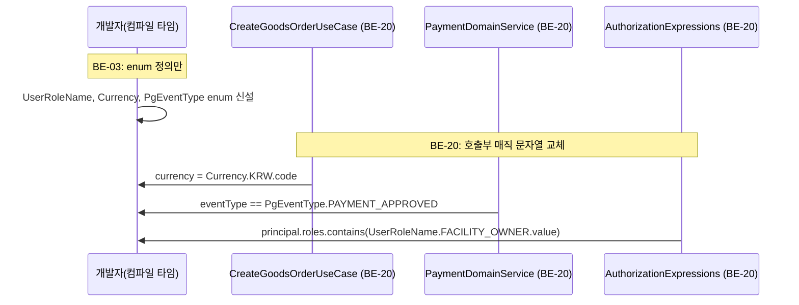
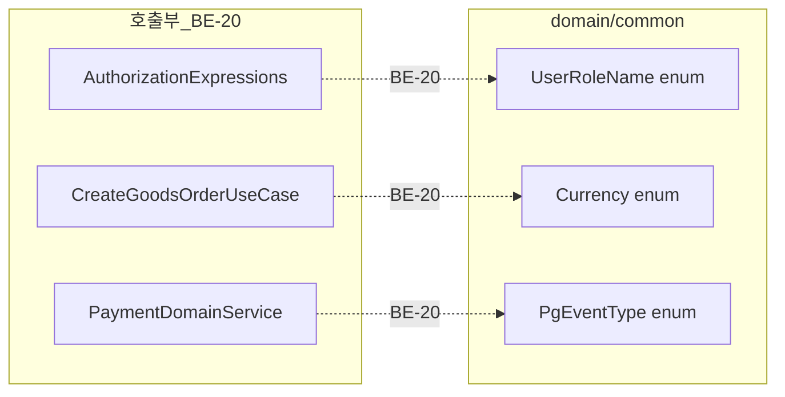

# [BE-03] 공통 enum 신설 — UserRoleName·Currency·PgEventType

## 작업 내용 (설계 의도)

### 변경 사항

코드베이스 전역에 매직 문자열이 산재해 있다(결함#15).

- 역할 이름: `AuthorizationExpressions.kt`에서 `principal.roles.contains("FACILITY_OWNER")`, `UserDomainService`에서 `"USER"` / `"ADMIN"`, `SecurityConfig`에서 `hasRole("ADMIN")` 등 문자열 리터럴
- 통화 코드: `CreateGoodsOrderUseCase`에서 `currency = "KRW"` 하드코딩
- PG 이벤트 타입: `PaymentDomainService.confirmWebhook`에서 `"PAYMENT_APPROVED"` / `"PAYMENT_CANCELED"` 문자열 when 분기

이 티켓에서는 세 enum을 `domain/common` 패키지에 신설하는 것만 수행한다. 호출부 갱신(매직 문자열 제거)은 후속 티켓(BE-20)에서 처리한다.

신설 파일:
- `domain/common/UserRoleName.kt` — `USER`, `ADMIN`, `FACILITY_OWNER`, `EVENT_HOST`, `GOODS_SELLER`, `OPERATIONS_MANAGER`
- `domain/common/Currency.kt` — `KRW`
- `domain/common/PgEventType.kt` — `PAYMENT_APPROVED`, `PAYMENT_CANCELED`

의존: 없음(독립 시작 가능).

### 비범위 (out of scope)

- 호출부 매직 문자열 교체 — BE-20에서 처리
- `SecurityConfig.hasRole(...)` 스프링 시큐리티 표현식 내부 문자열 처리 — BE-20 범위

## 다이어그램

### 처리 흐름

### 클래스 의존

## 테스트 케이스

### 단위 테스트 (Unit)

| ID | 대상 | 케이스 |
|---|---|---|
| U-01 | `UserRoleName` | entries가 USER, ADMIN, FACILITY_OWNER, EVENT_HOST, GOODS_SELLER, OPERATIONS_MANAGER 6개를 포함한다 |
| U-02 | `Currency` | KRW의 code 프로퍼티가 "KRW"를 반환한다 |
| U-03 | `PgEventType` | PAYMENT_APPROVED.value가 "PAYMENT_APPROVED"이고 PAYMENT_CANCELED.value가 "PAYMENT_CANCELED"이다 |
| U-04 | `PgEventType` | value 문자열로 역방향 lookup 시 일치하는 enum 상수가 반환된다 |

### 레포지토리 테스트 (Repository / Persistence)

해당 없음. 이 티켓은 순수 enum 정의만 포함하며 DB 영속화 대상이 없다.

### 시나리오 테스트 (Scenario / Integration)

| ID | 시나리오 | 케이스 |
|---|---|---|
| S-01 | 컴파일 통합 | 신설 enum 3종이 포함된 상태로 `./gradlew compileKotlin`이 성공한다 |
