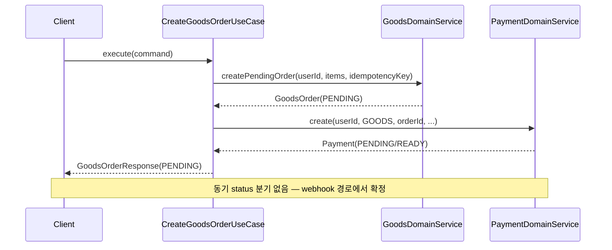
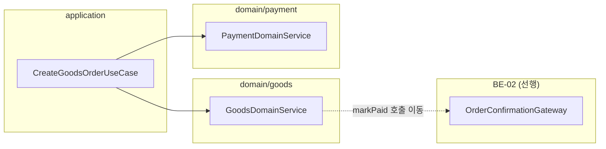

# [BE-04] goods 주문 비동기 확정 전환

## 작업 내용 (설계 의도)

### 변경 사항

현재 `CreateGoodsOrderUseCase`는 주문 생성 직후 `paymentDomainService.create()`가 반환하는 `Payment.status`를 `when` 분기로 동기 확인해 `goodsDomainService.markPaid()` 또는 `cancelPendingOrder()`를 즉시 호출한다(line 59-71). 이 흐름은 결제 완료를 UseCase 응답 경로에 직결시켜 "주문 PENDING 반환 → webhook 이후 확정" 설계를 위반한다.

이 티켓은 해당 동기 분기(`processPaymentResult`)를 제거하고, 주문을 항상 PENDING 상태로 반환하도록 전환한다. 실제 확정(CONFIRMED 전환 + `payment.completed.v1` 발행)은 BE-01이 제공하는 `confirmWebhook` 이벤트 코어와 BE-02가 제공하는 `OrderConfirmationGateway`를 통해 webhook 경로에서만 이루어진다.

- BE-01(payment 이벤트 코어), BE-02(OrderConfirmationGateway ACL) 완료 후 착수 가능
- `GoodsDomainService.markPaid()`는 BE-02의 Gateway 구현체에서만 호출하도록 이동
- `CreateGoodsOrderUseCase`에서 `PaymentDomainService` 직접 호출은 주문 생성용(`create`) 1회만 유지
- 동기 분기 제거 후 `CartDomainService.clearCart()` 호출 경로도 webhook 완료 이벤트 처리로 이동

**구현 범위**
- `CreateGoodsOrderUseCase.processPaymentResult()` 메서드 제거 (line 59-71)
- `CreateGoodsOrderUseCase.execute()` 반환을 PENDING 주문 그대로 반환하도록 단순화
- `GoodsDomainService.markPaid()` 호출을 BE-02 Gateway 구현체(`GoodsOrderConfirmationGatewayImpl`)로 이동
- 장바구니 정리(`clearCart`) 호출을 webhook 확정 이벤트 핸들러로 이동
- **(OQ-2 확정) FE 폴링용 주문 상태 조회 보장**: 비동기 전환으로 생성 응답이 PENDING 고정이 되므로 `GET /goods-orders/{id}`로 현재 상태(PENDING/CONFIRMED/CANCELLED)를 조회 가능해야 함. 기존 주문 조회 재사용, 없으면 신설

**비범위 (out of scope)**
- BE-02 `OrderConfirmationGateway` 인터페이스 및 구현체 신규 작성 (BE-02 담당)
- `payment.completed.v1` Kafka 이벤트 정의 및 발행 로직 (BE-01 담당)
- DB 스키마 변경 없음

## 다이어그램

### 처리 흐름

### 클래스 의존

## 테스트 케이스

### 단위 테스트 (Unit)

| ID | 대상 | 케이스 (한 문장) |
|---|---|---|
| U-01 | `CreateGoodsOrderUseCase` | 신규 주문 생성 시 항상 PENDING 상태의 `GoodsOrderResponse`를 반환한다 |
| U-02 | `CreateGoodsOrderUseCase` | 멱등키가 이미 존재하는 주문이면 기존 주문을 그대로 반환하고 결제를 재생성하지 않는다 |
| U-03 | `CreateGoodsOrderUseCase` | 결제 생성 후 `processPaymentResult`를 호출하지 않는다 (COMPLETED 분기 제거 검증) |
| U-04 | `GoodsOrder` | PENDING 상태에서만 CONFIRMED 전이가 허용된다 |
| U-05 | `GoodsOrder` | CONFIRMED 상태에서 `markPaid` 재호출 시 `InvalidGoodsOrderStateException`이 발생한다 |

### 레포지토리 테스트 (Repository / Persistence)

| ID | 대상 | 케이스 (한 문장) |
|---|---|---|
| R-01 | `GoodsOrderRepository` | save 후 status=PENDING, paymentId=null로 저장되고 findById로 동일 값이 조회된다 |
| R-02 | `GoodsOrderRepository` | 동일 idempotencyKey로 두 번 insert 시 unique 제약 위반이 발생한다 |
| R-03 | `GoodsOrderRepository` | `findByIdempotencyKey`가 존재하는 키에 대해 정확히 1건을 반환한다 |

### 시나리오 테스트 (Scenario / Integration)

| ID | 시나리오 | 케이스 (한 문장) |
|---|---|---|
| S-01 | 주문 생성 메인 플로우 | `CreateGoodsOrderUseCase` 실행 후 DB의 주문 status가 PENDING이고 응답에 paymentId가 포함된다 |
| S-02 | 멱등성 | 동일 idempotencyKey로 2회 호출 시 주문이 1건만 생성되고 동일 응답을 반환한다 |
| S-03 | 동기 확정 경로 제거 | UseCase 호출 후 `GoodsDomainService.markPaid()`가 실행되지 않아 주문이 CONFIRMED로 전환되지 않는다 |
| S-04 | 빈 주문 항목 방어 | 빈 items로 요청 시 `EmptyOrderException`이 발생하고 주문이 저장되지 않는다 |
