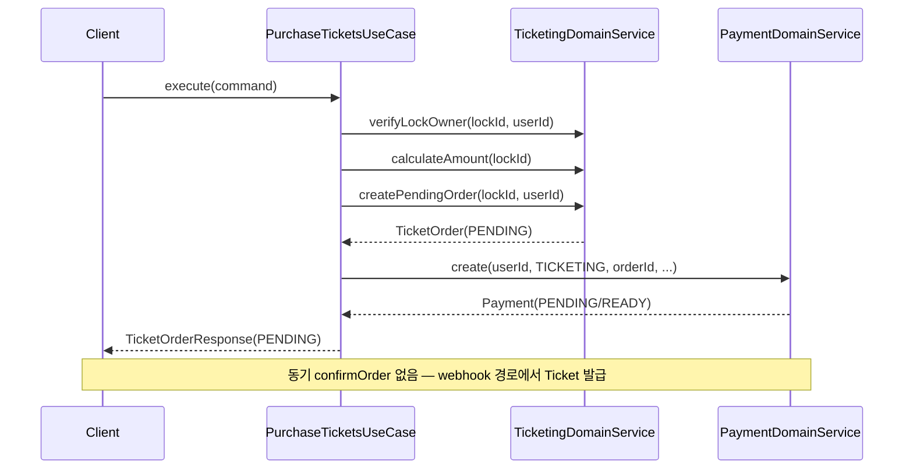
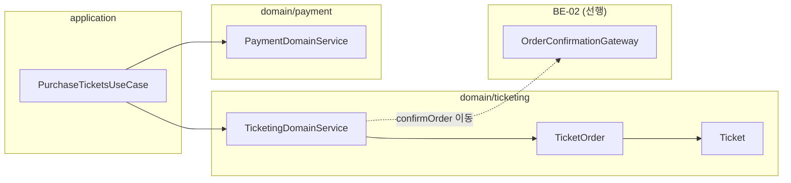

# [BE-05] ticketing 주문 비동기 확정 전환

## 작업 내용 (설계 의도)

### 변경 사항

현재 `PurchaseTicketsUseCase`는 `paymentDomainService.create()` 직후 `Payment.status`를 `when` 분기로 동기 확인해 `ticketingDomainService.confirmOrder()` 또는 `cancelOrder()`를 즉시 호출한다(line 35-47). `confirmOrder()`는 `TicketOrder`를 CONFIRMED로 전환하고 `Ticket`을 발급한다. 이 흐름은 결제 완료를 UseCase 응답 경로에서 처리해 "주문 PENDING 반환 → webhook 이후 확정" 설계를 위반한다.

이 티켓은 해당 동기 분기(`processPaymentResult`)를 제거하고, 주문을 항상 PENDING 상태로 반환하도록 전환한다. 티켓 발급과 `ticket.issued.v1` Kafka 이벤트 발행은 BE-01/BE-02의 webhook 확정 경로에서만 이루어진다.

- BE-01(payment 이벤트 코어), BE-02(OrderConfirmationGateway ACL) 완료 후 착수 가능
- `TicketingDomainService.confirmOrder()` 호출을 BE-02 Gateway 구현체(`TicketOrderConfirmationGatewayImpl`)로 이동
- `ticket.issued.v1` 이벤트는 `confirmOrder` 완료 후 AFTER_COMMIT으로 발행 (BE-01 이벤트 코어에서 정의된 패턴 준수)
- `PurchaseTicketsUseCase`는 `createPendingOrder` → `paymentDomainService.create` → PENDING 반환의 3단계로 단순화

**구현 범위**
- `PurchaseTicketsUseCase.processPaymentResult()` 메서드 제거 (line 35-47)
- `PurchaseTicketsUseCase.execute()` 반환을 PENDING TicketOrder 그대로 반환하도록 단순화
- `TicketingDomainService.confirmOrder()` 호출을 BE-02 Gateway 구현체로 이동
- `confirmOrder` 내 `Ticket` 발급 후 `ticket.issued.v1` 이벤트 등록 (AbstractDomainEvent + topic 지정)
- **(OQ-2 확정) FE 폴링용 주문 상태 조회 보장**: 생성 응답이 PENDING 고정이 되므로 `GET /ticket-orders/{id}`로 현재 상태(PENDING/CONFIRMED/CANCELLED) 조회 가능해야 함. 기존 조회 재사용, 없으면 신설

**비범위 (out of scope)**
- BE-02 `OrderConfirmationGateway` 인터페이스 및 구현체 신규 작성 (BE-02 담당)
- `payment.completed.v1` Kafka 이벤트 정의 및 발행 로직 (BE-01 담당)
- 좌석 락 해제 로직 변경 없음

## 다이어그램

### 처리 흐름

### 클래스 의존

## 테스트 케이스

### 단위 테스트 (Unit)

| ID | 대상 | 케이스 (한 문장) |
|---|---|---|
| U-01 | `PurchaseTicketsUseCase` | 실행 후 항상 PENDING 상태의 `TicketOrderResponse`를 반환한다 |
| U-02 | `PurchaseTicketsUseCase` | 실행 후 `ticketingDomainService.confirmOrder()`가 호출되지 않는다 |
| U-03 | `PurchaseTicketsUseCase` | 실행 후 `ticketingDomainService.cancelOrder()`가 호출되지 않는다 |
| U-04 | `TicketOrder` | PENDING 상태에서 `confirm()`을 호출하면 CONFIRMED로 전환되고 seatIds 수만큼 Ticket 목록을 반환한다 |
| U-05 | `TicketOrder` | CONFIRMED 상태에서 `confirm()` 재호출 시 `InvalidOrderStateException`이 발생한다 |
| U-06 | `TicketOrder` | CANCELLED 상태에서 `confirm()` 호출 시 `InvalidOrderStateException`이 발생한다 |
| U-07 | `OrderStatus` | PENDING→CONFIRMED, PENDING→CANCELLED 전이는 허용되고 CONFIRMED→CANCELLED는 금지된다 |

### 레포지토리 테스트 (Repository / Persistence)

| ID | 대상 | 케이스 (한 문장) |
|---|---|---|
| R-01 | `TicketOrderRepository` | save 후 status=PENDING, paymentId=null, lockedSeatIds JSON이 원본과 동일하게 조회된다 |
| R-02 | `TicketRepository` | `Ticket.issue()` 후 save하면 ticketOrderId·seatId가 정확히 매핑돼 findByTicketOrderId로 조회된다 |
| R-03 | `TicketOrderRepository` | status=CONFIRMED로 update 후 findById 조회 시 paymentId가 non-null로 반환된다 |

### 시나리오 테스트 (Scenario / Integration)

| ID | 시나리오 | 케이스 (한 문장) |
|---|---|---|
| S-01 | 주문 생성 메인 플로우 | `PurchaseTicketsUseCase` 실행 후 DB의 TicketOrder status가 PENDING이고 Ticket이 생성되지 않는다 |
| S-02 | 동기 확정 경로 제거 | UseCase 실행 후 `TicketingDomainService.confirmOrder()`가 호출되지 않아 Ticket이 발급되지 않는다 |
| S-03 | 멱등성 | 동일 lockId로 2회 주문 시도 시 잠금 검증 후 두 번째 요청은 예외를 반환하고 주문이 1건만 생성된다 |
| S-04 | 잠금 소유자 검증 | 타인의 lockId로 요청 시 `SeatNotLockOwnerException`이 발생하고 주문이 생성되지 않는다 |
| S-05 | ticket.issued.v1 발행 | webhook 확정 경로에서 `confirmOrder` 완료 AFTER_COMMIT 시 `ticket.issued.v1` 이벤트가 Kafka에 발행된다 |
