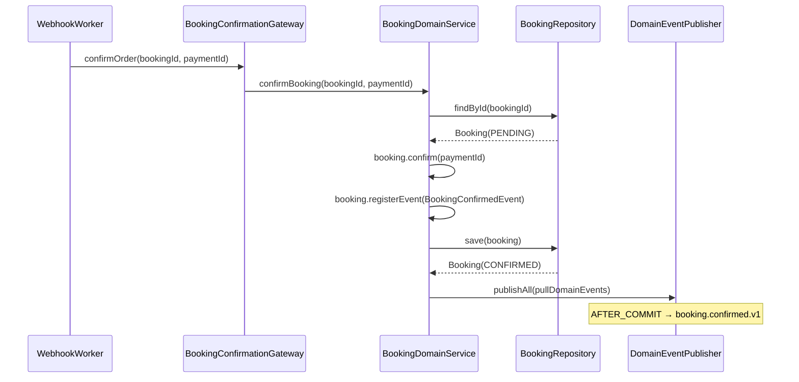
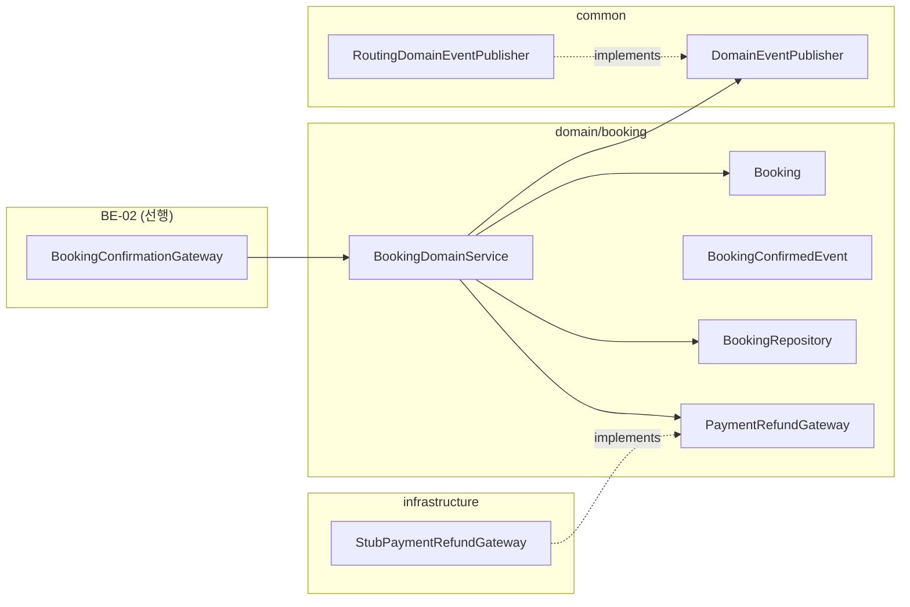

# [BE-06b] booking 통합 티켓 — 결함#1·#2·#9·#10

## 작업 내용 (설계 의도)

### 변경 사항

`BookingDomainService`는 4개 결함이 동일 파일에 집중되어 있어 1개 통합 티켓으로 처리한다. 각 결함의 변경 의도는 아래와 같다.

**결함#1 — confirmBooking webhook 연결 누락 (line 88-93)**
`confirmBooking(bookingId, paymentId)` 메서드가 구현되어 있지만 webhook 확정 경로(`ConfirmPaymentWebhookUseCase` → `BookingOrderConfirmationGateway`)와 연결되어 있지 않다. `Booking.confirm()` 호출 후 `booking.confirmed.v1` 이벤트를 등록하고 AFTER_COMMIT으로 발행하도록 연결한다. BE-01·BE-02의 선행 작업이 공통 `OrderConfirmationGateway` 인터페이스와 webhook 이벤트 코어를 제공하면, `BookingConfirmationGatewayImpl`이 `confirmBooking()`을 호출한다.

**결함#2 — 도메인 이벤트가 AFTER_COMMIT 없이 발행 (line 51, 100)**
`requestBooking` 내 `doBooking`(line 51)과 `cancel`(line 100)에서 `domainEventPublisher.publishAll()`이 트랜잭션 커밋 전에 발행된다. `SpringDomainEventPublisher`가 `ApplicationEventPublisher`에 위임하는데, 이를 수신하는 `@TransactionalEventListener(AFTER_COMMIT)` 핸들러가 커밋 전 이벤트를 수신하면 DB 상태와 불일치가 발생한다. `Booking` Entity가 `registerEvent()`로 이벤트를 적재한 뒤, DomainService는 `bookingRepository.save()` 후에 `pullDomainEvents()`를 호출해 발행하도록 순서를 정리한다. `RoutingDomainEventPublisher`가 topic=null 이벤트는 `SpringDomainEventPublisher` → `@TransactionalEventListener(AFTER_COMMIT)` 경로로 전달하므로, 커밋 완료 후에만 알림이 발송된다.

**결함#2 — 오버부킹 DB 방어 미흡 (requestBooking line 31-58)**
현재 `countBySlotIdAndStatusIn()` 조회와 `bookingRepository.save()` 사이에 락이 없으면(Redis 락 TTL 만료 시) 동시 요청이 capacity를 초과해 저장될 수 있다. **(OQ-1 확정) `slot.capacity`는 N>1이 가능하므로 partial unique 인덱스로는 표현 불가** → slot row를 `@Lock(LockModeType.PESSIMISTIC_WRITE)` + `SELECT ... FOR UPDATE`로 잠근 뒤 count-then-insert를 수행해 슬롯 단위로 직렬화한다. be-code-convention상 `@Lock + @Query`는 비관락 한정 허용 예외다. DB-01은 count 쿼리 보강 인덱스만 제공(제약 아님). Redis 분산락은 보조로 유지한다.

**결함#10 — refundBooking 외부 PG 호출이 @Transactional 내부에 위치 (line 147-155)**
`refundBooking()`이 `@Transactional` 범위 안에서 `paymentRefundGateway.requestRefund()`(외부 PG 호출)를 실행한다. PG 응답이 느리거나 타임아웃되면 트랜잭션이 오래 잡혀 커넥션 풀이 소진된다. 또한 PG 호출 성공 후 `bookingRepository.save()`가 실패하면 DB는 롤백되지만 이미 발행된 환불은 취소되지 않아 상태 불일치가 생긴다. 외부 PG 호출을 트랜잭션 커밋 이후(`@TransactionalEventListener(AFTER_COMMIT)` 또는 트랜잭션 외부 별도 메서드)로 이동하고, DB 상태 변경(`booking.refund()` + save)을 먼저 커밋한 뒤 PG 환불을 요청하도록 순서를 역전한다.

- BE-01(payment 이벤트 코어), BE-02(OrderConfirmationGateway ACL), DB-01(오버부킹 DB 제약 마이그레이션) 완료 후 착수 가능

**구현 범위**
- `BookingDomainService.confirmBooking()`: `Booking.confirm()` 후 `BookingConfirmedEvent` 등록 및 AFTER_COMMIT 발행 연결
- `BookingDomainService.doBooking()` (line 51): `bookingRepository.save()` 후 `pullDomainEvents()`로 발행 순서 정리
- `BookingDomainService.cancel()` (line 100): 동일하게 save 후 발행 순서 정리
- `BookingDomainService.requestBooking()` (line 31-58): slot row 비관락(`@Lock(PESSIMISTIC_WRITE)` + FOR UPDATE) 적용 후 count-then-insert. `SlotRepository`에 비관락 조회 메서드 추가
- `BookingDomainService.refundBooking()` (line 147-155): `paymentRefundGateway.requestRefund()` 호출을 트랜잭션 커밋 후 이벤트 기반으로 이동, DB 상태 변경 먼저 커밋
- **(OQ-2 확정) FE 폴링용 예약 상태 조회 보장**: 생성 응답이 PENDING 고정이 되므로 `GET /bookings/{id}`로 현재 상태(PENDING/CONFIRMED/CANCELLED) 조회 가능해야 함. 기존 조회 재사용

**비범위 (out of scope)**
- DB-01 마이그레이션 DDL 작성 (DB-01 담당)
- BE-02 `OrderConfirmationGateway` 인터페이스 신규 작성 (BE-02 담당)
- `PaymentRefundGateway` 실 PG 구현체 (`StubPaymentRefundGateway` 유지)
- `BookingStatus` enum 변경 없음

## 다이어그램

### 처리 흐름

### 클래스 의존

## 테스트 케이스

### 단위 테스트 (Unit)

| ID | 대상 | 케이스 (한 문장) |
|---|---|---|
| U-01 | `Booking` | PENDING 상태에서 `confirm(paymentId)` 호출 시 status=CONFIRMED, paymentId가 설정된다 |
| U-02 | `Booking` | CONFIRMED 상태에서 `confirm()` 재호출 시 `InvalidBookingStateException`이 발생한다 |
| U-03 | `Booking` | CANCELLED 상태에서 `confirm()` 호출 시 `InvalidBookingStateException`이 발생한다 |
| U-04 | `Booking` | `cancel(cancelledByUserId, reason)` 호출 후 `pullDomainEvents()`에 `BookingCancelledEvent`가 1건 존재한다 |
| U-05 | `Booking` | CONFIRMED 상태에서 `refund()` 호출 시 status=REFUNDED로 전환된다 |
| U-06 | `Booking` | `requireHasPayment()` 호출 시 paymentId=null이면 `RefundBookingException`이 발생한다 |
| U-07 | `BookingDomainService.confirmBooking` | confirm 후 `BookingConfirmedEvent`가 `pullDomainEvents()`에 등록된다 |
| U-08 | `BookingDomainService.refundBooking` | `booking.refund()` 및 `save()`가 먼저 호출된 뒤 `paymentRefundGateway.requestRefund()`가 호출된다 |

### 레포지토리 테스트 (Repository / Persistence)

| ID | 대상 | 케이스 (한 문장) |
|---|---|---|
| R-01 | `BookingRepository` | save 후 status·paymentId가 ZonedDateTime UTC로 정확히 저장되고 findById로 복원된다 |
| R-02 | `BookingRepository` | `countBySlotIdAndStatusIn(slotId, [PENDING, CONFIRMED])`이 해당 상태 행만 정확히 집계한다 |
| R-03 | `BookingRepository` | DB-01 제약 위반 시 capacity 초과 insert가 DataIntegrityViolationException을 던진다 |
| R-04 | `BookingRepository` | 낙관락이 없는 동시 confirm 요청 2건 중 후행이 status 확인에서 `InvalidBookingStateException`을 던진다 |

### 시나리오 테스트 (Scenario / Integration)

| ID | 시나리오 | 케이스 (한 문장) |
|---|---|---|
| S-01 | 예약 확정 webhook 플로우 | webhook 이벤트 수신 시 Booking이 CONFIRMED로 전환되고 `booking.confirmed.v1`이 AFTER_COMMIT으로 Kafka에 발행된다 |
| S-02 | 이벤트 발행 타이밍 | `booking.confirmed.v1` 이벤트가 트랜잭션 커밋 전에 발행되지 않음을 트랜잭션 롤백 시나리오로 검증한다 |
| S-03 | 오버부킹 방어 | capacity=1인 슬롯에 동시 요청 2건 중 1건만 성공하고 나머지는 `SlotFullException`을 반환한다 |
| S-04 | 환불 트랜잭션 순서 | `refundBooking` 실행 시 DB status=REFUNDED 커밋 완료 후 PG `requestRefund`가 호출된다 |
| S-05 | PG 환불 실패 보상 | PG `requestRefund`가 예외를 던져도 이미 커밋된 DB status=REFUNDED가 롤백되지 않고 재시도 이벤트가 등록된다 |
| S-06 | 취소 이벤트 타이밍 | `cancel()` 호출 후 `BookingCancelledEvent`가 트랜잭션 커밋 이후에만 발행된다 |
| S-07 | 멱등성 | 동일 bookingId의 confirm webhook이 2회 수신돼도 DB 상태가 1회만 변경된다 |
