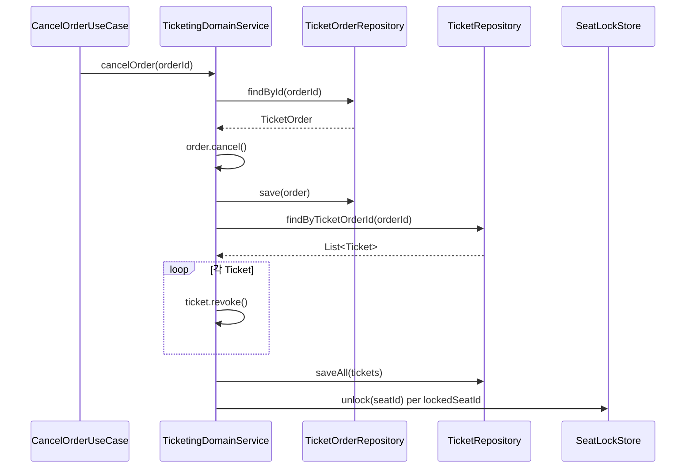
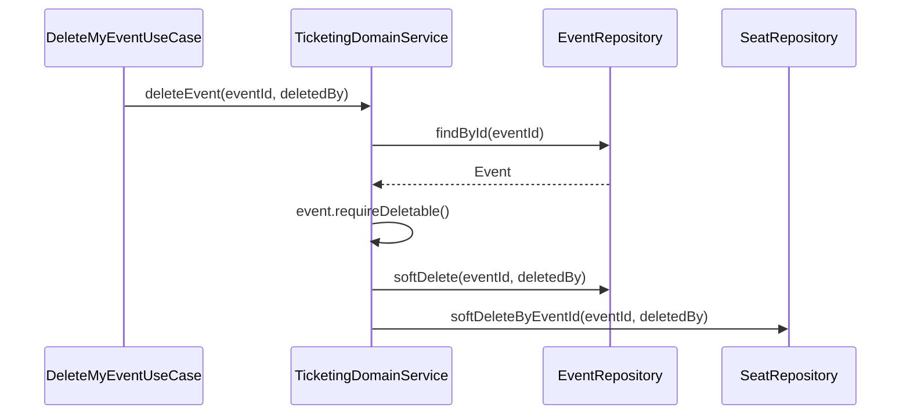
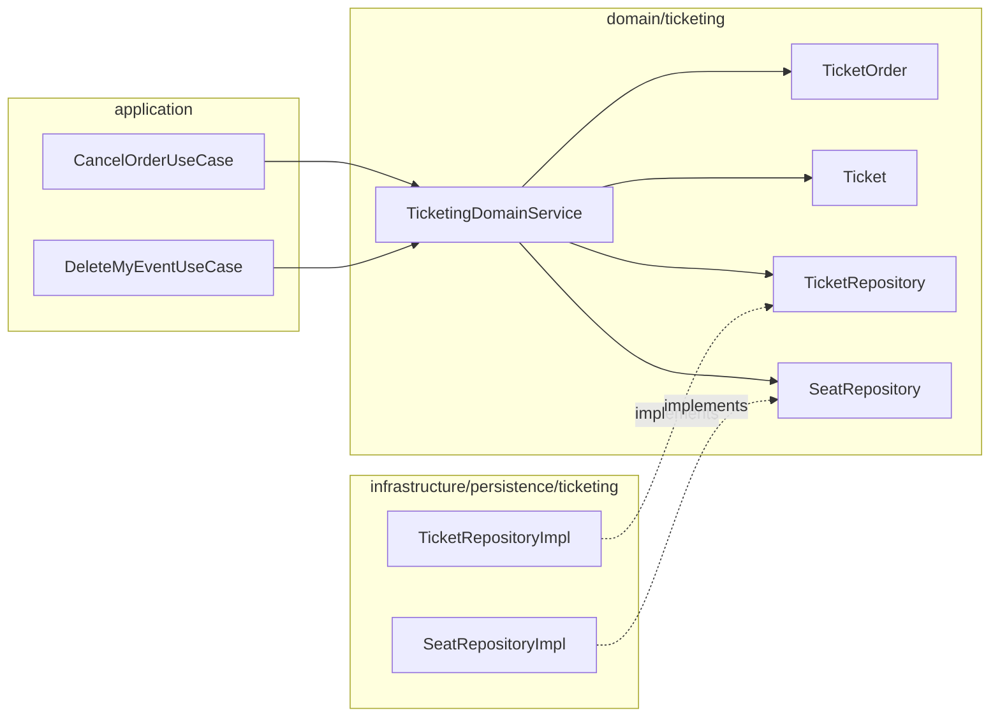

# [BE-08] TicketingAggregate 고아 차단 — cancelOrder Ticket 취소 전파 + deleteEvent Seat softDelete 호출

## 작업 내용 (설계 의도)

### 변경 사항

`cancelOrder`(line 122-132)는 `TicketOrder.cancel()`로 주문 상태만 CANCELLED로 바꾸고, 해당 주문에 연결된 `Ticket` 행은 그대로 ISSUED 상태로 남긴다. `tickets` 테이블에는 `status = 'ISSUED'` 일 때만 값을 갖는 가상 컬럼 `active_seat_id`와 `uk_tickets_active_seat` 유니크 키가 있으므로, 취소된 주문의 티켓이 살아 있으면 해당 좌석은 새 주문이 들어와도 유니크 제약 위반이 발생해 영구 점유된다.

`deleteEvent`(line 184-189)는 `event.requireDeletable()` + `eventRepository.softDelete()` 만 호출한다. `seatRepository.softDeleteByEventId`는 도메인 인터페이스와 `SeatRepositoryImpl`에 이미 구현되어 있으나 호출부가 없다. 이벤트가 삭제되면 Seat 행이 살아남아 고아가 된다.

두 결함 모두 `TicketingDomainService` 단일 파일 내 수정으로 해결 가능하다. `cancelOrder`는 주문 취소 후 연결 Ticket을 `revoke()`하고 저장하는 전파 로직을 추가한다. `deleteEvent`는 `seatRepository.softDeleteByEventId(eventId, deletedBy)` 호출을 추가한다. `Ticket.revoke()`는 이미 `TicketStatus` 전이 가드(`requireCanTransitTo`)를 통해 ISSUED → REVOKED 만 허용한다.

#### 변경 범위

- `domain/ticketing/TicketingDomainService.kt` — `cancelOrder`에 Ticket revoke 전파, `deleteEvent`에 `seatRepository.softDeleteByEventId` 호출 추가
- `domain/ticketing/TicketRepository.kt` — `findByTicketOrderId` 이미 존재(신규 불필요), 필요 시 `softDeleteAllByOrderId` 신설 여부 결정

#### 비범위 (out of scope)

- `Seat` 엔티티 구조 변경
- `uk_tickets_active_seat` 마이그레이션 수정
- 결제 환불 연동 (별도 티켓)
- 이미 고아화된 기존 데이터 정정 (운영 데이터 패치)

## 다이어그램

### 처리 흐름

### 클래스 의존

## 테스트 케이스

### 단위 테스트 (Unit)

| ID | 대상 | 케이스 |
|---|---|---|
| U-01 | `Ticket` | ISSUED 상태의 Ticket은 revoke() 호출 시 REVOKED로 전이된다 |
| U-02 | `Ticket` | REVOKED 상태의 Ticket은 revoke() 재호출 시 InvalidTicketStateException을 던진다 |
| U-03 | `TicketOrder` | PENDING 상태의 TicketOrder는 cancel() 호출 시 CANCELLED로 전이된다 |
| U-04 | `TicketOrder` | CONFIRMED 상태의 TicketOrder는 cancel() 호출 시 상태 전이 예외를 던진다 |

### 레포지토리 테스트 (Repository / Persistence)

| ID | 대상 | 케이스 |
|---|---|---|
| R-01 | `TicketRepositoryImpl` | cancelOrder 후 findByTicketOrderId 조회 시 revoke된 Ticket이 0건 반환된다 (deletedAt IS NULL 필터 + REVOKED 상태) |
| R-02 | `TicketRepositoryImpl` | ISSUED 상태 Ticket이 남아 있을 때 동일 seat_id로 새 Ticket insert 시 uk_tickets_active_seat 위반이 발생한다 |
| R-03 | `TicketRepositoryImpl` | revoke() 후 저장된 Ticket은 active_seat_id가 NULL이어서 동일 seat_id로 새 Ticket insert가 성공한다 |
| R-04 | `SeatRepositoryImpl` | softDeleteByEventId 호출 후 findByEventId는 0건을 반환한다 |

### 시나리오 테스트 (Scenario / Integration)

| ID | 시나리오 | 케이스 |
|---|---|---|
| S-01 | cancelOrder 전파 메인 플로우 | CONFIRMED 주문 취소 시 연결된 모든 Ticket이 REVOKED 상태로 저장된다 |
| S-02 | 고아 차단 — 좌석 재사용 | cancelOrder 후 동일 seat_id로 새 TicketOrder를 생성하고 confirmOrder하면 uk_tickets_active_seat 위반 없이 성공한다 |
| S-03 | deleteEvent 전파 메인 플로우 | deleteEvent 호출 후 해당 eventId의 Seat 전체가 deletedAt IS NOT NULL 상태로 변경된다 |
| S-04 | 루트 soft-delete → 자식 조회 0건 | deleteEvent 후 seatRepository.findByEventId(eventId)가 0건을 반환한다 |
