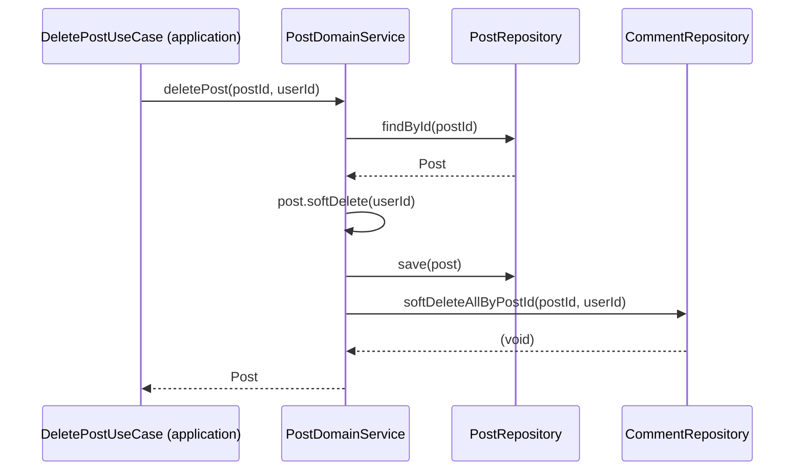
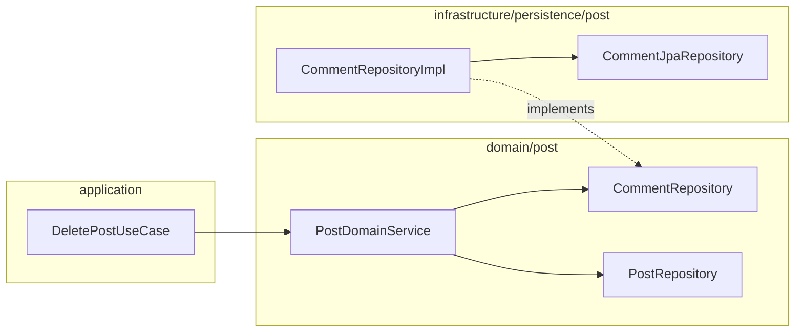

# [BE-10] Post→Comment 고아 차단 — deletePost 댓글 soft-delete 전파

## 작업 내용 (설계 의도)

### 변경 사항

`PostDomainService.deletePost`(line 28-33)는 `post.softDelete(userId)`와 `postRepository.save(post)`만 수행한다. 해당 Post에 달린 Comment는 삭제되지 않으므로 `deletedAt IS NULL` 필터 기반 조회(`commentRepository.findByPostId`, `findTop50ByPostId`, `findPageByPostId`)에서 고아 댓글이 계속 노출된다.

해결 방향은 `CommentRepository`에 `softDeleteAllByPostId(postId: Long, deletedBy: Long)` 메서드를 신설하고, `CommentRepositoryImpl`에서 `CommentJpaRepository`를 통해 구현한다. `PostDomainService.deletePost` 끝에서 이 메서드를 호출해 전파한다.

`Comment.delete(requestUserId)`는 댓글 소유자 검증을 포함하므로 일괄 전파에 사용할 수 없다. 운영자 삭제(부모 Post 삭제에 의한 cascade)는 소유자 검증 없이 직접 soft-delete한다. Comment 자체에 `softDelete(userId)`는 이미 `JpaAuditingBase`에서 상속되므로 Entity를 수정하지 않아도 된다.

#### 변경 범위

- `domain/post/CommentRepository.kt` — `softDeleteAllByPostId(postId: Long, deletedBy: Long)` 추가
- `infrastructure/persistence/post/CommentRepositoryImpl.kt` — 위 메서드 구현 (findByPostIdAndDeletedAtIsNull + forEach softDelete + saveAll)
- `domain/post/PostDomainService.kt` — `deletePost` 끝에 `commentRepository.softDeleteAllByPostId(postId, userId)` 호출

#### 비범위 (out of scope)

- Comment 자체 삭제 API 변경
- 이미 고아화된 기존 댓글 데이터 정정
- 페이지네이션 방식 변경

## 다이어그램

### 처리 흐름

### 클래스 의존

## 테스트 케이스

### 단위 테스트 (Unit)

| ID | 대상 | 케이스 |
|---|---|---|
| U-01 | `Comment` | delete(userId)는 소유자가 아닌 userId 전달 시 NotCommentOwnerException을 던진다 |
| U-02 | `Comment` | softDelete(userId)는 소유자 검증 없이 deletedAt을 현재 시각으로 설정한다 |

### 레포지토리 테스트 (Repository / Persistence)

| ID | 대상 | 케이스 |
|---|---|---|
| R-01 | `CommentRepositoryImpl` | softDeleteAllByPostId 호출 후 findByPostId(postId)는 0건을 반환한다 |
| R-02 | `CommentRepositoryImpl` | softDeleteAllByPostId는 다른 postId의 Comment에 영향을 주지 않는다 |
| R-03 | `CommentRepositoryImpl` | 이미 soft-delete된 Comment에 softDeleteAllByPostId를 재호출해도 JpaAuditingBase.check가 예외를 던진다 |

### 시나리오 테스트 (Scenario / Integration)

| ID | 시나리오 | 케이스 |
|---|---|---|
| S-01 | deletePost 전파 메인 플로우 | Post 삭제 시 해당 Post의 모든 Comment가 동시에 soft-delete된다 |
| S-02 | 루트 soft-delete → 자식 조회 0건 | deletePost 후 commentRepository.findByPostId(postId)가 0건을 반환한다 |
| S-03 | 다른 Post 댓글 격리 | Post A 삭제 시 Post B의 댓글은 deletedAt IS NULL 상태를 유지한다 |
| S-04 | 멱등성 | 동일 postId에 대해 deletePost를 재호출하면 ResourceNotFoundException이 발생하고 댓글 중복 삭제는 일어나지 않는다 |
