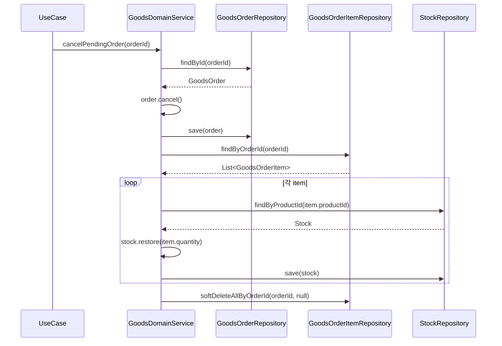
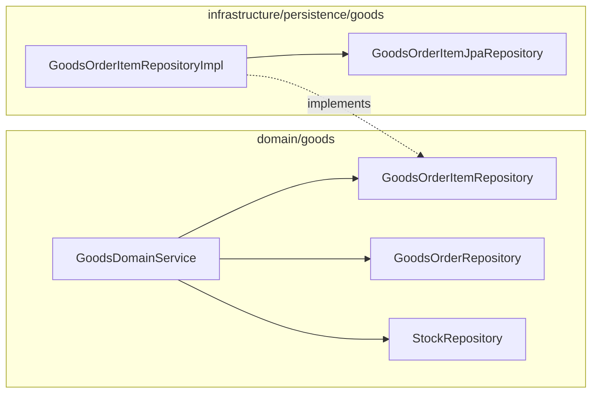

# [BE-11] GoodsOrder→GoodsOrderItem 취소 전파 — cancelPendingOrder item soft-delete 추가

## 작업 내용 (설계 의도)

### 변경 사항

`GoodsDomainService.cancelPendingOrder`(line 93-105)는 `order.cancel()`로 주문 상태를 CANCELLED로 변경하고, 각 item의 재고를 `stock.restore(item.quantity)`로 복원한다. 그러나 `GoodsOrderItem` 행에는 soft-delete가 적용되지 않아 아이템이 CANCELLED 주문에 고아 상태로 남는다.

`GoodsOrderItemRepository`에 `softDeleteAllByOrderId` 메서드가 없으며, `GoodsOrderItemJpaRepository`에도 대응 쿼리가 없다. `GoodsOrderItem`은 `JpaAuditingBase`를 상속하므로 Entity 변경 없이 `softDelete(userId)` 호출이 가능하다. 단, `GoodsOrderItem`에 `cancel()` 같은 의미있는 도메인 메서드가 없으므로 직접 `softDelete`를 호출하는 방식으로 전파한다.

`cancelPendingOrder`는 `userId` 파라미터가 없다. 취소 주체를 기록하려면 서명 변경이 필요하나, 현 호출부(`application/goods` UseCase)를 함께 변경해야 한다. 이 티켓에서는 취소 주체 기록 여부를 `open_questions`로 남기고 일단 `deletedBy = null`로 진행할 수 있다.

#### 변경 범위

- `domain/goods/GoodsOrderItemRepository.kt` — `softDeleteAllByOrderId(orderId: Long, deletedBy: Long?)` 신설
- `infrastructure/persistence/goods/GoodsOrderItemRepositoryImpl.kt` — 위 메서드 구현 (findAllByOrderId + forEach softDelete + saveAll)
- `infrastructure/persistence/goods/GoodsOrderItemJpaRepository.kt` — `findAllByOrderId` 신설 (soft-delete 미적용 전체 조회, 전파 전용)
- `domain/goods/GoodsDomainService.kt` — `cancelPendingOrder` 재고 복원 루프 이후 `goodsOrderItemRepository.softDeleteAllByOrderId(orderId, null)` 호출

#### 비범위 (out of scope)

- `cancelPendingOrder` 시그니처에 userId 추가 (open question 참조)
- `GoodsOrderItem` 도메인 메서드 추가
- 이미 고아화된 기존 아이템 데이터 정정

## 다이어그램

### 처리 흐름

### 클래스 의존

## 테스트 케이스

### 단위 테스트 (Unit)

| ID | 대상 | 케이스 |
|---|---|---|
| U-01 | `GoodsOrder` | PENDING 상태는 cancel() 호출 시 CANCELLED로 전이된다 |
| U-02 | `GoodsOrder` | CONFIRMED 상태는 cancel() 호출 시 InvalidGoodsOrderStateException을 던진다 |

### 레포지토리 테스트 (Repository / Persistence)

| ID | 대상 | 케이스 |
|---|---|---|
| R-01 | `GoodsOrderItemRepositoryImpl` | softDeleteAllByOrderId 호출 후 findByOrderId(orderId)는 0건을 반환한다 |
| R-02 | `GoodsOrderItemRepositoryImpl` | softDeleteAllByOrderId는 다른 orderId의 GoodsOrderItem에 영향을 주지 않는다 |
| R-03 | `GoodsOrderItemRepositoryImpl` | softDeleteAllByOrderId 후 deletedAt IS NOT NULL인 item의 deletedAt이 현재 시각 이내로 저장된다 |

### 시나리오 테스트 (Scenario / Integration)

| ID | 시나리오 | 케이스 |
|---|---|---|
| S-01 | cancelPendingOrder 전파 메인 플로우 | 주문 취소 시 GoodsOrder가 CANCELLED가 되고 연결된 모든 GoodsOrderItem이 soft-delete된다 |
| S-02 | 루트 soft-delete → 자식 조회 0건 | cancelPendingOrder 후 goodsOrderItemRepository.findByOrderId(orderId)가 0건을 반환한다 |
| S-03 | 재고 복원 일관성 | 주문 취소 후 각 item의 product 재고가 취소 전 수량만큼 복원되고 item도 soft-delete된다 |
| S-04 | 멱등성 | 이미 CANCELLED 상태인 orderId로 cancelPendingOrder를 재호출하면 InvalidGoodsOrderStateException이 발생하고 아이템 중복 삭제는 일어나지 않는다 |

## Open Questions

- `cancelPendingOrder`에 `deletedBy` 기록이 필요한가? 현재 시그니처에 `userId`가 없어 `deletedBy = null`로 기록된다. PM/Tech Lead 확인 후 시그니처 변경 여부 결정.
