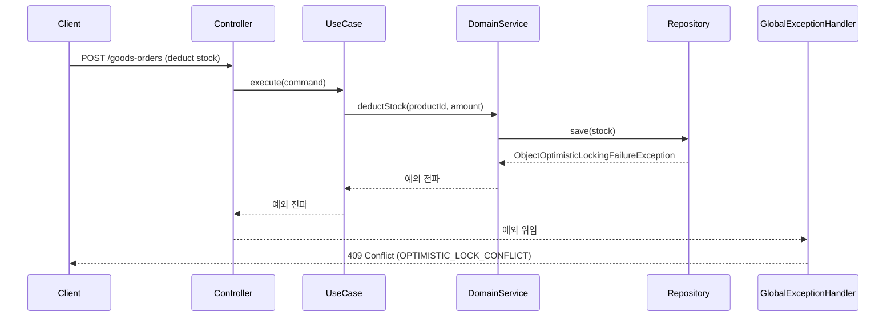

# [BE-12] 낙관락 충돌 500 → 409 응답 매핑

## 작업 내용 (설계 의도)

### 변경 사항

`Stock` 에 `@Version` 낙관락이 선언되어 있다.
동시 재고 차감 시 `ObjectOptimisticLockingFailureException`이 발생하지만
`GlobalExceptionHandler`에 매핑 핸들러가 없어 폴백인 `handleUnknownException`이 잡아 500을 반환한다.

클라이언트 관점에서 낙관락 충돌은 "재고 경쟁 실패"이므로 409 Conflict로 반환해야 한다.
`Stock.kt`는 수정하지 않고 예외 핸들러 레이어(`presentation/exception/GlobalExceptionHandler`)에
`ObjectOptimisticLockingFailureException` → 409 매핑을 추가한다.

구현 범위:
- `GlobalExceptionHandler`에 `ObjectOptimisticLockingFailureException` 핸들러 추가 (HTTP 409, 코드 `OPTIMISTIC_LOCK_CONFLICT`)
- `ErrorStatus`에 409 매핑이 없으면 HTTP 상태 직접 지정

비범위:
- `Stock.kt` 수정 없음
- `@Retryable` 재시도 로직 추가 없음 (별도 티켓으로 결정 필요 — Open Question 참조)
- 다른 도메인의 낙관락 핸들링 방식 변경 없음

---

## 다이어그램

### 처리 흐름



### 클래스 의존

```mermaid
flowchart LR
    subgraph presentation
        GlobalExceptionHandler
    end
    subgraph Spring["Spring ORM"]
        OOLF["ObjectOptimisticLockingFailureException"]
    end
    GlobalExceptionHandler -->|@ExceptionHandler 추가| OOLF
```

---

## 테스트 케이스

### 단위 테스트 (Unit)

| ID | 대상 | 케이스 |
|---|---|---|
| U-01 | `GlobalExceptionHandler#handleOptimisticLockException` | `ObjectOptimisticLockingFailureException` 입력 시 HTTP 409와 코드 `OPTIMISTIC_LOCK_CONFLICT`의 `ProblemDetail`을 반환한다 |

### 레포지토리 테스트 (Repository / Persistence)

| ID | 대상 | 케이스 |
|---|---|---|
| R-01 | `StockConcurrencyTest` | 두 트랜잭션이 동일 `Stock` row를 동시에 save하면 후행 트랜잭션이 `ObjectOptimisticLockingFailureException`을 발생시킨다 (기존 테스트 회귀 확인) |

### 시나리오 테스트 (Scenario / Integration)

| ID | 시나리오 | 케이스 |
|---|---|---|
| S-01 | 낙관락 충돌 HTTP 응답 | `ObjectOptimisticLockingFailureException`이 발생하는 컨트롤러 엔드포인트 요청 시 409 + `OPTIMISTIC_LOCK_CONFLICT` 코드의 ProblemDetail이 반환된다 |
| S-02 | 기존 500 핸들러 회귀 | 등록되지 않은 일반 RuntimeException은 여전히 500 + `INTERNAL_ERROR`로 응답된다 |
