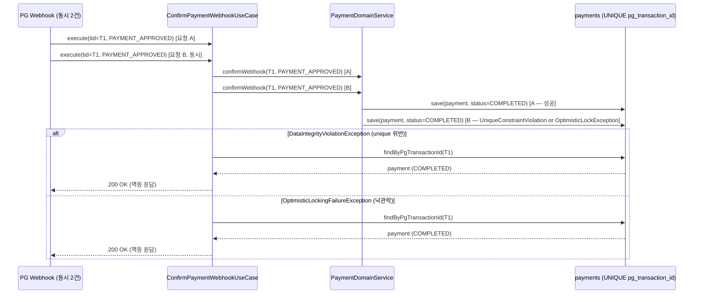
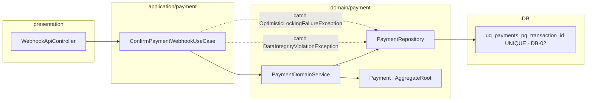

# [BE-13] webhook 동시 첫 도착 멱등 처리

## 작업 내용 (설계 의도)

### 변경 사항

현재 `PaymentDomainService.confirmWebhook`에는 이미 COMPLETED 상태인 경우 early-return하는 멱등 처리가 있다. 그러나 두 웹훅이 동시에 첫 도착할 때(`payment.status == READY`, 아직 COMPLETED 아님)는 두 스레드 모두 early-return을 통과해 중복 처리가 발생할 수 있다(결함#8).

DB-02에서 `pg_transaction_id`에 UNIQUE 인덱스가 생성되면 DB 레벨에서 중복 insert를 차단한다. 이 티켓에서는 애플리케이션 레이어에서 다음 두 케이스를 방어한다.

1. `pg_transaction_id` unique 제약 위반 (`DataIntegrityViolationException`): 이미 처리된 tid이므로 멱등 응답(200 OK, 기존 payment 반환)으로 처리.
2. `@Version` 낙관락 충돌 (`OptimisticLockingFailureException`): 같은 Payment row를 두 트랜잭션이 동시에 수정할 때 후행 커밋이 실패. 재시도 없이 멱등 응답으로 처리.

`ConfirmPaymentWebhookUseCase`에서 예외를 catch하고, `PaymentRepository.findByPgTransactionId`로 현재 상태를 재조회해 반환한다.

의존: DB-02(pg_transaction_id unique 인덱스), BE-01(PaymentCompletedEvent 이벤트 발행 코어) — 두 티켓 모두 완료 후 착수.

### 비범위 (out of scope)

- 재시도(retry) 로직 — 멱등 처리로 충분하며 재시도는 PG 쪽에서 담당
- webhook 인증 검증 — 별도 보안 티켓 범위

## 다이어그램

### 처리 흐름

### 클래스 의존

## 테스트 케이스

### 단위 테스트 (Unit)

| ID | 대상 | 케이스 |
|---|---|---|
| U-01 | `ConfirmPaymentWebhookUseCase` | PaymentDomainService가 DataIntegrityViolationException을 던질 때 findByPgTransactionId로 재조회한 payment를 반환한다 |
| U-02 | `ConfirmPaymentWebhookUseCase` | PaymentDomainService가 OptimisticLockingFailureException을 던질 때 findByPgTransactionId로 재조회한 payment를 반환한다 |
| U-03 | `PaymentDomainService#confirmWebhook` | 이미 COMPLETED인 payment에 PAYMENT_APPROVED 수신 시 save와 publishAll이 호출되지 않는다(기존 멱등 유지) |

### 레포지토리 테스트 (Repository / Persistence)

| ID | 대상 | 케이스 |
|---|---|---|
| R-01 | `PaymentRepository` | 두 트랜잭션이 동일 payment row를 동시에 수정할 때 후행 커밋이 OptimisticLockingFailureException을 던진다 |
| R-02 | `PaymentRepository` | 동일 pg_transaction_id로 두 번째 save 시 DataIntegrityViolationException이 발생한다(DB-02 마이그레이션 적용 상태) |

### 시나리오 테스트 (Scenario / Integration)

| ID | 시나리오 | 케이스 |
|---|---|---|
| S-01 | 동시 웹훅 첫 도착 멱등 | READY 상태의 payment에 동일 tid PAYMENT_APPROVED 웹훅이 동시에 2건 도착해도 DB 상태 변경과 Kafka 이벤트 발행이 1회만 일어나고 두 응답 모두 200 OK를 반환한다 |
| S-02 | 낙관락 충돌 후 멱등 응답 | 두 스레드가 같은 payment의 version을 동시에 읽고 한 쪽이 먼저 커밋하면 나머지는 멱등 응답으로 처리된다 |
