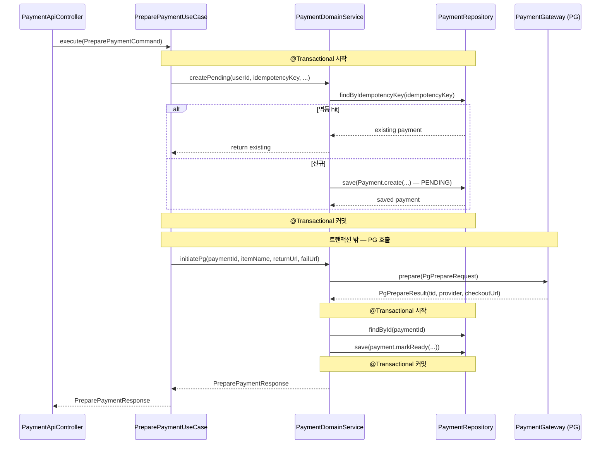
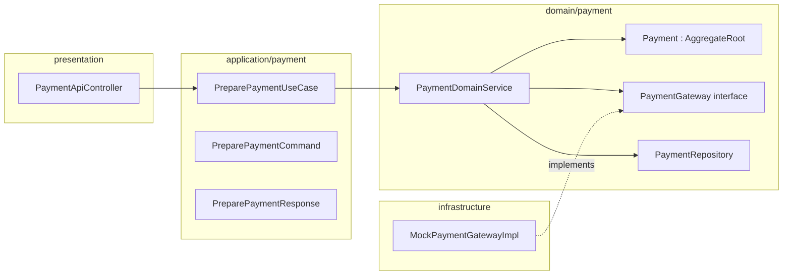

# [BE-14b] PreparePaymentUseCase PG 호출 @Transactional 분리

## 작업 내용 (설계 의도)

### 변경 사항

현재 `PreparePaymentUseCase.execute`는 `@Transactional` 안에서 `PaymentDomainService.prepare`를 호출하고, `prepare` 내부에서 외부 PG(`paymentGateway.prepare(...)`)를 동기 호출한다(결함#9 payment측). 외부 PG 응답 지연이 DB 커넥션을 점유해 커넥션 풀 고갈 위험이 있다.

수정 방향:

1. `PaymentDomainService.prepare`를 두 단계로 분리한다.
   - 1단계(`createPending`): `@Transactional` 안에서 PENDING 상태의 Payment를 DB에 저장.
   - 2단계(`initiatePg`): `@Transactional` 밖에서 PG 호출 후 `payment.markReady(...)` 적용 및 저장.
2. `PreparePaymentUseCase.execute`에서 트랜잭션 경계를 재조정한다. PG 호출은 트랜잭션 외부에서 실행한다.
3. `PaymentDomainService.prepare` 시그니처는 그대로 유지하되 내부 구현을 분리하거나, UseCase에서 두 단계를 명시적으로 호출하는 방식 중 하나를 선택한다.

의존: BE-01(PaymentCompletedEvent 코어 완료) — BE-01이 Payment를 `AggregateRoot` 상속으로 변경하므로, 그 이후에 이 티켓을 착수해야 충돌이 없다.

### 비범위 (out of scope)

- `CreatePaymentUseCase` 변경 — 현재 `prepare`를 동일하게 호출하므로 별도 티켓에서 처리
- PG 호출 재시도(retry) 정책 — 별도 티켓 범위

## 다이어그램

### 처리 흐름

### 클래스 의존

## 테스트 케이스

### 단위 테스트 (Unit)

| ID | 대상 | 케이스 |
|---|---|---|
| U-01 | `PaymentDomainService#createPending` | 신규 idempotencyKey로 호출 시 PENDING 상태의 Payment가 save되고 PG 호출이 발생하지 않는다 |
| U-02 | `PaymentDomainService#createPending` | 기존 idempotencyKey로 호출 시 PG 호출 없이 기존 Payment가 반환된다(멱등) |
| U-03 | `PaymentDomainService#initiatePg` | PG 호출 성공 시 payment.status가 READY로 전이되고 pgTransactionId·checkoutUrl이 설정된다 |
| U-04 | `PaymentDomainService#initiatePg` | PG 호출에서 PaymentGatewayException이 발생하면 Payment 상태가 FAILED로 전이된다 |
| U-05 | `PreparePaymentUseCase` | PG 호출이 `@Transactional` 경계 밖에서 실행된다(트랜잭션 활성 여부 검증) |

### 레포지토리 테스트 (Repository / Persistence)

| ID | 대상 | 케이스 |
|---|---|---|
| R-01 | `PaymentRepository` | createPending 후 DB에 PENDING 상태로 저장되고 findById로 복원된다 |
| R-02 | `PaymentRepository` | initiatePg 완료 후 pgTransactionId·provider·checkoutUrl·status=READY가 정확히 저장된다 |
| R-03 | `PaymentRepository` | PG 호출 실패 후 Payment.status가 FAILED로 업데이트된다 |

### 시나리오 테스트 (Scenario / Integration)

| ID | 시나리오 | 케이스 |
|---|---|---|
| S-01 | PG 정상 흐름 | PreparePaymentUseCase 실행 시 PENDING 저장 → PG 호출 → READY 저장이 순서대로 완료되고 checkoutUrl이 반환된다 |
| S-02 | PG 타임아웃 시 DB 일관성 | PG 호출이 타임아웃될 때 첫 번째 PENDING 저장 트랜잭션은 커밋된 상태로 유지되고 Payment.status는 FAILED로 전이된다 |
| S-03 | 멱등 재시도 | 동일 idempotencyKey로 PreparePaymentUseCase를 2회 실행해도 PG 호출과 Payment 생성이 1회만 일어난다 |
