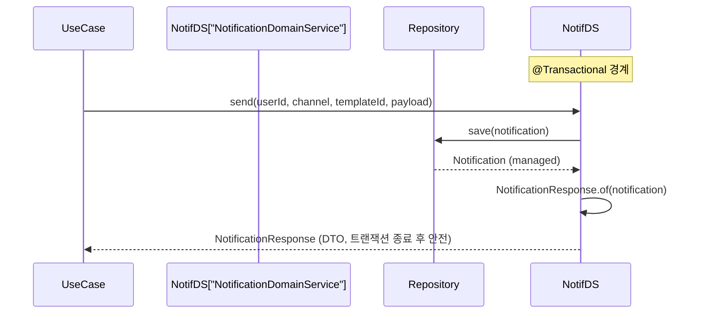
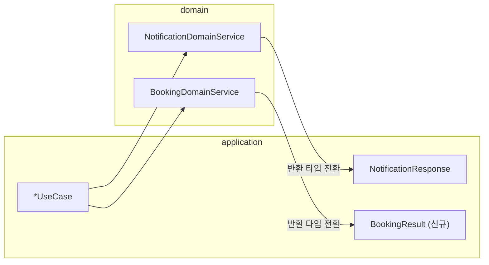

# [BE-15] OSIV 방지 — notification/booking DomainService Entity 반환 → DTO 전환

## 작업 내용 (설계 의도)

### 변경 사항

OSIV(Open Session In View)가 비활성화된 환경에서 `@Transactional` 메서드가 Entity를 반환하면
트랜잭션 종료 후 UseCase에서 lazy 필드에 접근할 때 `LazyInitializationException`이 발생한다.

`NotificationDomainService`의 `send`, `markRead`, `sendWithTemplate` 메서드와
`BookingDomainService`의 `requestBooking` 메서드가 Entity를 그대로 반환한다.
트랜잭션 경계 내에서 DTO(Result 객체)로 변환하여 반환하도록 수정한다.

`NotificationDomainService.send/markRead/sendWithTemplate`:
- 반환 타입을 `Notification` → `NotificationResponse`(기존 application 레이어 DTO)로 전환
- 트랜잭션 안에서 `NotificationResponse.of(notification)` 호출

`BookingDomainService.requestBooking`:
- `requestBooking`은 `CreateBookingUseCase`가 호출하며 반환값은 `CreateBookingResult.of(booking, paymentId)` 매핑에 쓰인다
- `Booking` 대신 `BookingResult`(신규 소형 Result 객체) 반환으로 전환
- `CreateBookingUseCase`는 `bookingDomainService.requestBooking` 결과를 `CreateBookingResult.of()` 없이 직접 사용하도록 호출부 갱신

비범위:
- `BookingDomainService`의 `confirmBooking`, `cancel`, `refundBooking` 등 다른 메서드 수정 없음
- `NotificationDomainService.enqueueOrSkip`, `listMyNotifications`, `countUnread` 수정 없음
- BE-06b와 파일이 겹칠 경우: `BookingDomainService.requestBooking` 반환 타입 변경만 수행하고 BE-06b 범위(비동기 전환)와 충돌되는 부분은 Open Question으로 남긴다

---

## 다이어그램

### 처리 흐름

### 클래스 의존

---

## 테스트 케이스

### 단위 테스트 (Unit)

| ID | 대상 | 케이스 |
|---|---|---|
| U-01 | `NotificationDomainService#send` | 정상 발송 시 `NotificationResponse`를 반환하고 `status`가 `SENT`이다 |
| U-02 | `NotificationDomainService#send` | gateway 실패 시 `NotificationResponse`를 반환하고 `status`가 `FAILED`이다 |
| U-03 | `NotificationDomainService#markRead` | 소유자 userId와 일치하면 `NotificationResponse`를 반환하고 `readAt`이 null이 아니다 |
| U-04 | `NotificationDomainService#markRead` | 소유자가 아닌 userId 입력 시 `NotificationNotOwnedException`이 발생한다 |
| U-05 | `NotificationDomainService#sendWithTemplate` | 템플릿 렌더 결과가 payload에 포함된 `NotificationResponse`를 반환한다 |
| U-06 | `BookingDomainService#requestBooking` | 슬롯이 가득 차지 않았을 때 `BookingResult`를 반환하고 `status`가 `PENDING`이다 |
| U-07 | `BookingDomainService#requestBooking` | 슬롯 용량 초과 시 `SlotFullException`이 발생한다 |

### 레포지토리 테스트 (Repository / Persistence)

| ID | 대상 | 케이스 |
|---|---|---|
| R-01 | `NotificationRepositoryImpl` | `save` 후 `findById` 시 Entity 필드(channel, status, payload JSON)가 정확히 복원된다 |
| R-02 | `NotificationRepositoryImpl` | 동일 `eventId`로 두 번 insert 시 unique 제약 위반이 발생한다 |

### 시나리오 테스트 (Scenario / Integration)

| ID | 시나리오 | 케이스 |
|---|---|---|
| S-01 | 알림 발송 트랜잭션 종료 후 DTO 접근 | `NotificationApiScenarioTest` — `POST /notifications/send` 후 응답 body의 `status`, `sentAt` 필드가 `LazyInitializationException` 없이 반환된다 |
| S-02 | 예약 생성 트랜잭션 종료 후 DTO 접근 | `CreateBookingUseCase.execute` 완료 후 `CreateBookingResult`의 `bookingId`, `status` 필드에 OSIV 없이 접근 가능하다 |
| S-03 | markRead 멱등성 | 이미 읽은 알림에 `markRead`를 두 번 호출해도 `readAt`이 첫 번째 시각으로 유지된다 |
