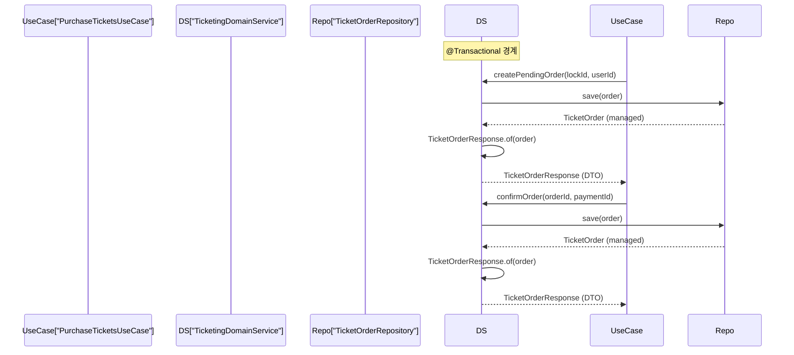
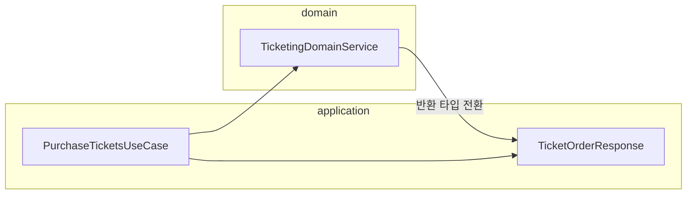

# [BE-16] OSIV 방지 — ticketing createPendingOrder/confirmOrder 반환 DTO화

**blocked by: BE-05**

## 작업 내용 (설계 의도)

### 변경 사항

`TicketingDomainService.createPendingOrder`와 `confirmOrder`는 `@Transactional` 메서드이며
현재 `TicketOrder` Entity를 그대로 반환한다.
OSIV 비활성 환경에서 `PurchaseTicketsUseCase`가 트랜잭션 종료 후 `ticketOrder.id`, `ticketOrder.status`에
접근하면 `LazyInitializationException`이 발생할 수 있다.

BE-05가 `createPendingOrder`/`confirmOrder`를 비동기 처리로 전환하므로 그 위에서 반환 타입을 정리한다.
이미 `TicketOrderResponse`(application 레이어) DTO가 존재하므로 `of(ticketOrder)` 변환을 트랜잭션 내부에서 수행한다.

구현 범위:
- `TicketingDomainService.createPendingOrder` 반환 타입 `TicketOrder` → `TicketOrderResponse`
- `TicketingDomainService.confirmOrder` 반환 타입 `TicketOrder` → `TicketOrderResponse`
- `PurchaseTicketsUseCase` 호출부 반환값 타입 갱신
- `PurchaseTicketsUseCase.processPaymentResult` 내 `ticketOrder` 참조를 DTO 필드 접근으로 교체

비범위:
- `cancelOrder` 수정 없음 (반환값 없음)
- `TicketOrderResponse` 필드 추가/변경 없음
- BE-05 범위(비동기 전환) 수정 없음 — 해당 티켓 완료 후 이 티켓 착수

---

## 다이어그램

### 처리 흐름

### 클래스 의존

---

## 테스트 케이스

### 단위 테스트 (Unit)

| ID | 대상 | 케이스 |
|---|---|---|
| U-01 | `TicketingDomainService#createPendingOrder` | 유효한 lockId와 userId 입력 시 `TicketOrderResponse`를 반환하고 `status`가 `PENDING`이다 |
| U-02 | `TicketingDomainService#createPendingOrder` | 잘못된 lockId 포맷 입력 시 `MalformedLockIdException`이 발생한다 |
| U-03 | `TicketingDomainService#confirmOrder` | 존재하는 orderId와 paymentId 입력 시 `TicketOrderResponse`를 반환하고 `status`가 `CONFIRMED`이다 |
| U-04 | `TicketingDomainService#confirmOrder` | 존재하지 않는 orderId 입력 시 `ResourceNotFoundException`이 발생한다 |
| U-05 | `PurchaseTicketsUseCase#execute` | 결제 완료 시 `confirmOrder`가 호출되고 최종 `TicketOrderResponse`의 status가 `CONFIRMED`이다 |
| U-06 | `PurchaseTicketsUseCase#execute` | 결제 실패 시 `cancelOrder`가 호출되고 반환된 TicketOrderResponse의 status가 `CANCELLED`이다 |

### 레포지토리 테스트 (Repository / Persistence)

| ID | 대상 | 케이스 |
|---|---|---|
| R-01 | `TicketOrderRepositoryImpl` | `save` 후 `findById` 시 `lockedSeatIds`(JSON 컬럼), `status`, `lockedEventId`가 정확히 복원된다 |
| R-02 | `TicketOrderRepositoryImpl` | `PENDING` 상태로 저장된 order를 `CONFIRMED`로 상태 변경 후 저장하면 `findById`에서 `CONFIRMED`가 조회된다 |

### 시나리오 테스트 (Scenario / Integration)

| ID | 시나리오 | 케이스 |
|---|---|---|
| S-01 | 티켓 구매 전체 플로우 | `TicketOrderPurchaseScenarioTest` — 좌석 잠금 → createPendingOrder → confirmOrder 흐름이 OSIV 없이 `TicketOrderResponse` 필드 접근에 성공한다 |
| S-02 | 결제 실패 보상 | 결제 실패 시 cancelOrder 호출 후 해당 order의 DB 상태가 `CANCELLED`이다 |
| S-03 | 동시 주문 차단 | 동일 좌석에 대해 두 사용자가 동시에 `createPendingOrder`를 호출하면 한 명만 성공하고 나머지는 적절한 예외를 받는다 |
