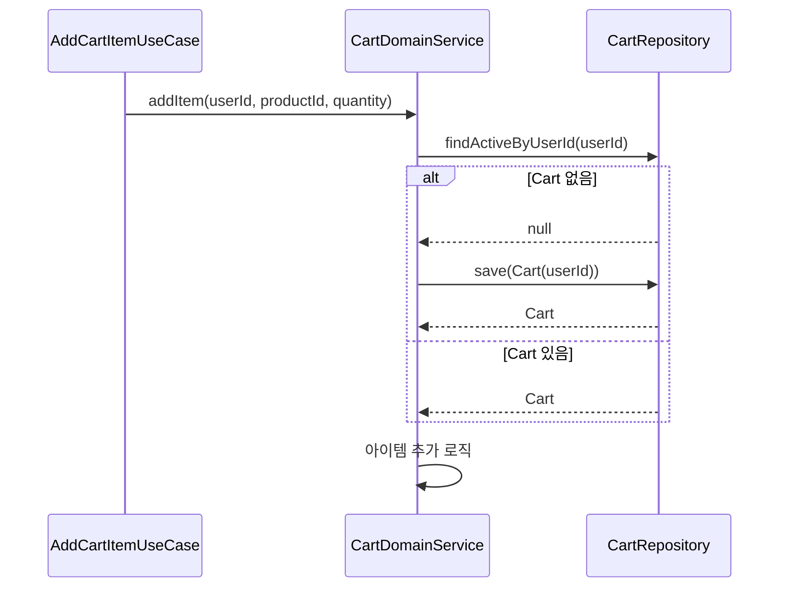
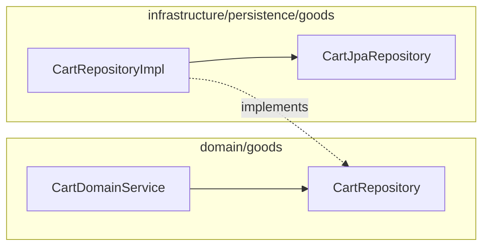

# [BE-17] CartRepositoryImpl 잔존 비즈니스 로직 → CartDomainService 이동

## 작업 내용 (설계 의도)

### 변경 사항

현재 `CartRepositoryImpl`의 구현을 살펴보면 `save(cart)`와 `findByUserId`(내부적으로 `findByUserIdAndDeletedAtIsNull`) 2개의 raw 조회만 존재한다. 실제 비즈니스 로직(중복 카트 해소, `.softDelete()` 호출, activeMarker 관리)은 이미 `CartDomainService`에 위치해 있다.

다만 티켓 설명에서 언급된 "RepositoryImpl 순수성 위반"은 현재 코드베이스에서 `CartRepositoryImpl` 자체에는 비즈니스 로직이 없는 상태이나, `CartDomainService.getOrCreateCart`가 Repository를 통해 Cart를 직접 생성·저장하는 구조가 UseCase가 Repository를 직접 참조하는 것처럼 보일 수 있다. 실제 위반은 `CartRepository.findByUserId`가 도메인 인터페이스에 `deletedAt IS NULL` 필터 조건을 암묵적으로 내포하고 있어 인터페이스 시그니처와 구현 의미가 불일치하는 부분이다.

이 티켓에서는 다음을 수행한다.
1. `CartRepository` 인터페이스의 `findByUserId`를 `findActiveByUserId`로 명칭 변경하여 soft-delete 필터가 적용됨을 시그니처에서 명시
2. `CartRepositoryImpl`은 `findActiveByUserId`를 `findByUserIdAndDeletedAtIsNull` 위임으로 구현
3. `CartDomainService` 내 호출부 `cartRepository.findByUserId` → `cartRepository.findActiveByUserId`로 일괄 갱신
4. 현재 `CartDomainService`에 존재하는 `addItem`, `updateItem`, `removeItem`, `clearCart`의 로직은 이미 DomainService에 있으므로 추가 이동 불필요 (현황 재확인 후 불필요 중복 없음 확인)

#### 변경 범위

- `domain/goods/CartRepository.kt` — `findByUserId` → `findActiveByUserId` 리네임
- `infrastructure/persistence/goods/CartRepositoryImpl.kt` — 메서드 리네임 대응
- `domain/goods/CartDomainService.kt` — `cartRepository.findByUserId` 3곳 호출부 리네임

#### 비범위 (out of scope)

- CartItem 관련 Repository 변경
- Cart 도메인 모델 구조 변경
- Cart soft-delete(탈퇴 등) 로직 추가

## 다이어그램

### 처리 흐름

### 클래스 의존

## 테스트 케이스

### 단위 테스트 (Unit)

| ID | 대상 | 케이스 |
|---|---|---|
| U-01 | `CartDomainService.getOrCreateCart` | findActiveByUserId가 null 반환 시 새 Cart를 save하고 반환한다 |
| U-02 | `CartDomainService.getOrCreateCart` | findActiveByUserId가 기존 Cart 반환 시 save를 호출하지 않는다 |
| U-03 | `CartDomainService.addItem` | findActiveByUserId 변경 후에도 기존 addItem 로직이 동일하게 동작한다 |

### 레포지토리 테스트 (Repository / Persistence)

| ID | 대상 | 케이스 |
|---|---|---|
| R-01 | `CartRepositoryImpl` | findActiveByUserId는 deletedAt IS NULL인 Cart만 반환한다 |
| R-02 | `CartRepositoryImpl` | soft-delete된 Cart가 있고 활성 Cart가 없으면 findActiveByUserId는 null을 반환한다 |
| R-03 | `CartRepositoryImpl` | save 후 findActiveByUserId로 동일 userId 조회 시 저장된 Cart가 반환된다 |

### 시나리오 테스트 (Scenario / Integration)

| ID | 시나리오 | 케이스 |
|---|---|---|
| S-01 | getOrCreateCart — 신규 유저 | Cart가 없는 userId로 getOrCreateCart 호출 시 새 Cart가 생성되고 findActiveByUserId로 조회된다 |
| S-02 | getOrCreateCart — 기존 유저 | 이미 Cart가 있는 userId로 getOrCreateCart 호출 시 기존 Cart가 반환되고 중복 생성되지 않는다 |
| S-03 | soft-delete Cart 격리 | soft-delete된 Cart를 보유한 userId로 getOrCreateCart 호출 시 삭제된 Cart를 반환하지 않고 새 Cart를 생성한다 |
