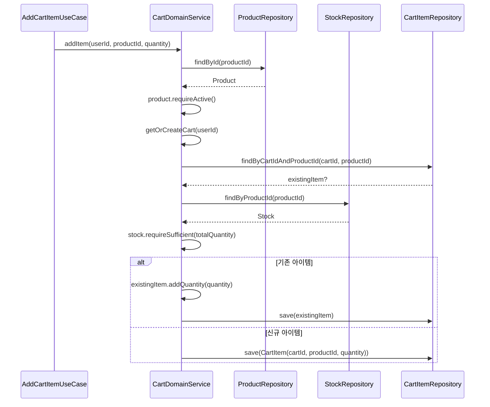
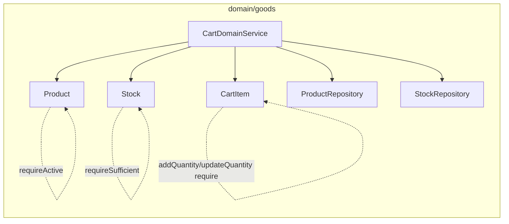

# [BE-18] CartDomainService self-validation helper → Entity 위임

## 작업 내용 (설계 의도)

### 변경 사항

`CartDomainService`(line 75-89)에는 3개의 private helper 메서드가 있다.

- `requirePositiveQuantity(quantity: Int)` — quantity ≤ 0 시 `InvalidQuantityException` 발생
- `validateProductActive(productId: Long)` — Repository 조회 후 `status != ACTIVE` 시 `ProductInactiveException` 발생
- `validateStockSufficient(productId: Long, requiredQuantity: Int)` — Repository 조회 후 재고 부족 시 `OutOfStockException` 발생

`Product.requireActive()`와 `Stock.requireSufficient(required: Int)`는 이미 Entity에 존재한다(`Product.kt:57`, `Stock.kt:35`). `InvalidQuantityException`은 `CartItem.addQuantity`와 `updateQuantity` 내부의 `require(amount > 0)` 가드로 흡수 가능하다.

`validateProductActive`는 `productRepository.findById` 조회를 포함하므로 Repository 의존이 있다. 이 조회는 DomainService에서 Product를 로드한 후 `product.requireActive()`를 호출하는 방식으로 전환한다. `validateStockSufficient` 역시 `stockRepository.findByProductId` 조회 후 `stock.requireSufficient(required)`를 호출하는 방식으로 전환한다.

결과적으로 DomainService는 "조회 → Entity 메서드 호출"의 흐름을 유지하고, 검증 규칙 자체는 Entity 내부에 캡슐화된다. 이는 `be-code-convention.md`의 "Self-Validation 캡슐화" 절을 준수한다.

#### 변경 범위

- `domain/goods/CartDomainService.kt`
  - `requirePositiveQuantity` 제거 — `addItem`, `updateItem` 호출부에서 `CartItem.addQuantity`/`updateQuantity` 내부 `require`로 대체
  - `validateProductActive` 제거 — `addItem` 내 `productRepository.findById` + `product.requireActive()` 인라인 호출로 대체
  - `validateStockSufficient` 제거 — `addItem`, `updateItem` 내 `stockRepository.findByProductId` + `stock.requireSufficient(required)` 인라인 호출로 대체

#### 비범위 (out of scope)

- `Product`, `Stock`, `CartItem` Entity 메서드 신규 추가 (이미 존재)
- Repository 인터페이스 변경
- `addItem`, `updateItem` 외의 메서드 구조 변경

## 다이어그램

### 처리 흐름

### 클래스 의존

## 테스트 케이스

### 단위 테스트 (Unit)

| ID | 대상 | 케이스 |
|---|---|---|
| U-01 | `Product.requireActive` | status가 INACTIVE인 Product는 requireActive() 호출 시 ProductInactiveException을 던진다 |
| U-02 | `Product.requireActive` | status가 ACTIVE인 Product는 requireActive() 호출 시 예외를 던지지 않는다 |
| U-03 | `Stock.requireSufficient` | quantity가 required보다 작으면 OutOfStockException을 던진다 |
| U-04 | `Stock.requireSufficient` | quantity가 required 이상이면 예외를 던지지 않는다 |
| U-05 | `CartItem.addQuantity` | amount가 0 이하면 IllegalArgumentException을 던진다 |
| U-06 | `CartItem.updateQuantity` | newQuantity가 0 이하면 IllegalArgumentException을 던진다 |
| U-07 | `CartDomainService.addItem` | INACTIVE Product에 addItem 호출 시 ProductInactiveException이 발생한다 |
| U-08 | `CartDomainService.addItem` | 재고보다 많은 quantity로 addItem 호출 시 OutOfStockException이 발생한다 |

### 레포지토리 테스트 (Repository / Persistence)

| ID | 대상 | 케이스 |
|---|---|---|
| R-01 | `CartItemRepository` | CartItem.addQuantity 후 save된 아이템은 quantity가 합산값으로 저장된다 |
| R-02 | `CartItemRepository` | CartItem.updateQuantity 후 save된 아이템은 newQuantity로 저장된다 |

### 시나리오 테스트 (Scenario / Integration)

| ID | 시나리오 | 케이스 |
|---|---|---|
| S-01 | addItem — INACTIVE 상품 | INACTIVE Product에 addItem 요청 시 ProductInactiveException이 발생하고 CartItem은 생성되지 않는다 |
| S-02 | addItem — 재고 부족 | 재고가 5인 상품에 quantity=6으로 addItem 요청 시 OutOfStockException이 발생하고 CartItem은 생성되지 않는다 |
| S-03 | addItem — 정상 경로 | ACTIVE Product, 충분한 재고 조건에서 addItem 요청 시 CartItem이 생성되고 quantity가 정상 저장된다 |
| S-04 | updateItem — 재고 부족 | 재고를 초과하는 newQuantity로 updateItem 요청 시 OutOfStockException이 발생하고 기존 quantity가 유지된다 |
