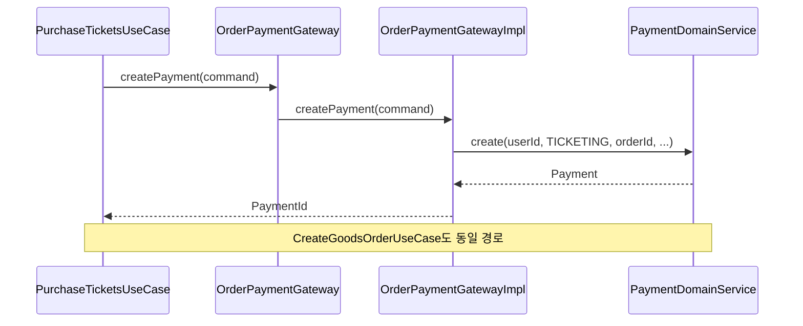
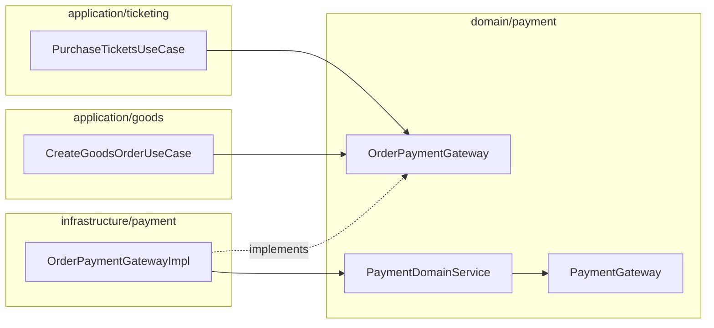

# [BE-19] payment 결합 ACL 통일

## 작업 내용 (설계 의도)

### 변경 사항

현재 `PurchaseTicketsUseCase`(ticketing)와 `CreateGoodsOrderUseCase`(goods)는 `PaymentDomainService`를 직접 주입해서 호출한다. 반면 booking 도메인의 환불은 `PaymentRefundGateway` ACL을 통해 외부 PG를 호출한다. 결제 생성은 직접 호출, 환불만 Gateway 경유라는 비대칭 구조는 다음 문제를 야기한다.

- ticketing/goods UseCase가 payment 도메인 내부 구현(`PaymentDomainService`)에 직접 의존해 도메인 경계를 침범한다
- payment 도메인의 변경이 ticketing/goods application 레이어로 직접 전파된다
- 결제 생성 mock 전환을 payment 도메인 서비스 모킹으로만 할 수 있어 테스트 격리가 어렵다

이 티켓은 결제 생성(`paymentDomainService.create`) 호출을 `PaymentGateway` ACL로 경유하도록 전환해 비대칭을 해소한다. `PaymentGateway`는 이미 `domain/payment/PaymentGateway.kt`에 인터페이스가 정의되어 있으나 PG 연동용(`prepare`)으로만 사용 중이다. 이 인터페이스를 확장하거나 별도 `OrderPaymentGateway`를 추가해 "주문 결제 생성" 행위를 추상화하고, ticketing/goods는 이 Gateway만 바라보도록 한다.

- BE-02(OrderConfirmationGateway ACL), BE-04(goods async 전환), BE-05(ticketing async 전환) 완료 후 착수 가능
- `infrastructure/payment/` 아래 `OrderPaymentGatewayImpl.kt` 신규 작성
- `PurchaseTicketsUseCase`와 `CreateGoodsOrderUseCase`의 `PaymentDomainService` 직접 주입 제거
- 환불 경로(`PaymentRefundGateway`)는 변경 없이 유지

**구현 범위**
- `domain/payment/OrderPaymentGateway.kt` 인터페이스 신규 정의 (`createPayment(command): PaymentId`)
- `infrastructure/payment/OrderPaymentGatewayImpl.kt` 신규 작성 (`PaymentDomainService` 위임)
- `PurchaseTicketsUseCase`: `paymentDomainService` 주입을 `orderPaymentGateway` 주입으로 교체
- `CreateGoodsOrderUseCase`: 동일하게 `orderPaymentGateway` 주입으로 교체
- `PaymentGateway` (PG 연동 인터페이스)는 변경 없음

**비범위 (out of scope)**
- `ConfirmPaymentWebhookUseCase` — webhook 처리는 payment 도메인 내부이므로 직접 호출 유지
- `PaymentRefundGateway` 구현체 변경 없음
- booking `CreateBookingUseCase`의 `PaymentDomainService` 직접 호출 — booking 도메인 경계 안이므로 별도 판단
- 실 PG 연동 구현체 추가 (`StubPaymentRefundGateway` 유지 정책과 동일)

## 다이어그램

### 처리 흐름

### 클래스 의존

## 테스트 케이스

### 단위 테스트 (Unit)

| ID | 대상 | 케이스 (한 문장) |
|---|---|---|
| U-01 | `PurchaseTicketsUseCase` | `PaymentDomainService`를 직접 주입받지 않고 `OrderPaymentGateway`만 주입받는다 |
| U-02 | `CreateGoodsOrderUseCase` | `PaymentDomainService`를 직접 주입받지 않고 `OrderPaymentGateway`만 주입받는다 |
| U-03 | `OrderPaymentGatewayImpl` | `createPayment()` 호출 시 `PaymentDomainService.create()`에 정확한 파라미터(userId, orderType, orderId, amount)를 전달한다 |
| U-04 | `PurchaseTicketsUseCase` | `orderPaymentGateway.createPayment()` 호출이 1회 이루어지고 반환된 paymentId가 응답에 포함된다 |
| U-05 | `CreateGoodsOrderUseCase` | `orderPaymentGateway.createPayment()` 호출이 1회 이루어지고 반환된 paymentId가 응답에 포함된다 |

### 레포지토리 테스트 (Repository / Persistence)

| ID | 대상 | 케이스 (한 문장) |
|---|---|---|
| R-01 | `PaymentRepository` | `OrderPaymentGatewayImpl.createPayment()` 실행 후 Payment가 DB에 저장되고 idempotencyKey로 조회된다 |
| R-02 | `PaymentRepository` | 동일 idempotencyKey로 2회 `createPayment()` 호출 시 unique 제약 위반이 발생한다 |

### 시나리오 테스트 (Scenario / Integration)

| ID | 시나리오 | 케이스 (한 문장) |
|---|---|---|
| S-01 | ticketing 주문 결제 ACL 경유 | `PurchaseTicketsUseCase` 실행 시 `PaymentDomainService`를 직접 호출하지 않고 `OrderPaymentGateway`를 통해 Payment가 생성된다 |
| S-02 | goods 주문 결제 ACL 경유 | `CreateGoodsOrderUseCase` 실행 시 `PaymentDomainService`를 직접 호출하지 않고 `OrderPaymentGateway`를 통해 Payment가 생성된다 |
| S-03 | 멱등성 유지 | 동일 idempotencyKey로 2회 호출 시 `OrderPaymentGatewayImpl`이 기존 Payment를 반환하고 중복 저장하지 않는다 |
| S-04 | 환불 경로 미영향 | `refundBooking()` 실행 시 `PaymentRefundGateway`가 그대로 사용되고 `OrderPaymentGateway`는 호출되지 않는다 |
| S-05 | 아키텍처 규칙 | `PurchaseTicketsUseCase`·`CreateGoodsOrderUseCase`에서 `PaymentDomainService` import가 존재하지 않는다 (ArchUnit 또는 grep 검증) |
