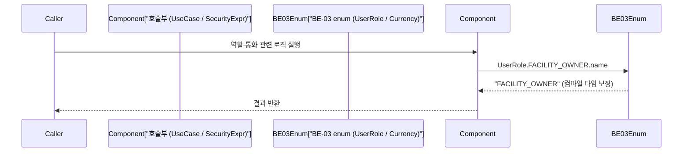
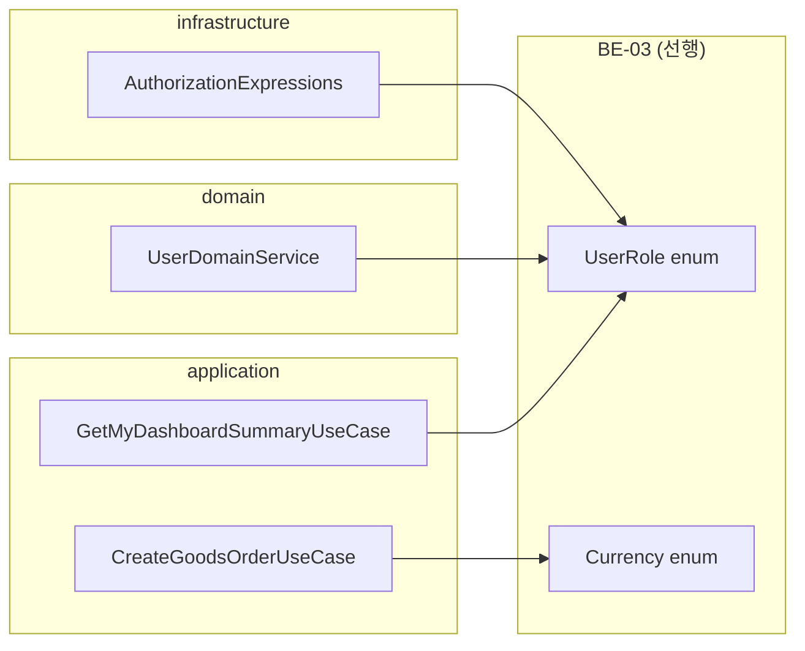

# [BE-20] 매직 문자열 enum 적용 — 호출부 갱신

**blocked by: BE-03**

## 작업 내용 (설계 의도)

### 변경 사항

현재 security(`AuthorizationExpressions`), application(`GetMyDashboardSummaryUseCase`),
domain(`UserDomainService`) 전반에 `"FACILITY_OWNER"`, `"GOODS_SELLER"`, `"EVENT_HOST"`, `"ADMIN"`,
`"USER"` 등 역할 이름이 문자열 리터럴로 하드코딩되어 있다.
`application/goods/CreateGoodsOrderUseCase`에는 `"KRW"` 통화 문자열도 직접 삽입되어 있다.

BE-03에서 정의한 `UserRole`(역할 enum), `Currency`(통화 enum)를 각 사용처에 적용하여
문자열 비교를 enum 비교로 교체한다. 오타·대소문자 실수로 인한 런타임 오류를 컴파일 타임에 차단한다.

구현 범위:
- `AuthorizationExpressions.isFacilityOwner` — `"FACILITY_OWNER"` → `UserRole.FACILITY_OWNER.name`
- `GetMyDashboardSummaryUseCase.execute` — `"FACILITY_OWNER"`, `"EVENT_HOST"`, `"GOODS_SELLER"` 3곳
- `UserDomainService.register` — `"USER"` 기본 역할 조회
- `UserDomainService.revokeRole` — `"ADMIN"` 비교
- `CreateGoodsOrderUseCase` — `"KRW"` → `Currency.KRW`
- BE-03 enum이 제공하는 `.name`(String 변환) 또는 `.value` 방식에 따라 호출부 갱신

**결정 (OQ-6 확정)**: Spring Security `@PreAuthorize`/`hasRole("ADMIN")` 등 **SpEL 표현식 문자열은 그대로 유지**한다 (어노테이션 SpEL 안에서 Kotlin enum 치환은 부자연). enum화는 **프로그래밍 비교(UserDomainService 등 `if (role == "ADMIN")` 류)에만** 적용한다. `PgEventType`는 BE-03이 정의하므로 webhook eventType 비교에 적용한다.

비범위:
- BE-03에서 정의하지 않은 enum 항목 추가 없음
- Spring Security SpEL 표현식 문자열(`hasRole(...)`) — 유지 (OQ-6 확정)

---

## 다이어그램

### 처리 흐름

### 클래스 의존

---

## 테스트 케이스

### 단위 테스트 (Unit)

| ID | 대상 | 케이스 |
|---|---|---|
| U-01 | `AuthorizationExpressions#isFacilityOwner` | `UserRole.FACILITY_OWNER` enum으로 역할 비교 시 일치하는 principal은 true를 반환한다 |
| U-02 | `AuthorizationExpressions#isFacilityOwner` | 다른 역할을 가진 principal은 false를 반환한다 |
| U-03 | `GetMyDashboardSummaryUseCase#execute` | `FACILITY_OWNER` 역할 보유 시 `facilities` 섹션이 non-null로 반환된다 |
| U-04 | `GetMyDashboardSummaryUseCase#execute` | `EVENT_HOST` 역할 미보유 시 `events` 섹션이 null로 반환된다 |
| U-05 | `UserDomainService#register` | 신규 가입 시 `UserRole.USER` enum 기반 기본 역할이 부여된다 |
| U-06 | `UserDomainService#revokeRole` | `UserRole.ADMIN` 역할 자기 자신 철회 시 `SelfRevocationException`이 발생한다 |

### 레포지토리 테스트 (Repository / Persistence)

| ID | 대상 | 케이스 |
|---|---|---|
| R-01 | `UserRoleRepositoryImpl` | `UserRole.FACILITY_OWNER` enum value로 역할을 조회하면 DB 저장값과 일치하는 레코드가 반환된다 |
| R-02 | `UserCustomRepositoryImpl` | `roleName` 파라미터에 enum `.name` 값을 전달하면 해당 역할 사용자 목록이 페이징 조회된다 |

### 시나리오 테스트 (Scenario / Integration)

| ID | 시나리오 | 케이스 |
|---|---|---|
| S-01 | 역할 기반 대시보드 분기 | `FACILITY_OWNER` 역할을 가진 사용자로 대시보드 요청 시 `facilities` 섹션이 포함된 응답이 반환된다 |
| S-02 | 통화 enum 적용 주문 생성 | `CreateGoodsOrderUseCase` 실행 시 `Currency.KRW` enum이 결제 생성에 전달되고 DB에 `"KRW"`로 저장된다 |
| S-03 | 문자열 오타 제거 검증 | 존재하지 않는 역할명으로 `assignRole` 호출 시 enum 미매핑으로 `ResourceNotFoundException`이 발생한다 |
