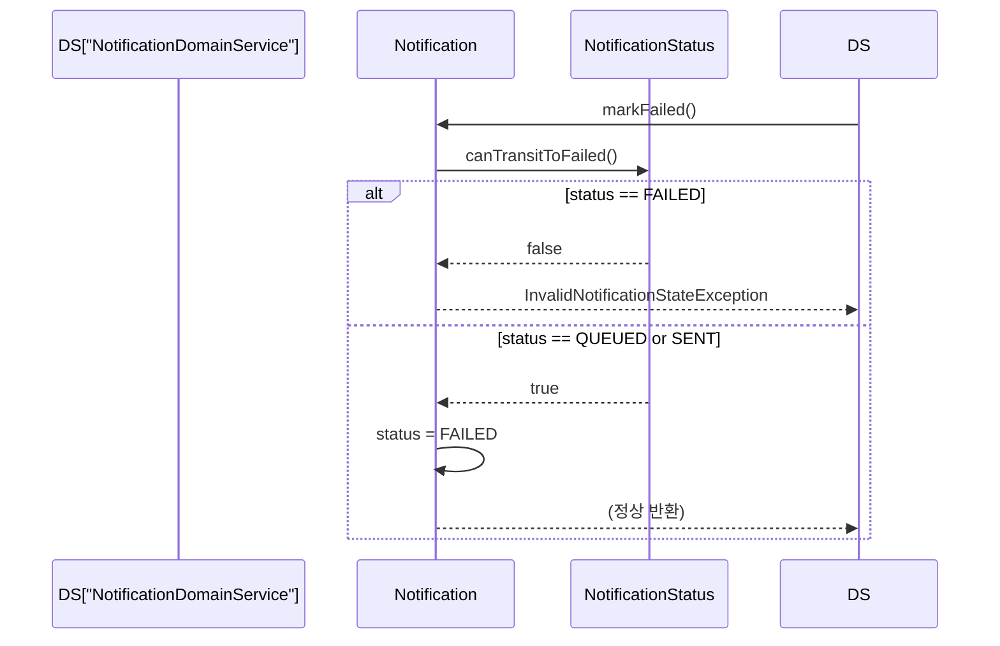
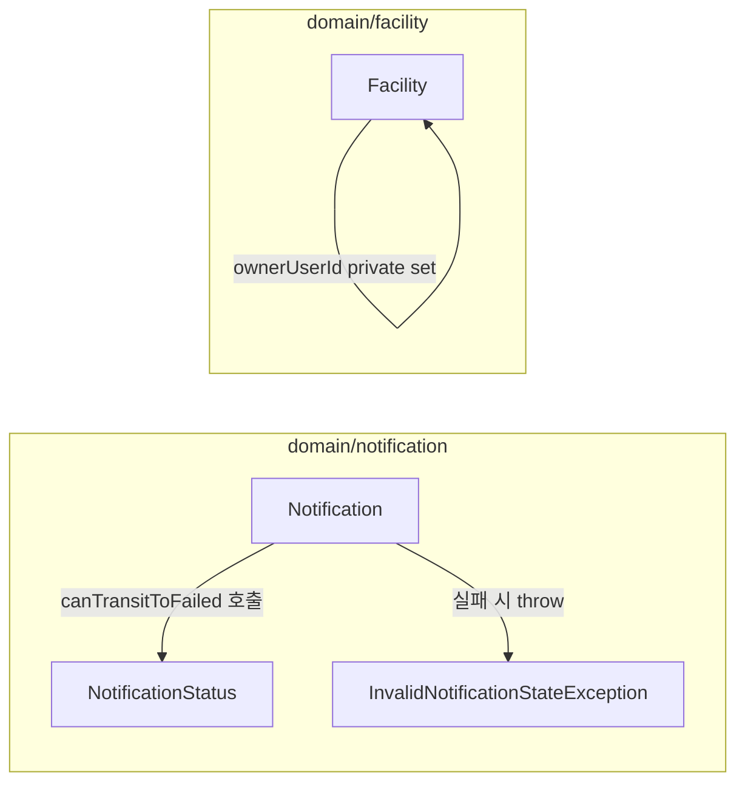

# [BE-21] 상태전이 가드 + 캡슐화 — Notification.markFailed / Facility.ownerUserId

## 작업 내용 (설계 의도)

### 변경 사항

**Notification.markFailed (상태전이 가드 누락)**

`Notification.markSent`는 `status.canTransitToSent()`로 QUEUED 외 상태에서의 전이를 차단하지만
`markFailed`는 현재 상태 검증 없이 `status = NotificationStatus.FAILED`를 직접 대입한다.
SENT 상태의 알림이 `markFailed`를 호출받으면 무결성 없이 FAILED로 덮어쓰인다.

`NotificationStatus`에 `canTransitToFailed()` 로직을 추가하고 `Notification.markFailed`에서 이를 호출한다.
이미 SENT된 알림은 FAILED 전이를 차단하고 `InvalidNotificationStateException`을 던진다.

**Facility.ownerUserId (캡슐화 누락)**

`Facility.ownerUserId`가 `var`로 선언되어 `assignOwner` 진입점을 우회한 직접 대입이 가능하다.
`assignOwner`에서 중복 소유자 체크(`check(ownerUserId == null)`)를 수행하고 있으나
필드가 public `var`이므로 강제력이 없다.
`ownerUserId`를 `private set`으로 제한하여 `assignOwner` 경유를 강제한다.

구현 범위:
- `NotificationStatus.canTransitToFailed()` 추가 (`QUEUED`, `SENT` → FAILED 허용 / 이미 `FAILED` → 차단)
- `Notification.markFailed`에서 `canTransitToFailed()` 호출 및 실패 시 `InvalidNotificationStateException` 발생
- `Facility.ownerUserId` 선언을 `var ownerUserId: Long? = null` → `var ownerUserId: Long? = null` + `private set`으로 변경

비범위:
- `NotificationDomainService.markFailedAndSave` 로직 변경 없음
- `Facility.assignOwner` 내부 로직 변경 없음
- `Facility.updateMeta` 내 ownerUserId 복사 로직 수정 없음 (생성자 호출이므로 private set 영향 없음)

---

## 다이어그램

### 처리 흐름

### 클래스 의존

---

## 테스트 케이스

### 단위 테스트 (Unit)

| ID | 대상 | 케이스 |
|---|---|---|
| U-01 | `Notification#markFailed` | `QUEUED` 상태의 Notification에 `markFailed` 호출 시 status가 `FAILED`로 전이된다 |
| U-02 | `Notification#markFailed` | `SENT` 상태의 Notification에 `markFailed` 호출 시 `InvalidNotificationStateException`이 발생한다 |
| U-03 | `Notification#markFailed` | 이미 `FAILED` 상태의 Notification에 `markFailed` 호출 시 `InvalidNotificationStateException`이 발생한다 |
| U-04 | `NotificationStatus#canTransitToFailed` | `QUEUED` → `canTransitToFailed` 반환값이 true이다 |
| U-05 | `NotificationStatus#canTransitToFailed` | `SENT` → `canTransitToFailed` 반환값이 true이다 |
| U-06 | `NotificationStatus#canTransitToFailed` | `FAILED` → `canTransitToFailed` 반환값이 false이다 |
| U-07 | `Facility#assignOwner` | ownerUserId가 null인 Facility에 `assignOwner` 호출 시 ownerUserId가 설정된다 |
| U-08 | `Facility#assignOwner` | ownerUserId가 이미 설정된 Facility에 `assignOwner` 호출 시 `IllegalStateException`이 발생한다 |
| U-09 | `Facility` | 외부 코드에서 `facility.ownerUserId = someId` 직접 대입이 컴파일 오류로 차단된다 (private set 검증) |

### 레포지토리 테스트 (Repository / Persistence)

| ID | 대상 | 케이스 |
|---|---|---|
| R-01 | `NotificationRepositoryImpl` | `QUEUED` → `FAILED` 전이 후 save 시 DB에 `FAILED` status가 저장되고 조회된다 |
| R-02 | `FacilityRepositoryImpl` | `assignOwner` 후 save된 Facility를 findById로 조회하면 `ownerUserId`가 설정된 값으로 복원된다 |

### 시나리오 테스트 (Scenario / Integration)

| ID | 시나리오 | 케이스 |
|---|---|---|
| S-01 | SENT 알림 이중 실패 처리 차단 | gateway가 두 번 실패 응답을 반환해도 `markFailed` 두 번째 호출에서 `InvalidNotificationStateException`이 발생하고 DB 상태가 `FAILED` 단일 기록으로 유지된다 |
| S-02 | 시설 소유자 중복 할당 차단 | `assignOwner` API를 동일 시설에 두 번 호출하면 두 번째 호출이 400/500 에러를 반환하고 DB ownerUserId는 첫 번째 값으로 유지된다 |
