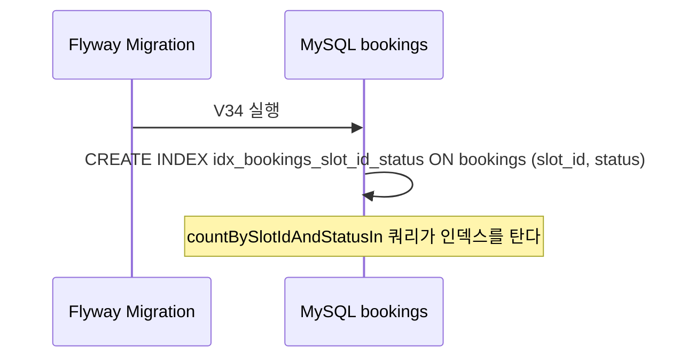
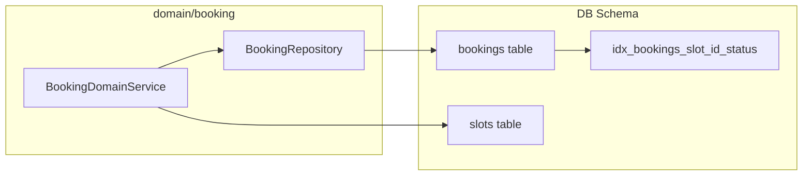

# [DB-01] bookings 활성예약 capacity DB 방어선 마이그레이션

## 작업 내용 (설계 의도)

### 변경 사항

현재 `V3__create_bookings.sql`에는 `bookings` 테이블에 capacity 관련 제약이 전혀 없다(결함#2 스키마). `BookingDomainService.doBooking`이 `countBySlotIdAndStatusIn(PENDING, CONFIRMED) >= slot.capacity` 조건을 애플리케이션 레벨에서 검사하지만, DB 레벨 방어선이 없으면 동시 요청이 분산 락 외부에서 유입될 때 초과 예약이 삽입될 수 있다.

**결정 (OQ-1 확정)**: `slots.capacity`는 `Int > 0`으로 N>1이 가능하므로 (부분) unique 인덱스로는 capacity 제약을 표현할 수 없다. **동시성 최종 방어선은 BE-06b의 slot row 비관락(`@Lock(PESSIMISTIC_WRITE)` + `SELECT ... FOR UPDATE`)**으로 처리한다. 본 마이그레이션은 그 비관락 count 쿼리를 받쳐줄 인덱스만 추가한다.

1. `bookings` 테이블에 `(slot_id, status)` 복합 인덱스를 추가해 `countBySlotIdAndStatusIn` 쿼리가 인덱스를 타도록 보장한다.
2. slot row 비관락은 `slots` PK(`id`)로 `SELECT ... FOR UPDATE` 하므로 기존 PK 인덱스로 충분 — 추가 불필요.
3. **부분 unique 인덱스는 적용하지 않는다** (capacity>1 가능, 도메인 의미와 불일치).

Flyway 파일명: `V34__add_bookings_slot_capacity_index.sql`

의존: 없음(독립 시작 가능). 애플리케이션 레이어(`BookingDomainService`)는 이미 capacity 검사를 하고 있으므로 이 마이그레이션은 인덱스 추가만으로 즉시 효과가 있다.

### 비범위 (out of scope)

- BookingDomainService 비관락 적용 — BE-06b 담당 (본 티켓은 인덱스만)
- 부분 unique 인덱스 — 미적용 확정 (capacity>1 가능)

<details>
<summary>DDL 참고</summary>

```sql
-- V34__add_bookings_slot_capacity_index.sql

-- 활성 예약 카운트 쿼리 인덱스 보강
-- countBySlotIdAndStatusIn(slotId, [PENDING, CONFIRMED]) 쿼리 커버링
CREATE INDEX idx_bookings_slot_id_status ON bookings (slot_id, status);

-- [선택적, Open Question 해소 후 적용]
-- capacity=1 슬롯 전용 DB 고유 제약 (partial unique index — MySQL 8.0 미지원, 함수 인덱스 활용)
-- 활성(PENDING/CONFIRMED) 상태의 (slot_id) 조합이 1건만 허용되어야 할 경우:
-- CREATE UNIQUE INDEX uq_bookings_slot_id_active
--     ON bookings (slot_id, status)
--     WHERE status IN ('PENDING', 'CONFIRMED');
-- ※ MySQL 8.0은 partial unique index WHERE 절 미지원 → 트리거 또는 애플리케이션 SELECT FOR UPDATE 전략으로 대체
```

</details>

## 다이어그램

### 처리 흐름



### 클래스 의존



## 테스트 케이스

### 단위 테스트 (Unit)

해당 없음. 이 티켓은 DDL 마이그레이션이며 도메인 로직 변경이 없다.

### 레포지토리 테스트 (Repository / Persistence)

| ID | 대상 | 케이스 |
|---|---|---|
| R-01 | `FlywayMigrationTest` | V34 마이그레이션이 오류 없이 실행되고 idx_bookings_slot_id_status 인덱스가 존재한다 |
| R-02 | `BookingRepositoryIntegrationTest#countBySlotIdAndStatusIn` | slot에 PENDING 1건, CONFIRMED 1건 삽입 후 countBySlotIdAndStatusIn(slotId, [PENDING, CONFIRMED])가 2를 반환한다 |
| R-03 | `BookingRepositoryIntegrationTest` | (slot_id, status) 조합으로 조회 시 EXPLAIN 결과가 idx_bookings_slot_id_status를 사용한다 |

### 시나리오 테스트 (Scenario / Integration)

| ID | 시나리오 | 케이스 |
|---|---|---|
| S-01 | 동시 예약 capacity 초과 방지 | capacity=1인 slot에 동시 2건의 예약 요청이 도착할 때 1건만 PENDING으로 저장되고 나머지는 SlotFullException이 발생한다 |

## 결정 사항 (OQ-1 — 확정)

- capacity>1 가능 → 부분 unique 미적용. 동시성 최종 방어선은 **BE-06b의 slot row 비관락(SELECT FOR UPDATE)**. 본 티켓은 count 쿼리 보강 인덱스만 담당.
