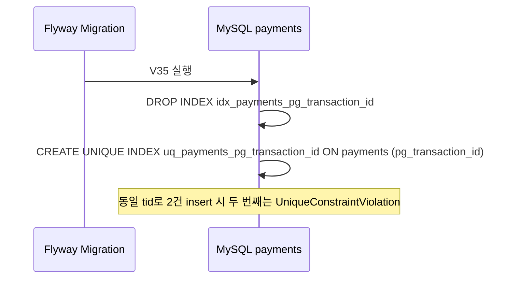
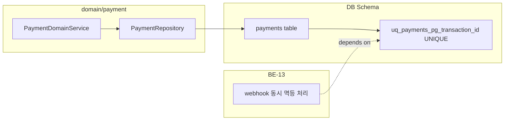

# [DB-02] payments pg_transaction_id 유니크 인덱스 마이그레이션

## 작업 내용 (설계 의도)

### 변경 사항

현재 `V26__add_payments_pg_fields.sql`에서 `pg_transaction_id`에 일반 인덱스(`idx_payments_pg_transaction_id`)만 생성되어 있다(결함#8 스키마). 웹훅이 동시에 2건 도착할 때 DB 레벨 유니크 제약이 없으면 같은 `pg_transaction_id`로 두 트랜잭션이 동시에 `findByPgTransactionId`를 통과해 두 번 결제 완료 처리가 실행될 수 있다.

이 마이그레이션에서는 기존 비-유니크 인덱스를 삭제하고 UNIQUE 인덱스를 재생성한다. `pg_transaction_id`는 NULL 허용 컬럼이므로 NULL 값은 유니크 제약 대상에서 제외된다(MySQL 8.0 기본 동작).

Flyway 파일명: `V35__make_payments_pg_transaction_id_unique.sql`

의존: 없음(독립 시작 가능). BE-13(webhook 동시 멱등)이 이 마이그레이션을 선행 요건으로 한다.

### 비범위 (out of scope)

- payments 테이블의 다른 인덱스 변경
- PaymentDomainService 로직 변경 — BE-13에서 처리

<details>
<summary>DDL 참고</summary>

```sql
-- V35__make_payments_pg_transaction_id_unique.sql

-- 기존 비-unique 인덱스 제거
DROP INDEX idx_payments_pg_transaction_id ON payments;

-- unique 인덱스 재생성 (NULL은 중복 허용 — MySQL 8.0 기본)
CREATE UNIQUE INDEX uq_payments_pg_transaction_id ON payments (pg_transaction_id);
```

</details>

## 다이어그램

### 처리 흐름



### 클래스 의존



## 테스트 케이스

### 단위 테스트 (Unit)

해당 없음. 이 티켓은 DDL 마이그레이션이며 도메인 로직 변경이 없다.

### 레포지토리 테스트 (Repository / Persistence)

| ID | 대상 | 케이스 |
|---|---|---|
| R-01 | `FlywayMigrationTest` | V35 마이그레이션이 오류 없이 실행되고 uq_payments_pg_transaction_id 유니크 인덱스가 존재한다 |
| R-02 | `PaymentRepository` | 동일 pg_transaction_id로 두 번째 Payment를 save 시 DataIntegrityViolationException(unique constraint)이 발생한다 |
| R-03 | `PaymentRepository` | pg_transaction_id가 NULL인 Payment를 여러 건 save해도 unique 위반이 발생하지 않는다 |
| R-04 | `PaymentRepository` | 서로 다른 pg_transaction_id를 가진 두 Payment가 문제없이 저장된다 |

### 시나리오 테스트 (Scenario / Integration)

| ID | 시나리오 | 케이스 |
|---|---|---|
| S-01 | 동시 웹훅 중복 방지 | 동일 tid로 PAYMENT_APPROVED 웹훅이 동시에 2건 도달할 때 하나는 성공하고 나머지는 DB 유니크 위반으로 거부된다 |
