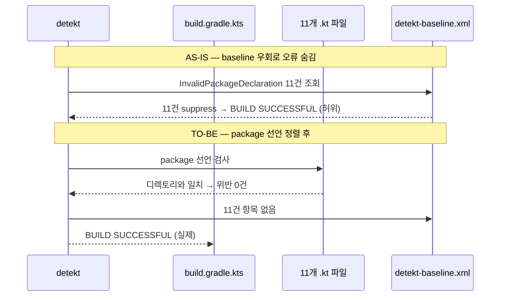
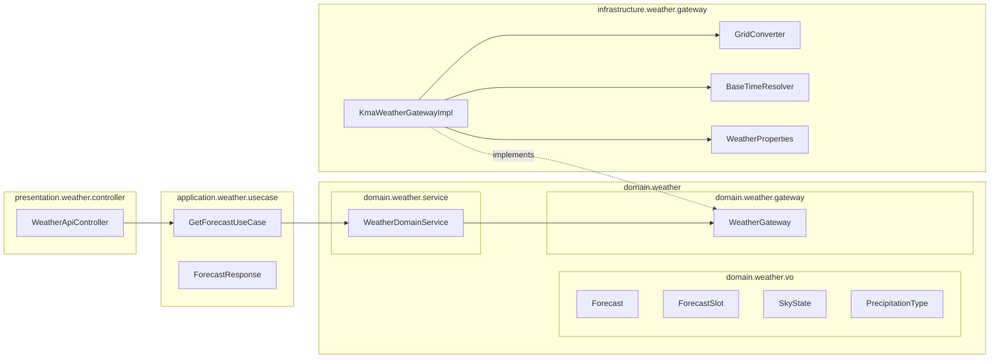

# [INFRA-01] weather 모듈 패키지 선언을 디렉토리 구조와 일치시킨다

## 작업 내용 (설계 의도)

### 변경 사항

weather 모듈 11개 파일의 `package` 선언이 실제 디렉토리 경로와 어긋나 있다.
예를 들어 `infrastructure/weather/gateway/KmaWeatherGatewayImpl.kt`는 디렉토리 기준 패키지가 `com.sportsapp.infrastructure.weather.gateway`여야 하지만 `com.sportsapp.infrastructure.weather`로 선언돼 있다.
detekt `InvalidPackageDeclaration` 규칙이 이 11건을 빌드 오류로 차단하고 있으며, 이전 PR에서 이 오류를 `detekt-baseline.xml`에 등록해 숨기는 우회가 발생했다.
이번 티켓은 각 파일의 `package` 선언을 디렉토리와 일치시키고, 이를 참조하는 모든 `import`를 갱신하여 `./gradlew detekt`가 `BUILD SUCCESSFUL`로 통과하도록 한다.

| 파일 | 현재 package 선언 | 정렬 후 package 선언 |
|---|---|---|
| `presentation/weather/controller/WeatherApiController.kt` | `com.sportsapp.presentation.weather` | `com.sportsapp.presentation.weather.controller` |
| `presentation/weather/dto/response/ForecastResponse.kt` | `com.sportsapp.application.weather` | `com.sportsapp.presentation.weather.dto.response` |
| `application/weather/usecase/GetForecastUseCase.kt` | `com.sportsapp.application.weather` | `com.sportsapp.application.weather.usecase` |
| `domain/weather/vo/Forecast.kt` | `com.sportsapp.domain.weather` | `com.sportsapp.domain.weather.vo` |
| `domain/weather/service/WeatherDomainService.kt` | `com.sportsapp.domain.weather` | `com.sportsapp.domain.weather.service` |
| `domain/weather/gateway/WeatherGateway.kt` | `com.sportsapp.domain.weather` | `com.sportsapp.domain.weather.gateway` |
| `infrastructure/weather/gateway/KmaWeatherGatewayImpl.kt` | `com.sportsapp.infrastructure.weather` | `com.sportsapp.infrastructure.weather.gateway` |
| `infrastructure/weather/gateway/WeatherProperties.kt` | `com.sportsapp.infrastructure.weather` | `com.sportsapp.infrastructure.weather.gateway` |
| `infrastructure/weather/gateway/GridConverter.kt` | `com.sportsapp.infrastructure.weather` | `com.sportsapp.infrastructure.weather.gateway` |
| `infrastructure/weather/gateway/BaseTimeResolver.kt` | `com.sportsapp.infrastructure.weather` | `com.sportsapp.infrastructure.weather.gateway` |
| `test/.../infrastructure/weather/gateway/GridConverterTest.kt` | `com.sportsapp.infrastructure.weather` | `com.sportsapp.infrastructure.weather.gateway` |

추가 작업 범위:

- **`presentation/weather/dto/response/ForecastResponse.kt`를 삭제한다 (OQ-4 확정)**. 이 파일은 참조처가 0건인 데드 코드다 — `WeatherApiController`는 `com.sportsapp.application.weather.ForecastResponse`(application 레이어)를 import 하며, presentation 디렉토리의 동명 파일은 어디서도 참조하지 않는다(grep 0건). 따라서 package 선언을 맞추는 대신 중복 파일을 제거한다.
- `detekt-baseline.xml`에 이전 PR이 등록한 weather `InvalidPackageDeclaration` 11건을 제거한다.
- typealias 호환 레이어 신규 생성 금지: 구 패키지로의 typealias, `*Compat.kt`, `*Aliases.kt` 생성 금지.
- Port/Adapter 잔재 발견 시 제거: `interface *Port` / 단순 위임 `*Adapter` 발견 시 Repository/Gateway 직접 주입으로 전환.
- 구 package 선언을 참조하던 모든 `import` 100% 갱신.

비범위(out of scope):

- `BookingRepository.kt` / `BookingRepositoryImpl.kt` TooManyFunctions — 별도 부채 티켓
- weather 이외 다른 도메인 패키지 정렬
- 비즈니스 로직 변경

## 다이어그램

### 처리 흐름

### 클래스 의존

## 테스트 케이스

> 이 티켓은 package 선언 정렬과 detekt 통과가 목적인 빌드 인프라 작업이다.
> 비즈니스 로직 변경이 없으므로 단위/레포지토리/시나리오 신규 케이스를 추가하지 않는다.
> 기존 테스트가 package 변경 후에도 컴파일·통과됨을 검증하는 것이 수용 기준이다.

### 단위 테스트 (Unit)

| ID | 대상 | 케이스 |
|---|---|---|
| U-01 | `GridConverter` | package 선언 변경 후 서울시청 좌표(37.5665, 126.9780) → 격자 (60, 127) 변환이 동일하다 (기존 `GridConverterTest` 재실행) |
| U-02 | `BaseTimeResolver` | package 선언 변경 후 오후 3시 30분 → baseTime `1400`, 새벽 1시 → 전일 `2300` 반환이 동일하다 (기존 `BaseTimeResolverTest` 재실행) |

### 레포지토리 테스트 (Repository / Persistence)

해당 없음. weather 모듈은 DB 영속화 없이 외부 API Gateway만 사용한다.

### 시나리오 테스트 (Scenario / Integration)

해당 없음. 비즈니스 로직 변경 없음. 기존 `AggregateAndUseCaseRulesTest`·`LayerDependencyRulesTest`가 package 변경 후에도 통과됨을 `./gradlew test`로 확인한다.

### 검증 방법 (빌드/detekt)

| 순서 | 명령 | 기대 결과 |
|---|---|---|
| 1 | `./gradlew detekt` | `BUILD SUCCESSFUL`, `InvalidPackageDeclaration` 0건 |
| 2 | `./gradlew test` | 기존 `GridConverterTest`, `BaseTimeResolverTest`, `AggregateAndUseCaseRulesTest`, `LayerDependencyRulesTest`, `PackageStructureRulesTest` 전원 통과 |
| 3 | `./gradlew harnessCheck` | `PASS — harness-rules 위반 0건` |
| 4 | `./gradlew build` | `BUILD SUCCESSFUL` (컴파일 오류 없음) |

## 결정 사항 (OQ-4 — 확정)

- `presentation/weather/dto/response/ForecastResponse.kt`는 참조처 0건 데드 코드 → **삭제**. Controller는 `application.weather.ForecastResponse`만 사용.
