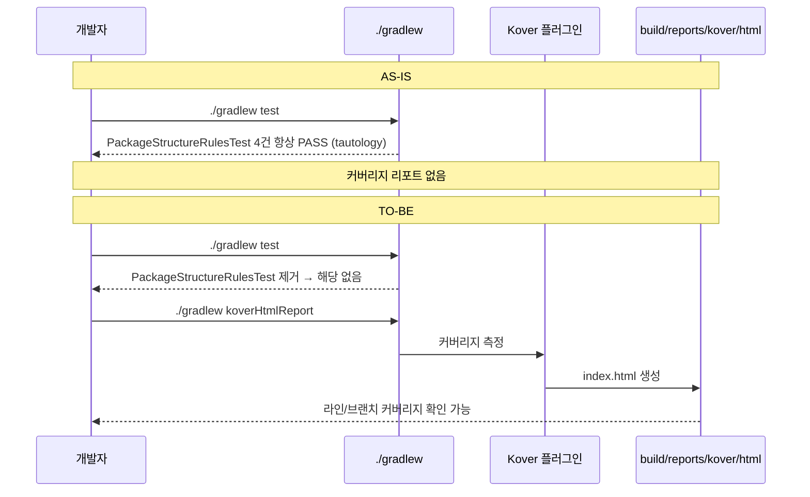
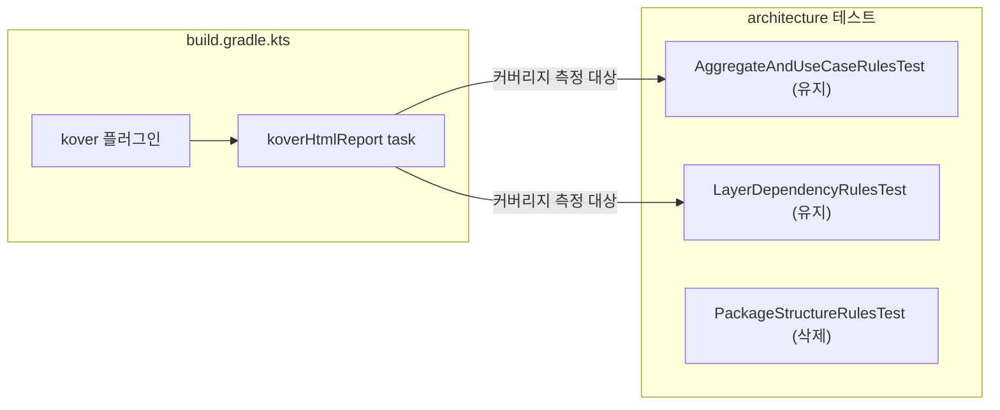

# [INFRA-02] ArchUnit 동어반복 테스트 제거 + Kover 커버리지 게이트 추가

## 작업 내용 (설계 의도)

### 변경 사항

`PackageStructureRulesTest`의 4개 테스트는 "X 패키지에 속하는 클래스는 X 패키지에 속해야 한다"는 동어반복 단언이다.
`classes().that().resideInAPackage("com.sportsapp.presentation..").should().resideInAPackage("com.sportsapp.presentation..")` 형태는 항상 참(tautology)이어서 어떤 실패도 잡지 못한다.
반면 `AggregateAndUseCaseRulesTest`와 `LayerDependencyRulesTest`는 잘못된 패턴(UseCase→Repository 의존, domain→infra import)을 실제로 차단하므로 유지한다.

**결정 (OQ-5 확정)**: `SportsApplication 은 com_sportsapp 루트 패키지에 위치한다` 케이스는 동어반복이 아니며(앱 클래스를 다른 패키지로 옮기면 실제로 실패) 의미가 있으므로 **보존한다**. 따라서 `PackageStructureRulesTest.kt` 파일을 통째로 삭제하지 않고 **동어반복 4개 메서드만 제거하고 SportsApplication 단언은 남긴다.**

**결정 (OQ-3 확정)**: Kover는 **리포트 생성만 활성화하고 임계 강제(`koverVerify`)는 적용하지 않는다.** 현재 커버리지 실측값을 먼저 가시화한 뒤, 임계(라인/브랜치 %) 강제는 PO·Tech Lead 합의 후 후속 티켓에서 추가한다.

구현 범위:

- `PackageStructureRulesTest.kt`: 동어반복 4개 메서드 삭제, `SportsApplication 루트 패키지` 단언은 보존
- `build.gradle.kts`: Kover 플러그인(`org.jetbrains.kotlinx.kover`) 추가
- `build.gradle.kts`: `koverHtmlReport` task 등록 — `./gradlew koverHtmlReport` 실행 시 `build/reports/kover/html/index.html` 생성
- `settings.gradle.kts`: Kover 플러그인 버전 선언 추가
- 커버리지 임계 강제(`koverVerify`) 미적용 — 임계 합의 후 후속 티켓

비범위(out of scope):

- `AggregateAndUseCaseRulesTest`, `LayerDependencyRulesTest` 수정 또는 삭제 — 실질적인 규칙이므로 유지
- 커버리지 임계 강제(`koverVerify`) 설정 — 별도 티켓
- 기존 테스트 커버리지 수치 달성

## 다이어그램

### 처리 흐름

### 클래스 의존

## 테스트 케이스

> 이 티켓은 테스트 파일 삭제와 빌드 플러그인 추가가 목적인 빌드 인프라 작업이다.
> 비즈니스 로직 변경이 없으므로 단위/레포지토리/시나리오 신규 케이스를 추가하지 않는다.

### 단위 테스트 (Unit)

| ID | 대상 | 케이스 |
|---|---|---|
| U-01 | `AggregateAndUseCaseRulesTest` | `PackageStructureRulesTest` 제거 후 기존 ArchUnit 규칙 4건이 여전히 통과된다 |
| U-02 | `LayerDependencyRulesTest` | `PackageStructureRulesTest` 제거 후 레이어 의존 규칙 6건이 여전히 통과된다 |

### 레포지토리 테스트 (Repository / Persistence)

해당 없음. 빌드 설정 변경이며 영속화 레이어 미포함.

### 시나리오 테스트 (Scenario / Integration)

해당 없음. 비즈니스 로직 변경 없음.

### 검증 방법 (빌드/detekt/Kover)

| 순서 | 명령 | 기대 결과 |
|---|---|---|
| 1 | `./gradlew test` | `PackageStructureRulesTest` 클래스 없음, `AggregateAndUseCaseRulesTest`·`LayerDependencyRulesTest` 전원 통과 |
| 2 | `./gradlew koverHtmlReport` | `BUILD SUCCESSFUL`, `build/reports/kover/html/index.html` 파일 생성됨 |
| 3 | `./gradlew detekt` | `BUILD SUCCESSFUL`, 신규 위반 0건 |
| 4 | `./gradlew build` | `BUILD SUCCESSFUL` |

## 결정 사항 (OQ-3 / OQ-5 — 확정)

- **OQ-3**: Kover는 **리포트 생성만** 활성화, 임계 강제(`koverVerify`) 미적용. 임계 수치·강제 시점은 실측 후 PO·Tech Lead 합의로 후속 티켓에서 결정.
- **OQ-5**: `PackageStructureRulesTest`는 통째 삭제하지 않고 동어반복 4건만 제거, `SportsApplication 루트 패키지` 단언은 보존.
