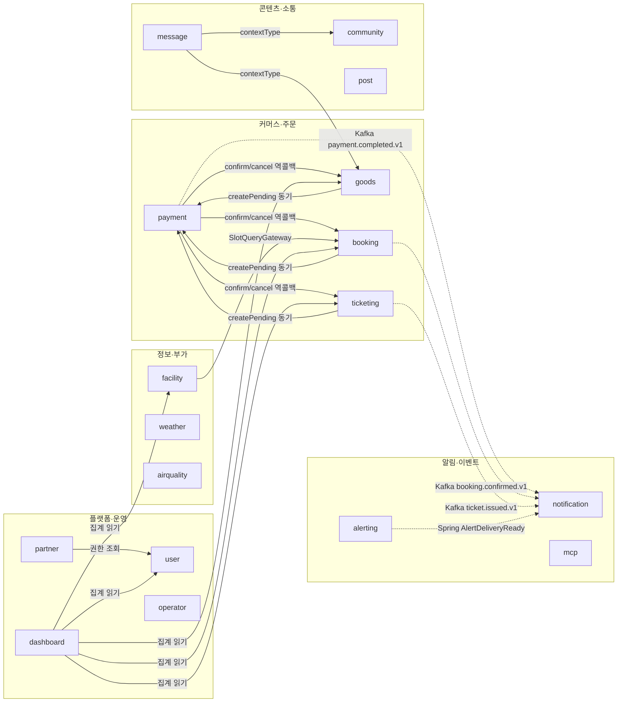
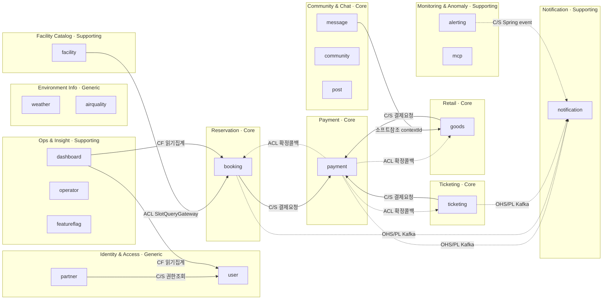

# 도메인 · 바운디드 컨텍스트 맵

sports-application 백엔드(`backend`, 단일 모듈)의 도메인 구성과 도메인 간 연결, 바운디드 컨텍스트 경계를 정리한 문서입니다. 코드베이스 조사(2026-07-06 최초 작성, 2026-07-07 BE-22 FR-8 정합 갱신)를 근거로 작성했습니다.

## 구조 개요

- 단일 모듈 `backend`, 레이어 우선 패키지 구조 — `presentation` / `application` / `domain` / `infrastructure` 하위에 도메인 컨텍스트가 놓입니다.
- `domain/` 기준 **20개 도메인 + `common`**(recruitment 신규).
- 도메인 간 연결은 `RoutingDomainEventPublisher`가 `DomainEvent.topic` 유무로 **Kafka(topic 지정) vs Spring 내부 이벤트(topic null)** 로 분기 발행하는 이벤트 방식과, 동기 게이트웨이/도메인서비스 방식이 함께 쓰입니다.

## 도메인 목록

| 분류 | 도메인 | 핵심 엔티티/책임 |
|---|---|---|
| **커머스·주문** | `payment` | Payment — 결제 PG 연동, 주문 확정 콜백 허브 |
| | `booking` | Booking, Slot — 시설 예약 |
| | `goods` | Cart, GoodsOrder, Product, Stock, LimitedDrop — 굿즈 커머스 |
| | `ticketing` | Event, Seat, Ticket, TicketOrder — 티켓 판매 |
| | `recruitment` | Recruitment, Application — 모집 개설·정원 내 신청, 단계별 취소수수료(`TieredCancellationPolicy`). payment Customer 관계(`OrderType.RECRUITMENT` 동기 확장은 BE-55 예정), community ID 참조(`communityId`, nullable) |
| **콘텐츠·소통** | `post` | Post, Comment — 게시판 |
| | `community` | Community, CommunityMember — 멤버십 커뮤니티(`CommunityVisibility` 개방/폐쇄 겸용, `CommunityRole` HOST/MEMBER, `CommunityChatIntegrationEventWorker`로 채팅 자동연동) |
| | `message` | Message, Room, RoomParticipant — 실시간 채팅 |
| **알림·이벤트** | `notification` | Notification, PushToken — 통합 알림 발송 |
| | `alerting` | Alert — 이상징후 알림 + LLM 분석 |
| | `mcp` | McpAnomalyEvent, McpToken — MCP 이상탐지/토큰 |
| **플랫폼·운영** | `user` | User, Role, Permission, UserRole — 인증·인가 |
| | `partner` | Partner, PartnerApiKey — B2B 파트너 |
| | `operator` | OperatorInboxNotification — 운영자 인박스 |
| | `featureflag` | FeatureFlag, FeatureFlagAuditLog — 기능 플래그 |
| | `dashboard` | (집계) B2B 인사이트 대시보드 |
| **정보·부가** | `facility` | Facility — 시설 마스터(공공데이터 임포트) |
| | `weather` / `airquality` | Forecast / AirQuality — 외부 API 게이트웨이 (VO 중심) |
| | `featuredemo` / `image` | 데모 / 이미지 스토리지 |

## 도메인 간 연결 (구현 관점)

- 실선 `→` : 동기 호출 (DomainService 주입 / Gateway)
- 점선 `-.->` : 비동기 이벤트 (Kafka Layer 2 / Spring ApplicationEvent Layer 1)
- `weather`·`airquality`·`operator`·`post`는 강결합 없는 독립 도메인, `featuredemo`·`image`는 부가 도메인(생략).
- `recruitment`는 domain core(Recruitment/Application aggregate, `RecruitmentRefundGateway` interface)만 구현 완료 상태라 이 구현 관점 다이어그램에는 아직 미표기 — payment `createPending`/`OrderConfirmationGateway` 연동(BE-55)·community 연동(BE-60) 배선 후 반영합니다.

### 연결 방식 5종

**① Kafka 이벤트 (Layer 2 — 무관 도메인, 비동기)**

| 발행 도메인 | 토픽 | 구독 |
|---|---|---|
| payment | `payment.completed.v1` | notification (NotificationEventWorker) |
| booking | `booking.confirmed.v1` | notification |
| ticketing | `ticket.issued.v1` | notification |

**② Spring ApplicationEvent (Layer 1 — AFTER_COMMIT 비동기)**

| 발행 | 이벤트 | 구독 → UseCase |
|---|---|---|
| alerting | AlertProcessingRequested | alerting → ProcessAlert (LLM 분석) |
| alerting | AlertDeliveryReady | **notification** → SendRawNotification (크로스 도메인) |
| notification | NotificationDispatchRequested | notification → DispatchNotification |
| featureflag | FeatureFlagChanged | featureflag → PropagateFeatureFlagChange |
| goods | LimitedDropOversold | goods → 오버셀 처리 |
| mcp | McpAnomalyDetected | mcp → PersistAnomalyEvent |
| booking | BookingRefundRequested | booking → 환불 처리 |
| community | CommunityCreatedEvent / CommunityMemberJoinedEvent / CommunityMemberLeftEvent | **message** → ProvisionContextRoom / JoinContextRoom / LeaveContextRoom (`CommunityChatIntegrationEventWorker`, 크로스 도메인) |
| recruitment | ApplicationRefundRequestedEvent | (구독자 미배선 — `RecruitmentRefundGateway.requestRefund` 연동 예정) |

**③ 동기 호출 — UseCase가 타 도메인 DomainService 주입**
- `booking`·`goods`·`ticketing` → **payment** (`paymentDomainService.createPending` / `findStatuses`)
- `dashboard` → **booking·facility·goods·ticketing·user** (읽기 집계)
- `partner` → **user**

**④ 역방향 콜백 — Gateway로 도메인 레이어 결합 차단 (infra가 브리지)**
- **payment → booking/goods/ticketing**: `OrderConfirmationGateway.confirm/cancel`. `OrderType`으로 분기해 `confirmBooking`/`markPaid`/`confirmOrder` 호출
- **facility → booking**: `SlotQueryGateway`로 예약 슬롯 조회

**⑤ 소프트 참조 (FK 없음, ID/컨텍스트 값만 보유)**
- `message` Room의 `contextType`(COMMUNITY, GOODS_PRODUCT) + `contextId` → community·goods 컨텍스트 연결
- `recruitment` Recruitment의 `communityId`(nullable) → community 컨텍스트 연결 (ID만 보유, community Entity 직접 참조 없음)
- 주문 3종·대부분 엔티티가 `userId: Long` 보유 → user 도메인 (객체 참조 아닌 ID)

## 바운디드 컨텍스트 맵 (DDD 관점)

> `recruitment`는 신규 Core 컨텍스트로 편입됐으나 payment·community 연동 배선(BE-55·BE-60)이 아직 없어 이 DDD 관점 다이어그램에는 노드를 추가하지 않았습니다 (다이어그램은 15 노드 이하 유지 — [mermaid 규칙](../.claude/rules/mermaid.md)). 아래 "바운디드 컨텍스트 정의" 표에는 Recruitment 컨텍스트를 반영합니다.

### 바운디드 컨텍스트 정의

| 컨텍스트 | 유형 | 포함 도메인 | 유비쿼터스 언어 |
|---|---|---|---|
| **Payment** | Core | payment | Payment, PG, 확정/취소 |
| **Reservation** | Core | booking | Booking, Slot |
| **Retail** | Core | goods | Cart, GoodsOrder, Product, Stock, LimitedDrop |
| **Ticketing** | Core | ticketing | Event, Seat, Ticket, TicketOrder |
| **Recruitment** | Core | recruitment | Recruitment, Application, CancellationPolicy |
| **Notification** | Supporting | notification | Notification, PushToken |
| **Monitoring & Anomaly** | Supporting | alerting, mcp | Alert, McpAnomalyEvent, McpToken |
| **Community & Chat** | Core | message, community, post | Room, Message, Community, CommunityMember, Post, Comment |
| **Facility Catalog** | Supporting | facility | Facility, Region |
| **Ops & Insight** | Supporting | dashboard, operator, featureflag | 집계, Inbox, Flag |
| **Identity & Access** | Generic | user, partner | User, Role, Permission, Partner |
| **Environment Info** | Generic | weather, airquality | Forecast, AirQuality |

> `featuredemo`·`image`는 Generic 서브도메인(데모·스토리지)이라 컨텍스트 맵에서 생략했습니다.
> **Community & Chat**은 기존 Supporting에서 **Core**로 정정했습니다 — `message`·`post`는 `DomainClassification.core`(`SupportToCoreDependencyRulesTest.kt:18`)에 이미 등록돼 있고, `community`도 완성 컨텍스트로서 같은 상수에 등록됩니다(BE-50). 세 도메인 모두 사용자 대상 핵심 자산(채팅방·게시글·멤버십)을 소유해 Core 분류가 실제 코드 기준과 일치합니다.
> **Recruitment**는 payment의 Customer(결제 요청 주체)이자 community를 ID로만 참조하는 신규 Core 컨텍스트입니다. `DomainClassification.core` 등록은 BE-50, 결제 연동(`OrderType.RECRUITMENT`)은 BE-55가 담당합니다.

### 컨텍스트 매핑 패턴 범례

| 약어 | 패턴 | 이 프로젝트의 구현 |
|---|---|---|
| **C/S** | Customer/Supplier | Reservation·Retail·Ticketing이 Payment에 `createPending` 동기 요청 (upstream=Payment). Recruitment도 같은 패턴으로 편입 예정(BE-55) |
| **ACL** | Anticorruption Layer | `OrderConfirmationGateway`·`SlotQueryGateway` — infra 게이트웨이가 타 컨텍스트 도메인을 격리 호출, 도메인 레이어 결합 차단. `RecruitmentRefundGateway`도 같은 패턴(환불 요청 격리) |
| **OHS/PL** | Open Host Service + Published Language | Kafka 토픽(`payment.completed.v1` 등) — Payment/Reservation/Ticketing 발행, Notification 구독 |
| **CF** | Conformist | Dashboard가 각 Core 컨텍스트 모델을 그대로 읽어 집계 (읽기 전용) |

## 핵심 관찰

- **Payment가 Core의 공급자 허브**: 3개 판매 컨텍스트(Reservation/Retail/Ticketing)가 Payment의 Customer이고, 확정 콜백은 ACL(`OrderConfirmationGateway`)로 역방향 격리. Payment 도메인 레이어는 판매 컨텍스트를 import하지 않습니다.
- **Notification은 Downstream Conformist**: 상류 4개 컨텍스트의 Published Language(Kafka 이벤트 + Spring 이벤트)를 구독만 합니다.
- **Identity & Access가 사실상 Shared Kernel**: 모든 컨텍스트가 `userId: Long`을 값으로 보유 — 객체 참조가 아닌 ID 소프트 참조라 경계는 유지됩니다.
- **Community & Chat은 완성된 Core 컨텍스트**: `community`는 Community·CommunityMember aggregate(Entity 2·DomainService 12메서드·UseCase 10·Repository 3·이벤트 3·예외 6·VO 4, 테스트 22)로 구현이 끝났고, `CommunityChatIntegrationEventWorker`(Layer 1, AFTER_COMMIT)가 커뮤니티 생성·가입·탈퇴 이벤트를 구독해 `message` 전용 그룹채팅방을 자동 provision·가입·퇴장시킵니다. `message`의 `contextType`(COMMUNITY/GOODS_PRODUCT)으로 Retail·Community에 느슨히 연결되는 소프트 참조 구조는 유지됩니다.
- **Recruitment는 post/community와 별도 수명주기를 가진 신규 Core 컨텍스트**: 모집 정원 상태 머신·신청 라이프사이클·단계별 취소 수수료(`TieredCancellationPolicy`)를 자체 소유하며, community는 `communityId`(nullable) ID로만 참조합니다(Entity 직접 참조 없음). post 도메인 자체와는 아직 참조 관계가 없고, 모집을 post PostType으로 흡수하지 않기로 한 설계 결정(게시판 오염 방지)의 결과입니다. payment와는 Customer 관계로 편입될 예정(`OrderType.RECRUITMENT`, BE-55)입니다.

## Document History

| 날짜 | 변경 내용 |
|---|---|
| 2026-07-06 | 최초 작성 — 코드베이스 조사 기반 도메인·컨텍스트 맵 |
| 2026-07-07 | BE-22 FR-8 문서 정합 — community stale 서술(VO만·미완성) 정정, message/post/community 분류를 `DomainClassification.core` 기준으로 Core 정합, recruitment 신규 Core 도메인 행 추가 |
