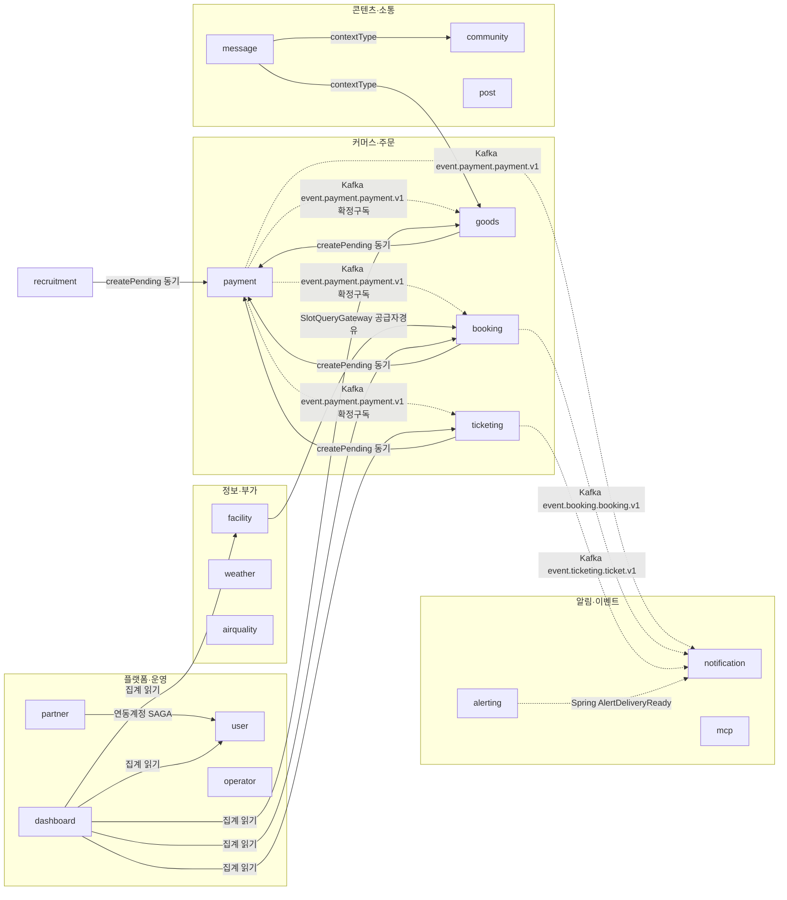
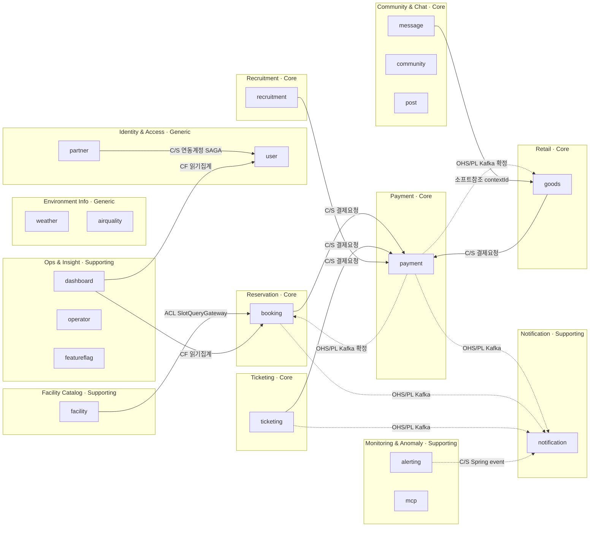

# 도메인 · 바운디드 컨텍스트 맵

sports-application 백엔드(`backend`, 단일 모듈)의 도메인 구성과 도메인 간 연결, 바운디드 컨텍스트 경계를 정리한 문서입니다. 코드베이스 조사(2026-07-06 최초 작성, 2026-07-07 BE-22 FR-8 정합 갱신)를 근거로 작성했습니다.

## 구조 개요

> **현재 상태와 목표 구조**: 이 문서는 **현재 코드의 사실**만 기술합니다. 지금은 단일 모듈·단일 배포이며, 목표 구조(서비스 물리 분리 범위·경계·순서)는 여기서 단정하지 않습니다 — `아키텍트/20260728-msa-물리분리-실행설계.md`(레포 밖 설계 문서)를 참조하세요.

- 단일 모듈 `backend`, 레이어 우선 패키지 구조 — `presentation` / `application` / `domain` / `infrastructure` 하위에 도메인 컨텍스트가 놓입니다.
- `domain/` 기준 **20개 도메인 + `common`**(recruitment 신규).
- 도메인 간 연결은 `RoutingDomainEventPublisher`가 `DomainEvent.topic` 유무로 **Kafka(topic 지정) vs Spring 내부 이벤트(topic null)** 로 분기 발행하는 이벤트 방식과, 동기 게이트웨이/도메인서비스 방식이 함께 쓰입니다.

## 도메인 목록

| 분류 | 도메인 | 핵심 엔티티/책임 |
|---|---|---|
| **커머스·주문** | `payment` | Payment — 결제 PG 연동. 확정은 **콜백이 아니라 이벤트** — 발행만 하고 주문 컨텍스트를 모른다(역참조 0건) |
| | `booking` | Booking, Slot — 시설 예약 |
| | `goods` | Cart, GoodsOrder, Product, Stock, LimitedDrop — 굿즈 커머스 |
| | `ticketing` | Event, Seat, Ticket, TicketOrder — 티켓 판매 |
| | `recruitment` | Recruitment, Application — 모집 개설·정원 내 신청, 단계별 취소수수료(`TieredCancellationPolicy`). payment Customer 관계(`OrderType.RECRUITMENT` 배선 완료 — `ApplyRecruitmentUseCase`·`ConfirmRecruitmentPaymentUseCase`·`RecruitmentPaymentEventWorker`), community ID 참조(`communityId`, nullable) |
| **콘텐츠·소통** | `post` | Post, Comment — 게시판 |
| | `community` | Community, CommunityMember — 멤버십 커뮤니티(`CommunityVisibility` 개방/폐쇄 겸용, `CommunityRole` HOST/MEMBER, `CommunityChatIntegrationEventWorker`로 채팅 자동연동) |
| | `message` | Message, Room, RoomParticipant — 실시간 채팅 |
| **알림·이벤트** | `notification` | Notification, PushToken — 통합 알림 발송 |
| | `alerting` | Alert — 이상징후 알림 + LLM 분석 |
| | `mcp` | McpAnomalyEvent, McpToken — MCP 이상탐지/토큰 |
| **플랫폼·운영** | `user` | User, Role, **Permission**, UserRole, RolePermission — 인증·인가. `permissions` 테이블 소유권이 공유 커널(`domain/common`)에서 user로 이관돼 공유 커널은 물리 테이블을 갖지 않는다 |
| | `partner` | Partner, PartnerApiKey — B2B 파트너. 연동 계정 프로비저닝은 컨텍스트별 로컬 트랜잭션 3단 + 보상(SAGA)으로 분리 — 한 `@Transactional` 안의 크로스 컨텍스트 쓰기 없음 |
| | `operator` | OperatorInboxNotification — 운영자 인박스 |
| | `featureflag` | FeatureFlag, FeatureFlagAuditLog — 기능 플래그 |
| | `virtualqueue` | 가상 대기열 — 인그레스 입장 제어(HMAC 입장토큰). Redis 전용, 코어 역참조 0건. `EntryTokenGuard`(common)로만 노출 |
| | `dashboard` | (집계) B2B 인사이트 대시보드 |
| **정보·부가** | `facility` | Facility — 시설 마스터(공공데이터 임포트) |
| | `weather` / `airquality` | Forecast / AirQuality — 외부 API 게이트웨이 (VO 중심) |
| | `featuredemo` / `image` | 데모 / 이미지 스토리지 |
| **조회 조합(application 전용)** | `catalog` / `order` | 도메인 레이어 없는 **읽기 조합 파사드**. 코어 DomainService를 병렬 fan-out 하고 도메인당 300ms 타임아웃 + 실패 도메인 부분 저하(`failedDomains`)로 응답한다 |

## 도메인 간 연결 (구현 관점)

```mermaid
flowchart LR
    subgraph Commerce["커머스·주문"]
        payment
        booking
        goods
        ticketing
    end
    subgraph Alert["알림·이벤트"]
        notification
        alerting
        mcp
    end
    subgraph Content["콘텐츠·소통"]
        message
        community
        post
    end
    subgraph Platform["플랫폼·운영"]
        user
        partner
        dashboard
        operator
    end
    subgraph Info["정보·부가"]
        facility
        weather
        airquality
    end

    booking -->|createPending 동기| payment
    goods -->|createPending 동기| payment
    ticketing -->|createPending 동기| payment
    recruitment -->|createPending 동기| payment

    payment -.->|Kafka event.payment.payment.v1 확정구독| booking
    payment -.->|Kafka event.payment.payment.v1 확정구독| goods
    payment -.->|Kafka event.payment.payment.v1 확정구독| ticketing
    payment -.->|Kafka event.payment.payment.v1| notification
    booking -.->|Kafka event.booking.booking.v1| notification
    ticketing -.->|Kafka event.ticketing.ticket.v1| notification
    alerting -.->|Spring AlertDeliveryReady| notification

    facility -->|SlotQueryGateway 공급자경유| booking
    partner -->|연동계정 SAGA| user
    message -->|contextType| community
    message -->|contextType| goods

    dashboard -->|집계 읽기| booking
    dashboard -->|집계 읽기| goods
    dashboard -->|집계 읽기| ticketing
    dashboard -->|집계 읽기| facility
    dashboard -->|집계 읽기| user
```

- 실선 `→` : 동기 호출 (DomainService 주입 / Gateway)
- 점선 `-.->` : 비동기 이벤트 (Kafka Layer 2 / Spring ApplicationEvent Layer 1)
- `weather`·`airquality`·`operator`·`post`는 강결합 없는 독립 도메인, `featuredemo`·`image`는 부가 도메인(생략).
- `recruitment`는 payment 연동(`createPending` + `event.payment.payment.v1` 구독)과 community ID 참조가 모두 **배선 완료**됐습니다. 다이어그램 노드 15개 제한([mermaid 규칙](../.claude/rules/mermaid.md)) 때문에 이 구현 관점 그림에는 표기하지 않고, 아래 연결 방식 표와 바운디드 컨텍스트 정의에 반영합니다.

### 연결 방식 5종

**① Kafka 이벤트 (Layer 2 — 무관 도메인, 비동기)**

| 발행 도메인 | 토픽 | 구독 |
|---|---|---|
| payment | `event.payment.payment.v1` | **5 groupId 팬아웃** — `booking-payment`·`goods-payment`·`ticketing-payment`·`recruitment-payment`·`notification-payment` |
| booking | `event.booking.booking.v1` | `notification-booking` |
| ticketing | `event.ticketing.ticket.v1` | `notification-ticketing` |

**② Spring ApplicationEvent (Layer 1 — AFTER_COMMIT 비동기)**

| 발행 | 이벤트 | 구독 → UseCase |
|---|---|---|
| alerting | AlertProcessingRequested | alerting → ProcessAlert (LLM 분석) |
| alerting | AlertDeliveryReady | **notification** → SendRawNotification (크로스 도메인) |
| notification | NotificationDispatchRequested | notification → DispatchNotification |
| featureflag | FeatureFlagChanged | featureflag → PropagateFeatureFlagChange |
| goods | LimitedDropOversold | goods → 오버셀 처리 |
| mcp | McpAnomalyDetected | mcp → PersistAnomalyEvent |
| booking | BookingRefundRequested | booking → 환불 처리 |
| community | CommunityCreatedEvent / CommunityMemberJoinedEvent / CommunityMemberLeftEvent | **message** → ProvisionContextRoom / JoinContextRoom / LeaveContextRoom (`CommunityChatIntegrationEventWorker`, 크로스 도메인) |
| recruitment | ApplicationRefundRequestedEvent | recruitment → `RecruitmentRefundEventWorker` → `RecruitmentRefundGateway.requestRefund` (UseCase 미경유, 게이트웨이 직접 주입) |

**③ 동기 호출 — UseCase가 타 도메인 DomainService 주입**
- `booking`·`goods`·`ticketing` → **payment** (`paymentDomainService.createPending` / `findStatuses`)
- `dashboard` → **booking·facility·goods·ticketing·user** (읽기 집계)
- `recruitment` → **payment** (`createPending`)
- `partner` → **user** (연동 계정 프로비저닝 쓰기)

**④ 확정 흐름과 소비자 ACL 게이트웨이 (infra가 브리지)**
- **payment → 주문 4종**: `OrderConfirmationGateway`류 동기 디스패치 허브는 **존재하지 않습니다**(제거됨). payment는 `event.payment.payment.v1`에 발행만 하고, 각 주문 컨텍스트(booking·goods·ticketing·recruitment)가 **자기 `*PaymentEventWorker`로 확정**합니다 — 공용 컨텍스트가 주문 컨텍스트를 역참조하지 않습니다.
- **소비자 ACL 게이트웨이 7종**: 소비자 domain이 interface를 소유하고, infrastructure 구현체가 **공급자의 공개 행위 계약(DomainService)** 을 경유합니다. 공급자 Repository(=테이블)를 직접 주입하지 않습니다.
  `FacilityOwnershipGateway`·`FacilityScheduleGateway`(booking→facility) / `SlotInfoGateway`(community→booking) / `SlotQueryGateway`(facility→booking) / `GoodsProductGateway`(message→goods) / `RecipientContactGateway`(notification→user) / `McpPermissionGateway`(mcp→user)

**⑤ 소프트 참조 (FK 없음, ID/컨텍스트 값만 보유)**
- `message` Room의 `contextType`(COMMUNITY, GOODS_PRODUCT) + `contextId` → community·goods 컨텍스트 연결
- `recruitment` Recruitment의 `communityId`(nullable) → community 컨텍스트 연결 (ID만 보유, community Entity 직접 참조 없음)
- 주문 4종·대부분 엔티티가 `userId: Long` 보유 → user 도메인 (객체 참조 아닌 ID)

## 바운디드 컨텍스트 맵 (DDD 관점)

```mermaid
flowchart LR
    subgraph IAM["Identity & Access · Generic"]
        user
        partner
    end
    subgraph Reservation["Reservation · Core"]
        booking
    end
    subgraph Retail["Retail · Core"]
        goods
    end
    subgraph Ticketing["Ticketing · Core"]
        ticketing
    end
    subgraph Recruit["Recruitment · Core"]
        recruitment
    end
    subgraph Payment["Payment · Core"]
        payment
    end
    subgraph Notify["Notification · Supporting"]
        notification
    end
    subgraph Anomaly["Monitoring & Anomaly · Supporting"]
        alerting
        mcp
    end
    subgraph Social["Community & Chat · Core"]
        message
        community
        post
    end
    subgraph Catalog["Facility Catalog · Supporting"]
        facility
    end
    subgraph Env["Environment Info · Generic"]
        weather
        airquality
    end
    subgraph Ops["Ops & Insight · Supporting"]
        dashboard
        operator
        featureflag
    end

    booking -->|"C/S 결제요청"| payment
    goods -->|"C/S 결제요청"| payment
    ticketing -->|"C/S 결제요청"| payment
    payment -.->|"OHS/PL Kafka 확정"| booking
    payment -.->|"OHS/PL Kafka 확정"| goods
    payment -.->|"OHS/PL Kafka"| notification
    booking -.->|"OHS/PL Kafka"| notification
    ticketing -.->|"OHS/PL Kafka"| notification
    alerting -.->|"C/S Spring event"| notification

    facility -->|"ACL SlotQueryGateway"| booking
    recruitment -->|"C/S 결제요청"| payment
    partner -->|"C/S 연동계정 SAGA"| user
    message -->|"소프트참조 contextId"| goods
    dashboard -->|"CF 읽기집계"| booking
    dashboard -->|"CF 읽기집계"| user
```

> `recruitment`는 payment 연동이 배선 완료된 Core 컨텍스트라 결제 요청 엣지를 표기했습니다. 이 DDD 관점 그림은 컨텍스트 수가 많아 [mermaid 규칙](../.claude/rules/mermaid.md)의 노드 15개 권장을 넘습니다 — 컨텍스트 맵의 성격상 전체 조망이 목적이므로 `subgraph` 그룹핑으로 가독성을 확보했습니다. 상세는 아래 "바운디드 컨텍스트 정의" 표를 보세요.

### 도메인 분류 (ADR-001 / `DomainClassification`)

`domain/` 하위 20개 컨텍스트(+`common` 공유 커널)가 모두 분류돼 있습니다. 이 상수가 ArchUnit R3 스캔 대상을 **직접 구동**하므로, 상수에 도메인을 추가하면 스캔 대상이 함께 늘어납니다.

| 분류 | 도메인 | 수 |
|---|---|---|
| 코어(거래) | booking, facility, goods, payment, ticketing, user, post, message, community, recruitment | 10 |
| 지원(Supporting) | notification, operator, weather, alerting, featureflag, virtualqueue, partner, airquality, featuredemo | 9 |
| 서브시스템 | mcp | 1 |
| 공유 커널 | common (분류 대상 아님, 물리 테이블 미소유) | — |
| 조회·유틸 | dashboard, image, catalog, order (domain 레이어 없음) | — |

`partner`는 `application.partner → domain.user`(연동 계정 프로비저닝)가 ADR-002 rule #4의 사전 등록 예외라, 일반 R3 루프에서 제외되고 전용 화이트리스트 테스트가 담당합니다.

### 바운디드 컨텍스트 정의

| 컨텍스트 | 유형 | 포함 도메인 | 유비쿼터스 언어 |
|---|---|---|---|
| **Payment** | Core | payment | Payment, PG, 확정/취소 |
| **Reservation** | Core | booking | Booking, Slot |
| **Retail** | Core | goods | Cart, GoodsOrder, Product, Stock, LimitedDrop |
| **Ticketing** | Core | ticketing | Event, Seat, Ticket, TicketOrder |
| **Recruitment** | Core | recruitment | Recruitment, Application, CancellationPolicy |
| **Notification** | Supporting | notification | Notification, PushToken |
| **Monitoring & Anomaly** | Supporting | alerting, mcp | Alert, McpAnomalyEvent, McpToken |
| **Community & Chat** | Core | message, community, post | Room, Message, Community, CommunityMember, Post, Comment |
| **Facility Catalog** | Supporting | facility | Facility, Region |
| **Ops & Insight** | Supporting | dashboard, operator, featureflag | 집계, Inbox, Flag |
| **Identity & Access** | Generic | user, partner | User, Role, Permission, Partner |
| **Environment Info** | Generic | weather, airquality | Forecast, AirQuality |

> `featuredemo`·`image`는 Generic 서브도메인(데모·스토리지)이라 컨텍스트 맵에서 생략했습니다.
> **Community & Chat**은 기존 Supporting에서 **Core**로 정정했습니다 — `message`·`post`는 `DomainClassification.core`(`SupportToCoreDependencyRulesTest.kt:18`)에 이미 등록돼 있고, `community`도 같은 상수에 등록돼 있습니다. 세 도메인 모두 사용자 대상 핵심 자산(채팅방·게시글·멤버십)을 소유해 Core 분류가 실제 코드 기준과 일치합니다.
> **Recruitment**는 payment의 Customer(결제 요청 주체)이자 community를 ID로만 참조하는 Core 컨텍스트입니다. `DomainClassification.core` 등록과 결제 연동(`OrderType.RECRUITMENT`) 모두 **완료** 상태입니다.

### 컨텍스트 매핑 패턴 범례

| 약어 | 패턴 | 이 프로젝트의 구현 |
|---|---|---|
| **C/S** | Customer/Supplier | Reservation·Retail·Ticketing·**Recruitment** 4개 컨텍스트가 Payment에 `createPending` 동기 요청 (upstream=Payment) |
| **ACL** | Anticorruption Layer | 소비자 domain이 Gateway interface를 소유하고 infra 구현체가 **공급자 DomainService**를 경유 — 도메인 레이어 결합과 **스키마 결합**을 함께 차단합니다. 7종: `FacilityOwnershipGateway`·`FacilityScheduleGateway`·`SlotInfoGateway`·`SlotQueryGateway`·`GoodsProductGateway`·`RecipientContactGateway`·`McpPermissionGateway`. `RecruitmentRefundGateway`는 성격이 다릅니다 — PG sandbox 확보 전까지 쓰는 의존 0의 로그 stub이라 공급자 경유가 아닙니다 |
| **OHS/PL** | Open Host Service + Published Language | Kafka 토픽 `event.{domain}.{sub-domain}.v1` 3종 — Payment/Reservation/Ticketing 발행. `event.payment.payment.v1`은 5개 컨슈머 그룹이 팬아웃 구독 |
| **CF** | Conformist | Dashboard가 각 Core 컨텍스트 모델을 그대로 읽어 집계 (읽기 전용) |

## 핵심 관찰

- **Payment가 Core의 공급자 허브**: 4개 판매 컨텍스트(Reservation/Retail/Ticketing/Recruitment)가 Payment의 Customer입니다. 확정은 **콜백이 아니라 이벤트**입니다 — payment는 `event.payment.payment.v1`에 발행만 하고 각 주문 컨텍스트가 자기 EventWorker로 확정합니다. Payment 도메인 레이어는 판매 컨텍스트를 import하지 않고, 역참조 디스패치 허브도 없습니다.
- **Notification은 Downstream Conformist**: 상류 4개 컨텍스트의 Published Language(Kafka 이벤트 + Spring 이벤트)를 구독만 합니다.
- **Identity & Access가 사실상 Shared Kernel**: 모든 컨텍스트가 `userId: Long`을 값으로 보유 — 객체 참조가 아닌 ID 소프트 참조라 경계는 유지됩니다.
- **Community & Chat은 완성된 Core 컨텍스트**: `community`는 Community·CommunityMember aggregate(Entity 2·DomainService 12메서드·UseCase 10·Repository 3·이벤트 3·예외 6·VO 4, 테스트 22)로 구현이 끝났고, `CommunityChatIntegrationEventWorker`(Layer 1, AFTER_COMMIT)가 커뮤니티 생성·가입·탈퇴 이벤트를 구독해 `message` 전용 그룹채팅방을 자동 provision·가입·퇴장시킵니다. `message`의 `contextType`(COMMUNITY/GOODS_PRODUCT)으로 Retail·Community에 느슨히 연결되는 소프트 참조 구조는 유지됩니다.
- **Recruitment는 post/community와 별도 수명주기를 가진 신규 Core 컨텍스트**: 모집 정원 상태 머신·신청 라이프사이클·단계별 취소 수수료(`TieredCancellationPolicy`)를 자체 소유하며, community는 `communityId`(nullable) ID로만 참조합니다(Entity 직접 참조 없음). post 도메인 자체와는 아직 참조 관계가 없고, 모집을 post PostType으로 흡수하지 않기로 한 설계 결정(게시판 오염 방지)의 결과입니다. payment와는 Customer 관계로 **편입 완료**(`OrderType.RECRUITMENT`)입니다.

## Document History

| 날짜 | 변경 내용 |
|---|---|
| 2026-07-30 | PH0-07 0단계 정합 갱신 — 코드 실측 기준 전면 정정. ① `virtualqueue`·`catalog`·`order` 신규 기재 ② recruitment 결제·community 연동을 "예정"에서 **배선 완료**로 정정 ③ 제거된 `OrderConfirmationGateway` 구조 서술 삭제(payment는 발행만, 각 주문 컨텍스트가 자기 EventWorker로 확정) ④ 토픽명 3종을 `event.{domain}.{sub-domain}.v1` 실제 값으로 정정 + `event.payment.payment.v1`의 5 groupId 팬아웃 반영 ⑤ 소비자 ACL 게이트웨이 7종이 공급자 Repository가 아니라 **공급자 DomainService를 경유**함을 반영 ⑥ `permissions` 소유권이 공유 커널에서 user로 이관돼 공유 커널이 물리 테이블을 갖지 않음을 명시 ⑦ partner 연동 계정이 SAGA + 보상 구조임을 명시 ⑧ 도메인 분류표(20/20) 신설 ⑨ 목표 구조는 단정하지 않고 물리분리 실행설계 문서로 연결 |
| 2026-07-07 | BE-22 FR-8 문서 정합 — community stale 서술(VO만·미완성) 정정, message/post/community 분류를 `DomainClassification.core` 기준으로 Core 정합, recruitment 신규 Core 도메인 행 추가 |
| 2026-07-06 | 최초 작성 — 코드베이스 조사 기반 도메인·컨텍스트 맵 |
