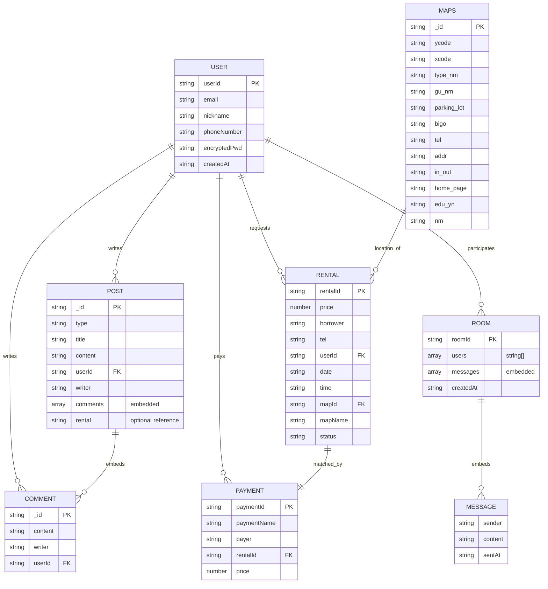
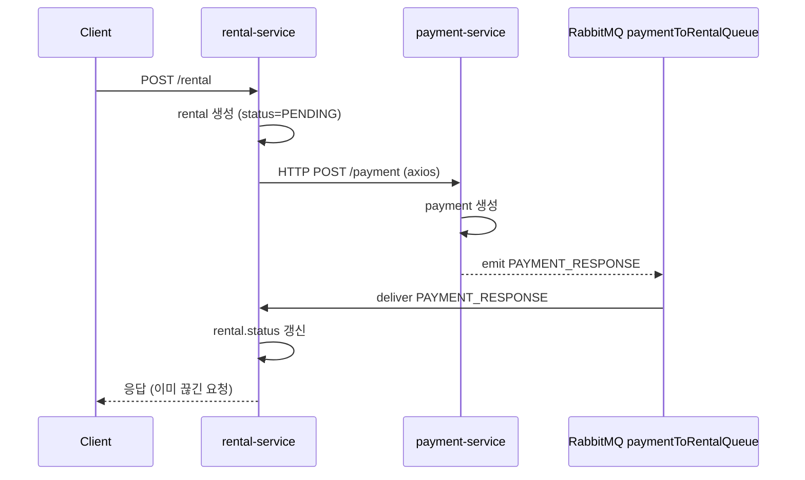

# MyLifeSports 레거시 분석

> 원본 레포: https://github.com/biuea3866/MyLifeSports
> 작성일: 2026-05-19
> 목적: NestJS 7-MSA → Kotlin/Spring 모놀리스 리팩토링을 위한 AS-IS 인벤토리

## Overview

MyLifeSports는 생활 체육 플랫폼 시제품입니다. NestJS 8.x 기반 7개 마이크로서비스와 React Native 클라이언트 앱으로 구성된 모노레포입니다. 루트 README가 없고 운영 배포 흔적도 없어, 본 문서는 코드 기준 인벤토리만 다룹니다.

### 기술 스택

| 레이어 | 기술 | 비고 |
|---|---|---|
| BE 프레임워크 | NestJS 8.x + TypeScript 4.3 | 7개 서비스 동일 |
| ODM | Mongoose 6.x | 전 서비스 MongoDB 단일 인스턴스 가정 |
| 메시지 브로커 | RabbitMQ (amqplib) | rental ↔ payment 1회성 RPC 형태 |
| 인증 | passport-jwt + passport-local + bcrypt | auth-service 단독 |
| 클라이언트 | React Native | iOS/Android 동시 타깃 |

### 레포 구조

```
MyLifeSports/
├── auth-service/
├── post-service/
├── message-service/
├── rental-service/
├── payment-service/
├── map-service/
├── wayfinding-service/
└── client_app/
```

모노레포지만 워크스페이스 도구(yarn/npm workspaces, nx 등)는 사용하지 않습니다. 각 서비스가 독립 `package.json`을 갖습니다.

---

## 서비스 인벤토리

### auth-service

| 항목 | 값 |
|---|---|
| 책임 | 회원 가입·로그인·로그아웃, JWT 발급, 사용자 조회 |
| DB | MongoDB `AUTHSERVICE` |
| 외부 의존 | passport-jwt, passport-local, bcrypt |
| 환경 변수 | `mongodb://localhost:27017/AUTHSERVICE` (하드코딩) |

엔드포인트:
- `POST /auth-service/register` — 회원 가입
- `POST /auth-service/login` — 로그인 (JWT 반환)
- `POST /auth-service/logout` — 로그아웃
- `GET /:userId` — 사용자 단건 조회
- `GET /:userId/check` — userId 중복 확인
- `GET /status` — 헬스 체크 추정

이슈:
- 인가(Role/Permission) 미존재. 모든 API가 JWT만 검증.
- 비밀번호 해싱 라운드·솔트 정책 명시 없음.
- `userId`가 string PK. UUID가 아닌 임의 문자열.

### post-service

| 항목 | 값 |
|---|---|
| 책임 | 게시글·댓글 CRUD, 키워드/타입/사용자별 조회 |
| DB | MongoDB `POSTSERVICE` |
| 외부 의존 | — |

엔드포인트:
- `POST /` — 게시글 생성
- `POST /comment` — 댓글 생성
- `GET /` — 전체 목록
- `GET /posts/type/:type` — 타입별 목록
- `GET /:_id/post` — 단건 조회
- `GET /:userId/posts` — 사용자별 목록
- `GET /posts/keyword/:keyword` — 키워드 검색 (regex 추정)
- `DELETE /:_id/post` — 게시글 삭제
- `DELETE /:_id/comment` — 댓글 삭제

이슈:
- Comment가 Post 내부 임베드 배열. RDBMS 이전 시 별도 테이블 분리 필요.
- 키워드 검색은 MongoDB regex로 추정. 인덱스 전략 불명확.

### message-service

| 항목 | 값 |
|---|---|
| 책임 | 채팅방 생성·조회·삭제, 메시지 작성 |
| DB | MongoDB `MESSAGESERVICE` |
| 외부 의존 | — |

엔드포인트:
- `POST /room/init-room` — 채팅방 생성
- `POST /message` — 메시지 작성
- `GET /:roomId/room` — 채팅방 단건
- `GET /:nickname/rooms` — 사용자별 채팅방
- `GET /:keyword/keyword/rooms` — 키워드로 채팅방 검색
- `GET /room/check` — 채팅방 존재 확인
- `DELETE /:roomId/room` — 채팅방 삭제

이슈:
- Message가 Room 내부 임베드 배열. 메시지 수 증가 시 단일 도큐먼트 16MB 제약 위험.
- 실시간 전송 채널 없음 (WebSocket/SSE 미존재). 폴링 추정.
- userId/nickname 둘 다 사용해 일관성 부족.

### rental-service

| 항목 | 값 |
|---|---|
| 책임 | 체육시설 대여 신청·만료·취소, 결제 응답 수신 |
| DB | MongoDB `RENTALSERVICE` |
| 외부 의존 | RabbitMQ `paymentToRentalQueue` (CloudAMQP), axios |
| 환경 변수 | RabbitMQ URL 평문 커밋 (보안 사고) |

엔드포인트:
- `POST /rental` — 대여 신청
- `GET /:rentalId/rental` — 단건 조회
- `GET /:userId/rentals` — 사용자별 목록
- `PATCH /:rentalId/rental` — 대여 수정 (상태 변경 추정)
- `DELETE /:rentalId/rental` — 대여 취소
- `@EventPattern('PAYMENT_RESPONSE')` — 결제 응답 수신 핸들러

이슈:
- **CloudAMQP 시크릿 평문 커밋** — `rental-service/src/app.module.ts:14`에 `amqps://vsrleeyf:O4J_Nq...` 형태로 노출. **즉시 회수** 필요.
- 결제 ↔ 대여는 단발 RMQ 메시지로 연동. 결제 실패 시 보상 트랜잭션 없음.
- `Rental.status`가 string. enum 부재로 상태 전이 검증 불가.

### payment-service

| 항목 | 값 |
|---|---|
| 책임 | 결제 생성·조회, rental에 결제 결과 통보 |
| DB | MongoDB `PAYMENTSERVICE` |
| 외부 의존 | RabbitMQ publisher |

엔드포인트:
- `POST /payment` — 결제 생성 (rental_id 수반)
- `GET /:paymentId/payment` — 단건 조회
- `GET /:payer/payments` — 결제자별 목록
- `GET /:rentalId/payment-from-rental` — rental 기준 결제 조회

이슈:
- 결제 게이트웨이(PG) 연동 없음. 결제 정보만 저장하는 placeholder.
- 멱등성 키 없음. 동일 결제 중복 생성 가능.

### map-service

| 항목 | 값 |
|---|---|
| 책임 | 체육시설 지도 데이터 HTTP 조회 |
| DB | 없음 (인메모리 또는 upstream 추정) |
| 외부 의존 | RabbitMQ 의존성 선언만 있고 미사용 |

엔드포인트:
- `GET /` — 전체 시설 목록
- `GET /map/:_id` — 단건 조회
- `GET /maps/list-type-nm/:type_nm` — 시설 유형별 목록
- `GET /maps/list-gu-nm/:gu_nm` — 자치구별 목록
- `GET /maps/list-gu-type` — 자치구 + 유형 조합 통계

### wayfinding-service

| 항목 | 값 |
|---|---|
| 책임 | map-service와 동일 데이터, TCP MessagePattern 전용 |
| DB | MongoDB `WAYFINDINGSERVICE` |
| 외부 의존 | NestJS microservice (TCP transport) |

MessagePattern:
- `GET_ALL` — 전체 조회
- `GET_ONE` — 단건
- `GET_LIST_TYPE` — 유형별
- `GET_LIST_GU` — 자치구별
- `GET_LIST_GU_TYPE` — 자치구+유형

이슈:
- **map-service와 데이터·책임 100% 중복**. HTTP/TCP 두 게이트웨이만 다름. Kotlin 이전 시 단일 Facility 도메인으로 통합 필수.

### client_app

| 항목 | 값 |
|---|---|
| 책임 | iOS/Android React Native 앱 |
| 의존 | 위 BE 서비스 호출 |

이슈:
- 직접 BE 마이크로서비스 호출. API Gateway 또는 BFF 없음.

---

## 데이터 모델 (ERD)



스키마 공통 이슈:
- **PK 정책 혼재** — `_id` (ObjectId), `userId`/`rentalId`/`paymentId` (string), `roomId` (string). 일관성 0%.
- **타임스탬프 string 저장** — `createdAt`이 ISO string. 비교·정렬에 비용. Kotlin 이전 시 `ZonedDateTime` 강제.
- **FK 무결성 없음** — Mongoose ref만 사용. 삭제 시 고아 도큐먼트 발생 가능.
- **enum 부재** — `Post.type`, `Rental.status` 등 모두 string. 검증 로직 산재.

---

## API 엔드포인트 전수 표

| 서비스 | 메서드 | 경로 | 책임 |
|---|---|---|---|
| auth | POST | `/auth-service/register` | 회원 가입 |
| auth | POST | `/auth-service/login` | 로그인 |
| auth | POST | `/auth-service/logout` | 로그아웃 |
| auth | GET | `/:userId` | 사용자 단건 |
| auth | GET | `/:userId/check` | 중복 확인 |
| auth | GET | `/status` | 헬스 |
| post | POST | `/` | 게시글 생성 |
| post | POST | `/comment` | 댓글 생성 |
| post | GET | `/` | 전체 목록 |
| post | GET | `/posts/type/:type` | 유형별 목록 |
| post | GET | `/:_id/post` | 단건 |
| post | GET | `/:userId/posts` | 사용자별 |
| post | GET | `/posts/keyword/:keyword` | 키워드 |
| post | DELETE | `/:_id/post` | 게시글 삭제 |
| post | DELETE | `/:_id/comment` | 댓글 삭제 |
| message | POST | `/room/init-room` | 채팅방 생성 |
| message | POST | `/message` | 메시지 작성 |
| message | GET | `/:roomId/room` | 채팅방 단건 |
| message | GET | `/:nickname/rooms` | 사용자 채팅방 |
| message | GET | `/:keyword/keyword/rooms` | 키워드 검색 |
| message | GET | `/room/check` | 존재 확인 |
| message | DELETE | `/:roomId/room` | 채팅방 삭제 |
| rental | POST | `/rental` | 대여 신청 |
| rental | GET | `/:rentalId/rental` | 단건 조회 |
| rental | GET | `/:userId/rentals` | 사용자별 |
| rental | PATCH | `/:rentalId/rental` | 수정 |
| rental | DELETE | `/:rentalId/rental` | 취소 |
| rental | EventPattern | `PAYMENT_RESPONSE` | 결제 응답 수신 |
| payment | POST | `/payment` | 결제 생성 |
| payment | GET | `/:paymentId/payment` | 단건 |
| payment | GET | `/:payer/payments` | 결제자별 |
| payment | GET | `/:rentalId/payment-from-rental` | 대여 기준 결제 |
| map | GET | `/` | 시설 전체 |
| map | GET | `/map/:_id` | 단건 |
| map | GET | `/maps/list-type-nm/:type_nm` | 유형별 |
| map | GET | `/maps/list-gu-nm/:gu_nm` | 자치구별 |
| map | GET | `/maps/list-gu-type` | 조합 통계 |
| wayfinding | MessagePattern | `GET_ALL` | 전체 |
| wayfinding | MessagePattern | `GET_ONE` | 단건 |
| wayfinding | MessagePattern | `GET_LIST_TYPE` | 유형별 |
| wayfinding | MessagePattern | `GET_LIST_GU` | 자치구별 |
| wayfinding | MessagePattern | `GET_LIST_GU_TYPE` | 조합 |

총 HTTP 엔드포인트 36개 + TCP MessagePattern 5개 + EventPattern 1개.

---

## 이벤트 흐름

### 결제 → 대여 응답 (RabbitMQ)



문제점:
- 클라이언트는 동기 요청을 보냈으나 결제 응답은 비동기. 클라이언트는 결과를 받지 못함.
- 결제 실패 시 rental 상태가 영구 `PENDING`으로 남을 가능성.
- `PAYMENT_RESPONSE` 메시지 스키마 정의 없음. 페이로드 검증 부재.

---

## 안티패턴 / 기술 부채 10가지

| # | 항목 | 위치 | 심각도 |
|---|---|---|---|
| 1 | CloudAMQP 시크릿 평문 커밋 | `rental-service/src/app.module.ts:14` | Critical |
| 2 | map-service ↔ wayfinding-service 데이터·책임 중복 | 두 서비스 전체 | High |
| 3 | MongoDB 연결 문자열 하드코딩 | 전 서비스 `app.module.ts` | High |
| 4 | 결제 보상 트랜잭션 부재 (Saga 없음) | rental ↔ payment 흐름 | High |
| 5 | Anemic Service 패턴 (Domain Model 없음) | 전 서비스 `*.service.ts` | High |
| 6 | 테스트 파일 0건 (`test/` 디렉토리 비어있음) | 전 서비스 | High |
| 7 | 인가(Role/Permission) 미존재 | auth-service | Medium |
| 8 | Comment·Message 임베드 모델 (16MB 한계) | post, message | Medium |
| 9 | PK 정책 혼재 (string/ObjectId 혼용) | 전 스키마 | Medium |
| 10 | enum 부재로 상태 전이 검증 불가 | Rental, Post 등 | Medium |

---

## 마이그레이션 매핑 가이드

### 기술 매핑

| AS-IS | TO-BE | 비고 |
|---|---|---|
| NestJS 8.x | Spring Boot 3.x (Kotlin 1.9) | 모놀리스 단일 모듈 (도메인 패키지 분리) |
| 7개 마이크로서비스 | 단일 애플리케이션 (Hexagonal + 도메인 패키지) | 운영 부담 감소, 배포 단순화 |
| MongoDB (전 서비스) | **MySQL 8 (주)** + MongoDB 7 (비정형만) | 원칙: 트랜잭션 필요 → MySQL, 비정형·읽기 위주 → MongoDB |
| Mongoose ODM | JPA (Hibernate) + QueryDSL | 복잡 쿼리는 CustomRepositoryImpl |
| RabbitMQ | **Kafka 3.x** | 도메인 이벤트 토픽 통일, 멱등 키 필수 |
| string PK | **Long PK** (auto increment) + 비즈니스 키 별도 | `Rental.rentalId` 같은 비즈니스 키는 unique index |
| Embedded Comment/Message | 별도 테이블 (FK) | `comments`, `messages` 테이블 신설 |
| string status | Kotlin enum (canTransitTo) | 상태 전이 캡슐화 |
| passport-jwt | Spring Security + JWT + Redis 블랙리스트 | 로그아웃·만료 처리 |
| Anemic Service | Rich Domain Model + DomainService + UseCase | be-code-convention 준수 |
| 테스트 0건 | Kotest BehaviorSpec + Testcontainers | TDD 5레이어 (domain/application/infrastructure/presentation/scenario) |

### 도메인 매핑

| 레거시 서비스 | 신규 도메인 패키지 | 변경 사항 |
|---|---|---|
| auth-service | `domain.user`, `domain.auth` | Role/Permission 신설, JWT 블랙리스트 Redis |
| post-service | `domain.post` (MongoDB 유지) | Comment 별도 컬렉션 분리, 키워드 검색 인덱스 |
| message-service | `domain.message` (MongoDB 유지) | Message 별도 컬렉션, WebSocket/SSE 도입 검토 |
| rental-service | `domain.booking` (MySQL) | **시설 예약**으로 확장 — 좌석/시간대 단위, Redis 분산 락 |
| payment-service | `domain.payment` (MySQL) | Kafka Saga 패턴, 멱등 키, PG 어댑터 자리 마련 |
| map-service + wayfinding-service | `domain.facility` (MongoDB) | **단일 통합** — HTTP만 노출, 지도 데이터 비정형 |
| (신규) | `domain.ticketing` (MySQL + Redis) | **경기 티켓** 판매, 좌석 임시 점유 락 |
| (신규) | `domain.goods` (MySQL) | 스포츠 **물품 구매** — 상품/재고/주문/장바구니 |
| (신규) | `domain.notification` (MySQL + Kafka consumer) | 결제·예약·발권 통합 알림 |

### Kafka 토픽 매핑

| 레거시 RabbitMQ | 신규 Kafka 토픽 | 페이로드 |
|---|---|---|
| `paymentToRentalQueue` `PAYMENT_RESPONSE` | `payment.completed.v1` | paymentId, orderId, status, paidAt |
| (없음) | `booking.confirmed.v1` | bookingId, userId, facilityId, slotAt |
| (없음) | `ticket.issued.v1` | ticketId, eventId, seatNo, userId |
| (없음) | `goods.stock.changed.v1` | productId, delta, reason |
| (없음) | `notification.requested.v1` | recipientId, channel, templateId, payload |

### 마이그레이션 순서 권고

1. **공통 인프라** — Spring Boot 모놀리스 부트스트랩, MySQL/MongoDB/Redis/Kafka 컴포즈, harness 규칙 적용
2. **User/Auth** — JWT + Role/Permission 신규. 클라이언트 호환을 위해 동일 엔드포인트 유지 가능
3. **Facility** — map + wayfinding 통합. MongoDB로 그대로 이관 (스키마는 동일)
4. **Booking** — rental 데이터 이관 + 좌석/시간대 모델 확장. **MySQL로 이관**
5. **Payment** — Kafka Saga 도입. 멱등 키 부여
6. **Post / Message** — MongoDB 유지하되 임베드 모델 해체
7. **Ticketing / Goods / Notification** — 신규 도메인 추가

---

## 결론

레거시 MyLifeSports는 **개념 증명 수준의 결합도 낮은 MSA**입니다. 운영 신뢰성·보안·트랜잭션 일관성 모두 부족하며, 데이터 모델은 모두 재설계가 필요합니다.

리팩토링 방향은 단순 이관이 아닌 **다음 4가지를 동시에 수행**합니다:
1. 마이크로서비스 7개 → 단일 모놀리스 (운영 단순화)
2. MongoDB 단일 → MySQL 주 + MongoDB 보조 (트랜잭션 강화)
3. RabbitMQ ad-hoc → Kafka 도메인 이벤트 표준화
4. Anemic + 테스트 0건 → Rich Domain Model + TDD 5레이어

신규 도메인 3종(Ticketing/Goods/Notification)은 기존 도메인 정리 후 추가하므로, **PRD에서 도메인 경계와 저장소 분할 정책을 먼저 명시**해야 합니다.
