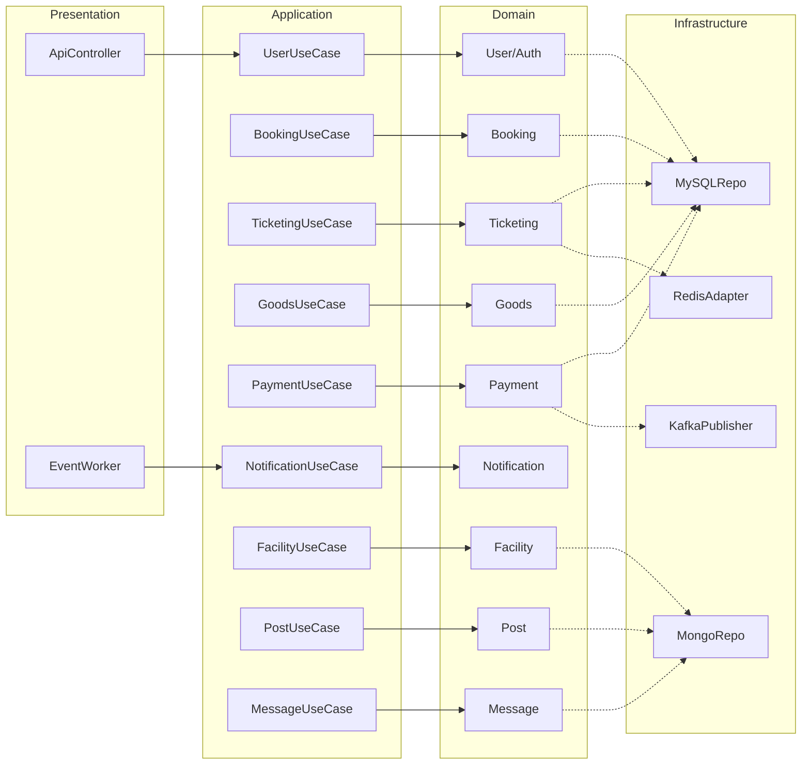
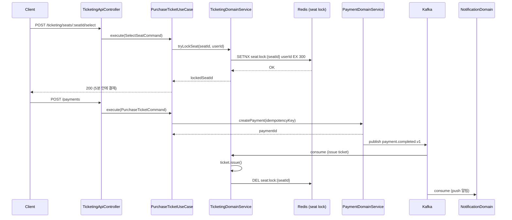
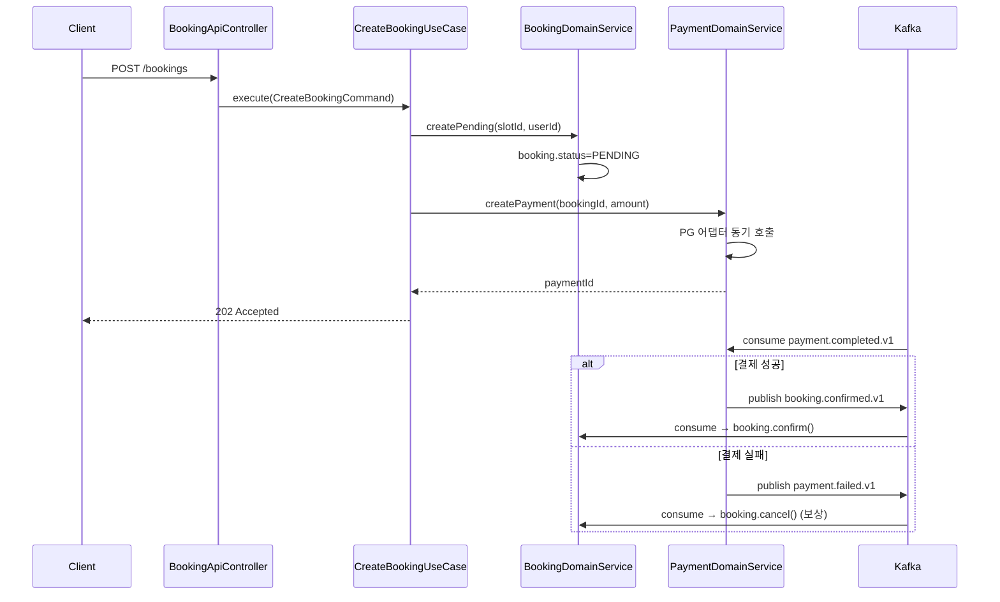
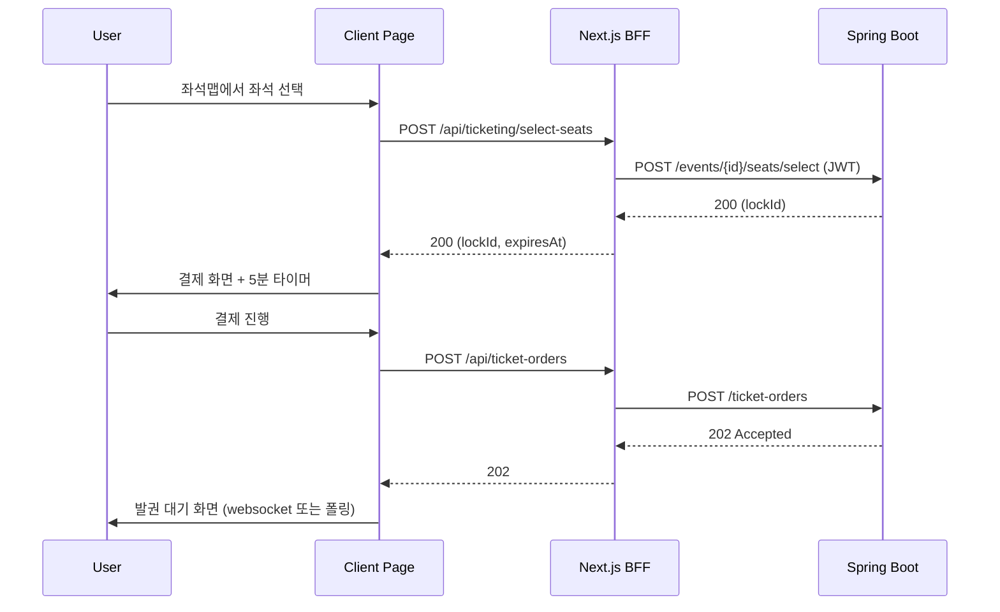
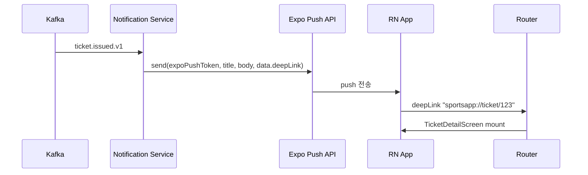

# Sports Application PRD

> 작성일: 2026-05-19
> 작성자: biuea@doodlin.co.kr
> 소스: [MyLifeSports 레거시 분석](../legacy-analysis/MyLifeSports.md)

## 배경 (Background)

MyLifeSports는 NestJS 8.x 기반 7개 마이크로서비스로 구성된 생활 체육 플랫폼 시제품입니다. 다음 4가지 한계로 정상 운영이 어렵습니다.

1. **운영 부담** — 7개 독립 서비스를 단일 개발자가 유지. 배포·로깅·모니터링이 분산됨
2. **데이터 일관성 부재** — RabbitMQ 단발 메시지로 결제↔대여 연동. 보상 트랜잭션 없음
3. **보안 사고 노출** — `rental-service/src/app.module.ts:14`에 CloudAMQP 시크릿이 평문 커밋됨
4. **테스트 0건** — 모든 서비스 `test/` 디렉토리가 비어 있음

본 PRD는 위 4가지를 동시에 해결하면서 신규 **스포츠 티케팅·시설 예매·물품 구매** 도메인을 함께 추가합니다. 마이그레이션과 신규 도메인은 한 베이스에서 진행해, 도메인 경계와 저장소 정책을 처음부터 정리합니다.

## 목표 (Goals)

- 7개 NestJS 서비스를 **Kotlin/Spring Boot 3.x 단일 모놀리스**로 통합합니다.
- 9개 도메인(기존 6 + 신규 3)을 Hexagonal + Rich Domain Model로 정리합니다.
- 결제 트랜잭션 일관성을 Kafka Saga로 확보합니다(결제 실패 시 자동 보상).
- 좌석/시설 동시 예약 충돌을 Redis 분산 락으로 0건으로 만듭니다.
- 도메인·UseCase·인프라·표현·시나리오 5개 레이어 테스트 커버리지 80% 이상을 확보합니다.
- 시크릿 평문 노출 0건, 운영 환경 변수는 전부 외부 주입으로 전환합니다.

## 비목표 (Non-Goals)

- PG(결제 게이트웨이) 실 연동 — 어댑터 자리만 마련하고 mock 구현
- 운영 자동화 (CI/CD, Helm chart) — 별도 트랙
- 데이터 마이그레이션 자동화 도구 작성 — 1회성 스크립트만 작성
- 분석/리포트 도메인 — 본 PRD 범위 밖
- 신규 디자인 시스템 도입 — Web/Mobile 모두 기본 컴포넌트 라이브러리 기반(Tailwind+shadcn / React Native Paper)으로 시작

## 사용자 스토리 (User Stories)

| As a | I want to | So that |
|---|---|---|
| 일반 사용자 | 회원 가입하고 로그인 | 서비스 기능 이용 |
| 일반 사용자 | 체육시설을 검색하고 예약 | 원하는 시간대에 운동 |
| 일반 사용자 | 예약 시 결제하고 결과 즉시 확인 | 예약 확정 여부 파악 |
| 일반 사용자 | 프로 스포츠 경기 티켓 구매 | 직관 관람 |
| 일반 사용자 | 티켓 좌석을 직접 선택 | 원하는 자리 확보 |
| 일반 사용자 | 스포츠 용품 검색하고 장바구니에 담아 결제 | 운동 장비 구매 |
| 일반 사용자 | 게시판에 글·댓글 작성 | 커뮤니티 활동 |
| 일반 사용자 | 다른 사용자와 채팅 | 운동 메이트 모집 |
| 일반 사용자 | 결제·예약·티켓 발권 결과 알림 받기 | 누락 없이 진행 상황 인지 |
| 시설 운영자 | 시설 등록·시간대 관리 | 예약 받기 (V2) |
| 관리자 | 사용자 권한 부여·회수 | 부정 사용 통제 |

## 기능 요구사항 (Functional Requirements)

### FR-01. 회원 가입·로그인 (Auth/User 도메인)

사용자는 이메일·비밀번호로 가입하고 로그인합니다. 시스템은 JWT를 발급하며, 로그아웃 시 토큰을 Redis 블랙리스트에 등재합니다. 기본 Role은 `USER`이며 관리자가 `ADMIN`·`FACILITY_OWNER`로 부여 가능합니다.

### FR-02. 체육시설 조회 (Facility 도메인)

사용자는 시설을 전체 목록·자치구별·유형별·자치구+유형 조합으로 조회합니다. 시설 데이터는 비정형(주차장·홈페이지·교육 가능 여부 등 다양한 메타)이며 트랜잭션이 불필요해 MongoDB에 저장합니다. map-service와 wayfinding-service는 단일 HTTP API로 통합합니다.

### FR-03. 시설 예매 (Booking 도메인)

사용자는 시설·날짜·시간 슬롯을 선택해 예약을 신청합니다. 시스템은 동일 슬롯의 동시 예약을 Redis 분산 락으로 차단하고 결제 결과를 대기합니다. 결제 실패 시 예약을 자동 취소합니다(Saga 보상).

### FR-04. 경기 티켓 구매 (Ticketing 도메인)

사용자는 경기(Event)를 조회하고 좌석을 선택합니다. 좌석 선택 시 Redis에 5분 TTL로 점유 락을 걸고, 결제 완료 시 영구 발권합니다. 5분 내 결제 미완료 시 락이 해제되어 다른 사용자가 선택 가능합니다.

### FR-05. 스포츠 물품 구매 (Goods 도메인)

사용자는 상품을 카테고리·키워드로 검색하고 장바구니에 담아 결제합니다. **재고는 주문 PENDING 생성 시점에 예약 차감하고, 결제 실패 시 보상 복원**합니다 (Kafka `payment.failed.v1` 구독 → `Stock.restore`). 동시 주문이 잦은 인기 상품의 over-sell을 방지하기 위해 결제 확정을 기다리지 않고 즉시 차감하는 전략입니다. 결제 성공 시 추가 차감은 없습니다. 인기 상품 목록은 Redis 캐시로 응답합니다.

### FR-06. 통합 결제 (Payment 도메인)

Booking·Ticketing·Goods 세 도메인이 동일한 Payment 도메인을 호출합니다. 결제 생성 시 멱등 키를 강제하며, 결과는 `payment.completed.v1` Kafka 토픽으로 발행합니다. 각 도메인은 이 토픽을 구독해 자기 도메인의 후속 처리를 수행합니다.

### FR-07. 게시판 (Post 도메인)

사용자는 글을 작성·조회·삭제하고 댓글을 답니다. 키워드·유형·작성자별 조회를 지원합니다. 콘텐츠는 비정형이며 트랜잭션이 불필요해 MongoDB에 저장하되, Comment는 별도 컬렉션으로 분리합니다(16MB 한계 회피).

### FR-08. 채팅 (Message 도메인)

사용자는 1:1 또는 그룹 채팅방을 생성하고 메시지를 주고받습니다. Message는 Room과 별도 컬렉션으로 저장합니다. 실시간 전송은 WebSocket 또는 SSE로 도입하되 V2 단계로 미룰 수 있습니다.

### FR-09. 통합 알림 (Notification 도메인)

결제 완료·예약 확정·티켓 발권·재고 변경 이벤트를 Kafka로 구독해 사용자에게 알림을 발송합니다. 채널은 인앱·이메일·SMS 어댑터 자리를 마련하고 V1은 인앱만 구현합니다.

### FR-10. 인가 (Authorization)

`USER`는 본인 자원만 조회·수정 가능합니다. `FACILITY_OWNER`는 본인 소유 시설의 예약을 조회·관리합니다. `ADMIN`은 전체 자원에 접근 가능합니다. Spring Security `@PreAuthorize` 기반 메서드 보안을 사용합니다.

## 비기능 요구사항 (Non-Functional Requirements)

| 영역 | 요구사항 |
|---|---|
| 성능 | API P95 응답시간 500ms 이내, 좌석 선택 P95 200ms 이내 |
| 가용성 | 단일 인스턴스 가정 (V1), SLA 명시 없음 |
| 데이터 | 결제·예약·티켓·주문 트랜잭션은 ACID 보장 |
| 보안 | JWT 만료 30분, Refresh Token Redis 저장, 모든 시크릿은 환경 변수로만 주입 |
| 운영 | 도메인 이벤트는 Kafka에 v1 suffix 토픽으로 발행, 멱등 키 필수 |
| 테스트 | 5레이어(도메인/애플리케이션/인프라/표현/시나리오) 커버리지 80% 이상 |
| 코드 품질 | be-code-convention 준수, harness-rules 위반 0건 |

## 제약 조건 (Constraints)

- 모놀리스 구조 강제 (서비스 분리 금지)
- BE 언어는 Kotlin 1.9, 빌드 도구는 Gradle Kotlin DSL
- MySQL 8 / MongoDB 7 / Redis 7 / Kafka 3.x 외 추가 인프라 금지
- harness-rules 금지 패턴 (@Query, LocalDateTime, ConsumerRecord<String,String> 등) 위반 시 PR 거부
- 시크릿 평문 커밋 금지 (pre-commit hook)
- `@Transactional`은 UseCase에만, Repository 직접 호출은 DomainService에서만

## 데이터 저장소 정책

| 저장소 | 사용 도메인 | 사용 이유 |
|---|---|---|
| MySQL 8 (주) | User, Role, Booking, Ticketing(Event/Seat/Order), Goods(Product/Stock/Order/Cart), Payment, Notification(로그) | 트랜잭션 강제 필요, 외래키 무결성 보장 |
| MongoDB 7 | Post, Comment, Message, Room, Facility | 비정형 스키마, 트랜잭션 불필요, 읽기 위주 |
| Redis 7 | JWT 블랙리스트, 좌석 임시 점유 락(TTL 5분), 인기 상품 캐시, 분산 락 | TTL 기반 락, 캐시 |
| Kafka 3.x | 도메인 이벤트 발행/구독 | 결제·재고·알림 비동기 처리, 도메인 간 결합 차단 |

원칙: **기본은 MySQL**. 명백히 비정형이고 트랜잭션 검증이 불필요한 경우에만 MongoDB 사용.

## 도메인 구성

### 9개 도메인



### 핵심 시퀀스

#### 티켓 좌석 예약 + 결제



#### 시설 예매 결제 Saga



## ERD

### MySQL 주요 테이블

```mermaid
erDiagram
    USERS ||--o{ USER_ROLES : has
    ROLES ||--o{ USER_ROLES : assigned_to
    USERS ||--o{ BOOKINGS : creates
    USERS ||--o{ TICKET_ORDERS : creates
    USERS ||--o{ GOODS_ORDERS : creates
    USERS ||--o{ PAYMENTS : pays

    SLOTS ||--o{ BOOKINGS : reserves
    EVENTS ||--o{ SEATS : has
    SEATS ||--o{ TICKETS : sold_as
    TICKET_ORDERS ||--o{ TICKETS : contains
    PRODUCTS ||--o{ STOCKS : tracks
    PRODUCTS ||--o{ CART_ITEMS : added_to
    GOODS_ORDERS ||--o{ GOODS_ORDER_ITEMS : contains

    PAYMENTS ||--o| BOOKINGS : settles
    PAYMENTS ||--o| TICKET_ORDERS : settles
    PAYMENTS ||--o| GOODS_ORDERS : settles

    USERS {
        bigint id PK
        varchar email
        varchar nickname
        varchar password_hash
        varchar phone_number
        timestamp created_at
    }
    ROLES {
        bigint id PK
        varchar name
    }
    USER_ROLES {
        bigint user_id FK
        bigint role_id FK
    }
    SLOTS {
        bigint id PK
        varchar facility_id
        date date
        varchar time_range
        int capacity
    }
    BOOKINGS {
        bigint id PK
        bigint user_id FK
        bigint slot_id FK
        varchar status
        bigint payment_id FK
        timestamp created_at
    }
    EVENTS {
        bigint id PK
        varchar title
        varchar venue
        timestamp starts_at
    }
    SEATS {
        bigint id PK
        bigint event_id FK
        varchar section
        varchar row_no
        varchar seat_no
        int price
    }
    TICKET_ORDERS {
        bigint id PK
        bigint user_id FK
        varchar status
        bigint payment_id FK
    }
    TICKETS {
        bigint id PK
        bigint ticket_order_id FK
        bigint seat_id FK
        varchar status
    }
    PRODUCTS {
        bigint id PK
        varchar name
        varchar category
        int price
    }
    STOCKS {
        bigint product_id PK_FK
        int quantity
    }
    CART_ITEMS {
        bigint id PK
        bigint user_id FK
        bigint product_id FK
        int quantity
    }
    GOODS_ORDERS {
        bigint id PK
        bigint user_id FK
        varchar status
        bigint payment_id FK
    }
    GOODS_ORDER_ITEMS {
        bigint id PK
        bigint goods_order_id FK
        bigint product_id FK
        int quantity
        int price
    }
    PAYMENTS {
        bigint id PK
        bigint user_id FK
        varchar idempotency_key
        varchar method
        int amount
        varchar status
        timestamp created_at
    }
```

### MongoDB 컬렉션

| 컬렉션 | 도큐먼트 | 인덱스 |
|---|---|---|
| `posts` | `_id, type, title, content, userId, writer, createdAt` | `userId`, `type`, `createdAt`, text index on `title+content` |
| `comments` | `_id, postId, content, userId, writer, createdAt` | `postId+createdAt`, `userId` |
| `rooms` | `_id, name, participantIds[], createdAt` | `participantIds` |
| `messages` | `_id, roomId, senderId, content, sentAt` | `roomId+sentAt` |
| `facilities` | `_id, code, name, gu, type, address, lat, lng, parking, tel, homePage, eduYn, meta{}` | `gu`, `type`, geospatial on `lat+lng` |

Comment·Message는 임베드 모델에서 분리되어 16MB 한계와 부분 갱신 비용을 해결합니다.

### Kafka 토픽

| 토픽 | 발행자 | 구독자 | 페이로드 핵심 필드 |
|---|---|---|---|
| `payment.completed.v1` | PaymentDomainService | Booking, Ticketing, Goods, Notification | paymentId, orderType, orderId, amount, paidAt, idempotencyKey |
| `payment.failed.v1` | PaymentDomainService | Booking, Ticketing, Goods | paymentId, orderType, orderId, reason, failedAt |
| `booking.confirmed.v1` | BookingDomainService | Notification | bookingId, userId, facilityId, facilityName, slotAt, amount |
| `ticket.issued.v1` | TicketingDomainService | Notification | ticketIds[], userId, eventId, eventTitle, venue, startsAt, seats[{section, rowNo, seatNo, price}] |
| `goods.stock.changed.v1` | GoodsDomainService | Goods(인기 상품 캐시 invalidate), Notification(V2 관심 상품 재입고 알림) | productId, delta, reason, occurredAt |
| `notification.requested.v1` | (도메인 통합 — 내부 Spring 이벤트로 처리, V1은 Kafka 미사용) | NotificationDomainService | recipientId, channel, templateId, payload |

`payment.requested.v1`은 V1 범위에서 제외 (사용처 없음). 결제 요청은 동기 PG 어댑터 호출이며, 별도 토픽이 필요해지면 V2에서 신설.

모든 토픽은 v1 접미사. 페이로드 진화 시 v2 신토픽 신설 + dual-publish 후 v1 제거.

## 영향 범위 (Scope)

| 레포 | 변경 유형 | 설명 |
|---|---|---|
| `sports-application` (신규 BE) | 신규 생성 | Kotlin/Spring Boot 모놀리스, 9개 도메인 패키지 |
| `sports-application-web` (신규 Web) | 신규 생성 | Next.js 14 App Router + BFF, 사용자/관리자 화면 |
| `sports-application-mobile` (신규 Mobile) | 신규 생성 | React Native 0.74 + Expo 51, iOS/Android 사용자 앱 |
| `MyLifeSports` (레거시) | 폐기 예정 | 데이터 마이그레이션 후 archive |
| `client_app` (RN 레거시) | 폐기 예정 | 신규 mobile 레포로 대체 |

---

## Web 트랙 (Next.js)

### 목표

사용자가 데스크톱·태블릿에서 시설 검색·예약·티켓 구매·물품 구매·게시판·채팅을 사용할 수 있는 웹 클라이언트를 제공합니다. 관리자(ADMIN)·시설 운영자(FACILITY_OWNER)는 동일 앱 내 별도 라우트로 어드민 기능을 사용합니다.

### 기술 스택

| 항목 | 선택 | 비고 |
|---|---|---|
| 프레임워크 | Next.js 14 App Router | RSC + Server Actions 활용 |
| 언어 | TypeScript 5 strict | `any` 금지, exhaustive switch 강제 |
| 상태관리 | Zustand (클라이언트) + TanStack Query (서버 캐시) | Redux 도입 안 함 |
| 스타일 | Tailwind CSS + shadcn/ui | CSS-in-JS 도입 안 함 |
| 폼 | react-hook-form + zod | 서버·클라이언트 동일 스키마 |
| BFF | Next.js Route Handler (`/app/api/*`) | BE 직접 호출 금지 — Facade/Service 경유 |
| 테스트 | Vitest + Testing Library + Playwright | 단위 / 컴포넌트 / E2E |
| 빌드 | Turbopack | — |

### 구조 원칙

- **BFF 패턴 강제** — 클라이언트 컴포넌트가 BE API를 직접 호출하지 않음. `app/api/*` Route Handler가 인증·DTO 변환·집계를 수행하고 클라이언트는 BFF만 호출.
- **TanStack Query 캐시 단일 소스** — 동일 자원 중복 fetch 금지.
- **접근성(a11y) 의무** — 모든 폼 컴포넌트는 label/aria 속성 필수. axe-core CI 검증.
- **번들 예산** — 초기 진입 JS bundle gzip 250KB 이하.

### 주요 화면

| 영역 | 화면 |
|---|---|
| 공개 | 랜딩, 시설 검색, 시설 단건, 경기 목록, 경기 단건+좌석맵, 상품 목록, 상품 단건 |
| 인증 | 가입, 로그인, 비밀번호 찾기 |
| 사용자 | 마이페이지(예약/티켓/주문/알림), 장바구니, 결제, 게시판, 채팅 |
| Owner | 본인 시설 슬롯 관리, 예약 목록 |
| Admin | 사용자/역할 관리, 이벤트(경기) 등록, 상품 등록 |

### 핵심 흐름 (티켓 좌석 예약)



---

## Mobile 트랙 (React Native)

### 목표

iOS/Android 사용자가 위치 기반으로 시설을 찾고 예약·티켓·물품 구매·푸시 알림을 받을 수 있는 네이티브 앱을 제공합니다. 레거시 `client_app`을 폐기하고 신규 RN 0.74 + Expo 51 기반으로 재구축합니다.

### 기술 스택

| 항목 | 선택 | 비고 |
|---|---|---|
| 프레임워크 | React Native 0.74 + Expo SDK 51 | New Architecture(Fabric/TurboModules) 사용 |
| 언어 | TypeScript 5 strict | `any` 금지 |
| 라우팅 | expo-router | 파일 기반 라우팅 |
| 상태관리 | Zustand + TanStack Query | Web과 동일 |
| 폼 | react-hook-form + zod | Web과 동일 스키마 재사용 |
| 네이티브 모듈 | expo-notifications, expo-location, expo-secure-store | JWT는 SecureStore 저장 |
| 디자인 | React Native Paper + 자체 토큰 | NativeWind는 도입 안 함 (성능 우선) |
| 테스트 | Jest + React Native Testing Library + Detox | 단위 / 컴포넌트 / E2E |

### 구조 원칙

- **Repository 레이어** — TanStack Query hooks를 화면에서 직접 호출하지 않고 `api/<도메인>.ts` Repository 모듈을 경유. 화면은 hook을 통해 Repository를 사용.
- **JWT 보관** — AccessToken은 메모리(Zustand), RefreshToken은 expo-secure-store. AsyncStorage에 토큰 저장 금지.
- **푸시 알림** — Expo Push Service 활용. BE의 NOTIFICATION 도메인이 expoPushToken을 발급된 토큰 테이블에 저장하고 발송 시 Expo HTTP API 호출.
- **딥링크** — `sportsapp://event/{id}` 형태로 푸시 알림에서 화면 진입. expo-router의 typed deep link.
- **오프라인 처리** — 조회 응답은 TanStack Query 디스크 persist로 30분 캐시. 결제·예약은 오프라인 시 명시적 에러.

### 주요 화면

| 영역 | 화면 |
|---|---|
| 공개 | 스플래시, 로그인, 가입 |
| 메인 탭 | 홈(추천 경기/상품), 시설 검색, 마이페이지 |
| 상세 | 시설 단건+지도, 경기 단건+좌석맵, 상품 단건 |
| 거래 | 장바구니, 결제, 결제 결과 |
| 마이 | 예약/티켓/주문/알림 목록 |
| 채팅 | 채팅방 목록, 채팅방 (실시간은 V2) |

### 핵심 흐름 (푸시 알림 → 딥링크)



### 권한 처리

- 위치(시설 검색용): 앱 시작 시 요청, 거부 시 자치구 셀렉터로 fallback.
- 알림: 가입 직후 요청.
- 카메라: V2 (QR 입장 스캔 시).

---

## 마일스톤

| 단계 | 내용 | 산출물 |
|---|---|---|
| M0. 인프라 부트스트랩 | Spring Boot 골격, MySQL/MongoDB/Redis/Kafka 컴포즈, harness 적용 | 빈 모놀리스 + 헬스 체크 |
| M1. User/Auth | 가입·로그인·JWT·Role/Permission | Auth API + Redis 블랙리스트 |
| M2. Facility | map+wayfinding 통합, MongoDB 이관 | Facility 조회 API |
| M3. Booking | Slot 모델, Redis 분산 락, Booking API | Booking 생성·취소 + Saga 골격 |
| M4. Payment | 멱등 키, Kafka 토픽, Saga publisher | Payment 생성 + 이벤트 발행 |
| M5. Ticketing | Event/Seat/Ticket, 좌석 락(5분), 구매 | Ticketing 전체 흐름 |
| M6. Goods | Product/Stock/Cart/Order, 재고 보상 | Goods 전체 흐름 |
| M7. Post/Message | 임베드 해제, Comment/Message 분리 | Post/Message API |
| M8. Notification | Kafka consumer, 인앱 채널 | Notification 발송 |
| M9. 통합 시나리오 | 9도메인 E2E, 부하 테스트 | 시나리오 테스트 통과 |

## 오픈 이슈 (Open Issues)

| # | 질문 | 담당 | 비고 |
|---|---|---|---|
| 1 | PG 실 연동 시점은? V2로 미루는지? | PO | 어댑터 자리만 마련하는 게 합의 |
| 2 | Facility 데이터 출처는? 공공데이터 API 재연동인지 1회 덤프인지 | PO | 레거시 데이터 정합 확인 필요 |
| 3 | 경기(Event) 데이터는 어디서 가져오는가? 운영자 수기 입력인지 외부 피드인지 | PO | M5 시작 전 결정 필요 |
| 4 | 실시간 채팅(WebSocket/SSE)은 V1 포함인지 V2 분리인지 | PO | V2 분리 권장 |
| 5 | 시설 운영자(FACILITY_OWNER) 어드민 UI는 V1 범위인지 | PO | V1은 API만, UI는 V2 권장 |
| 6 | 데이터 마이그레이션 — 레거시 사용자/대여 이력을 신규로 이관할 것인지 | PO | 이관 OR 폐기 결정 필요 |
| 7 | 알림 채널 SMS·이메일 V1 포함 여부 | PO | V1은 인앱만 권장 |
| 8 | 인기 상품 캐시 갱신 주기 정책 | TPM | 1분 주기 가정 (Redis TTL) |

## 다음 단계

| 작업 | 도구 |
|---|---|
| 도메인별 1일/1PR 티켓 분해 | `docs/tickets/<CATEGORY>/<TICKET>.md` 분할 작성 |
| TDD·아키텍처 상세 설계 | `claude-framework:plan-project` |
| Confluence 게시 | `doc-sync` 스킬 |
| 본격 구현 진입 | `/feature` 또는 `/implement` |

## Document History

| 날짜 | 변경 내용 | 작성자 |
|---|---|---|
| 2026-05-19 | 초안 작성 (9개 도메인, 4개 저장소 정책, 9개 마일스톤, 8개 오픈 이슈) | biuea@doodlin.co.kr |
