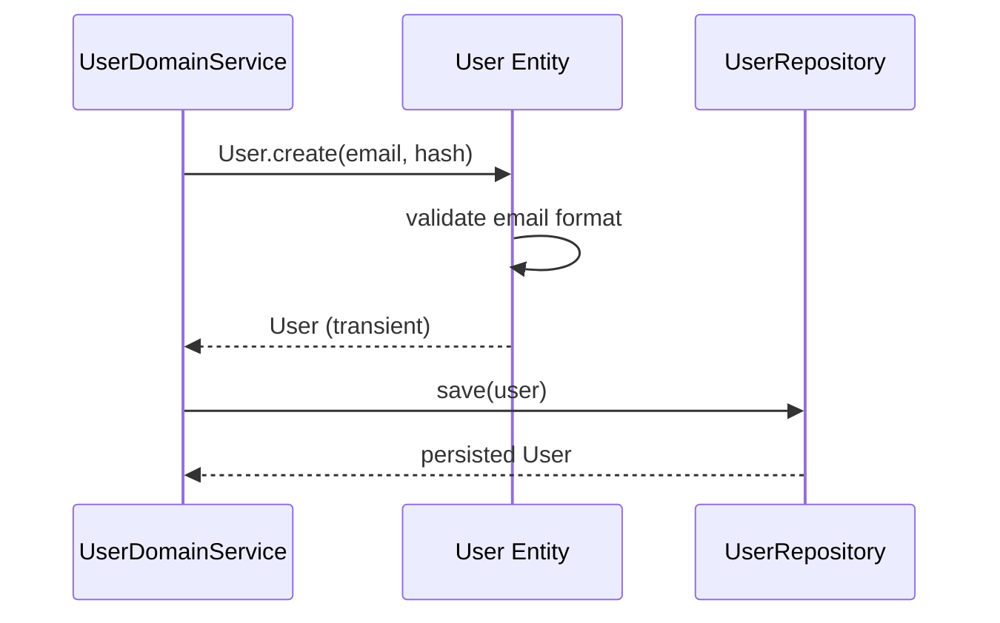
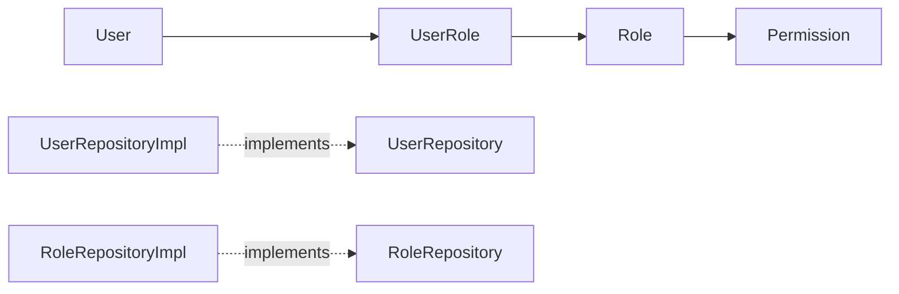

# [AUTH-01] User Entity + Role/Permission 도메인

## 작업 내용 (설계 의도)

### 변경 사항

`domain.user` 패키지에 Rich Domain Model `User`, `Role`, `Permission`, `UserRole` Entity를 정의한다. PK는 `id: Long`이며 이메일·닉네임은 unique index. 비밀번호는 `passwordHash` 컬럼만 보유한다.

`User.changePassword`, `User.assignRole`, `User.canAccess(resource)` 같은 비즈니스 메서드를 Entity 내부에 캡슐화한다. Anemic 금지.

`Role`은 `USER`/`ADMIN`/`FACILITY_OWNER` 3종 기본 시드. Flyway `V2__user.sql`로 테이블 + 시드 데이터 삽입.

`UserRepository`, `RoleRepository` interface를 `domain.user`에 두고 infrastructure에서 JPA로 구현.

## 다이어그램

### 처리 흐름

### 클래스 의존

## 테스트 케이스

### 단위 테스트 (Unit)
| ID | 대상 | 케이스 |
|---|---|---|
| U-01 | `User.create` | 잘못된 이메일 형식 입력 시 `InvalidEmailException`을 던진다 |
| U-02 | `User.assignRole` | 동일 Role 중복 부여 시 `DuplicateRoleException`을 던진다 |
| U-03 | `User.canAccess` | resource.ownerId가 본인 id와 일치할 때만 true를 반환한다 |
| U-04 | `User.changePassword` | BCrypt 해시 결과가 항상 60자 형식이다 (Mock PasswordEncoder) |

### 레포지토리 테스트 (Repository / Persistence)
| ID | 대상 | 케이스 |
|---|---|---|
| R-01 | `UserRepository` | 동일 email 두 번 insert 시 unique 제약 위반으로 `DataIntegrityViolationException`이 발생한다 |
| R-02 | `UserRepository.findByEmail` | 매칭되는 사용자 0건 또는 1건을 `Optional`로 반환한다 |
| R-03 | `UserRoles` | `(user_id, role_id)` 복합 PK가 동일 Role 중복 부여를 DB 레벨에서 차단한다 |
| R-04 | Flyway 시드 | USER/ADMIN/FACILITY_OWNER 3개 Role row가 적재된다 |

### 시나리오 테스트 (Scenario / Integration)
| ID | 시나리오 | 케이스 |
|---|---|---|
| S-01 | 신규 가입 후 Role 부여 | User 생성 시 기본 USER Role이 자동 부여되어 `findByIdWithRoles`로 조회 시 Role 1건이 포함된다 |
