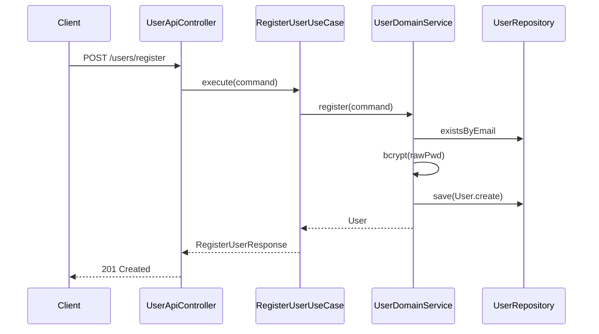
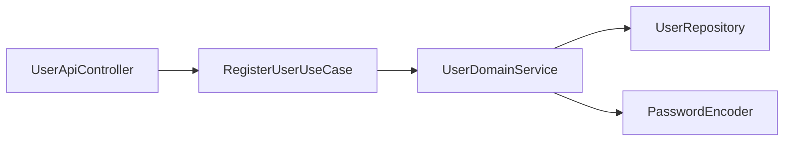

# [AUTH-02] 회원 가입 UseCase + API

## 작업 내용 (설계 의도)

### 변경 사항

`RegisterUserUseCase.execute(RegisterUserCommand): RegisterUserResponse`를 구현한다. UseCase는 DomainService만 호출(`UserDomainService.register`). DomainService 내부에서 이메일 중복 검사 → bcrypt 해싱 → `User.create` → save를 수행한다.

Presentation: `POST /users/register` 엔드포인트. Request DTO `RegisterUserRequest`를 Command로 변환한다.

비밀번호 해싱은 `PasswordEncoder` 빈(BCrypt, strength=10)을 주입받아 DomainService에서 호출. UseCase에서는 직접 사용 금지.

기본 Role `USER`를 가입 시점에 자동 부여한다.

## 다이어그램

### 처리 흐름

### 클래스 의존

## 테스트 케이스

### 단위 테스트 (Unit)
| ID | 대상 | 케이스 |
|---|---|---|
| U-01 | `RegisterUserUseCase` | DomainService만 호출하고 Repository/PasswordEncoder를 직접 참조하지 않는다 (MockK) |
| U-02 | `UserDomainService.register` | 이메일 중복 검사 → bcrypt → save 순서로 호출된다 |
| U-03 | `UserDomainService.register` | 가입 시점에 기본 USER Role이 자동 부여된다 |

### 레포지토리 테스트 (Repository / Persistence)
| ID | 대상 | 케이스 |
|---|---|---|
| R-01 | `UserRepository` + `UserRoleRepository` | User + UserRole 저장이 단일 트랜잭션 내 원자적으로 처리된다 |
| R-02 | 트랜잭션 롤백 | 중간 예외 발생 시 두 테이블 모두 롤백된다 |

### 시나리오 테스트 (Scenario / Integration)
| ID | 시나리오 | 케이스 |
|---|---|---|
| S-01 | 정상 가입 | `POST /users/register` 요청 시 201 + Location 헤더 응답이 반환되고 password_hash는 노출되지 않는다 |
| S-02 | 이메일 중복 | 동일 이메일 재가입 시도 시 409 ProblemDetail 응답이 반환된다 |
| S-03 | 입력 검증 | 잘못된 이메일 형식 입력 시 422 응답이 반환된다 |
