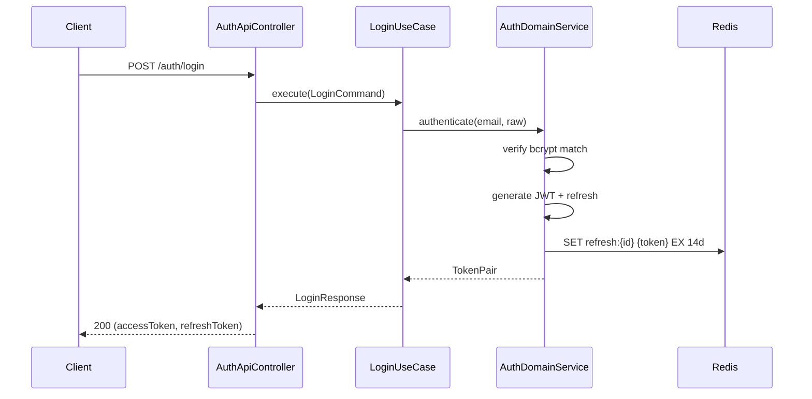
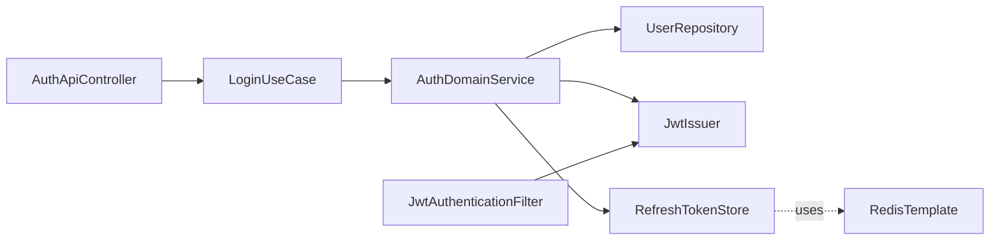

# [AUTH-03] 로그인·JWT 발급 + Refresh Token

## 작업 내용 (설계 의도)

### 변경 사항

`LoginUseCase`를 구현한다. 이메일·비밀번호 검증 후 Access Token(JWT, 30분) + Refresh Token(랜덤 UUID, 14일)을 발급. Refresh Token은 Redis에 `refresh:{userId}` 키로 저장하며 TTL은 14일.

Spring Security `OncePerRequestFilter`로 `JwtAuthenticationFilter`를 추가해 Authorization 헤더를 검증한다. SecurityContext에 `UserPrincipal(id, email, roles)`을 주입.

`POST /auth/login`, `POST /auth/refresh` 두 엔드포인트. Refresh 시 기존 Refresh Token은 Redis에서 삭제(회전 정책).

JWT 비밀 키는 `application.yml`의 `app.jwt.secret`으로 외부 주입. 평문 커밋 금지.

## 다이어그램

### 처리 흐름

### 클래스 의존

## 테스트 케이스

### 단위 테스트 (Unit)
| ID | 대상 | 케이스 |
|---|---|---|
| U-01 | `LoginUseCase` | 잘못된 비밀번호 입력 시 `InvalidCredentialsException`을 던진다 |
| U-02 | `JwtIssuer` | 토큰 페이로드에 sub/roles/jti/exp 4개 클레임이 포함된다 |
| U-03 | `RefreshTokenService` | 새 Refresh 발급 시 기존 Refresh가 Redis에서 삭제된다 (회전 정책) |

### 레포지토리 테스트 (Repository / Persistence)
| ID | 대상 | 케이스 |
|---|---|---|
| R-01 | `RefreshTokenStore` | `refresh:{userId}` 키가 TTL 14일로 정확히 저장된다 |
| R-02 | `RefreshTokenStore` | 동일 userId로 재로그인 시 기존 키가 덮어쓰기로 갱신된다 |

### 시나리오 테스트 (Scenario / Integration)
| ID | 시나리오 | 케이스 |
|---|---|---|
| S-01 | 정상 로그인 | `POST /auth/login` 200 응답에 accessToken/refreshToken 두 필드가 포함된다 |
| S-02 | 인증 실패 | 잘못된 비밀번호 시 401 ProblemDetail 응답이 반환된다 |
| S-03 | 보호 자원 접근 | 발급된 accessToken으로 보호 API 호출 시 SecurityContext에 UserPrincipal이 주입된다 |
| S-04 | Refresh 만료 | 만료된 Refresh Token으로 `POST /auth/refresh` 호출 시 401 응답이 반환된다 |
