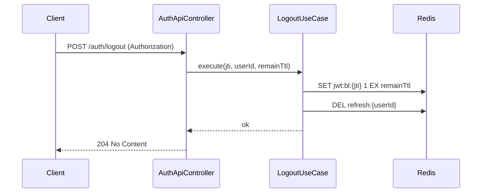
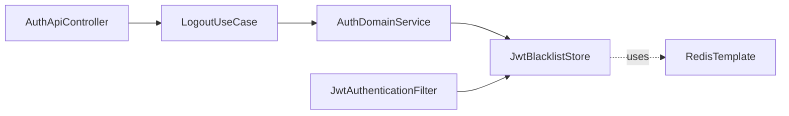

# [AUTH-04] 로그아웃 + Redis 블랙리스트

## 작업 내용 (설계 의도)

### 변경 사항

`LogoutUseCase`를 구현한다. Access Token의 jti를 Redis 블랙리스트(`jwt:bl:{jti}`)에 등록하고 TTL은 토큰 잔여 만료시간으로 설정. 동시에 Refresh Token(`refresh:{userId}`)을 삭제한다.

`JwtAuthenticationFilter`는 토큰 검증 시 블랙리스트 조회를 수행. 블랙리스트 hit 시 401 응답.

`POST /auth/logout` 엔드포인트는 인증 필요. SecurityContext에서 사용자를 식별.

## 다이어그램

### 처리 흐름

### 클래스 의존

## 테스트 케이스

### 단위 테스트 (Unit)
| ID | 대상 | 케이스 |
|---|---|---|
| U-01 | `LogoutUseCase` | jti와 토큰 잔여 TTL을 정확히 계산해 블랙리스트에 등록한다 |
| U-02 | `LogoutUseCase` | 이미 블랙리스트에 있는 jti로 재시도 시 멱등하게 noop 처리된다 |

### 레포지토리 테스트 (Repository / Persistence)
| ID | 대상 | 케이스 |
|---|---|---|
| R-01 | `JwtBlacklistStore` | `jwt:bl:{jti}` 키가 토큰 잔여 만료시간과 동일한 TTL로 저장된다 |
| R-02 | `RefreshTokenStore` | 로그아웃 시 `refresh:{userId}` 키가 DEL로 즉시 삭제된다 |

### 시나리오 테스트 (Scenario / Integration)
| ID | 시나리오 | 케이스 |
|---|---|---|
| S-01 | 로그아웃 후 보호 API | 동일 accessToken으로 보호 API 호출 시 401 응답이 반환된다 |
| S-02 | 로그아웃 후 토큰 갱신 | 동일 refreshToken으로 `POST /auth/refresh` 호출 시 401 응답이 반환된다 |
| S-03 | TTL 자동 정리 | 블랙리스트 TTL 만료 후 키가 Redis에서 자동 삭제되어 메모리 누수가 없다 |
