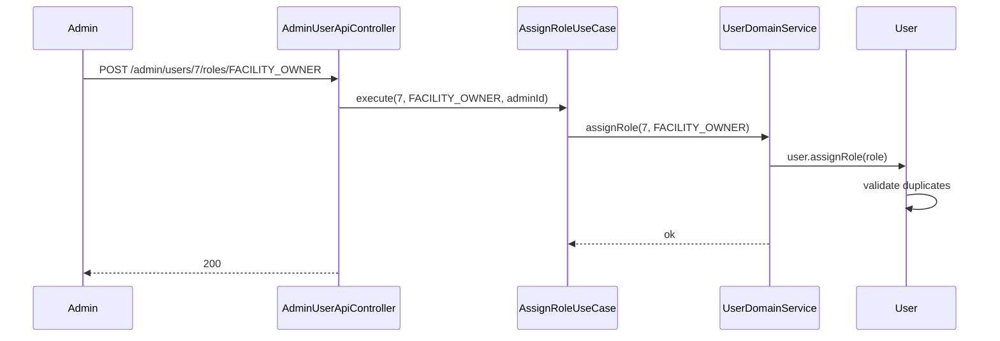
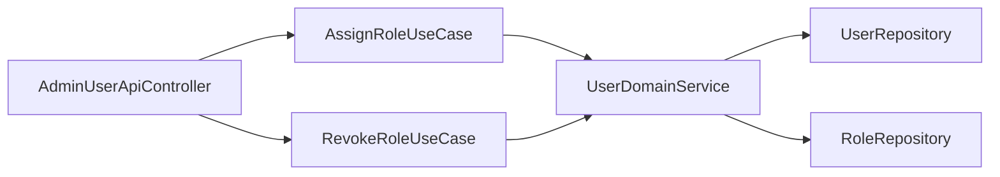

# [AUTH-05] Role 부여·회수 ADMIN API

## 작업 내용 (설계 의도)

### 변경 사항

ADMIN만 접근 가능한 Role 관리 API를 둔다. `POST /admin/users/{userId}/roles/{roleName}` 부여, `DELETE` 회수.

`AssignRoleUseCase` / `RevokeRoleUseCase`는 `UserDomainService.assignRole(userId, roleName)` / `revokeRole` 호출. Entity 내부에서 중복 부여·잔여 Role 0 검증.

`User.assignRole`은 자기 자신에게 ADMIN 회수 금지 (관리자 lockout 방지). 회수 시 본인이면 `SelfRevocationException`.

## 다이어그램

### 처리 흐름

### 클래스 의존

## 테스트 케이스

### 단위 테스트 (Unit)
| ID | 대상 | 케이스 |
|---|---|---|
| U-01 | `User.assignRole` | 동일 Role 중복 부여 시 `DuplicateRoleException`을 던진다 |
| U-02 | `User.revokeRole` | 본인이 자기 ADMIN을 회수 시도 시 `SelfRevocationException`을 던진다 |
| U-03 | `User.revokeRole` | 회수 후 Role 리스트가 비면 자동으로 USER Role을 유지한다 |

### 레포지토리 테스트 (Repository / Persistence)
| ID | 대상 | 케이스 |
|---|---|---|
| R-01 | `UserRoleRepository` | 동시 두 ADMIN 호출이 트랜잭션 격리로 일관된 결과를 낸다 |
| R-02 | `RoleRepository` | 미존재 Role 이름으로 조회 시 `RoleNotFoundException`이 발생한다 |

### 시나리오 테스트 (Scenario / Integration)
| ID | 시나리오 | 케이스 |
|---|---|---|
| S-01 | ADMIN의 Role 부여 | ADMIN이 사용자에게 FACILITY_OWNER 부여 후 그 사용자가 재로그인하면 토큰에 새 권한이 포함된다 |
| S-02 | 비-ADMIN 접근 차단 | USER Role이 Role 관리 API 호출 시 403 응답이 반환된다 |
| S-03 | Self 회수 방어 | ADMIN이 자기 ADMIN을 회수 시도 시 409 ProblemDetail 응답이 반환된다 |
