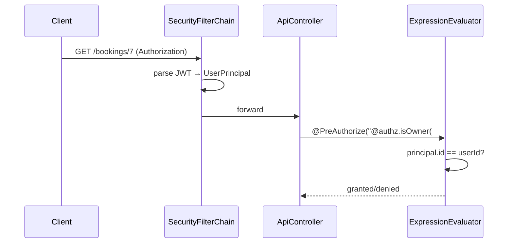
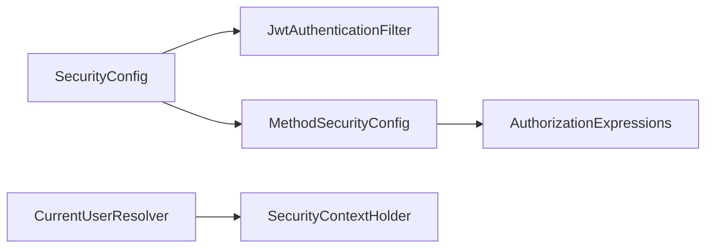

# [AUTH-06] `@PreAuthorize` 메서드 보안 와이어업

## 작업 내용 (설계 의도)

### 변경 사항

Spring Security 메서드 보안을 활성화(`@EnableMethodSecurity`)하고, 도메인 Controller가 `@PreAuthorize("hasRole('ADMIN')")` 같은 표현식으로 인가를 강제하도록 한다.

본인 자원 검증용 SpEL 헬퍼 `@authz.isOwner(#userId)`를 `AuthorizationExpressions` 빈으로 노출. UseCase 내부에서 if + throw로 권한 검사하지 않는다 (harness-rules).

`SecurityContextHolder`에서 `UserPrincipal`을 꺼내는 `@CurrentUser` 어노테이션을 만들어 Controller 시그니처를 간결하게.

본 티켓에서는 인프라만 세팅. 실제 `@PreAuthorize` 부착은 각 도메인 티켓이 자기 API에 한다.

## 다이어그램

### 처리 흐름

### 클래스 의존

## 테스트 케이스

### 단위 테스트 (Unit)
| ID | 대상 | 케이스 |
|---|---|---|
| U-01 | `AuthorizationExpressions.isOwner` | SecurityContext principal.id와 인자가 일치하면 true를 반환한다 |
| U-02 | `AuthorizationExpressions.isFacilityOwner` | FACILITY_OWNER Role + 본인 소유 시설일 때만 true를 반환한다 |
| U-03 | `@CurrentUser` ArgumentResolver | 어노테이션이 부착된 메서드 인자에 UserPrincipal이 정확히 주입된다 |

### 레포지토리 테스트 (Repository / Persistence)
| ID | 대상 | 케이스 |
|---|---|---|
| R-01 | — | 본 티켓은 권한 정책만 다루므로 별도 Repository 없음 |

### 시나리오 테스트 (Scenario / Integration)
| ID | 시나리오 | 케이스 |
|---|---|---|
| S-01 | isOwner 인가 | 본인 호출은 200, 타인 호출은 403 응답이 반환된다 |
| S-02 | hasRole 인가 | 비-ADMIN이 ADMIN 전용 메서드 호출 시 403 응답이 반환된다 |
| S-03 | 미인증 차단 | 인증되지 않은 요청이 `@PreAuthorize` 부착 메서드에 도달하면 필터 단에서 401로 차단된다 |
