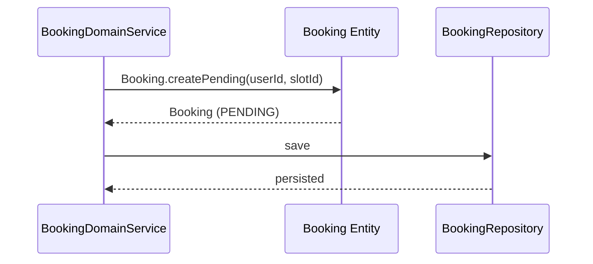
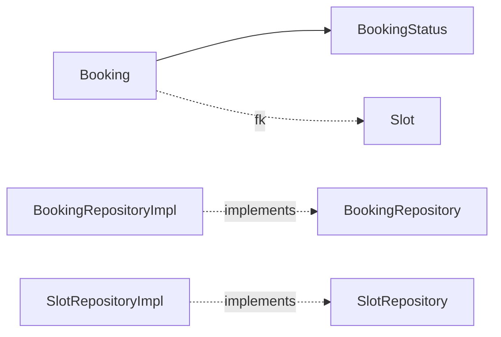

# [BOOKING-01] Slot·Booking Entity + 도메인

## 작업 내용 (설계 의도)

### 변경 사항

`domain.booking` 패키지에 `Slot`, `Booking`, `BookingStatus` enum, `BookingRepository`, `SlotRepository`를 정의한다.

`Slot`: 시설별 시간대 단위 자원. `facilityId`(string, Mongo 시설 code 참조), `date`, `timeRange`, `capacity`.

`Booking`: `userId`, `slotId`, `status`(PENDING / CONFIRMED / CANCELLED / EXPIRED), `paymentId`(nullable), `createdAt`.

`BookingStatus.canTransitTo`로 상태 전이 검증. `Booking.confirm(paymentId)`, `Booking.cancel(reason)` 등 Entity 비즈니스 메서드.

레거시 `Rental`의 `borrower`/`tel`/`mapName`은 신규 도메인에서 제거 — User 참조와 Facility 참조로 정규화.

Flyway `V3__booking.sql`로 `slots`, `bookings` 테이블 생성.

## 다이어그램

### 처리 흐름

### 클래스 의존

## 테스트 케이스

### 단위 테스트 (Unit)
| ID | 대상 | 케이스 |
|---|---|---|
| U-01 | `Booking.createPending` | status=PENDING, paymentId=null로 생성된다 |
| U-02 | `Booking.confirm` | PENDING → CONFIRMED 전이 시 paymentId가 채워진다 |
| U-03 | `Booking.confirm` | CANCELLED 상태에서 호출 시 `InvalidBookingStateException`을 던진다 |
| U-04 | `BookingStatus.canTransitTo` | 9개 상태 전이 케이스가 표 기반으로 정확히 판단된다 |
| U-05 | `Slot.create` | `HH:mm-HH:mm` 형식이 아닌 timeRange는 `InvalidSlotException`을 던진다 |

### 레포지토리 테스트 (Repository / Persistence)
| ID | 대상 | 케이스 |
|---|---|---|
| R-01 | `BookingRepository.findByUserIdAndStatus` | PENDING Booking 저장 후 정확히 1건이 반환된다 |
| R-02 | 외래키 제약 | 미존재 slotId로 Booking 저장 시 FK 위반 예외가 발생한다 |
| R-03 | `BookingQueryDslRepository` | `userId + status + 날짜 범위` 동적 조건 쿼리가 정확한 결과와 카운트를 반환한다 |

### 시나리오 테스트 (Scenario / Integration)
| ID | 시나리오 | 케이스 |
|---|---|---|
| S-01 | 멱등 confirm | CONFIRMED 상태 Booking에 재confirm 호출 시 paymentId가 변경되지 않고 멱등하게 처리된다 |
