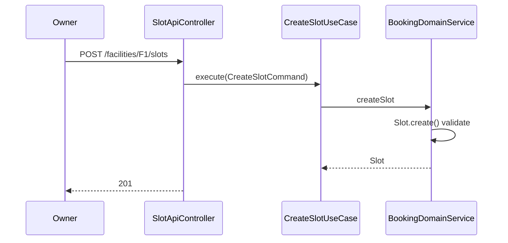
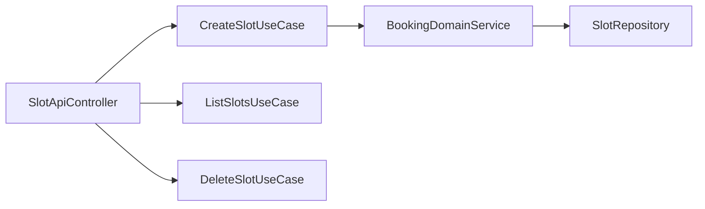

# [BOOKING-02] Slot 등록/조회 API (Owner)

## 작업 내용 (설계 의도)

### 변경 사항

`FACILITY_OWNER` Role 사용자가 자기 시설의 슬롯을 등록·조회·삭제하는 API. `POST /facilities/{facilityId}/slots`, `GET /facilities/{facilityId}/slots`, `DELETE /slots/{slotId}`.

`CreateSlotUseCase`, `ListSlotsUseCase`, `DeleteSlotUseCase`. `@PreAuthorize("@authz.isFacilityOwner(#facilityId)")`로 본인 시설만 접근.

Slot의 `capacity`는 ≥ 1 검증. `timeRange`는 `HH:mm-HH:mm` 형식 정규식 검증을 Entity 내부에서 수행.

일반 사용자(USER)는 `GET`만 인가 허용.

## 다이어그램

### 처리 흐름

### 클래스 의존

## 테스트 케이스

### 단위 테스트 (Unit)
| ID | 대상 | 케이스 |
|---|---|---|
| U-01 | `CreateSlotUseCase` | capacity ≤ 0 입력 시 `InvalidSlotException`을 던진다 |
| U-02 | `@authz.isFacilityOwner` | 본인 소유 시설일 때만 true를 반환한다 |

### 레포지토리 테스트 (Repository / Persistence)
| ID | 대상 | 케이스 |
|---|---|---|
| R-01 | `slots` unique 제약 | 동일 (facility_id, date, time_range) 두 슬롯 저장 시 제약 위반이 발생한다 |
| R-02 | `findByFacilityIdAndDate` | 인덱스를 사용해 정확한 슬롯만 반환한다 |

### 시나리오 테스트 (Scenario / Integration)
| ID | 시나리오 | 케이스 |
|---|---|---|
| S-01 | Owner 인가 | FACILITY_OWNER가 본인 시설에 slot 등록 시 201, 타인 시설은 403이다 |
| S-02 | USER Role | 일반 USER가 GET은 200, POST/DELETE는 403 응답을 받는다 |
| S-03 | 슬롯 삭제 | PENDING Booking이 있는 슬롯 삭제 시 409, 없으면 204 응답이 반환된다 |
