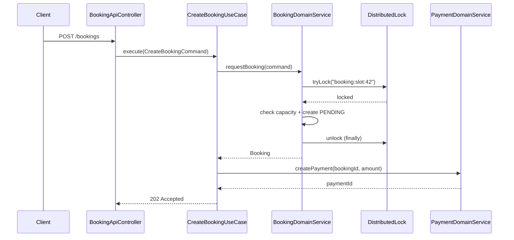
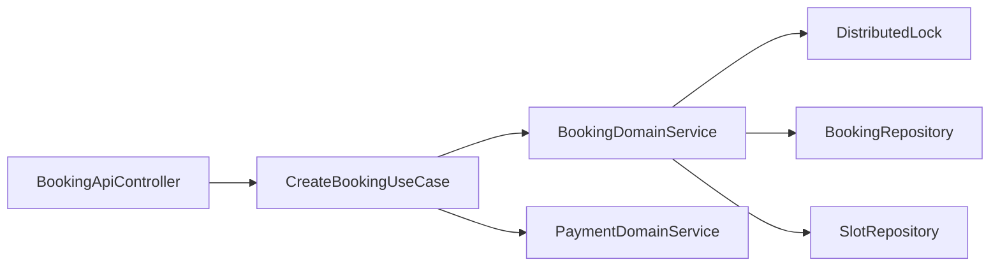

# [BOOKING-03] 예약 신청 UseCase + Redis 분산 락

## 작업 내용 (설계 의도)

### 변경 사항

`CreateBookingUseCase`는 사용자가 슬롯을 예약하는 흐름. **UseCase는 DomainService만 호출** (be-code-convention 준수, execute 10줄 이내). 락 획득·해제는 `BookingDomainService.requestBooking` 내부에 캡슐화한다.

UseCase 시그니처:
```kotlin
@Transactional
fun execute(command: CreateBookingCommand): CreateBookingResult {
    val booking = bookingDomainService.requestBooking(command)
    val paymentId = paymentDomainService.create(booking.toPaymentCommand())
    return CreateBookingResult.of(booking, paymentId)
}
```

`BookingDomainService.requestBooking` 내부 흐름 (락은 여기에 캡슐화):
1. `DistributedLock.tryLock("booking:slot:{slotId}", ttl=10s)` 실패 시 `SlotBusyException` → 409.
2. slot.capacity 잔여 검증 + `Booking.createPending` + save.
3. try-finally로 락 해제 보장.

PaymentDomainService 호출은 UseCase 책임 (도메인 간 협력). BookingDomainService는 외부 도메인을 모름.

응답은 `202 Accepted`. 실제 확정은 결제 완료 Kafka 이벤트가 `booking.confirm`을 트리거(BOOKING-04).

## 다이어그램

### 처리 흐름



### 클래스 의존



## 테스트 케이스

### 단위 테스트 (Unit)
| ID | 대상 | 케이스 |
|---|---|---|
| U-01 | `BookingDomainService.requestBooking` | tryLock 실패 시 `SlotBusyException`을 던지고 Booking을 생성하지 않는다 (MockK) |
| U-02 | `BookingDomainService.requestBooking` | slot.capacity 잔여 0건일 때 `SlotFullException`을 던진다 |
| U-03 | `BookingDomainService.requestBooking` | 락 해제는 try-finally로 보장되어 예외 발생 시에도 실행된다 |
| U-04 | `CreateBookingUseCase` | DomainService만 호출하고 DistributedLock/Repository를 직접 참조하지 않는다 (be-code-convention) |

### 레포지토리 테스트 (Repository / Persistence)
| ID | 대상 | 케이스 |
|---|---|---|
| R-01 | Redis + MySQL 동시성 | capacity=1 환경에서 동일 slotId 동시 트랜잭션 중 1건만 성공한다 |
| R-02 | Redis 락 키 | `booking:slot:{slotId}` 키가 TTL 10초로 설정된다 |

### 시나리오 테스트 (Scenario / Integration)
| ID | 시나리오 | 케이스 |
|---|---|---|
| S-01 | 동시 예약 충돌 | 두 사용자 동시 동일 슬롯 요청 시 1건 202, 1건 409 응답이 반환된다 |
| S-02 | Payment 연동 | 예약 요청 후 PaymentDomainService.create가 호출되어 paymentId가 반환된다 |
| S-03 | capacity 다중 | capacity=2 슬롯에 두 사용자 동시 요청 시 둘 다 202, PENDING 2건 생성된다 |
