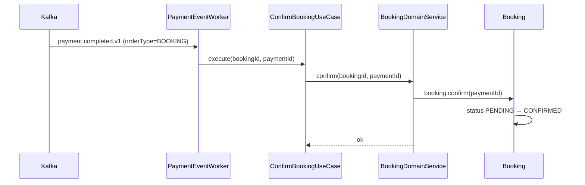
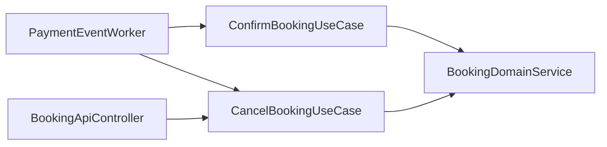

# [BOOKING-04] 예약 취소 UseCase + Saga 보상 consumer

## 작업 내용 (설계 의도)

### 변경 사항

`presentation/consumer/PaymentEventWorker`에서 `payment.completed.v1` / `payment.failed.v1` 두 토픽을 구독.

`payment.completed.v1`: orderType=BOOKING인 페이로드면 `ConfirmBookingUseCase.execute(bookingId, paymentId)` 호출 → Booking.confirm.

`payment.failed.v1`: orderType=BOOKING이면 `CancelBookingUseCase.execute(bookingId, reason)` 호출 → Booking.cancel (Saga 보상).

사용자 명시 취소도 `CancelBookingUseCase` 재사용. `DELETE /bookings/{id}` 엔드포인트. 본인 예약만 취소 가능 + CONFIRMED 상태에서만 환불 처리.

중복 이벤트 멱등성: `bookings.payment_id`가 이미 같은 paymentId면 무시.

## 다이어그램

### 처리 흐름

### 클래스 의존

## 테스트 케이스

### 단위 테스트 (Unit)
| ID | 대상 | 케이스 |
|---|---|---|
| U-01 | `ConfirmBookingUseCase` | 이미 CONFIRMED 상태에 재호출 시 멱등 noop 처리된다 |
| U-02 | `CancelBookingUseCase` | 미존재 bookingId 입력 시 `BookingNotFoundException`을 던진다 |
| U-03 | `PaymentEventWorker` | orderType ≠ BOOKING 이벤트는 무시한다 |

### 레포지토리 테스트 (Repository / Persistence)
| ID | 대상 | 케이스 |
|---|---|---|
| R-01 | `bookings.payment_id` | 이미 동일 paymentId가 채워진 row에 confirm 재시도 시 변경 없이 멱등 처리된다 |
| R-02 | Consumer 동시 처리 | 두 인스턴스가 같은 이벤트 처리해도 상태 전이는 1회만 발생한다 |

### 시나리오 테스트 (Scenario / Integration)
| ID | 시나리오 | 케이스 |
|---|---|---|
| S-01 | 결제 완료 → 확정 | `payment.completed.v1` 발행 후 5초 내 Booking이 CONFIRMED로 전이된다 |
| S-02 | 결제 실패 → 보상 | `payment.failed.v1` 발행 시 Booking이 CANCELLED로 전이된다 |
| S-03 | 멱등성 | 동일 이벤트 두 번 발행 시 Booking 상태는 한 번만 변경된다 |
| S-04 | 사용자 취소 | 본인 PENDING `DELETE /bookings/{id}`는 즉시 CANCELLED, 타인 호출은 403이다 |
