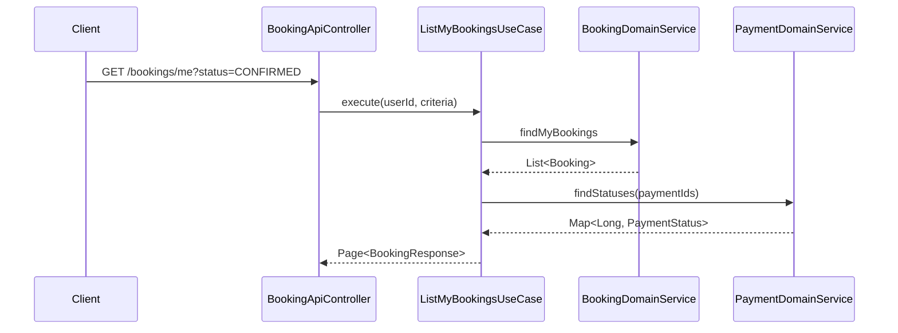
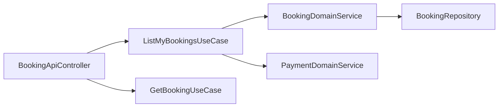

# [BOOKING-05] 사용자별 예약 목록 + 단건 조회 API

## 작업 내용 (설계 의도)

### 변경 사항

`GET /bookings/me` 본인 예약 목록(상태 필터 지원), `GET /bookings/{id}` 단건 조회. 단건은 본인 또는 FACILITY_OWNER(해당 시설 소유자)만 조회 가능.

`ListMyBookingsUseCase`, `GetBookingUseCase`. 페이지네이션 기본 20건.

QueryDSL `CustomRepositoryImpl`로 `userId + status` 복합 조건 쿼리 구현. `@Query` 금지.

응답에 결제 상태(`paymentStatus`)를 JOIN 없이 별도 조회로 합산 — Booking과 Payment는 다른 도메인이므로 Entity 직접 참조 금지.

## 다이어그램

### 처리 흐름

### 클래스 의존

## 테스트 케이스

### 단위 테스트 (Unit)
| ID | 대상 | 케이스 |
|---|---|---|
| U-01 | `ListMyBookingsUseCase` | Criteria에 status 미지정 시 전체 상태가 반환된다 |
| U-02 | `BookingResponseMapper` | paymentId=null인 Booking도 paymentStatus=null로 정상 매핑된다 |

### 레포지토리 테스트 (Repository / Persistence)
| ID | 대상 | 케이스 |
|---|---|---|
| R-01 | `BookingQueryDslRepository` | `(userId, status, date 범위)` 동적 조건이 정확한 결과와 카운트를 반환한다 |
| R-02 | harness-rules | `@Query` 사용 없이 QueryDSL로만 구현됨을 정적 룰로 검증한다 |
| R-03 | 페이지네이션 | `createdAt desc` 안정 정렬로 동작한다 |

### 시나리오 테스트 (Scenario / Integration)
| ID | 시나리오 | 케이스 |
|---|---|---|
| S-01 | 본인 목록 조회 | `GET /bookings/me?status=CONFIRMED` 응답에 paymentStatus가 합산되어 노출된다 |
| S-02 | 단건 인가 | 다른 사용자의 Booking 단건 조회 시 403 응답이 반환된다 |
| S-03 | Owner 시설 조회 | FACILITY_OWNER는 본인 시설 Booking은 조회 가능, 타인 시설은 403이다 |
