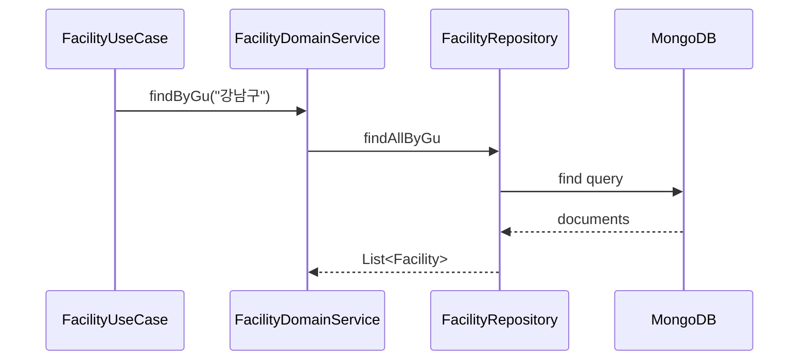
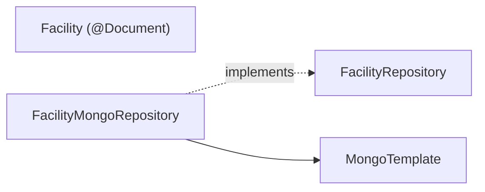

# [FACILITY-01] Facility 도메인 + Mongo 컬렉션

## 작업 내용 (설계 의도)

### 변경 사항

`domain.facility` 패키지에 `Facility` 도큐먼트와 `FacilityRepository` interface를 정의한다. MongoDB 컬렉션 `facilities`.

레거시 `map-service` + `wayfinding-service`를 단일 도메인으로 통합한다. TCP MessagePattern 게이트웨이는 제거하고 HTTP만 유지.

필드: `id`, `code`(legacy `_id`), `name`, `gu`, `type`, `address`, `lat`, `lng`, `parking`, `tel`, `homePage`, `eduYn`, `meta`(Map<String,String> 가변). 인덱스: `gu`, `type`, geospatial `lat+lng`.

Facility는 비정형 메타 데이터를 그대로 받아 다양한 시설 카테고리를 유연하게 표현한다.

## 다이어그램

### 처리 흐름

### 클래스 의존

## 테스트 케이스

### 단위 테스트 (Unit)
| ID | 대상 | 케이스 |
|---|---|---|
| U-01 | `Facility.update` | meta 맵의 키 병합 시 기존 키는 덮어쓰고 다른 키는 보존된다 |
| U-02 | `Facility.create` | `code`가 빈 문자열이면 `InvalidFacilityException`을 던진다 |

### 레포지토리 테스트 (Repository / Persistence)
| ID | 대상 | 케이스 |
|---|---|---|
| R-01 | `FacilityMongoRepository.findByGu` | "강남구" 필터로 정확한 건수가 반환된다 |
| R-02 | geospatial 인덱스 | `near(point, distance)` 쿼리가 거리순 정렬 결과를 반환한다 |
| R-03 | `meta` 비정형 필드 | 임의 키-값 저장 후 동일 구조로 복원된다 |

### 시나리오 테스트 (Scenario / Integration)
| ID | 시나리오 | 케이스 |
|---|---|---|
| S-01 | 대량 데이터 조회 | 1만건 적재 후 `gu + type` 복합 필터 조회 P95가 50ms 이하다 |
