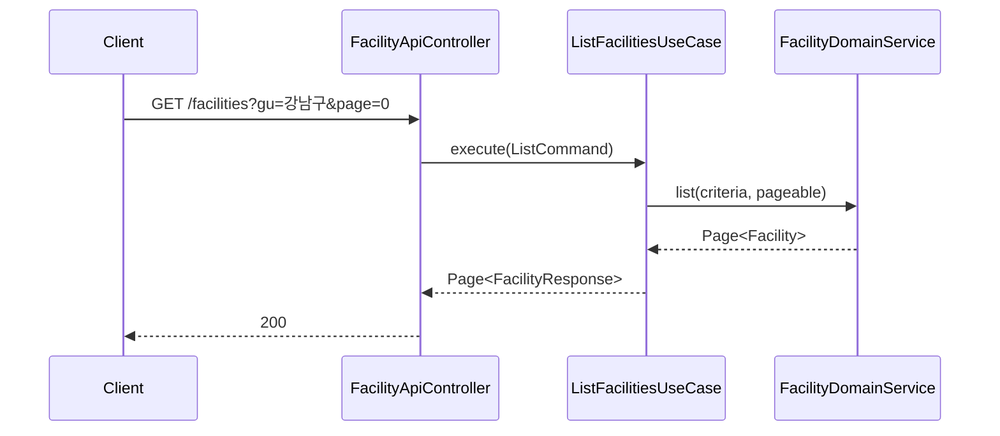
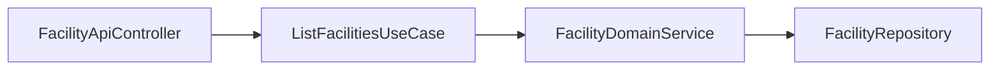

# [FACILITY-02] 시설 전체·자치구·유형 조회 API

## 작업 내용 (설계 의도)

### 변경 사항

`GET /facilities` (전체 페이지네이션), `GET /facilities?gu=강남구`, `GET /facilities?type=풋살장`, `GET /facilities?gu=강남구&type=풋살장` 4개 케이스를 단일 엔드포인트로 노출.

`ListFacilitiesUseCase`는 `FacilityDomainService.list(criteria)` 호출. Criteria 객체로 필터를 묶어 후속 정렬·페이지네이션 확장에 대비.

응답은 `Page<FacilityResponse>`. 페이지당 50건 기본.

## 다이어그램

### 처리 흐름

### 클래스 의존

## 테스트 케이스

### 단위 테스트 (Unit)
| ID | 대상 | 케이스 |
|---|---|---|
| U-01 | `FacilityCriteria` | null/blank 필터를 무시하고 적용된 필터만 Query로 변환된다 (MockK) |
| U-02 | `ListFacilitiesUseCase` | 페이지 사이즈가 100을 초과하면 100으로 cap된다 |

### 레포지토리 테스트 (Repository / Persistence)
| ID | 대상 | 케이스 |
|---|---|---|
| R-01 | `FacilityMongoRepository` | `gu=강남구&type=풋살장` 두 필터를 모두 만족하는 시설만 반환된다 |
| R-02 | `FacilityMongoRepository` | 페이지네이션 정렬이 `name asc` 안정 정렬로 동작한다 |
| R-03 | `FacilityMongoRepository` | 필터 미지정 시 전체 적재 건수가 페이지네이션 카운트로 일치한다 |

### 시나리오 테스트 (Scenario / Integration)
| ID | 시나리오 | 케이스 |
|---|---|---|
| S-01 | 공개 조회 API | `GET /facilities?gu=강남구&page=0&size=20`이 200 + Page 응답을 반환한다 |
| S-02 | 인증 불필요 | 인증 없이도 시설 조회 API 호출이 허용된다 |
