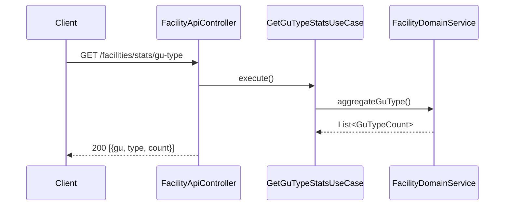
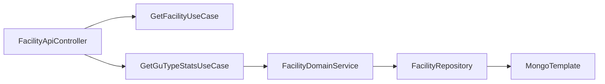

# [FACILITY-03] 시설 단건 + 조합 통계 API

## 작업 내용 (설계 의도)

### 변경 사항

`GET /facilities/{id}` 단건 조회와 `GET /facilities/stats/gu-type` 자치구×유형 조합 카운트 API를 둔다.

조합 통계는 MongoDB Aggregation Framework로 구현. `MongoTemplate`의 `aggregate` 사용. Result는 `{gu, type, count}` 리스트.

`GetFacilityUseCase` / `GetGuTypeStatsUseCase` 두 UseCase로 분리. 단건 조회 시 미존재면 `FacilityNotFoundException` → 404.

## 다이어그램

### 처리 흐름

### 클래스 의존

## 테스트 케이스

### 단위 테스트 (Unit)
| ID | 대상 | 케이스 |
|---|---|---|
| U-01 | `GetFacilityUseCase` | 미존재 ID 입력 시 `FacilityNotFoundException`을 던진다 |
| U-02 | `GetGuTypeStatsUseCase` | MongoTemplate.aggregate 결과를 `GuTypeCount` DTO 리스트로 변환한다 (MockK) |

### 레포지토리 테스트 (Repository / Persistence)
| ID | 대상 | 케이스 |
|---|---|---|
| R-01 | `$group by (gu, type)` aggregation | 25개 자치구 × 다양한 유형 적재 후 정확한 카운트를 반환한다 |
| R-02 | aggregation | 적재 0건 상태에서 빈 결과 리스트를 반환한다 |

### 시나리오 테스트 (Scenario / Integration)
| ID | 시나리오 | 케이스 |
|---|---|---|
| S-01 | 조합 통계 | `GET /facilities/stats/gu-type`이 200 + `[{gu, type, count}]` 배열을 반환한다 |
| S-02 | 미존재 단건 | 미존재 시설 단건 조회 시 404 ProblemDetail 응답이 반환된다 |
