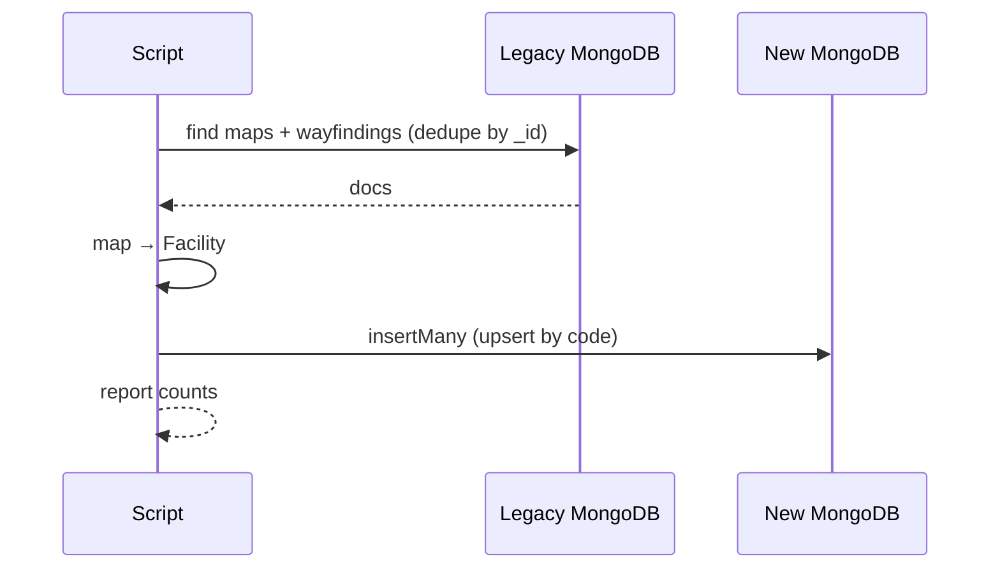
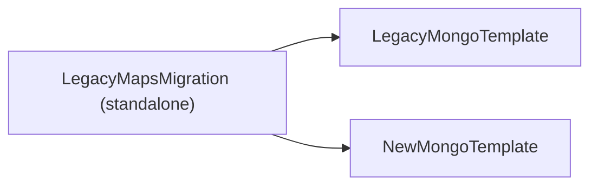

# [FACILITY-04] 레거시 maps 데이터 1회 이관 스크립트

## 작업 내용 (설계 의도)

### 변경 사항

레거시 `MAPSERVICE` / `WAYFINDINGSERVICE` MongoDB 데이터를 신규 `facilities` 컬렉션으로 1회 이관하는 Spring Batch Step 또는 standalone Kotlin 스크립트를 작성한다.

매핑 규칙:
- 레거시 `_id` → 신규 `code` (string 유지)
- `ycode`/`xcode` → `lat`/`lng` (double 변환)
- `bigo`, `parking_lot`, `tel`, `addr`, `in_out`, `home_page`, `edu_yn`, `nm` → 각 필드 매핑
- 추가 메타는 `meta` 맵에 저장

dry-run 모드 지원. 실제 적용은 `--apply` 플래그 필요.

중복 검증: 동일 `code` 존재 시 skip 또는 overwrite(옵션).

## 다이어그램

### 처리 흐름

### 클래스 의존

## 테스트 케이스

### 단위 테스트 (Unit)
| ID | 대상 | 케이스 |
|---|---|---|
| U-01 | `LegacyToFacilityMapper` | 레거시 `_id`(string) → 신규 `code` 매핑이 정확하다 |
| U-02 | `LegacyToFacilityMapper` | 잘못된 ycode/xcode 형식은 건너뛰고 경고 로그를 남긴다 |
| U-03 | `LegacyToFacilityMapper` | 미정의 필드는 `meta` 맵으로 fallback 적재된다 |

### 레포지토리 테스트 (Repository / Persistence)
| ID | 대상 | 케이스 |
|---|---|---|
| R-01 | 마이그레이션 적용 | 레거시 10건 → 신규 컨테이너에 10건이 정확한 필드로 적재된다 |
| R-02 | dry-run | `--apply` 없이 실행 시 신규 0건 적재 + 변경 예정 건수 콘솔 출력 |
| R-03 | upsert | 동일 마이그레이션 두 번 실행 시 신규에 0건 변경(no-op) |

### 시나리오 테스트 (Scenario / Integration)
| ID | 시나리오 | 케이스 |
|---|---|---|
| S-01 | 중복 dedupe | maps + wayfindings에 중복 `_id`가 있을 때 단일 도큐먼트로 dedupe 적재된다 |
| S-02 | 성능 요건 | 1만건 이관이 5분 이내 완료된다 |
