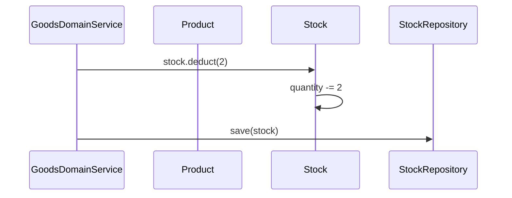
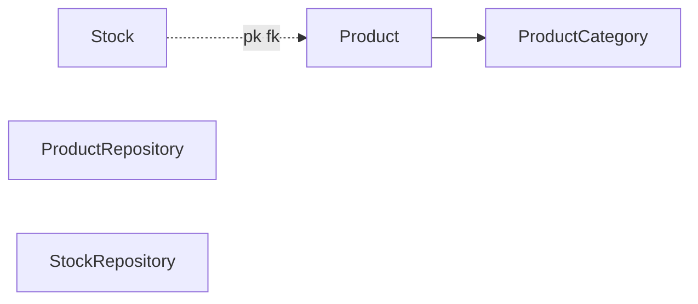

# [GOODS-01] Product·Stock Entity + 도메인

## 작업 내용 (설계 의도)

### 변경 사항

`domain.goods` 패키지에 `Product`, `Stock`, `ProductCategory` enum, `ProductRepository`, `StockRepository`를 정의한다.

`Product`: `id`, `name`, `category`, `price`, `description`, `imageUrl`, `status`(ACTIVE/INACTIVE).
`Stock`: `productId` PK, `quantity`. Product와 1:1.

`Stock.deduct(qty)` / `Stock.restore(qty)` Entity 메서드. deduct 시 quantity < qty면 `OutOfStockException`.

Flyway `V7__goods.sql`로 `products`, `stocks` 테이블. `(category, status, price)` 복합 인덱스 (검색용).

## 다이어그램

### 처리 흐름

### 클래스 의존

## 테스트 케이스

### 단위 테스트 (Unit)
| ID | 대상 | 케이스 |
|---|---|---|
| U-01 | `Stock.deduct` | quantity 부족 시 `OutOfStockException`을 던지고 quantity는 변하지 않는다 |
| U-02 | `Stock.restore` | quantity 증가 시 정상 동작하며 음수 입력 시 `InvalidQuantityException`을 던진다 |
| U-03 | `Product.activate / deactivate` | 상태 전이 메서드가 올바르게 동작한다 |

### 레포지토리 테스트 (Repository / Persistence)
| ID | 대상 | 케이스 |
|---|---|---|
| R-01 | `(category, status, price)` 복합 인덱스 | 검색 쿼리에서 사용됨을 explain plan으로 확인한다 |
| R-02 | Stock 동시 UPDATE | optimistic lock 또는 행 잠금으로 lost update가 방지된다 |
| R-03 | Cascade | Product 삭제 시 Stock도 함께 삭제된다 |

### 시나리오 테스트 (Scenario / Integration)
| ID | 시나리오 | 케이스 |
|---|---|---|
| S-01 | 동시 deduct | 1000개 동시 deduct 요청 시 정확히 1000만큼만 차감되어 over-sell이 발생하지 않는다 |
