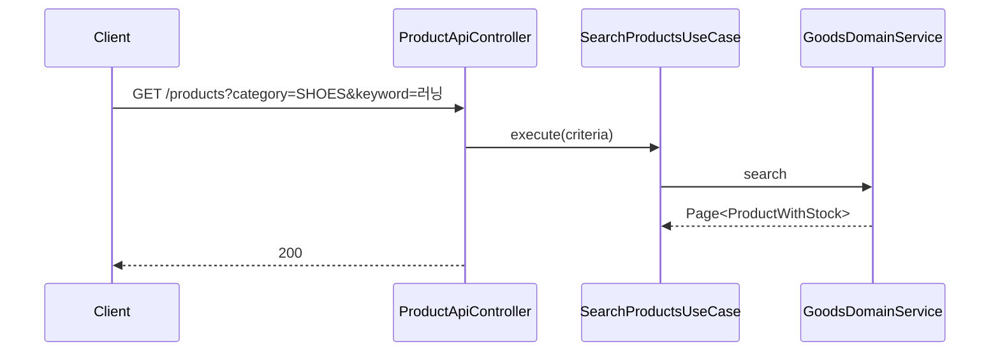
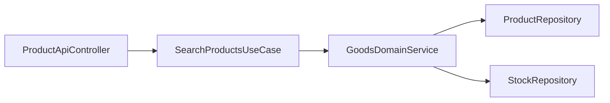

# [GOODS-02] 상품 카테고리·키워드 검색 API

## 작업 내용 (설계 의도)

### 변경 사항

`GET /products` — category, keyword, priceMin, priceMax, sort(price/recent), page, size.

`SearchProductsUseCase` → `GoodsDomainService.search(criteria, pageable)`. QueryDSL CustomRepository로 동적 조건 + 페이지네이션 + 정렬.

키워드 검색은 `name LIKE %kw%`. (전문 검색은 추후 ElasticSearch 검토 — 본 PRD 범위 밖.)

응답에 Stock 잔여 수량을 함께 포함하기 위해 fetch join 사용.

## 다이어그램

### 처리 흐름

### 클래스 의존

## 테스트 케이스

### 단위 테스트 (Unit)
| ID | 대상 | 케이스 |
|---|---|---|
| U-01 | `SearchProductsUseCase` | priceMin > priceMax 입력 시 `InvalidPriceRangeException`을 던진다 |
| U-02 | `ProductCriteria` | null 필터는 무시되고 적용된 필터만 BooleanBuilder로 변환된다 |

### 레포지토리 테스트 (Repository / Persistence)
| ID | 대상 | 케이스 |
|---|---|---|
| R-01 | QueryDSL 동적 조건 | category + keyword + 가격 범위 조합이 정확한 결과를 반환한다 |
| R-02 | fetch join | Stock 정보가 N+1 없이 단일 쿼리로 응답된다 |
| R-03 | 검색 성능 | 1만건 기준 LIMIT/OFFSET 검색 P95 응답시간이 200ms 이하다 |

### 시나리오 테스트 (Scenario / Integration)
| ID | 시나리오 | 케이스 |
|---|---|---|
| S-01 | 정렬·필터 | `GET /products?category=SHOES&keyword=러닝&sort=price`가 가격 오름차순 결과를 반환한다 |
| S-02 | 재고 0 노출 | 재고 0 상품도 응답에 포함되며 stockQuantity=0이 명시된다 |
| S-03 | 페이지네이션 메타 | totalElements/totalPages/page가 정확히 반환된다 |
