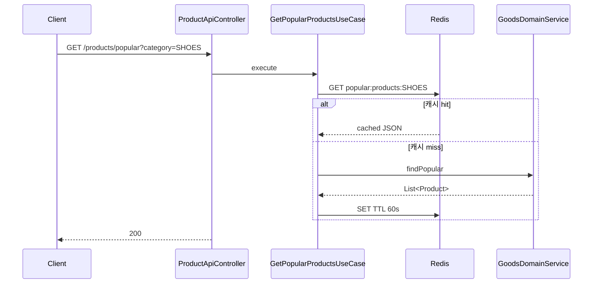
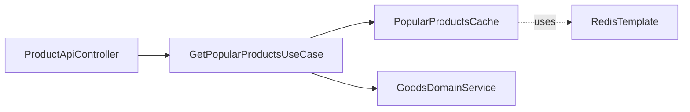

# [GOODS-03] 인기 상품 Redis 캐시

## 작업 내용 (설계 의도)

### 변경 사항

`GET /products/popular` — 카테고리별 상위 N개 인기 상품. 응답은 Redis `popular:products:{category}` 키에 JSON 형태로 캐시. TTL 60초.

캐시 미스 시 `GoodsDomainService.findPopular(category, limit)` 호출 → `GoodsOrder`의 최근 7일 판매 수 집계 → 캐시 저장 + 응답.

CacheManager 어노테이션(`@Cacheable`)이 아닌 명시적 RedisTemplate 호출 사용 (조건부 갱신·invalidate 용이성).

`goods.stock.changed.v1` 이벤트 수신 시(GOODS-07) 해당 카테고리 캐시 invalidate.

## 다이어그램

### 처리 흐름

### 클래스 의존

## 테스트 케이스

### 단위 테스트 (Unit)
| ID | 대상 | 케이스 |
|---|---|---|
| U-01 | `PopularProductsCache.get` | 캐시 hit/miss를 정확히 구분하고 miss 시 supplier를 호출한다 |
| U-02 | `PopularProductsCache.invalidate` | 카테고리별로만 적용되고 다른 카테고리 캐시는 유지된다 |

### 레포지토리 테스트 (Repository / Persistence)
| ID | 대상 | 케이스 |
|---|---|---|
| R-01 | Redis TTL | `popular:products:SHOES` 키 TTL이 60초로 정확히 설정된다 |
| R-02 | JSON 직렬화 | 직렬화/역직렬화 후 동일한 ProductPopularDto 리스트가 복원된다 |
| R-03 | 동시 SET | 다중 인스턴스가 동일 키 SET 호출해도 일관성이 유지된다 |

### 시나리오 테스트 (Scenario / Integration)
| ID | 시나리오 | 케이스 |
|---|---|---|
| S-01 | 캐시 hit/miss | 첫 호출 DB 조회 + 캐시 저장, 60초 내 재호출은 DB 조회 없이 캐시로만 응답한다 |
| S-02 | 이벤트 invalidate | `goods.stock.changed.v1` 수신 시 해당 카테고리 캐시가 invalidate된다 |
| S-03 | TTL 만료 | 60초 경과 후 자동 캐시 miss로 DB 재조회된다 |
