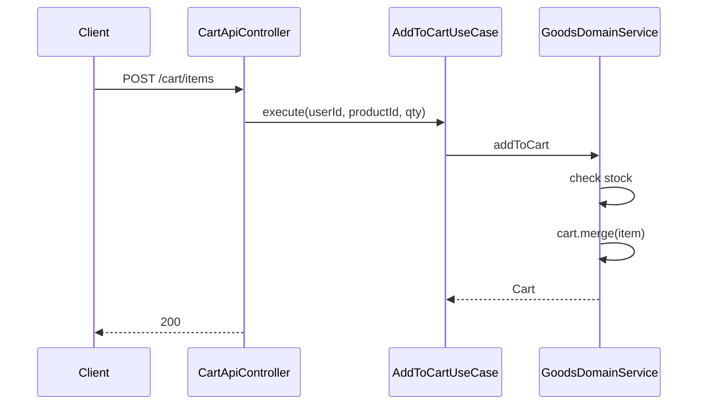
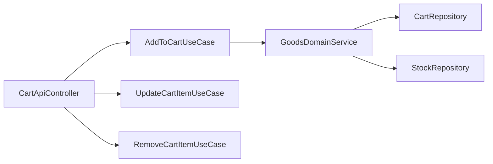

# [GOODS-04] Cart Entity + Cart UseCase + API

## 작업 내용 (설계 의도)

### 변경 사항

`Cart`(사용자당 1개) + `CartItem` Entity. `CartItem`: `id`, `cartId`, `productId`, `quantity`. unique `(cartId, productId)`.

API:
- `GET /cart/me` — 본인 장바구니
- `POST /cart/items` — 추가/병합 (동일 productId면 quantity 증가)
- `PATCH /cart/items/{itemId}` — 수량 수정
- `DELETE /cart/items/{itemId}` — 제거
- `DELETE /cart` — 비우기

`AddToCartUseCase`는 Stock.quantity 검증을 거쳐 추가. 재고 없음이면 `OutOfStockException`.

Flyway `V8__cart.sql` 테이블 추가.

## 다이어그램

### 처리 흐름

### 클래스 의존

## 테스트 케이스

### 단위 테스트 (Unit)
| ID | 대상 | 케이스 |
|---|---|---|
| U-01 | `AddToCartUseCase` | quantity ≤ 0 입력 시 `InvalidQuantityException`을 던진다 |
| U-02 | `Cart.merge` | 동일 productId가 있으면 quantity를 병합하고 새 row를 만들지 않는다 |
| U-03 | `AddToCartUseCase` | INACTIVE 상품 추가 시도 시 `ProductInactiveException`을 던진다 |

### 레포지토리 테스트 (Repository / Persistence)
| ID | 대상 | 케이스 |
|---|---|---|
| R-01 | `(cart_id, product_id)` unique | 동일 상품 두 row 시도 시 unique 제약이 위반된다 |
| R-02 | Cascade | Cart 삭제 시 CartItem이 모두 삭제된다 |

### 시나리오 테스트 (Scenario / Integration)
| ID | 시나리오 | 케이스 |
|---|---|---|
| S-01 | 재고 초과 | 재고 5개 상품을 10개 담으려는 요청은 409 응답을 받고 장바구니는 변경되지 않는다 |
| S-02 | 인가 | 타인의 cartId 접근 시 403 응답이 반환된다 |
| S-03 | 비우기 | `DELETE /cart` 후 `GET /cart/me`는 빈 결과를 반환한다 |
